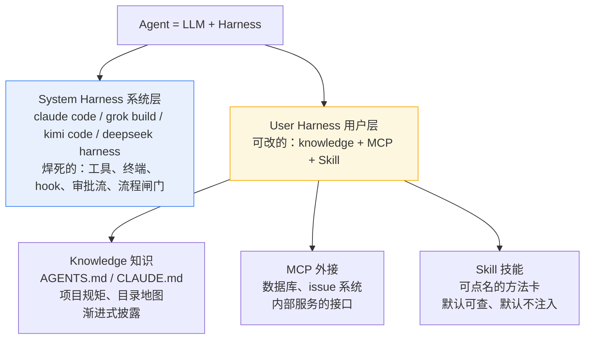
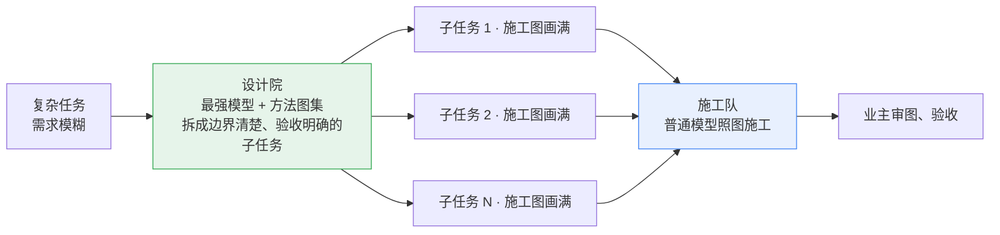
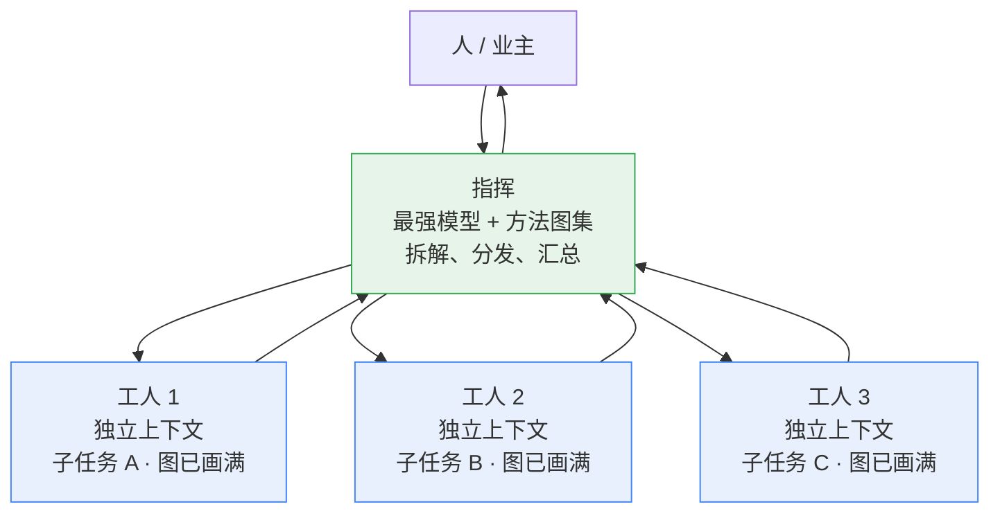
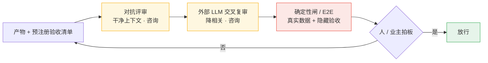
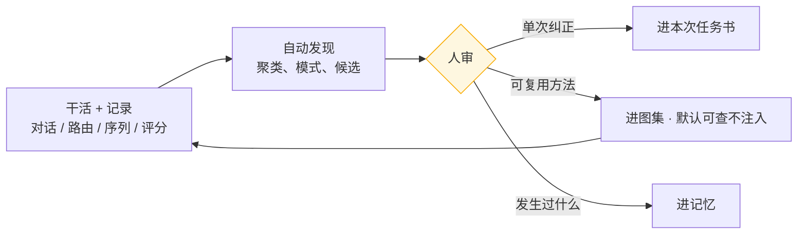

# 企业 AI 编程实践方法论：设计院、施工队、监理，和一个档案馆

> 一句话版本：**Agent = LLM + Harness**。企业要建的不是更强的模型，也不是一打常驻专家人格，而是一套分层结构——最聪明的模型当设计院，把任务拆成写满的施工图；普通的模型当施工队，照着图干活；独立的力量当监理，但放行权不在评委打分；档案馆把每一场施工的经验存下来，变成下一张图。
>
> 这套分工不是拍脑袋。零件来自我们 2026 年 8–9 月的八轮双容器对照实验（细节见《[AI 助手为什么总在同一个坑里跌倒](skill-routing-explained.md)》）：写满的需求书让技能冗余；粗的需求书让技能显形；有脚手架的弱模型能开工，裸的弱模型开不了。整机——设计院把图画满、施工队并行、监理独立验收——是从零件长出来的工程假设，不是已经被整体检验过的定理。社区 2025–2026 年的受控实验，又把另一件事说清楚了：**不必预设专家群来做完项目。**
>
> 上一篇我们用一家后厨讲清了 Memory / Skill / Harness 三个词；这一篇用一家装修公司，讲清一套分工，以及为什么墙上不该挂满工牌。

## 1. 地基：Agent = LLM + Harness

先把一个被过度神化的词拆开。所谓 AI 编程 Agent，其实是两样东西的组合：

**Agent = LLM + Harness**

- **LLM** 是那个会读、会想、会写的人——但只凭它自己，读不到你的项目，改不了你的文件，更不知道你的规矩。
- **Harness** 是它干活时穿的工装和安全绳——文件系统、终端、约束规则、流程闸门。离了 Harness，LLM 只是聊天框。

Harness 再分两层：

装修公司的类比里：**LLM 是工人，System Harness 是工地上的安全规程和脚手架**——焊死在那里，想跳过也跳不过；**User Harness 是发给工人的工具包和图纸架**——项目经理可以按项目换内容。工人笨不笨当然重要，但更便宜、更可控的杠杆，是规程和图纸。

**渐进式披露**是 User Harness 的第一纪律：知识文件只写「有什么」，不写全文，Agent 需要哪本再读哪本。一次把二十本规范全塞进上下文，等于让工人抱着整座图书馆上脚手架，走两步就摔下来。技能卡也服从同一条纪律——**图集挂在墙上供点名，不塞进每个工人的口袋。**

**指令写在 prompt 里是建议，焊进 hook 里才是规矩。**写进 AGENTS.md 的要求，Agent 经常照犯——我们在实验里反复见过它跳过路由、自作主张。所以关键要求要接到 hook 层：由运行时在每次任务进门的关口强制执行（比如路由钩子拦截每一条请求），Agent 想绕也绕不过。升级路径是一条单行道：**一条规则反复被违反、又被验证是关键，就由人把它从 prompt 写进 hook。**建议可以留在纸面上，规矩必须焊进结构里。

## 2. 中枢：spec 决定一切（零件结论，不是整机定理）

这套方法论里最反直觉的一层，是它不把重心放在「让 Agent 更强」，而放在「让任务书写满」。八轮对照测的是三块零件，不是整条流水线：

- **题目写满**（边界、接口、验收都钉死）：有没有技能，产物都打平（R1–R3、R7 连平）。R7 评委还吵起来——Grok 深评 16.5 对 17.0，Kimi 给 20 对 15。分裂本身就是答案：写满的题，技能没有下手的地方。
- **题目写粗**（只剩模块清单）：技能组第一次在产物上显形（R8，人评；盲评未结算）。
- **弱模型 + 有支撑的环境**：R6 处理组交出 22/25，但技能文件全程 **0 次读取**，路由问了两次都是 no-match。对照组两次尝试零产物，死在思考循环里。同题强模型 23.5 / 23.5 是 **R5**，不是 R6 的同协议对照。能说的是：脚手架能让弱模型开工，裸的弱模型开不了。**不能说「差 1.5 分就是能力等价」。**

由此推出两条条件句，和一条尚未整机检验的分工：

> **结论一：技能可以提升模糊需求的表现。**题越粗，技能越显形；题写满，技能归零。
>
> **结论二：spec 够清楚，再加上能把它从思考循环里拽出来的 harness，弱模型可以交出接近强模型的产物。**前提是环境撑得住，不是模型换个名字就行。

装修公司的行话：**全屋定制的施工图画到每一颗螺丝，任何一支靠谱的施工队都能装**；图纸只有一张毛坯平面图，二十年的手感才决定成败。企业要做的，是把「二十年手感」写进图纸——这件事交给最强模型 + 方法图集去干，而不是指望每支施工队都自带老师傅，更不是先养一个专家部门再开工。

丑话写在零件旁边：这条「设计院 → 施工队」流水线，八轮测过的是它的三块零件，整机还没有专门跑过。它现在是一个从数据里长出来的工程假设。

## 3. 专家是点名的，不是预装的

社区里有两派，看起来都在「用专家」，做的事完全不同。

**一派预装专家团。**MetaGPT、ChatDev、CrewAI，以及后来墙上挂着两百多个即插即用角色的技能库：产品经理、架构师、安全专家、QA 随时待命，像一家编制齐全的软件公司。2023–2024 的绿场小项目上，这一派报过正例。MetaGPT 的消融尤其好看——从 1 个工程师到 PM + 架构 + 工程师 + QA，可执行性从 1.0 拉到 4.0。但仔细看，赢的是 **SOP 和结构化产物**（需求书、设计、接口），不是工牌上的字。这和上一节「spec 决定一切」是同一件事。

**另一派按需点名。**常驻的是方法卡（怎么对抗、抓什么维、验收清单写什么）；人设是关口上的一次性透镜，由编排层（人或最强模型）为这一份产物现场生成。我们站这一派。

2025–2026 年的受控实验，把第一派从「看起来像组织」里拉了回来：

- **人格标签几乎不加客观能力。**给模型一顶「你是物理专家」的帽子，在 GPQA、MMLU-Pro 上多数情况没有显著增益；错配的专家有时会伤；无关的人格细节可以把表现打掉将近 30 个百分点。人格改的是语气和深度感，不是能力上限。
- **规定角色完不成项目。**Anthropic 让一群 agent 做开放世界游戏，专门对比三种 prompt：自由组队、规定角色（核心程序 / 艺术 / 测试）、CEO 层级。原文：这些 prompt **没什么差别**。产品仍然很差。真正拉开的是模型代际，以及能不能在共享文件上合并——不是角色表。他们还看见 18/30 个 agent 起了同一个分支名。
- **专家委员会经常输给单 agent。**TeamBench 用操作系统权限强制拆开 Planner / Executor / Verifier：团队平均几乎不赢单打（+0.5 分，统计不显著）；Solo 已经强的任务，团队反而拖后腿。CooperBench 上双 agent 合作比「一个 agent 把两件事都做了」低大约一半。Berkeley 的 MAST 在七个流行框架上看到 41%–87% 的失败率，主因是步骤重复、不知何时停，不是「缺一个安全专家」。Stanford 的实验更刺：就算明确告诉团队谁是专家，LLM 仍会把专家意见折中稀释，低于最强成员 6%–41%。

生产里真正能干活的编程 agent，几乎都是 **单 agent + harness + 工具**，不是常驻专家群。多 agent 真正赢过单 agent 的场景，是另一件事：Anthropic 的研究系统用带队模型拆出可并行的子搜索，内部评测大幅领先——因为方向独立、上下文互不污染。他们同时写明：需要共享上下文、步骤强依赖的领域，不适合今天的多 agent。软件项目常常是后者。

所以要把三件被揉在一起的事拆开：

| 是什么 | 要不要 | 为什么 |
|---|---|---|
| **领域专家人格**（你是架构师 / 安全专家 / 产品经理）常驻在环境里 | **不要** | 标签不加能力；错配伤准确率；占上下文；差路由会把它们塞进闲聊 |
| **功能分工**（设计院画图、施工队动手、监理不能改图） | **要，但是权限和信息隔离，不是人设** | 有用的是谁能看见什么、谁能改什么、谁不能给自己的作业打分 |
| **关口一次性透镜**（这一份产物需要被安全视角或教学法视角质问） | **要，按需点名、用完即弃** | 方法沉淀在图集里；工牌是一次性的 |

我们自己的证据也要放对位置。**差路由会把技能误注入**：7 条不该注入的日常查询，5 条被塞了技能，置信度还钉死在 82%。修完之后同组探针 0 误报。写实验综述的当天，一句「写公众号总结」还被编成四角色工程小队——差路由之下，技能编排是负资产。**R6 的零读取是另一件事**：弱模型根本没翻那些卡。它证明常驻专家卡可能根本没人读，不证明「专家人格有害」。两件事叠在一起，才得出同一条工程纪律：

> **常驻的是方法，不是编制。人设是一次性的，方法才是沉淀物。**

社区里已经有一张卡把这条纪律写成了元数据：mattpocock 的 **grill-me**，`disable-model-invocation: true`——机器不会自作主张盘问你，只能被你点名。它做的事不是「我是访谈专家」，而是一台 spec 缺口探测器：一次只问一个问题，事实它查，决策你拍。这才是专家该有的用法——**要覆盖面，不要常驻编制。**

## 4. 速度：并行是有条件的，工人不是专家委员会

spec 层决定上限之后，速度靠的是**并行**——但并行的是独立上下文里的工人，不是开会的专家委员会。三种形态，复杂度递增：

**形态一：单 Agent 工作流（workflow）。**一个窗口里，一个 Agent 按固定工序干活——研究 → 计划 → 测试先行 → 实现 → 自查。这是最便宜的提速：把「边想边干」换成「先想清楚再干」，返工率降下来，总时长就下来了。Anthropic 写过：很多团队花几个月做规划-执行-评审多 agent，最后发现把单 agent 的 prompt 写好就打平。**切不开、共享同一批可变状态、步骤强依赖——先走这一条。**

**形态二：可并行的工人群。**一个主 Agent 拆任务，多个子 Agent 并行领活。只适合三件事同时成立：子任务天然可切、接口已经钉死、彼此不抢同一份可变状态。接口定了之后，前端、后端、测试三条线可以同时动；接口没定就上，等于让三支施工队共用一张没画完的图，撞车比进度快。

**形态三：独立上下文的指挥-工人拓扑。**形态二的加强版：指挥负责编排和分发，每个工人拿一份写满的子任务书、一个干净上下文。它的价值不止并行——**工人之间互相看不到对方的上下文垃圾，也污染不了彼此。** tmux 多窗口是这张拓扑的一种实现，不是企业必须上的操作系统。

选型不能缩成「切得开就上群」。更准的三问：

1. 子任务能不能独立跑完、不改同一份共享状态？
2. 接口是不是已经写进施工图，而不是还在口头上？
3. 你付不付得起 3–10 倍（研究系统上大约 15 倍）的 token，去换那一点墙钟时间？

三个「是」，才上工人群。有一个「否」，单 Agent 工作流更便宜、更少协调税。TeamBench 后来补了一句我们自己的实验没覆盖到的话：团队的增益集中在 Solo 已经挣扎的任务上；Solo 已经强的任务，再加角色往往是开销。

## 5. 质量：三道闸，放行权不在评委打分

速度线跑起来之后，质量靠的是一条铁律：**评价一个产物的人，不能是生产它的人。**LLM 对自己的实现有偏好——它刚写的方案，它复查，容易觉得「合理」。但这还不是故事的全部。TeamBench 里，换一个独立的 Verifier，仍然对确定性评分失败的提交放行了大约一半；去掉这个 Verifier，部分分还更高。所以问题不只是「自己评自己」，而是：

> **LLM 评审是降相关的启发式，不是放行闸。**

三道手续，主体不同：

**1. 对抗评审（咨询，干净上下文）。**评审 Agent 只拿产物、预注册的验收清单和质疑指令，不拿施工过程。不让它看见施工者的「心路历程」，它就只能对着成品提问。对抗的意思是：角色设定是「找出不能放行的理由」，而不是「看看写得怎么样」。人设在这里按需点名——这一份产物需要被安全视角质问，就现场生成安全透镜；需要被教学法视角质问，就现场生成教学透镜。方法在图集里，工牌用完即弃。

**2. 外部 LLM 交叉复审（咨询，降相关）。**同一份产物，换一家的模型再评一遍。我们的实践里，不同家的模型抓的是不同维度——一家抓数据与结构（数字对不对、接口闭合没有），另一家抓产品与认知（用户会怎么用、叙事成立吗）。单路漏掉的必改项，经常被另一路抓住。R7 两个评委方向都吵起来，说明交叉复审能暴露分歧，**不能当真理。**多一家的成本，换来的是盲区不那么重叠，不是一张可以签字的验收单。

**3. 确定性闸 + E2E + 人（放行）。**评审再细，也只是读代码。后端项目最后一道机器闸是端到端：真实依赖、真实数据、隐藏验收。人留在业主席上拍板。我们实验里最阴的一次翻车，是「处理组根本没吃到处理」——技能压根没被读到，六小时后才从监控里发现。那是**测量失效**，不是业务质量模型，但它逼出同一句话：**验证「事情真的发生了」，和验证结果同样重要。**

装修公司的行话：**监理可以是雇来的，放行权必须是甲方的。**施工队自检一万遍，不如带着开工前写死的验收清单走一遍——清单要预注册，不能在验房的时候现编。雇来的监理（LLM）负责找不能放行的理由；门钥匙在确定性测试、真环境和人手里。

也别指望 Agent 自带的自检代替这一切。它对刚写的实现有偏好，独立 LLM 又会漏检——两件事叠在一起，才需要这三道手续，而不是再加一个常驻「质量专家」。

## 6. 成本：贵模型用在会被复制的决策上

速度和质量之外，企业真正买单的是成本——这也是「设计院 / 施工队」分工成立的经济账：

- **设计院**（编排、拆解、评审裁决）：上最贵的模型。因为它的输出会被复制 N 份——设计图错一条线，N 支施工队一起错。
- **施工队**（执行写满的子任务书）：上便宜够用的模型。R6 说明的不是「弱模型只差 1.5 分」，而是：**没有撑得住的 harness，便宜模型开不了工；有了脚手架和写清楚的任务书，它可以交出能评分的产物。**把弱模型从思考循环里拽出来的那套结构，本身也是成本。
- **监理**（对抗评审、交叉复审）：按需上，不同家的模型轮换。它们是咨询费，不是验收章；验收章走确定性闸和人。

一句话：**最贵的模型用在最贵的环节——会被复制的决策；最便宜的模型用在最重复的环节——照图施工。**如果整个流程都上最贵的模型，这套方法论就没有存在意义；如果执行层也塞满技能注入，那是用图书馆的重量压施工队；如果再养一个常驻专家群，你付的是编制和协调税，不是能力。

并行尤其贵。多 agent 常见是 3–10 倍 token，研究系统上大约 15 倍。只有子问题独立到「多花的 token 能换成墙钟时间和覆盖面」时，这笔账才打得平。

## 7. 学习：档案馆把经验变成下一张图

前面六层解决「这次怎么干好」，这一层解决「下次怎么干得更好」。三件事：

**记录一切。**对话全文、路由历史、工具调用序列、每一轮的评分和纠正——自动落盘，不靠人记。人的纠正如果不落到文件里，会话一关就蒸发，下次照犯。

**自动发现模式。**从记录里挖出反复出现的序列、反复踩的坑、反复成功的路径，聚成候选。机器发现，机器提案。这一层是实践设计，不是八轮对照已经证明的定理。

**人审晋升。**候选默认不生效——要变成会注入的技能、会影响路由的「本能」，必须人点头。**不让 Agent 改承载自己运行的代码**，这一层永远由人写。晋升进去的，应是方法卡（一类任务的施工图集），不是又一张常驻工牌。

档案馆的行话：**每一次施工留下的不是灰，是下一张图纸的草稿。**纠正的归宿有三处——单次的进本次任务书，可复用的进图集，发生过的进记忆。三样东西各有去处，才不会都挤成流水账，也不会都挤成专家编制。

## 8. 落地：图集是可点名的方法卡，不是常驻编制

上面是图纸，这一节是对照落地。我们的实践项目做了四件事，各自对应一层：

**渐进式披露（User Harness 的装配方式）。**预设 AGENTS.md / CLAUDE.md，让 Agent 知道「外面有哪些知识库和技能」，但**不一次性加载**——按需判断该读哪本，读全文而不是摘要。找不到匹配就是正常输出：硬塞一本错的比没有更糟。

**Hook 层强制（关键规矩的执行方式）。**写进 AGENTS.md 是建议，接进 hook 才是规矩：每一条用户请求先过路由钩子，该走流程的走流程，该挡的挡。要求容易被忽略的，一律从 prompt 升级到 hook——升级的判据就一条：**反复被违反、又被验证是关键**。

**社区技能包当图集，不当编制。**实战里验证过的社区技能库——superpowers、mattpocock/skills、oh-my-codex——开箱即用。里面看起来有大量「像专家」的卡：architect、review、tdd、grill-me。R2 把三个包预装进墙，产物仍然打平。所以预配置的正确读法是：**可点名的方法图集，默认不注入**；grill-me 那种「只能人开闸」才是这个原则的实现，不是「墙上挂满专家，每个请求都请他们开会」。技能是普通文件：可以版本管理、可以逐行审、可以改。

**差路由是负资产（探针，不是八轮 A/B）。**7 条不该注入的日常查询，5 条被塞了技能，置信度钉在 82%；修完同组 0 误报。编排系统自身的质量，要按同一个标准被验证——找不到就停，不要猜一本塞进去。

**自动记录与发现（档案馆的运转）。**对话镜像自动落盘；路由与技能消费历史自动记录；反复出现的工具序列和成功路径自动聚成候选，人审之后晋升。习惯可以自动养成，技能晋升必须人点头。

## 9. 纪律与边界：这套方法自己的保险丝

方法论最怕的不是缺步骤，是**自欺**。八轮实验逼出的纪律，同样是这套方法论的保险丝：

- **预注册**：预测、评分表、判读规则，在按下运行键之前写死。文件拦的不是对手，是自己——人会向着希望解释数据，封存的文件不会。
- **验证「处理真的发生了」**：说技能注入了，查触发记录；说模型换了，查透传。最阴的死法是静默失败。
- **墙钟时间不能当判据**：耗时比会被噪声支持任何方向。
- **评分表打平 ≠ 意图达成**：产物可能做得很好，但不是你要的那一个——留白处的每个决定，都得由人来拍。
- **差路由是负资产**：找不到就停，不要猜一本塞进去。
- **LLM 评审不是放行闸**：交叉复审抓漏，确定性验收和人签字。
- **不把零件结论写成整机定理**：写满的题、粗的题、弱模型脚手架，是三块零件。设计院-施工队-监理流水线，还是假设。

## 10. 我们不声称什么

- 不说这套流水线已经被整体检验过——八轮实验测的是零件，整机是假设。
- 不说「装了技能，成品一定更好」——写满的题上连平，粗的题上显形，都是条件句。
- 不把 R8 的人评判断写成盲评结算。
- 不把 R6 的 22/25 和 R5 的 23.5 写成「弱模型只差 1.5 分」。R6 对照是零产物，处理组有预注册事后豁免，n=1。
- 不说自动发现可以绕开人审——晋升永远需要人点头。
- 不说「专家群在任何场景都没用」——可并行、低耦合的搜索上，多 agent 可以大幅领先；软件项目里的常驻专家编制，是另一回事。
- 不说我们做过「按需点名 vs 常驻八个专家」的 A/B。社区证据和我们的路由探针指向同一边，整机对照还没有。
- 不说 LLM 监理可以当放行闸。
- 小样本、单次运行，八轮对照不是统计证明。

**收束成三句话：** Agent 是工人，Harness 是规程和工具；spec 是施工图，画满的图让普通工人干出老师傅的活。速度靠有条件的并行工人，不是靠专家开会；质量靠独立的咨询加上确定性的闸，放行权在人；学习靠档案馆。企业要建的，不是更强的模型，也不是一打常驻工牌，是这套让每个模型各就其位的结构。

## 相关阅读

- [AI 助手为什么总在同一个坑里跌倒](skill-routing-explained.md)——八轮对照实验的完整叙事与数据出处
- [Vibe Coding 实战](vibe-coding-article.md)——项目级的经验与教训复盘
- [task-memory-loop-article.md](task-memory-loop-article.md)——任务记忆闭环的专项实践
- [VibeSOP 哲学](PHILOSOPHY.md)——「发现 > 执行」的产品信念
- R7 量化驾驶舱对照报告：`.omx/artifacts/ab-quant-r7-report.md`
- R8 预注册：`.omx/artifacts/ab-quant-r8-prereg.md`

社区对照（本节判断所依据的外部实验，不是我们的数据）：

- Anthropic, *Building effective agents*；*When to use multi-agent systems*；*Patterns and problems in multiagent systems*（规定角色「没什么差别」；共享上下文的软件项目不适合今天的多 agent）
- TeamBench (Kim et al., 2026)——强制分权的 Planner / Executor / Verifier；团队平均不赢单打；Verifier 约 49% 假放行
- *Why Do Multi-Agent LLM Systems Fail?* (MAST, Cemri et al., 2025)——七个框架 41%–87% 失败率
- Zheng et al., *When "A Helpful Assistant" Is Not Really Helpful*；Mollick et al., *Playing Pretend: Expert Personas Don't Improve Factual Accuracy*
- MetaGPT (Hong et al., 2023)——角色消融的正例；机制更像 SOP 和施工图，不是人格
- CooperBench；*Multi-Agent Teams Hold Experts Back* (Pappu et al., 2026)——协作税，以及团队稀释专家
