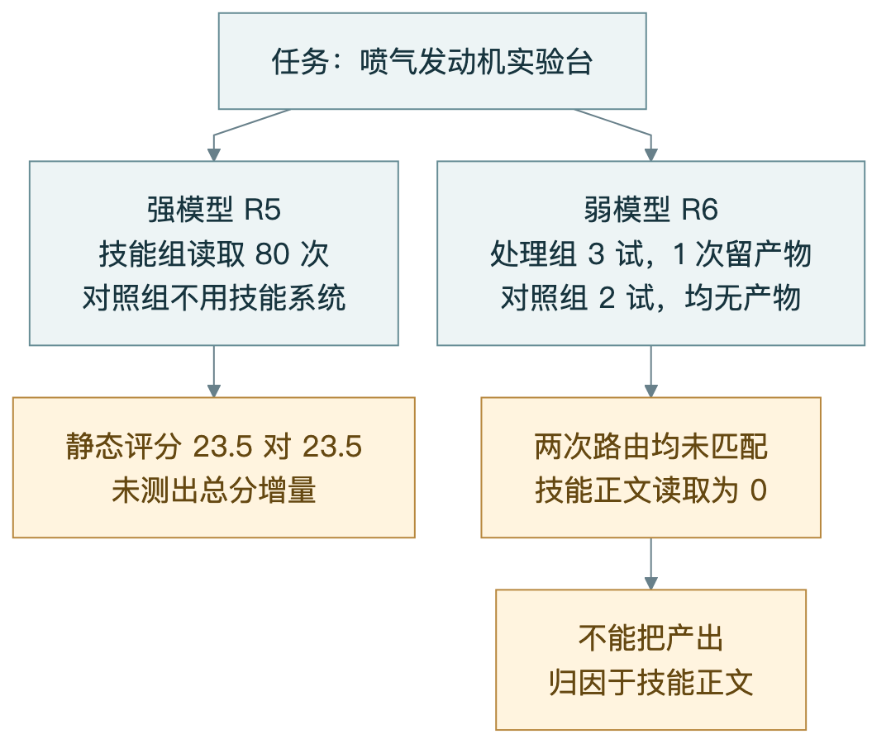
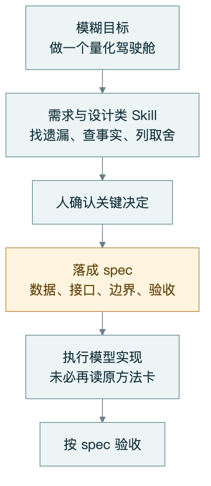
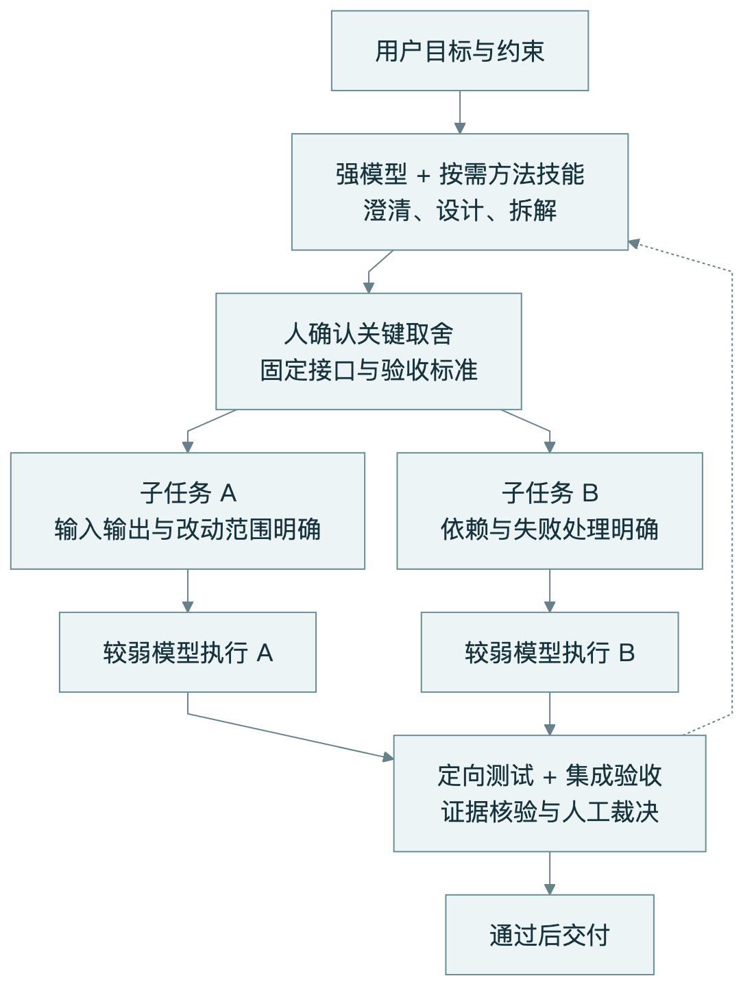
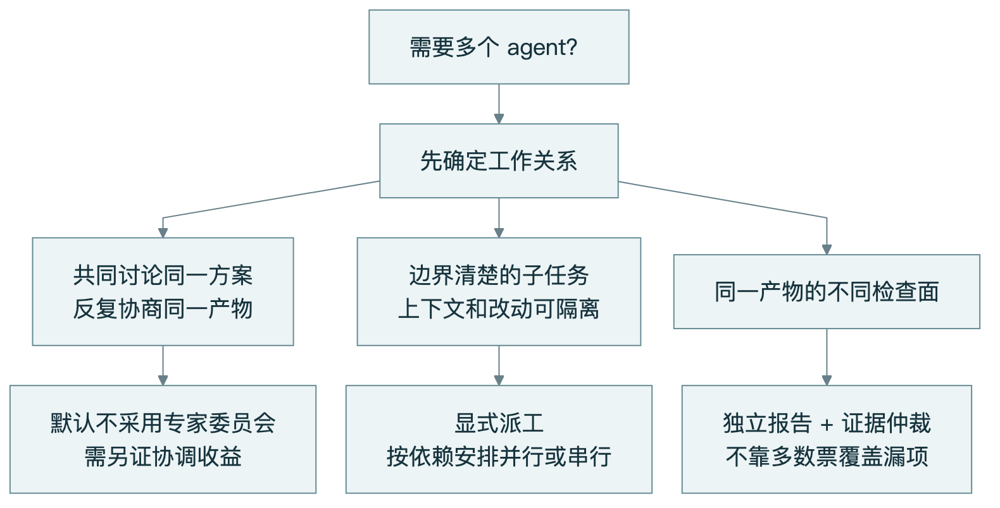
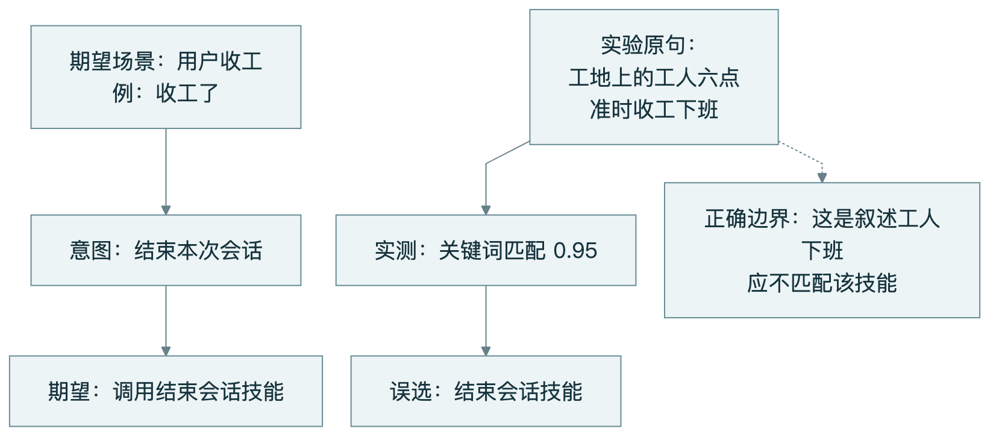
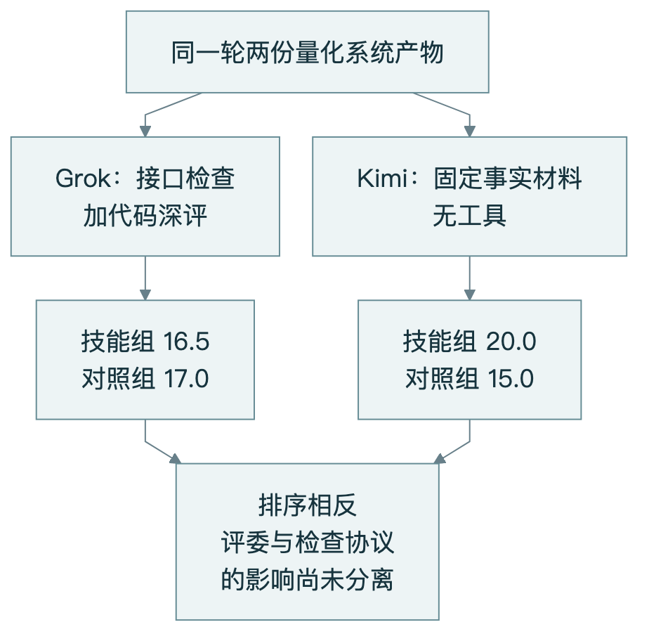
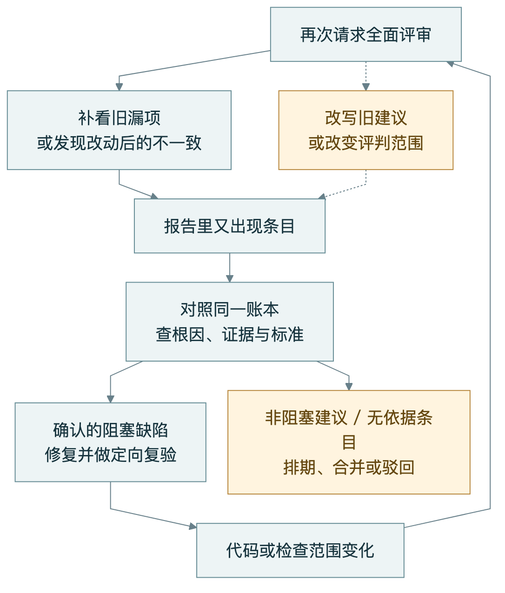
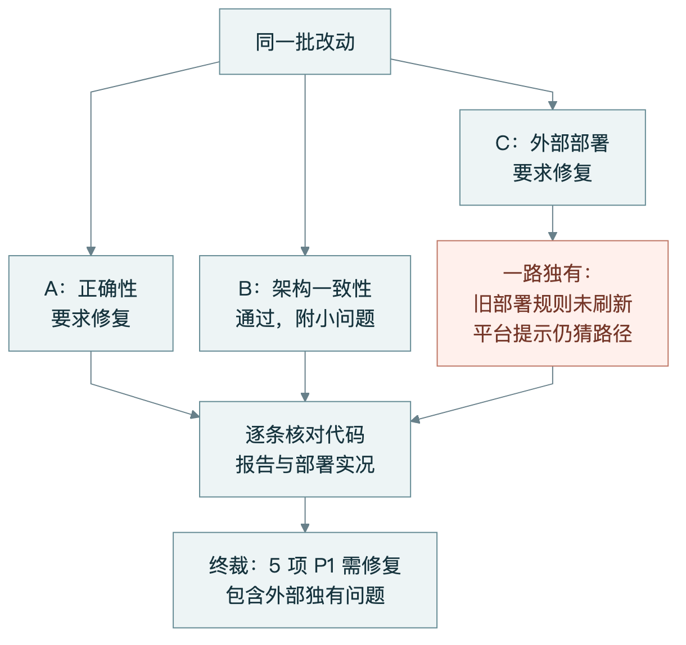
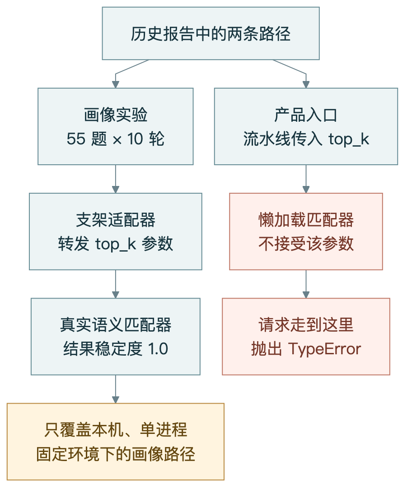
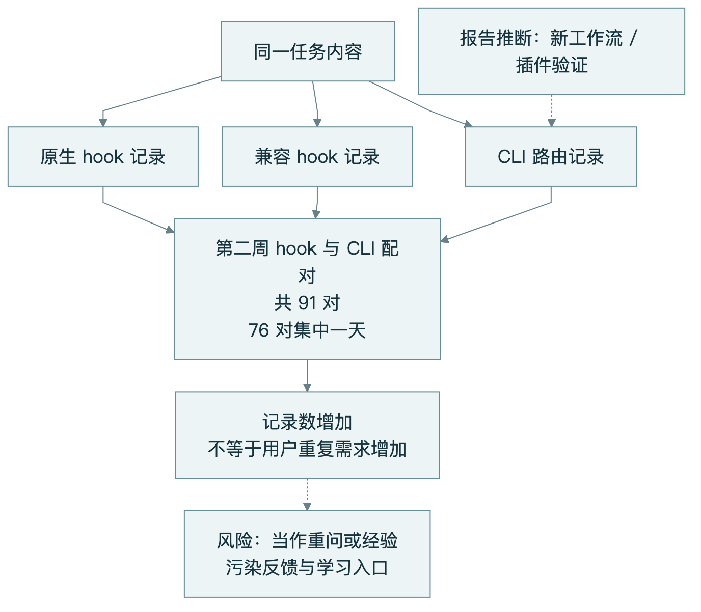

# Skill 的价值，可能在 AI 开工之前：完整 spec、强弱模型分工与专家委员会

**给 AI 装了技能，不代表技能参与了工作；多请几个 AI 评审，不代表结论更可靠；历史记录越来越多，也不代表系统学到了更多经验。**

这篇文章先回答两个我们自己也反复追问的问题。

**Skill 到底有没有用？** 在测过的任务里，我们看到了工作过程的变化，但没有建立“加 Skill 就能稳定提高产物质量”的证据。零增量不等于普遍无效，单次完成度领先也不等于技能立功。

**为什么 AI 每次审仓库都能找出问题？** 因为“这次写出的新条目”可能混合了新查到的缺陷、改动后出现的不一致、已有问题的重新表述，以及评判标准的变化。反复审、反复修，还在不断改变下一轮被审查的对象。我们要核验的是实际缺陷，而不是追求报告终于空白。

我们的进一步判断，可以连成三步：

| 容易接受的直觉 | 从实验与调研中得到的洞察 | 对应的工程选择 |
|---|---|---|
| Skill 给执行模型增加“专家能力” | 一类重要的 Skill 在帮助人把需求与决策补成完整 spec | 把方法技能用在需求澄清和任务设计阶段 |
| 每个执行任务都需要最强模型 | 清楚的任务描述与可靠运行环境，可能让较弱模型承担更多实现工作 | 强模型拆解、明确边界，弱模型按子任务执行 |
| 多配几个专家，系统自然更强 | 角色增多会引入协调、信息丢失与意见折中，收益并不自动成立 | 不默认拉专家委员会；按任务依赖和证据决定分工 |

VibeSOP 是我们开发的 AI 编程辅助项目：根据任务选择技能、把内容交给助手、记录执行过程，再把历史中的候选经验交给人审。这里的 **spec** 是可执行的任务规格：目标、输入输出、边界、失败处理和验收条件；“完整”指关键决策清楚，不是文档越长越好。

这三条洞察决定了本文的主线，后面再解释路由、评审和记忆为什么需要相应调整。项目数字来自截至 2026 年 9 月 12 日的历史记录，本次未重跑实验；外部技能与文献已重新查阅。我们会区分实测观察、解释框架和下一步方案。

## 一、Skill 是否有效？一个被忽略的作用，是帮人把 spec 写完整

**我们的核心洞察是：Skill 的价值可以发生在需求形成阶段。它把人的隐含经验和未决问题，变成执行者能够使用的任务规格。**

因此，“执行时加不加 Skill，分数一样”，与“Skill 对整个工作流程有用”，可以同时成立。前面的 Skill 已经帮助人把要求说清，后面的模型就未必需要再读一次原始方法卡。我们的执行期 A/B 没有单独检验这条前移的作用链，但它提供了理解结果、设计下一轮实验的方向。

现有证据支持的强度也不相同：强模型在若干清楚规格的任务中，不使用技能也能完成验收；弱模型留下了可用产物的信号，但尚无同预算、充分重复的强弱模型对照。

如果“有效”指助手开始列假设、补测试、写计划，我们已有过程记录。如果指最终作品更好，就要比较产物，而不能只数步骤。如果指省钱、省时或减少长期维护问题，还要分别测成本与后续影响。

把既有实验放在一起，比只挑一轮成功或失败更清楚：[1][7]

| 实际任务 | 工作过程 / 技能参与 | 产物层结果 | 能回答什么 |
|---|---|---|---|
| 待办 CLI，两次探针 R1/R2 | 装有技能系统，但均未命中技能 | 两轮都是 12/12 对 12/12 | 安装和增加技能包，没有自动产生增量；不能据此判技能正文无效 |
| 购物车调试 R3 | 引用调试技能、列根因假设、主动补 3 条测试 | 隐藏验收 16/16 对 16/16 | 过程有变化，当轮验收没拉开 |
| 强模型喷气机 R5 | 80 次读取，主动自测 | 静态评分 23.5 对 23.5 | 读取多和总分提高是两回事 |
| 弱模型喷气机 R6 | 两次未匹配，正文零读取 | 一次留下 22/25 产物，对照无产物；有协议偏离 | 不能归因于技能，也不能证明弱模型追平强模型 |
| 量化系统 R7 | 技能实际参与了计划、测试和界面设计流程 | 两套评审给出相反排序 | 不能只选有利成绩单证明有效 |
| 粗任务书量化 R8 | 缺少独立消费账本 | 人评更完整，盲评未结算 | 有继续验证的信号，尚不能作确定结论 |

R4 是实验方案评审，没有两组产物，不计入效果对照。不同轮次也不是同一任务的重复试验，不能合成一个简单胜率。

### 喷气机案例：系统在场、技能被读、技能带来增益，是三件事

实际任务是一张“喷气发动机实验台”网页：能旋转查看发动机，拖动油门，观察转速、推力、排气温度，还要引导学生做实验。

我们让两组模型读取同一份任务书和相同资源种子。一组可以使用 VibeSOP，一组不使用。任务并没有把教学方式、视觉风格和文件组织全部写死，技能有潜在的发挥空间。

强模型那轮，技能组读取了 80 次技能文件，还主动写了油门快速推拉的自测。对照组没有这项自测，却做出了自己的教学方案。按当轮五维静态审读评分，两组都是 23.5/25。

换成 27B 弱模型后，技能系统在场的一组第三次尝试写出十个文件，产物得到 22/25；对照组两次均没有文件。但处理组两次路由都未匹配，技能正文一次没读。[1]

*图 1｜两个轮次分别比较，不能把 22 分与 23.5 分画成模型能力排名。弱模型轮次有协议偏离，见下文。*

类比装修：工具箱运到了工地，房子也盖好了，但如果工具箱没有打开，这栋房子就不能证明箱内工具有效。另一位师傅打开工具箱很多次，最终验收与别人相同，也不能仅凭开箱次数证明质量更高。

弱模型实验的限制尤其重要：两组尝试次数不同，对照组运行参数的生效时点未完整记录；处理组在内存故障中止后被保留评分，属于事后豁免。严格按原作废规则执行，处理组也没有有效评分。我们既不能宣称“弱模型追平强模型”，也不能进一步宣称“已经证明静态规则导致了胜出”。

**真正得到的是一个排查顺序：先确认干预发生，再讨论干预效果。**

### grill-me：把“你想要什么”变成一组已作出的决定

Matt Pocock 的 `grill-me` 是一个具体例子。当前源码把它定义为需要用户点名的入口，再委托给 `grilling`；后者把方案展开成决策树，按依赖关系逐轮追问，提供推荐选项。能从环境中查明的事实由助手调查，需要取舍的决定交给用户。[grill-me 源码](https://raw.githubusercontent.com/mattpocock/skills/main/skills/productivity/grill-me/SKILL.md)、[grilling 源码](https://raw.githubusercontent.com/mattpocock/skills/main/skills/productivity/grilling/SKILL.md)。

我们把这种作用理解为 **spec 的缺口探测与补全**。它不保证自动生成一份规格文件，澄清后的决定仍需写入任务书；它也不是本项目做过独立 A/B 的干预。

以我们做过的量化驾驶舱为例，“做一个量化系统”留下了大量空白：信号产生后在哪一根行情柱成交？行情来自真实数据还是模拟？回放与模拟交易是否共用撮合逻辑？哪些接口必须有，哪些能力不在本轮范围？

这些问题并不是多写几句“你是资深量化专家”就能消失。它们需要被问出来、作出决定、进入验收。**这里借用真实实验中的问题说明该方法如何应用，不是声称那轮调用过 grill-me。**

*图 2｜Skill 前移的机制假设。量化场景来自项目；这条完整流程尚未作为独立实验验证。*

可以把 spec 看作本次施工图，把这类 Skill 看作帮设计者查漏的标准图集。执行者拿到已经补全的施工图，即使不再翻图集，也可能完成同样的工作。工具的贡献发生在上游，不能只在施工现场寻找它。

这并不意味着所有社区 Skill 都是在写 spec。调试、操作脚本、项目私有知识等仍有执行期价值。但需求访谈、计划、接口设计这一类技能，值得优先按“减少了哪些歧义和遗漏”评价，而不是只看让模型多走了多少步骤。

**下一轮应该分别比较需求粗细和执行期技能开关，并记录 spec 的形成过程。**先把这两个变量分开，才能判断是任务书已经包含了技能的信息，还是技能在执行阶段另有贡献。不能从打平直接推导“技能归零”。

## 二、完整 spec 的另一层价值：把强模型的判断交给弱模型执行

**第二条洞察是：值得尝试让强模型集中解决歧义与跨模块决策，让较弱模型承担边界清楚、可以独立验收的实现。**

R6 给我们这个方向的直观启发：较弱模型没有读取技能正文，仍留下了接近强模型当轮静态分数的喷气机产物。不过，22 与 23.5 来自不同轮次；失败尝试、运行预算、参数记录和事后豁免都限制了比较。它提示“部分工作可能可以交给弱模型”，不能量化为“弱模型达到了强模型多少百分比的能力”。

尤其需要区分：实验还没有完整覆盖“强／弱模型 × 完整／粗 spec × 有／无技能”的组合。因此，“完整 spec 能让强弱模型在有无技能时都表现很好”，可以作为下一步要验证的假设，不能写成已完成的全因素结论。

### WikiSkill：小模型加方法，确实可以超过更大的裸模型

2026 年 8 月的预印本 [WikiSkill（arXiv:2608.27454）](https://arxiv.org/html/2608.27454) 提供了更直接的外部证据。其表 1 的五项基准平均准确率如下，分数为三次独立演化所得技能的测试均值：

| 模型 | 无技能 | WikiSkill |
|---|---:|---:|
| Qwen-3.5-9B | 29.9% | **47.4%** |
| Qwen-3.6-27B | **39.4%** | 63.3% |

9B 加技能超过 27B 无技能 **8.0 个百分点**，但不是超过也加技能的 27B，更不是每项任务都胜出。表 2 中，9B 在 ALFWorld 使用 27B 演化的技能达到 70.2%，高于使用自身技能的 63.4%；这为“形成方法与执行方法可以分开”提供了具体例子。

方法也有区别：WikiSkill 从经验经持久 wiki 演化技能，并将完整技能直接注入执行模型，排除了检索未命中的干扰。它检验的是技能演化和迁移，不是完整 spec，也不是同总成本的强弱模型开发流水线。[方法 §3.2.1、结果 §4.2](https://arxiv.org/html/2608.27454)

这让我们的主张更完整：一类 Skill 帮人补全需求，另一类把经验整理成可迁移的执行方法。下一轮应分别测这两种收益，而不是把所有技能归为同一种“提示词增强”。

### 我们建议怎样分工

让强模型查清现状、调用需要的设计类 Skill、把用户取舍落实到 spec，再拆分子任务。每个执行者拿到完整的局部上下文、允许改动的范围和验收条件；遇到规格歧义就升级，不自行改变全局设计。

*图 3｜拟验证的强弱模型分工，项目尚未完成整机对照。只有依赖已解决、改动可隔离的任务才并行；虚线表示验收失败或规格歧义时升级。*

沿用量化案例，下面是一张**建议的子任务卡**，不是历史实验已经使用的派工单：

| 字段 | 示例：实现下一根行情撮合 |
|---|---|
| 目标与输入 | 接收已经确认格式的信号和行情序列 |
| 输出与不变量 | 输出成交记录；信号产生在第 t 根，禁止使用第 t 根收盘后才知道的信息在同根成交 |
| 范围与非目标 | 只改约定的撮合模块及测试；不修改策略、行情接入和前端 |
| 边界条件 | 缺少下一根行情时不成交；异常输入按已约定错误契约处理 |
| 依赖 | 行情时间语义、信号格式、手续费规则由上游先确认 |
| 验收与升级 | 提供对应测试结果；契约未定义时返回问题，不擅自补规则 |

这像设计院与施工队的分工：设计院负责把相互影响的决定做对，施工队依据图纸完成局部工作。边界清楚能减少执行者需要临场推理的事情，但图纸错误仍会被放大，不能取消集成验收。

预期收益是把更强的推理用在会影响多个子任务的决定上。是否真正省成本、缩短时间或减少返工，需要把设计、失败重试、协调和验收全部计入。弱模型单次调用便宜，不代表整项任务便宜。项目路线图已将“设计院→施工队”列为待做实验，而非已经交付并证实的产品。[11]

## 三、多专家体系真的更好吗？我们的默认答案是否定的

**我们对“先配齐一组常驻专家，再让他们协商完成任何任务”的默认方案持负面评价。**增加角色并不自动增加知识，也可能增加信息交接、修改冲突与决策折中。

这项评价来自两类证据，需要分开放：外部研究直接比较了不同协作形态；我们的项目验证了自动角色编排的误触发，以及独立评审的覆盖价值。我们没有做过“单 agent 对常驻八专家”的整机 A/B。

| 重新查阅的研究 | 在其测试条件下观察到什么 | 对我们的启示 |
|---|---|---|
| [Multi-Agent Teams Hold Experts Back](https://arxiv.org/abs/2602.01011v4) | 自组织团队未达到最强成员表现；即使指出谁是专家，仍出现专家与非专家意见的折中 | 正确意见可能在寻求共识时被稀释 |
| [TeamBench](https://arxiv.org/abs/2605.07073v1) | 分离规划、执行、验证的访问权限后，团队价值仍取决于任务；单体已经表现好时，团队可能拖累；验证者也会放过失败提交 | 分工与多一道模型审批，本身不保证可靠 |
| [CooperBench](https://arxiv.org/abs/2601.13295v2) | 两个编码 agent 协作相较一个 agent 完成两项任务，平均成功率更低；沟通与履行约定是主要问题 | 并行之前，先处理共享代码与接口依赖 |

WikiSkill 同样使用多个功能组件协作，提醒我们应按具体机制与结果评价，不能因为系统使用多个 agent 就否定它。

这些研究分别考察自组织协商、强制角色分离和共享代码协作，不能合并成一个“多专家失败率”。它们共同削弱的是“人数和角色增加就应更好”这个默认预期。

我们自己的代价更具体：纯文档评审曾触发多意图编排；七条不该注入的探针有五条被误派技能。后来项目撤回“角色词达到条件就自动组队”的行为，保留显式并行入口，停止扩张常驻专家编制。[11]

这里的错误发生在**是否应该启动这套组织**的第一步，不能拿它证明专家人格本身降低了能力。它足以改变产品默认值：用户没有要求的组织成本，不该自动附加到普通任务上。

*图 4｜由调研与项目经验得到的选型建议，不是三种架构的自家对照结果。*

这也解释了它与上一节不矛盾：强模型分派明确子任务，依靠的是接口与验收；专家委员会让多个角色共同协商，依靠的是尚需证明的协调能力。两者都可能调用多个模型，但工作机制不同。

我们不否定所有多 agent。Anthropic 的研究系统在可分开探索的方向上报告了收益，同时指出共享上下文、依赖密集的工作不适合直接套用。这个正例限定了我们的负面判断：**反对默认专家编制，保留有明确任务理由的并行与独立检查。**[Anthropic 工程报告](https://www.anthropic.com/engineering/multi-agent-research-system)。

接下来几个项目案例，说明这套分工还需要哪些配套：路由要理解意图，评审要形成有证据的决定，验收要覆盖真实入口，历史记录要能辨认来源。

## 四、路由边界：只要找到了技能，就算理解了用户

### 我们的发现：相同的词，可以处在完全不同的意图里

VibeSOP 有一个结束会话技能。用户表达收工意图时，它可以帮助整理当前工作、记录待办。

但下面这句话不是在要求助手收工：

> 工地上的工人六点准时收工下班。

在一次 Linux 容器对照中，固定环境基准和真实 CLI 路径都把它匹配到了结束会话技能，关键词分数为 0.95。[2]

*图 5｜上半部分说明应有语义，不代表两条路径都已实测通过；下半部分是两臂复现的错误。实线表示实测或明确标注的语义关系，虚线指向应有结果。*

同一组测试里，天气、翻译、公众号等五条明显负例，两边都能正确拒绝。加入十四条“用词像技能、实际在说别的事”的近似负例之后，固定环境基准误注入 2/19，真实 CLI 路径误注入 1/19。

另一条差异是英文里的“herd instinct”：这里说的是市场中的羊群心理，固定环境基准却选了经验学习技能，真实 CLI 没有匹配。两种环境的候选技能集合不同。

这些结果说明两件事：简单负例全过，不代表意图边界清楚；固定环境的测试数字，也不能原样当成真实使用数字。该轮 CLI 还出现过一条正例结果抽取为空，报告没有将它直接认定为产品漏判。

可以把路由想成图书馆咨询台。读者问“小说里的人为什么决定退休”，管理员却替读者办理了离职手续。它识别出了词，却没有识别谁在做什么。

**对应优化：**保留“无需技能”这个正常出口，同时增加真正触发与相似叙述的成对用例。既测误注入，也测误拒绝。修复方向应是分清意图，而不是删除结束会话技能，或一味提高匹配阈值。

## 五、评价边界：给作品打出分数，就有了客观答案

### 我们的发现：分数压缩了检查范围，也压缩了价值判断

我们让两组模型做量化驾驶舱：读取同一份真实行情种子，提供行情、回测、回放和模拟交易接口。两组主要接口都返回成功，但代码里都存在不同问题。[3]

技能组的一个测试，在生成交易信号的同一根行情柱上撮合，与实现声称的下一根撮合不一致；对照组则把评测日期的收盘价硬编码成了指定值。

两个评审对这两种问题的权重不同：

| 评审方式 | 技能组 | 对照组 | 更重视的缺陷 |
|---|---:|---:|---|
| Grok：调用接口并读代码 | 16.5 | 17.0 | 技能组的测试撮合时序等问题 |
| Kimi：无工具，依据固定事实材料 | 20.0 | 15.0 | 对照组硬编码评测值等问题 |

*图 6｜这里测到的是两套评审的分歧，不能单独归因为模型偏好或随机性。*

这像两位验房人：一位主要检查电路，另一位根据检查清单评价材料。分数都叫“房屋质量”，里面装的东西却未必相同。

这次实验没有证明技能无效，也没有证明某个评委更正确。它证明不了“换一个评委就稳定翻转”——我们没有做重复标定。但它足以说明：**只发布其中一张成绩单，会漏掉足以改变读者判断的信息。**

**对应优化：**固定评审输入、工具权限和标准；同时保留缺陷明细与分数。下一步对同一产物重复盲评，测排序的稳定性，再与人工取证对照。尚未标定前，不用几分的差距包装确定的产品收益。

## 六、为什么每次让 AI 评审仓库，总能审出问题？

**先区分两种情况：冻结同一份代码反复评，和一边修复一边重新评。它们不是同一个实验。**

我们主要积累的是后一种工程记录。仓库持续变化，模型、上下文和检查侧重点也会变化。因此，“这轮还有问题”不能直接说明上一轮白做了，也不能单独证明模型在编问题。

### 真实现场：定向检查通过了，下一轮仍然报出 10 条

在 9 月 3 日那次修复中，批 C 修改了技能路径指引、部署检查与版本标记。前置评审认可了相关修复，定向测试也通过；随后对提交 `7177b65` 的复审，又给出 10 条：1 条阻断项、3 条重大、4 条一般和 2 条小问题。[8]

阻断项很具体：模板已经从“猜一个技能路径”改成“读取返回的真实路径”，但一条旧的端到端测试还在断言模板必须包含旧句式。复审实际运行了这条测试，确认失败。前面的定向测试没有覆盖它。

另一个问题是，有的平台说明文件没有跟着改，新增扫描器又恰好漏掉了这个形式。

这轮确实有值得处理的新条目，但“新”包含两种含义：此前漏看的残留，以及代码改动后才形成或暴露的不一致。不能把十条统称为十个新引入的 bug。

### 一份“新问题清单”，可能混着四种东西

| 来源 | 在项目里怎样出现 | 当前能判断到哪一步 |
|---|---|---|
| 之前漏查的真实问题 | 外部部署评审看到旧规则没有刷新 | 有条目级证据，应该补修 |
| 改动后形成或暴露的不一致 | 新模板与旧测试要求相反 | 有失败测试；需追踪变更，区分新引入与旧问题显露 |
| 标准或范围发生变化 | 同一问题有人判重大、有人判一般；“补测试”“拆模块”也可扩展范围 | 严重度分歧有实证；是否阻塞要回到约定 |
| 换措辞重复建议，或提出缺少依据的风险 | 标题看起来全新，但未必对应新根因 | 是需要排查的解释，真实占比尚未测清 |

*图 7｜真实缺陷与修复复审循环有项目记录；虚线是待逐条区分的解释，不表示已测出它们的频率。这张图不是“永不收敛”的数学证明。*

我们还用文本解析器扫描过 191 份历史 gate 文件，抽出 310 条发现，归一化标题精确去重后剩 307 条，字面重复率约 1%。这不能解释成“99% 都是真新问题”：换词描述同一根因，仍可能算不同标题；解析器还存在散文抽取的覆盖限制。[9]

这些文件跨版本、跨任务，也不是冻结同一仓库快照的 191 次重复试验。低字面重复率不能证明发现永不枯竭。

一个好懂的类比是改文章：这一轮校错别字，下一轮看论证，再下一轮改文风。每轮都有意见，并不表示错别字永远改不完。若每轮都只说“请全面优化”，却没有保存已经接受的取舍，第三轮还可能把第一轮认可的写法改回去。

**所以，“有新条目”同时受代码状态、检查覆盖和评判标准影响，不是仓库质量的单一读数。**

至于“AI 是否为了交差，即使没问题也必须找点问题”，我们专门预注册了空报告率实验：给机械样板、通过确定性检查的用例、空或极简改动，检查它能否报告“无需优化”。截至本文材料时间，该实验尚未执行，不能把“强制找问题”写成已证实的主因。[10]

### 应该让什么收敛？

让本轮的发布决策收敛，比要求所有可能的建议消失更可操作：先冻结提交和验收范围，记录每条问题的根因、证据、严重度、处理结果；对确认的阻塞问题修复复验，对非阻塞取舍保留理由。

“还能更优雅”可以进入下一轮计划；能复现的功能错误不能靠换一个评委得到通过。模型说“通过”也只代表这次检查意见，不能代替机器验收与责任人的判断。

### 多路评审的作用：一票反对可能代表其他人没检查过的地方

2026 年 9 月 3 日，我们对一批技能注入与路径处理的改动做三路独立评审，分别侧重正确性、架构一致性和外部部署。

外部部署评审发现：仓库代码升级了，用户机器上先前生成的常驻规则却没有自动刷新。旧规则仍然教助手猜技能路径，和新版返回的真实路径冲突。另一个平台的提示文件也保留了猜路径的做法。[4]

这两条只被外部一路发现。

*图 8｜这是一次真实评审的关系图；最终结论来自条目级核验，不由箭头数量或票数决定。*

进一步对账：五条曾被判为重大问题的发现，没有一条被两路同时判为重大。但其中三条存在实质重叠，只是严重度不同；另外两条才是某一路独有。

所以，不能写成“三个 AI 完全没有共识”。更准确的发现是：**发现范围的差异与严重度的分歧，需要用不同方式处理。**

范围差异要补检查，严重度分歧要拿验收标准和项目先例校准。

这像交房验收：有人检查室内布线，有人检查承重结构，有人去看入户总闸。只有一个人发现总闸没接通，不能因为另外两人没提，就把它当成少数意见。

本例中，外部评审抓到了真实漏项；它并不能证明某种模型天生更懂部署，也不能证明增加任意一个评审都会增加覆盖。

**对应优化：**按检查对象分工，维护同一份问题账本，要求指出触发条件、影响和复现方式。修复后针对问题验收；主观改进建议另行排期。不要把“再审一遍直到无人提意见”设为默认停止条件。

## 七、测量边界：测试支架里稳定，用户路径也就稳定

### 我们的发现：测量对象可以在不经意间被换掉

这是整个项目里最能说明“仪器也要检查”的案例。

我们原本怀疑语义检索不稳定，于是做了带控制组的画像：固定同一组 55 道题，各重复十轮。控制组关闭向量语义匹配；实验组开启向量语义匹配，AI 分流模型仍然关闭。这里的画像是一次专门测量，不是产品运行日志。

两组的首选结果和命中层稳定度都是 1.0。实验组里，向量匹配实际承担了 180/550 次路由，所以它并非没有运行。[5]

同时，我们发现了另一个事实：真实产品的路由流水线会传入一个名为 `top_k` 的参数，但它调用的懒加载匹配器不接这个参数。只要请求走到这一处，当时就会抛出参数错误。

为了按任务边界完成画像，实验在测试支架里加了适配器，没有在该分支修改产品代码。

*图 9｜两条路径不能合并解读。图示为 9 月 11 日交接报告的历史状态，不代表当前产品仍有这个错误。*

类比台架测试：实验室通过转接头给发动机接上电源，发动机表现稳定；整车的线束却接不上。台架数据可以是真的，“整车可用”仍然没有得到验证。

这次实验支持我们缩小“本机固定输入下有很大语义方差”的担忧，转为低频抽检。它不证明路由全部正确，不覆盖跨进程、跨机器，也不覆盖开启 AI 分流后的表现。

**对应优化：**给实验记录运行路径、适配器、依赖版本和开关；修复产品调用契约后，再用真实链路测试，并重新测量。把“稳定”“正确”“产品可达”分别验收，不用一个绿色结果代替三个判断。

## 八、学习边界：历史越多，系统学得越多

### 我们的发现：增加的历史，可能是同一次请求经过了多个入口

VibeSOP 会收集路由和反馈，帮助寻找值得沉淀的经验。在实际接入项目 cmspark 后，我们发现：自动钩子处理过一次请求，助手又调用命令行路由，同一内容就会在日志里出现多次。

如果把它理解成“用户又问了一遍”，就可能误判上次处理失败；如果把它累积进候选池，就可能高估某类需求的频率。

我们调整提示文案，减少助手收到路由结果后机械地再问一次。第一周，每天回声对从预先钉死的基线 14.4 降到 3.57，下降约 75%。第二周却到了 13.0，较第一周回升约 264%。[6]

| 测量窗口 | 回声对/天 | 该怎样读 |
|---|---:|---|
| 基线，约 30 天 | 14.4 | 预先固定的比较值；原始数据复算约 14.34 |
| 修改后第一个 7 天 | 3.57 | 该窗口治理指标明显改善 |
| 随后的 7 天 | 13.00 | 按“不回升”判据正式判为失败 |

第二周的 91 对里，76 对集中在一天。日志显示两种钩子与 CLI 通道交叉出现，且这些回声对都跨会话。报告据此推断，新工作流与插件验证引入了不同于原先文案作用面的重复来源；但它没有逐条追溯到调用进程，来源解释仍有推断成分。

*图 10｜实线说明报告中的记录与配对结构，不表示已追踪全部调用进程；虚线表示来源推断或下游污染风险。91 对不是 91 次独立用户请求。*

这像客服系统把同一封邮件、自动转发副本和工单通知分别计成了三次投诉。报表显示需求猛增，实际增长的是系统的转发次数。

“剔除爆发日后只剩每天 2.5 对”能帮助定位原因，却不能替换正式结果。那一天是真实使用的一部分。反过来，指标反弹也不能独自证明原文案治理已经失效：新的重复可能来自它控制不到的通道。

**对应优化：**给反馈保留来源、任务关联和会话信息，分开衡量不同入口；追查重复形成机制，再决定在哪一层去重。继续保留后续窗口复检与人工经验准入。这个案例证明了反馈污染确实存在，尚未测出它对最终任务质量造成多少损失。

## 下一轮：先验证分工，再扩大规模

我们的调整可以落到具体的验收问题上：

| 优先动作 | 对应项目教训 | 下一轮至少要回答什么 |
|---|---|---|
| 比较 spec 形成过程与执行期技能贡献 | 清楚规格下强模型打平；grill-me 澄清决策 | 是上游补全需求起作用，还是执行期仍有增量？ |
| 用同预算重复测试强弱模型分工 | R6 提供启发，但有失败与协议偏离 | 算入设计、重试和验收后，质量与总成本怎样？ |
| 专家委员会必须另证收益 | 外部协调负结果；项目自动编排误触发 | 这项任务为什么需要多人协商，而非单体或明确子任务？ |
| 先检查技能是否参与，再扩技能库 | 喷气机零读取仍产出 | 选对了吗、内容到达了吗、执行改变了吗？ |
| 给触发词补成对的意图用例 | 工人“收工”误触发 | 误注入下降时，真正的结束会话请求是否仍能命中？ |
| 固定评委材料和工具，再比较分数 | 量化评分方向相反 | 同一条件下重复评，排序还稳定吗？ |
| 冻结评审范围、共享问题账本，再分工核验 | 修复后又出 10 条；部署问题只有一路发现 | 是漏项、改动影响、重复建议还是标准变化？本轮阻塞是否闭合？ |
| 把支架路径与产品路径并列检查 | 适配器遮住了调用契约差异 | 去掉适配器后，真实入口是否跑通？ |
| 分来源追踪反馈，并跨窗口复检 | 回声通过新通道反弹 | 增长的是用户需求，还是系统重复记录？ |

这些是由案例和外部研究推出的工程建议。spec 形成过程的对照、强弱模型分工的整机实验、评委重复标定和长期学习收益验证，仍是待做的工作。

文章最重要的建议由此落到三个位置：**把 Skill 用于补全关键决策，把强模型用于定义清楚的工作，把多 agent 用于确实可以分开的任务。**

这不会免除执行与验证，但会改变投入顺序。我们原先容易问“还要加什么角色”，现在先问“还有哪个决定没写清、哪条依赖没有解除、哪项验收没人负责”。

这个变化已经影响了投入：一次不匹配可能是正确服务，一条少数评审意见可能值得阻断，一次稳定实验可能要求修产品接线，一次反馈增长可能要求检查采集。

**优化的起点，是把我们看到的现象，放回它实际发生的那一层。**

---

### 项目证据索引

本文为项目实践复盘，项目结论回查原始记录，未重新运行历史实验；外部引用在改稿时复核。无跨模型普遍性或自家统计显著性声明。链接用于仓库内回查，发布公众号时可将此节作为文末材料说明。

1. 喷气机：[预注册任务与评分规则](../../../../.omx/artifacts/ab-jet-round1-eval.md)、[强模型报告](../../../../.omx/artifacts/ab-jet-round1-report.md)、[弱模型报告及协议偏离](../../../../.omx/artifacts/ab-jet-weak-report-r6.md)。80 次读取来自弱模型报告对前轮的回查。
2. 路由：[Linux 容器对照报告](../../../../.omx/artifacts/ab-routing-hygiene-20260911.md)。固定环境基准与容器 CLI 都不等于长期生产分布。
3. 量化：[R7 两套评分与检查方式](../../../../.omx/artifacts/ab-quant-r7-report.md)。粗任务书的未结算观察见[综述 §3.6](../../../research/research-survey.md)。
4. 评审：[三路仲裁原始报告](../../../../.omx/artifacts/pull-20260903-review-synthesis.md)，严重度对账见[研究综述](../../../research/research-survey.md) §4.5。
5. 语义画像：[Lane A 原始交接报告摘存](assets/evidence/evo-lane-A-handback.md)，重点看 §4–6 的运行边界与适配器说明。
6. 回声：[第一周测量](../../../../.omx/artifacts/gate43-t7-echo-measure.md)、[第二周复检与推断边界](../../../../.omx/artifacts/gate43-t14-echo-measure.md)。本案例观测环境是 cmspark，治理组件来自 VibeSOP。

7. Skill 全景补充：[R1–R3 探针原始报告](../../../../.omx/artifacts/ab-probe-20260828.md)；R8 的过程和局限见研究综述 §3.6，当前没有独立结果报告。
8. 修复后的再次评审：[批 C 复审原文](../../../../.omx/artifacts/pull-20260903-fixC-grok.md)。10 条的严重度与旧 e2e 失败来自此报告，未声称十条均为新引入缺陷。
9. 历史发现统计：[C.1 解析器交接原文摘存](assets/evidence/evo-lane-C1-handback.md)。字面去重不是根因去重，扫描到的零条目文件也未全部人工区分“真无问题／解析失败”。
10. 强制找问题的待验证假设：[空报告率预注册](../../../../.omx/artifacts/optimization-convergence-r3-prereg.md)，状态为未执行。

11. 派工与专家体系：[企业方法论](../../../enterprise-agent-methodology.md)、[锁定设计](../../../../.omx/artifacts/next-opt-design-v1.md)、[路线图](../../../ROADMAP.md)、[路由误触发原始审计](../../../../.omx/artifacts/routing-precision-audit-20260829.md)。前两者含工程推论；路线图明确整机实验待做。

外部来源已在对应段落直链：Matt Pocock 技能源文件、WikiSkill、三篇多 agent 原始论文与 Anthropic 工程报告。它们提供方法说明和外部实验结果，不能替代 VibeSOP 的整机验证。

12. WikiSkill：正文第二节依据 [v1 原文](https://arxiv.org/html/2608.27454v1) §3.2.1、表 1、表 2 与 §4.2；不将外部技能迁移结果归为自家实验。
