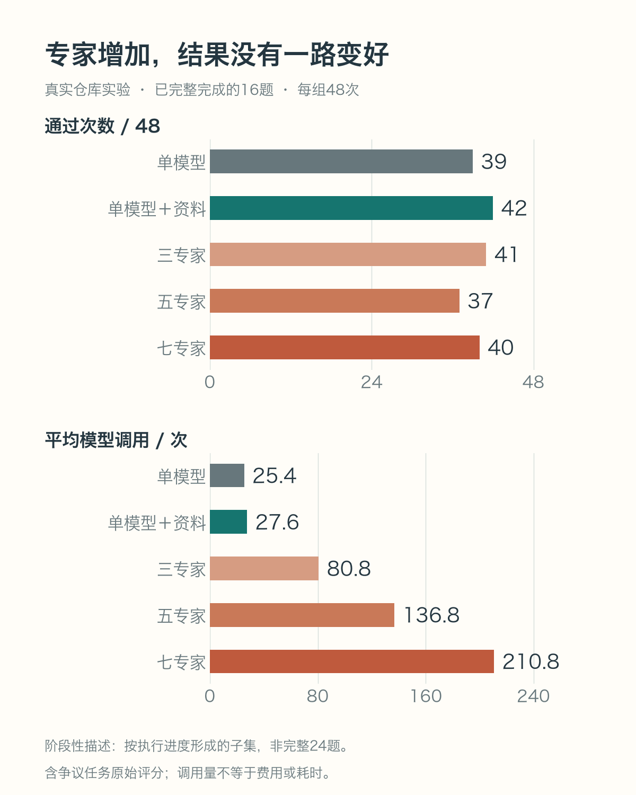
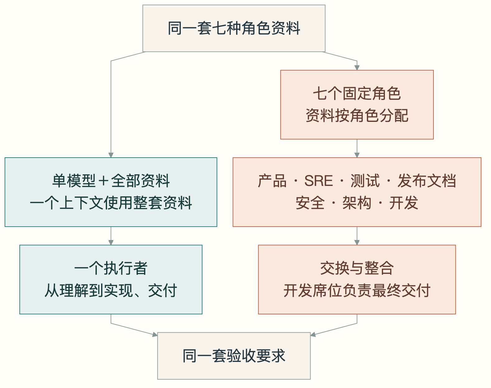
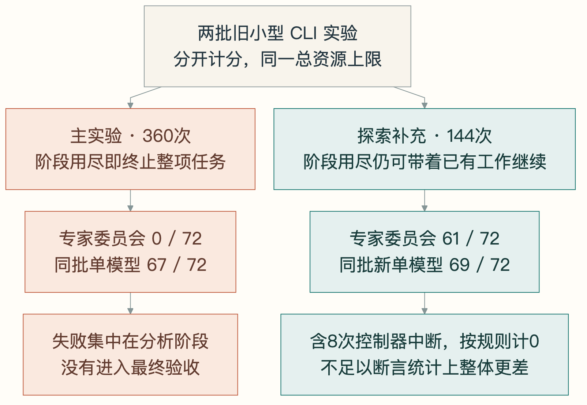
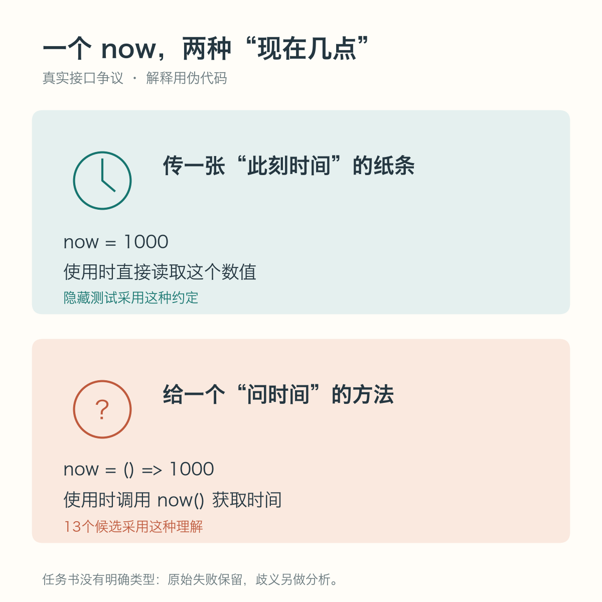
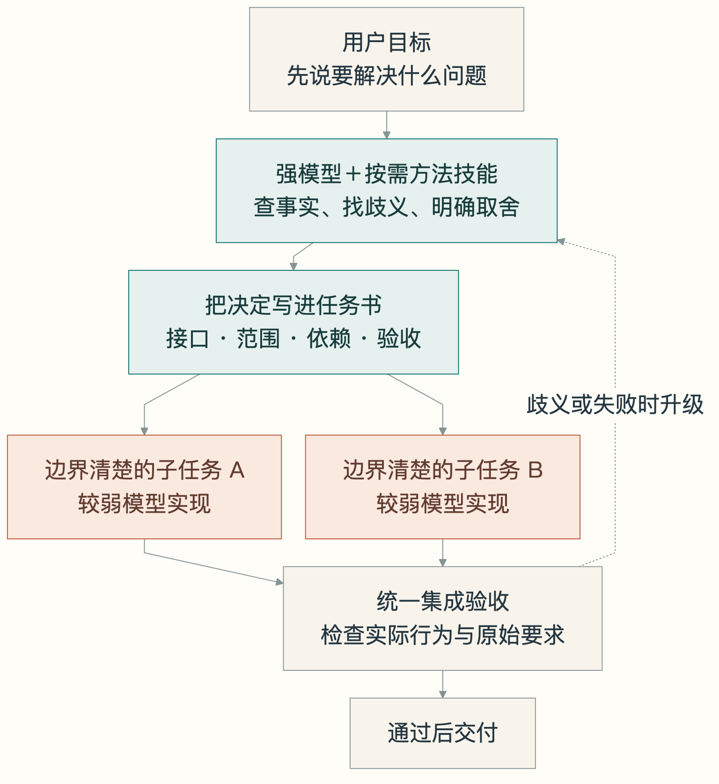
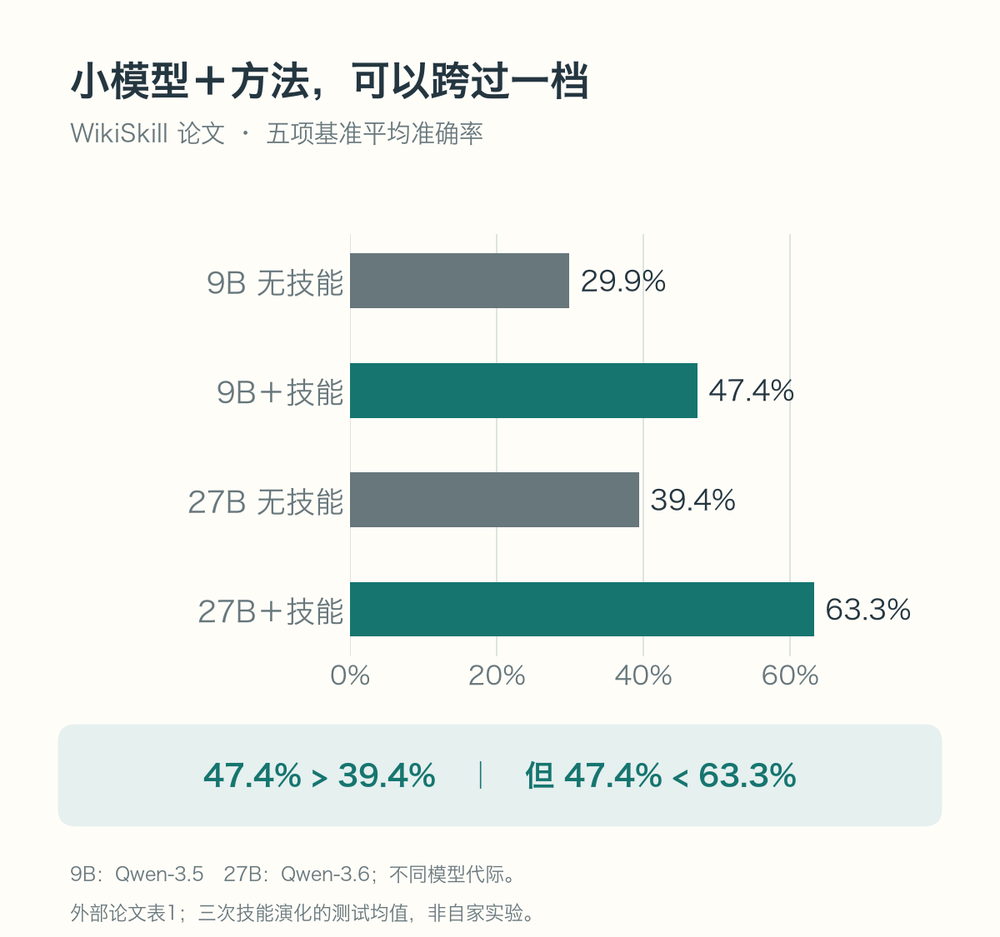
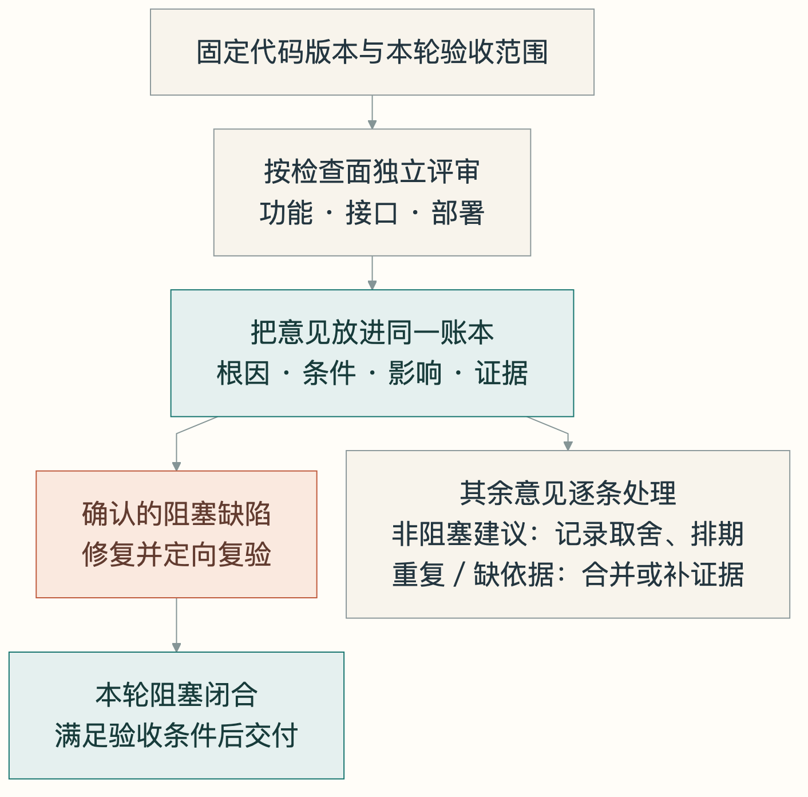
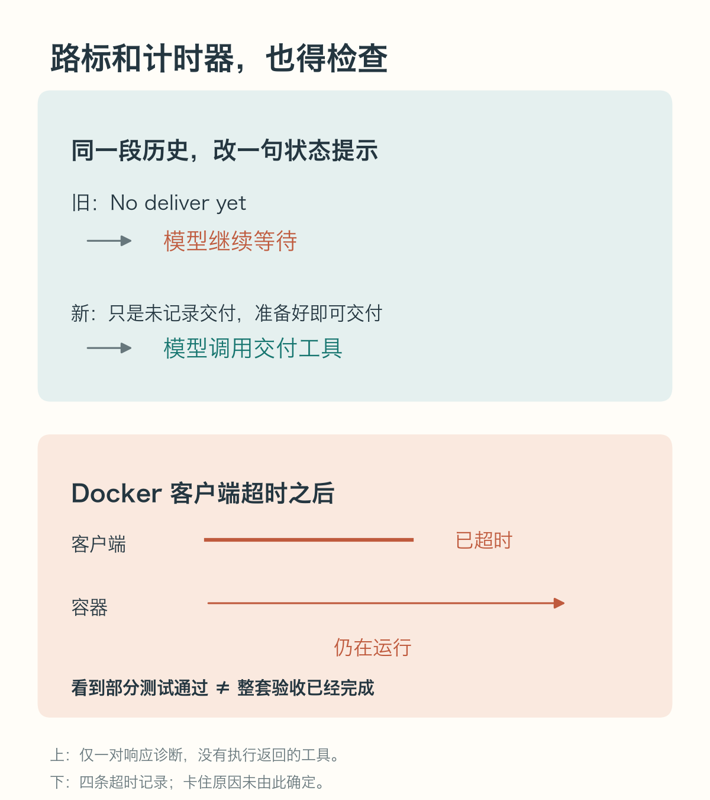
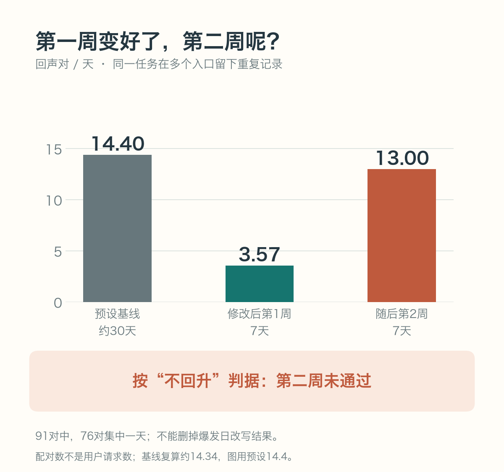

# 给 AI 配了七个专家，为什么未必比一个模型强？

给 AI 装上技能，再配一个产品经理、一个架构师、一个开发、一个测试、一个 SRE……看上去，一家微型软件公司就开张了。

我们也认真试了这条路。然后，实验给了我们几个不太顺耳的结果。

**技能读得多，作品未必更好。专家人数增加，调用次数一路上涨，通过次数却没有跟着涨。评审一轮又一轮，问题还在出现，连出题和评测的系统自己也会出错。**

最近一轮，我们先看五种方案都已完成的16道任务。每题重复三次，**每组48次：一个拿到全部角色资料的模型通过42次，七专家委员会通过40次。** 后者平均用了约7.6倍的模型调用。

这让我们越来越在意一个容易被跳过的问题：

**在给 AI 增加“人手”之前，我们到底有没有把活儿交代明白？**

*图1｜真实仓库实验的阶段性结果，每组48次。上下两幅图分别表示通过次数与平均模型调用，刻度不同。任务由执行进度形成，包含有争议任务的原始评分；不能当成完整实验或总体显著性结论。[数据与口径](#证据与阅读材料)*

我们做的项目叫 VibeSOP，帮助编程助手选择技能、执行流程、记录反馈。从技能 A/B，到代码评审，再到专家委员会，我们逐渐看到一条共同的线索：**每多加一层能力包装，都需要检查它究竟解决了哪个问题，又引入了什么新成本。**

下面讲的都是这条实践线上的事。有已经结算的实验，有正在进行的结果，也有值得继续验证的想法。它们的证据强度不同，我们会在对应位置说清。

## 01　一个人读完手册，和七个人开会，差在哪儿？

先想象一家修理厂。

客户送来一台机器。一种安排是，让一个技师拿到完整手册，负责从排查到修复。另一种安排是，七个人各看一部分：有人管安全，有人管性能，有人管交付，再把意见交给负责动手的人。

第二种安排当然可能更好：不同的人能看见不同的风险。

但它也多了几件事：解释背景、传递发现、消除冲突、确认谁说了算，以及把意见真正改进机器里。**这些活本身也要时间和钱。**

我们因此专门放了一个容易被忽略的对照：**让单个模型拿到七种角色的全部资料。**

这样才能问：收益究竟来自多了一本手册，还是来自多了六个交接环节？

*图2｜两组拥有相同的总角色资料，但资料分布和组织方式不同。七个席位中包含负责整合与交付的开发者，没有另加第八位执行者。[Mermaid 源文件](assets/02-roles.mmd)*

当前这轮从三个真实仓库选了24道有明确边界的改动任务，涉及功能、集成、回归和部署文档。它比小型玩具题更贴近项目工作，但仍不能代表任意大型工程。

我们比较单模型、单模型加全部资料，以及三、五、七个固定角色。三角色是产品、SRE、开发；五角色增加测试和发布文档；七角色再增加安全和架构。角色资料取自固定版本的公开角色库。各组使用同一参与模型和宽松的共同停止规则，设相同的整项任务资源上限，但不按人头切分固定额度。我们记录从执行到交付验收的过程，让协调开销自然进入总账；这仍然不是无限资源下的能力比较。

图1里，单模型通过39次，加全部资料通过42次；三、五、七专家分别通过41、37、40次。对应的平均调用约为25、28、81、137、211次。

**眼下最清楚的现象，是成本在增长，收益没有稳定增长。** 模型调用只是成本的一部分，不能把7.6倍调用直接换成7.6倍费用或耗时。

委员会也有做得更好的题。例如保护用户修改的任务，七专家通过2/3，单模型加资料通过1/3；重连错误传播任务，分别为3/3和2/3。反过来，升级文档任务则是1/3和3/3。每题只有三次，这些是用于理解差异的案例，不能拿一个局部胜负证明普遍规律。

我们的工程倾向因此很明确：**固定专家委员会需要证明自己带来了额外价值，才值得成为默认配置。**

还有一个变量不能混过去：从三人加到七人，我们同时增加了角色内容。单靠这三组，无法把“人数”和“知识覆盖”完全拆开。另设的72次人数诊断，会让每个人都拿到全部资料，再比较三、五、七人的差别；这部分尚未启动。

## 02　我们曾测出“专家全败”，后来发现裁判把会议提前结束了

如果只想写一篇唱衰多 agent 的文章，我们手里有一个更刺激的数字。

在此前已经结算的小型 CLI 主实验中，单模型通过67/72，专家委员会通过 **0/72**。

听起来够震撼。但只写这两行，会把读者带偏。

那轮有12道合成小任务，两种规格形式、五种组织方式，各重复三次，共360次。它固定了总资源，也给独立分析阶段设了单人额度。**成员分析用完额度，执行器会直接结束整项任务。** 72次专家委员会运行，全都卡在这个阶段。

像组织三位医生会诊，每个人发言时间到了，就把病人送出诊室。最后统计“会诊组无人完成治疗”，不能据此判断医生不会看病。

*图3｜两个独立计分的批次。后者由前者的失败诊断触发，属于探索性补充；不是对旧样本重判，也不能合并为一个胜率。[Mermaid 源文件](assets/03-stage-rule.mmd)*

后来我们保留同样的任务、角色提示和总资源，只把独立分析、交流阶段的额度用尽改成“保留已有工作，继续下一步”，又跑了144次，加入同批新的单模型对照。

这一次，单模型通过69/72，委员会通过61/72。

**一条流程规则，足以让委员会从几乎无法进入验收，变成能够完成大部分任务。** 但这个探索批次里，委员会通过次数仍低于同批单模型；差值的95%区间为−23.61到0个百分点，不能说已经统计证实它整体更差。

这144次分配里，有8次控制器中断，已包含在各组72次的分母中：委员会7次、单模型1次。它们按事先规则计为0，不能解释成模型能力失败。即使把7次委员会中断都假设为成功，它也只有68次，低于对照已知的69次；这只是该批样本的界限，不是新的统计结论。

更值得注意的是：两轮共有290份产物真正进入隐藏验收，全部通过。**这套题主要测出了“能不能走完流程、有没有违反操作边界”，没有拉开已交付代码的质量。** 单模型本来就通过了93%—96%，提升空间也很小。

这正是我们后来另开真实仓库、固定角色实验的原因。小题的流程失败、较复杂任务的实现失败，应该分别解释。

> 多 agent 的评测里，模型、任务和组织规则都在起作用。只看最后的输赢，很容易把管理办法的缺陷算在执行者头上。

## 03　Skill 真正值钱的地方，可能在 AI 开工之前

说完专家，再回头看技能。

最常见的期待是：给模型塞一份“资深工程师工作法”，它就能写出更好的代码。

我们测过的结果没有这么整齐。

| 历史任务 | 实际发生了什么 | 产物结果怎样读 |
|---|---|---|
| 待办 CLI，两轮 | 安装了技能系统，但都没有匹配到技能 | 两轮均12/12对12/12，不能评价未被读取的正文 |
| 购物车调试 | 技能组列假设、主动补测试 | 隐藏验收16/16对16/16，过程不同，成绩未拉开 |
| 喷气发动机教学页，强模型 | 技能组读取80次技能文件、主动自测 | 原报告静态总分均记为23.5/25 |
| 同类教学页，27B模型 | 三次尝试中一次留下产物，但技能正文零读取 | 留存产物22/25；对照两次无产物，存在协议偏离 |
| 量化驾驶舱 | 技能参与了计划、测试等流程 | 两套评审给出相反排序 |
| 粗任务书量化任务 | 人评认为技能组更完整 | 盲评未结算、缺消费账本，仍是线索 |

这些任务不是同一道题的多次重复，不能相加得到一个“Skill 胜率”。强模型喷气机报告的总分与所列分项加总还存在不一致，因此这里保留“报告所记总分”的历史口径，不把小分差当成精确量尺。

喷气机这个例子尤其有意思。任务是做一个可以旋转观察发动机、拖动油门、查看推力和温度的教学网页。强模型的一组翻了80次技能文件，另一组没有用这套技能系统，报告总分却相同。

换成27B模型后，留下产物的那次实验，看起来又像“装了技能就赢了”。翻开记录一看：**两次路由都没匹配上，技能正文一次没读。**

工具箱搬进工地，房子盖起来了。如果工具箱根本没打开，就不能把功劳记到箱里的锤子头上。

但这也不意味着技能没有价值。我们现在更重视它的另一种作用：**帮人把原本没想清的需求，变成已经作出决定的任务书。**

比如“做一个量化系统”，听起来很明确。真动手就会冒出问题：信号产生后当根成交还是下一根成交？数据从哪来？没有下一根行情怎么办？手续费怎么算？回放和模拟交易是否共用逻辑？

这些都决定系统会做出什么。写十遍“你是资深专家”，也代替不了一次明确选择。

Matt Pocock 的 `grill-me` / `grilling` 就是一个直观例子：把方案拆成有依赖关系的决定，逐轮追问，直到关键选择清楚。我们把这类技能的作用理解为“查出任务书的空白”。它是外部方法例子，本项目没有对它做独立 A/B。[技能入口](https://raw.githubusercontent.com/mattpocock/skills/main/skills/productivity/grill-me/SKILL.md)、[访谈方法源码](https://raw.githubusercontent.com/mattpocock/skills/main/skills/productivity/grilling/SKILL.md)。

可以把 Skill 想成设计师反复使用的检查手册，把 spec 想成本次施工图。手册帮助设计师补全图纸，施工队拿到图纸之后，不一定需要再把整本手册读一遍。

**因此，执行时“加不加技能差不多”，完全可能与上游“技能帮了大忙”同时成立。** 这是值得验证的解释；我们的旧 A/B 没有单独测出这条完整因果链。

也别把所有技能塞进同一个定义。需求访谈能补规格，调试步骤能指导排查，脚本能直接操作工具，私有知识能提供模型不知道的事实。它们应该分别验收：到底补了什么、有没有被用上、最终带来了什么变化。

## 04　Spec 写得很长，仍可能漏掉最要命的一句话

最新实验里，一个极小的接口选择，让我们重新理解了“需求完整”。

任务要求做认证会话，接口里写了一个可选参数：`now`。

一部分实现把它理解成“现在几点”，接收时间数值。另一部分把它理解成“需要知道时间时，调用这个函数”，接收可注入的时钟函数。

两种设计都说得通，测试起来却不一样。

*图4｜按真实争议重绘的接口示意，代码是解释用伪代码。隐藏测试传数值，13个候选按函数使用；公开规格没有明确排除后一种理解。*

隐藏测试选了数值；15次实现里，13次按函数处理，于是这一项失败，该题原始通过数只有2/15。

我们回头查公开任务书、可见测试和基线代码，再交给 Grok 与通过 Claude CLI 调用的 GLM‑5.3独立预审。双方都认为这里存在规格歧义。我们保留原评分，最终分析会另外展示这13条争议结果可能造成的影响，不把“可能通过”冒充“已经通过”。

这像你让师傅“预留一个插座”，却没说明是三孔还是两孔，最后拿三脚插头验收。插不上是真事，但“师傅不懂电”还需要别的证据。

与它相对，保护用户修改那道题是明确的实现缺陷。公开代码说明：摘要标记前后被用户改过的内容，都应该影响校验。部分候选却漏算了标记后追加的内容，重新安装时覆盖了用户修改。要求已经写清，行为仍然做错，不能用“题目有歧义”开脱。

我们还看到了重连失败后丢掉原始错误、数据库回滚出现表名冲突，以及文档把要求连续出现的字符串拆成两行。这些失败值得分开处理：功能错误要修逻辑，格式契约要修格式，规格歧义要补决定。回滚失败之后的断言没有执行，不能继续推测成“已经证明数据丢失”。

**一份有用的 spec，要让执行者少猜关键选择。长不长，反而是次要的。**

## 05　强模型负责把题目出好，较弱模型负责把局部活干好

顺着前面的发现，一个自然的分工浮现出来。

强模型用在需要判断的地方：查清现状、找到歧义、确定接口、处理跨模块取舍。较弱模型拿到边界清楚的任务，完成实现，交给统一验收。

像餐厅主厨先确定菜谱、口味和出菜顺序，其他厨师按明确工序备菜。切土豆的人不需要重新决定整桌宴席的风格，但他得知道切多大、切多少、几点交。

*图5｜工程建议，尚未完成自家整套流程的对照验证。只有依赖已解决、改动可隔离的任务才并行；发现规格缺口时升级处理。[Mermaid 源文件](assets/05-delegation.mmd)*

我们过去的27B实验给了这个方向一点启发：零技能正文读取，也留下了可用产物。但两组尝试次数不同，对照参数生效时点没有完整记录，且留存评分依赖故障后的事后豁免。**22分和强模型的23.5分不能换算成“拥有强模型多少百分比能力”。**

外部的 WikiSkill 论文提供了更直接、但属于另一种任务设置的证据：五项基准平均准确率中，Qwen‑3.5‑9B 加 WikiSkill 为47.4%，高于 Qwen‑3.6‑27B 无技能的39.4%；27B也加技能则达到63.3%。这些是三次独立技能演化后的测试均值。[WikiSkill v1，表1](https://arxiv.org/html/2608.27454v1#S4.SS2)。

*图6｜外部论文数据，五项基准的平均准确率。不同模型代际，不能只归因于参数量；也不代表我们的代码开发实验。*

这项研究把演化出的技能直接注入执行模型，测的是可复用方法的增益，不能用来证明“完整 spec 已经让弱模型追平强模型”。它提示我们：**形成方法与执行方法，可以分别安排、分别测量。**

真要落地，派工单至少应该让执行者回答五个问题：

- 最后交出什么，给谁使用？
- 能改哪些文件，哪些东西不能动？
- 输入输出和错误处理有什么约定？
- 哪些依赖已准备好，哪些需要等待？
- 用什么验收，遇到未定义情况交给谁决定？

如果这些还没写清，“让弱模型做子任务”很可能只是把含糊的问题拆成了更多份。是否划算，还要把强模型设计、失败重试、协调和验收一起算进去。

## 06　为什么每次让 AI 审仓库，总能审出问题？

很多人有这样的体验：改完一轮，AI说不错；再请它全面审一遍，又是一串问题。修了再审，还有。

我们也遇到了，而且留下了具体记录。

一次路径指引修复通过了前置评审和定向测试，随后对同一提交的复审，又报出10条。其中一条很实在：模板已经改成“读取工具返回的真实路径”，旧的端到端测试却还要求“按固定格式猜路径”。复审实际运行了那条测试，它确实失败了。

此前的定向测试没有覆盖它。另一处平台说明没同步改，新增扫描器又恰好漏掉了它。

所以，“又有问题”可以意味着之前没查到，也可以意味着修改后出现或暴露了不一致。再加上有人查功能，有人看部署，有人关心命名，报告当然不会天然长得一样。

这就像改文章：先校错别字，再查论证，再调文风，每轮都可能有意见。若每轮都要求“全面优化”，却不保存已经接受的取舍，第三轮还可能把第一轮认可的写法改回去。

*图7｜建议的收敛方式：让本轮阻塞问题闭合。重复建议、缺乏依据的风险需要逐条判断，图中没有声称测出了它们的占比。[Mermaid 源文件](assets/07-review.mmd)*

我们还用解析器扫描了191份历史评审文件，抽出310条发现，按归一化标题精确去重后剩307条。看上去重复很少，但这不能解释为“99%都是新 bug”：同一根因换个标题就可能被算成新条目，解析器本身也有覆盖限制。这些文件还跨任务、跨版本，不能算191次对冻结代码的重复实验。

至于“AI是不是为了交差，没问题也硬找问题”，我们已经有专门的空报告率实验方案，但还没执行。它是待验证的解释，不能提前当答案。

历史会话还记过三次“先找问题、再逐条反驳核验”的结果：19条留下17条、27条留下23条、另27条只留下12条。它提醒我们，候选意见和确认问题之间还隔着一道取证。但三份完整报告已经遗失，目前只能回查会话汇总；驳回是否正确，也没有第二层独立验证。因此，这些数字不能当成评审模型的真实误报率。

更好的做法，是让每条意见交代：触发条件是什么，违反哪条约定，造成什么影响，证据在哪里；再按根因合并，记录采纳、拒绝或延期的理由。

**一份报告有多少条意见，不足以告诉我们代码有多差；确认的阻塞缺陷有没有解决，才直接关系到这次能否交付。**

### 多找几个评委，可以补视野；最后别靠投票

另一次三路独立评审里，外部部署那一路发现：仓库代码升级了，用户机器上生成的旧规则没有刷新，还在教助手猜错误路径。这个问题只被一路发现，但组织者核查了实际部署状态，确认需要修。

像验房时，一个人看电路，一个人看墙面，一个人查总闸。只有一人发现总闸没接通，另外两人没提，不会让房子通上电。

那次五条最终重大问题中，三条被多路看到，另两条才是某一路独有；变更日志声明等问题的严重度，也存在评审与仲裁之间的分歧。说“三个 AI 完全没共识”并不准确。

评委的分数还会受检查方式影响。量化驾驶舱实验中，一套“接口检查加读代码”的评审给技能组16.5、对照17.0；另一套“固定事实材料、无工具”的评审给20.0、15.0，排序反过来了。一个更在意撮合时序，另一个更在意对照组硬编码评测值。

两套检查协议本来就不同，我们无法单独归因于模型偏好。但有一点很清楚：只挑一张有利的成绩单，会漏掉足以改变判断的信息。

还有更直接的风险：一次历史会话记载，评审器失去读文件工具后，编造了不存在的 API，随后给出“通过”。完整取证材料的保存也不齐全，这里只把它作为会话记录中的警示，不计算发生率。**“无法核实”可以是诚实的回答，凭空给绿灯却不能成为放行依据。**

**多路独立评审有价值的用法，是补检查范围、提供可核查证据。** 这与让固定委员会反复协商同一份实现，解决的是不同的问题。

## 07　模型看起来不靠谱，有时是我们给它的路标不靠谱

当前实验还抓到了一个很容易被忽视的细节。

旧版编排器每轮提醒模型：`No deliver yet`。组织者想表达“目前还没有记录到交付”，开发席位却把它理解成“现在先别交付”，在回复里明确表示继续等待，最后因空转停止。

我们固定首次等待前的同一段历史，只替换状态提示，做了一对响应诊断：旧版继续等待，新版调用了交付工具。新版说清了“这只是状态；候选准备好就交付”。

*图8｜上半图来自一对响应诊断，返回的工具没有执行，不能换算成端到端成功率；下半图来自四条真实超时记录，部分测试通过不代表整套验收完成。*

像调度员在对讲机里说“还没发车”，司机听成“先别发车”。大家都在等，仪表盘却把它记成司机效率低。

这对诊断支持一个具体的歧义机制，次数不足以证明普遍效果。旧批次因此保留归档，不与修正后的主批次混合。

评测器自己也出了问题：隐藏验收的 Docker 客户端超时后，容器仍然运行，异常又导致四次任务的最终结果没有写出。日志中有部分测试通过，却没有完整结束结果。我们不能据此补成成功，也不能直接断言是哪段候选代码导致卡住。

组织者停止运行，保存日志、核对调用账本和源文件版本；修复时保留已完成结果与失败，标明运行版本，只继续未启动的分配。

更早的语义路由实验也有相似教训：55道固定题重复十轮，首选结果稳定度都是1.0，语义匹配确实参与了180/550次。但实验用了一个适配器，接通了参数；当时产品入口的懒加载匹配器不接 `top_k`，请求走到那里就会报错。

台架上加了转接头，发动机能正常转；整车线束没接好，车还是开不走。两件事可以同时为真。这是历史状态，不代表当前产品仍有该错误。

**稳定、正确、真实入口能跑通，是三个需要分别检查的问题。**

证据本身也得接好“线束”。项目的实验目录曾被本地 Git 忽略规则排除，文件存在于机器上，却不会自动进入版本记录；前面三份丢失的评审报告就是保存不完整的教训。于是，“记得留证据”需要变成可检查的动作：文件真的存在，引用能打开，归档包含它，版本能对上。模型说测了、报告写了测过，都代替不了这几步。

## 08　系统越“积极”、记忆越多，就越聪明吗？

我们曾让路由系统判断一句话：

> 工地上的工人六点准时收工下班。

它匹配到了“结束当前会话”的技能，关键词分数还高达0.95。

词认出来了，谁在收工却没分清。像图书馆管理员听到小说里的主角辞职，就要替读者办离职手续。

天气、翻译等五条明显负例，两条测试路径都能拒绝；加上14条用词相似、意图不同的负例后，固定测试环境误注入2/19，真实 CLI 路径误注入1/19。两边技能候选集合不同，也不能把前者数字直接当成真实使用指标。

这里的优化方向很朴素：保留“这次无需技能”的出口；成对测试“用户真的要收工”和“用户在描述别人收工”。一个系统有时候安静地不介入，恰好是理解对了。

历史记录也一样，积累得多，不一定学得多。

在实际接入项目里，同一请求先经过自动钩子，后来又进入命令行路由。同一件事被多个入口记录，看起来像用户一再提出需求。

我们改过提示文案，第一周每天的“回声对”从预设基线14.4降到3.57，很漂亮。第二周变成13.0，按事先约定的“不回升”判据，失败。

*图9｜回声对是同一任务中符合条件的 hook 与 CLI 记录配对，可能一对多，不是独立用户请求数。基线图示用预先固定的14.4，原数据复算约14.34。各窗口长度不同，图示按天归一。*

第二周91对中，76对集中在一天。报告根据内容和通道推断，新工作流、插件验证引入了另一类重复；它没有逐条追到调用进程，来源仍有推断成分。

把爆发日删掉，数字会好看很多，但那一天是真实使用的一部分。删掉它，不能替代原来的验收结果。

这像同一封投诉邮件被自动转发了两次，客服系统却以为有三个人来投诉。记录确实增长了，用户需求却未必增长。

如果这样的记录继续进入“经验学习”，系统就有把自己的回声学成用户规律的风险。我们已经看到了重复采集，但还没有量化它最终损害了多少任务质量。

但治理也不能一刀切。更早的一次测量里，待处理卡片中回声占42.9%，按同一前缀判据检查底层525条记录，却只有3.0%。痛点集中在人看的队列；直接从底层删除所有“像机器说的话”，可能误删有用材料。当时唯一记录到的真实技能晋升案例，本身就来自回声簇，经过了人工处理。

这也是“学习链路跑通”与“自动学习有效”的区别：历史材料记录了收集、聚合、候选、人审、激活这条链，但只有一个人审晋升实例，没有自动晋升成功的实例，也没有证明晋升后的技能持续提高了任务质量。更稳妥的方向是机器帮助整理，人保留准入判断，并做后续效果复检。

**记忆系统首先需要辨认来源、关联同一任务、区分事实和推断，再谈从历史里学到了什么。**

## 09　以后怎么用 AI：先把交接处理好，再决定加多少人

把这些发现放在一起，我们对“更强的 AI 工作流”有了一个更具体的理解。

需求交给执行者，技能内容交给模型，专家意见交给开发，产物交给评审，历史记录交给记忆——每一次交接，都可能漏掉关键条件，或者把一种信息误当成另一种。

因此，现在我们会优先做五件事。

**第一，先写清验收，再测一个模型能做到什么。** 没有单模型基线，就不知道新增角色到底解决了多少问题。任务已经做得很好，增加组织可能主要增加开销。

**第二，把需求澄清类 Skill 用在任务成形时。** 检查它帮我们补了哪些接口、异常、边界和取舍。执行期技能再单独测，避免把上游与下游的贡献搅在一起。

**第三，让强模型处理高影响的决定，试着把边界清楚的工作交给较弱模型。** 每个子任务有输入、输出、改动范围和验收；全流程的质量、成本与返工一起算。这里是建议验证的架构，尚非已证明更优的方案。

**第四，让专家按需要进入，而不是常驻开会。** 资料能补上的，先给资料；可以独立探索的，按依赖分工；需要多角度检查的，独立报告再核验证据。外部研究也值得同时看：自组织团队研究观察到专家意见在折中中被稀释；Anthropic 的研究系统则说明，可独立展开的信息搜集能够受益，依赖密集的编码工作有不同约束。[自组织团队论文](https://arxiv.org/abs/2602.01011v4)、[Anthropic 工程报告](https://www.anthropic.com/engineering/multi-agent-research-system)。这些设置不同，不能合成一个统一的多 agent 胜率。

**第五，给评审和记忆建立可追溯的账本。** 记录问题对应的版本、触发条件、证据和决定；记录反馈来自哪个入口。发布可以在阻塞问题闭合时结束，长期改进继续进入下一轮。

固定配置还有一笔不太显眼的维护账。可以设想，一套为在线服务写的 SRE 建议，被原样搬去审离线文档；或者业务的重试规则已经变了，角色卡还在强调旧规则。头衔没变，适用条件已经变了。模型升级也可能让过去需要反复提醒的通用步骤变成它本来就会的事。这些都是我们担心的机制，当前还没有对应的实验结论。

通讯也不能只数消息。像快递一样，“寄出了”“签收了”“装进机器并正常工作”是三件事。专家写了建议，不等于开发读懂了；读懂了，也不等于最终代码落实了。我们需要顺着具体证据检查这条链，不能把没有记录到接收直接算成信息丢失，也不能把调用过整合工具算成正确落实。

还有四个问题，我们很在意，但需要继续做实验：

| 想验证的判断 | 当前知道什么，还缺什么 |
|---|---|
| 固定角色是否难以适配通用任务？ | 当前任务间收益不同；还需同任务对照固定角色与按需角色，不能只凭差异判定原因 |
| 增加专家是否真的更好？ | 固定角色组尚未出现稳定增益；还要完成全资料一致的人数诊断 |
| 通讯是否丢信息、配置是否会腐化？ | 通讯损失需要逐条跟踪证据是否被理解和落实；角色腐化需要跨任务变化或时间的对照，消息少不等于信息丢失 |
| 模型变强后，旧角色配置是否变成重复工作？ | 需要在相同任务、规格和组织下比较模型版本；当前没有这个结果 |

我们的倾向是：让每一份额外复杂度都回答一个具体问题。

这份技能，补上了哪个缺口？这个专家，发现了谁没发现的问题？这次评审，确认了什么可复现的风险？这条记忆，来自一件新的事实，还是系统又听见了自己的回声？

**下次准备再给 AI 加一个专家之前，先检查任务书里，还有没有一个没说清楚的 `now`。**

---

## 证据与阅读材料

本文更新于2026年9月14日。最近真实仓库主实验采用截至北京时间00:26的数据快照：241次已有终态（200通过、41失败），4次已启动但因评测超时缺少终态，115次未启动。另设72次人数诊断尚未启动。阶段性图仅用五组都完成三次重复的16题，各48次；不合并旧批次，也不推算完整360次胜率。

旧小型 CLI 的360次主实验、144次探索补充已经分别结算，与本轮真实仓库实验不是同一矩阵。文中历史案例重读了原始报告，没有重跑旧实验。真实仓库参与者使用同一 DeepSeek 模型接口；Grok 负责实验实施，Grok 与 GLM‑5.3承担本轮预审，ChatGPT负责组织与最终裁决，不能把实施者当成所有实验的被测模型。

- **当前资源与角色来源：**[事前资源裁决](../../../.experiment/v2/formal-resource-final-adjudication.md)设整项任务 T=384000、I=64000000、K=2400；不按人数切分。角色来自[固定版本来源记录](../../../.experiment/worktree/docs/experiments/fixed-role-v2/roles/community/SOURCE.json)，agency-agents，提交 `ad9264e309bd5e5422c04784372d7841b1e5d604`。
- **本轮固定角色：**[阶段性发现与案例证据](../../experiments/2026-09-14-fixed-role-interim-findings.md)、[16题原始聚合](../../../.experiment/v2/interim-pre-amendment-balanced.json)、[时钟接口裁决](../../../.experiment/v2/auth-now-final-adjudication.md)、[交付提示诊断](../../../.experiment/v2/DELIVERY-STATUS-REPLAY-ADJUDICATION.json)、[超时修正裁决](../../../.experiment/v2/docker-timeout-final-adjudication.md)。
- **旧委员会实验：**[两轮正式结算与局限](../../experiments/multi-expert-formal/REPORT.md)、[144次探索补充](../../experiments/multi-expert-sensitivity/REPORT.md)。
- **技能实验：**[R1—R3](../../../.omx/artifacts/ab-probe-20260828.md)、[强模型喷气机报告](../../../.omx/artifacts/ab-jet-round1-report.md)、[弱模型报告与协议偏离](../../../.omx/artifacts/ab-jet-weak-report-r6.md)、[量化 R7](../../../.omx/artifacts/ab-quant-r7-report.md)、[研究总账及 R8 未结算说明](../../research/research-survey.md)。
- **反复评审：**[修复后10条复审意见](../../../.omx/artifacts/pull-20260903-fixC-grok.md)、[三路终裁与部署取证](../../../.omx/artifacts/pull-20260903-review-synthesis.md)、[历史条目解析器记录](archive/assets/evidence/evo-lane-C1-handback.md)、[尚未执行的空报告率方案](../../../.omx/artifacts/optimization-convergence-r3-prereg.md)。
- **路由与学习：**[相似措辞误触发](../../../.omx/artifacts/ab-routing-hygiene-20260911.md)、[语义画像和适配器边界](archive/assets/evidence/evo-lane-A-handback.md)、[第一周回声测量](../../../.omx/artifacts/gate43-t7-echo-measure.md)、[第二周复检](../../../.omx/artifacts/gate43-t14-echo-measure.md)。

- **证据降级与学习准入：**[历史会话记录](../../../memory/session.md)中的反驳核验及无工具评审事件，只作记录级证据；[卡片与底层池的分母对照](../../../.omx/artifacts/gate35-echo-measure-cmspark.md)、[人工晋升与过滤边界裁决](../../../.omx/artifacts/gate34-synthesis.md)。原始报告遗失处不作强因果或精确率结论。

配图均依据文中数据或明确标注的机制重绘，解释性场景不是实验截图。图表数据、Mermaid 源码、渲染脚本和校验记录保存在 [配图目录](assets/README.md)。
