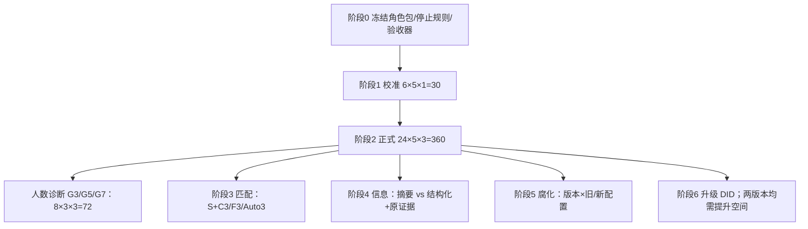

# 固定角色委员会 v2：通用复杂软件任务协议

状态：**仅方案，未启动任何模型实验。** 360 与诊断 72 都是规划运行数，不是已完成样本。不改上一轮冻结源码与原始结果，也不把旧报告数字解释成对本协议假设的支持或推翻。

监督：Codex 管方向。附件：[fixed-role-committee-v2-matrices.md](fixed-role-committee-v2-matrices.md)。

范围限定为**软件工程**（多文件代码、测试、集成、部署或工程文档产物）。不能代表医疗、法律或其他行业。

---

## 1. 要回答什么

主问题：在**公开的宽松停止规则内、允许自然做完**的条件下，由人预先编写并冻结的固定角色委员会（产品负责人、Developer、SRE 等）对**通用复杂软件任务**的端到端完成能力如何？往包里加专家是否更好？在固定知识下加人是否更好？

主指标是端到端**已验证成功率**（定义见 §3）。成本、**端到端延迟**（含通信、剥离全局调度排队）、人工干预是辅助。不按人头把总 token 机械切成固定份额。不存在可观测的「无限资源绝对能力」。

四个机制是可证伪方向上的假设。判定只用 **支持 / 削弱 / 未定**。无差或量表无相关，在功效不足以排除「有意义效应」时是**未定**，不是推翻。开跑前登记预测与「有意义效应」的最小幅度。不能把设计预期写成发现。

| 代号 | 假设 | 倾向支持 | 倾向削弱 | 未定 |
|---|---|---|---|---|
| H1 适配有限 | 固定角色包的通用性受任务适配限制 | 预注册量表上的不适配与该类任务上固定包相对对照更差**同向**，且精度够排除「全面更好」 | 四类任务上固定包相对**同知识**对照稳定更好，且量表预定对应落空、精度够排除「有意义的适配缺口」 | 量表与结果无关联但区间仍覆盖有意义缺口；或仅 p 值不显著 |
| H2 通信损失 | 跨 agent 传递会丢失可用信息或造成错整合 | 在**分开计数**的机制上：传输丢失、原证据漏读、错误整合，结构化+可检索通道降低其中至少一类，且端到端质量改善不能完全由「prompt 结构变好」解释 | 摘要通道在同样机制计数与端到端质量上不差或更好，精度够排除有意义的传递损失 | 两通道端到端无差但功效不足；或质量改善与 prompt 改写缠在一起，无法分开 |
| H3 配置腐化 | 角色/工具配置随项目与需求分布变化而过时 | 旧配置在新分布上变差，不见隐藏验收的更新能部分挽回，且过时路径/命令可定位、并与 H1 不适配分开 | 旧配置在新分布上不差，或更新无增益，精度够排除有意义的腐化 | 交叉格样本小、区间宽 |
| H4 升级冗余 | 模型进步使部分角色工作重复、独有正确贡献下降 | 在**两版本都有提升空间**的留出任务上，同版本委员会相对单体的增益缩小（DID），且角色独有有效贡献下降；若实施删除该角色的匹配消融，缺失该角色会掉这些贡献 | 增益不缩或扩大；独有贡献不降；消融无明显损失 | 仅 DID 变小但任务触顶；或无消融、无独有贡献编码。**增益压缩不能证明永远不需要委员会** |

H2 必须保留三种不同机制：**通信丢失**（发出的内容接收侧没有）、**原始证据漏读**（证据可得但未被看见/引用）、**错误整合**（看见了但合成错）。通道干预同时改变传递方式与 prompt 结构：即便质量变好，也不能简单算「H2 成立」。

旧 360/144 **不能**直接填进上表。

---

## 2. 上一轮已测 / 本协议未测

| | 上一轮（已结算） | 本协议 |
|---|---|---|
| 任务 | 12 个合成小型 CLI；天花板高 | 24 个新的复杂多文件**基础任务**；旧 12 个只作回归/校准，不作新证据 |
| 模型 | 同一请求名，别名不钉权重 | 主阶段同模型；升级阶段要可追溯两版本快照，否则只报横截面 |
| 资源 | 共享 T/I/K，委员会再切阶段额度 | 不按人头切固定 token；宽松停止规则内做完；截尾与能力失败分开 |
| 角色 | 架构/实现/质量标签；无清单对照 | 人写的固定包；任务揭示前冻结 |
| 人数 | 固定 3 或 2 工人+规划 | 嵌套 F3/5/7 = 加专家包；G3/5/7 = 固定知识下加人 |
| 配置演化、升级、匹配 | 未做 | 分阶段子集，不与主 360 全因子交叉 |

上一轮数字只说明那一包络。本协议不沿用 +10pp，也不把「阶段额度走不完」说成固定角色委员会无能力。

---

## 3. 成功、停止、截尾、成本与延迟

**主成功率（预注册）：** 在**已公开、经校准冻结的宽松停止规则内**的**已验证成功率**。全部分配进入分母。未完成 = **未成功**，失败机制标 **截尾**，不是模型能力失败，也不得改分母。另报未知结局的点估计上下界（把截尾当成功/失败的极端）。基础设施 `interrupted` 单独编码。

多维验收预先冻结类型权重，但报告时**分列**功能、质量、可靠性（含回归/契约）。文档或清单通过**不得**掩盖实现失败：实现硬闸未过则总成功为否。

**充分资源：** 不把总额度按 n 均分。允许在停止规则内自然做完。所有模型调用、检索、协调、修复、选择器、配置更新都计费。这仍不是无限资源。

**停止规则（校准后公开冻结）：** 防挂起上限、无任务相关进展的循环、重复无新信息的工具调用。**不要**把「分析期间没有文件变更」单独当成无进展——思考、检索、验证状态变化可以是进展。进展信号用任务相关 checkpoint、新证据、验证状态。阈值待校准后冻结。触顶 = 截尾，checkpoint **只回溯停止时已交付版本**。

**延迟（辅助，与主成功率并列记录）：** 在机器、并发度、全局调度排队已剥离记录足够时，报告端到端实际延迟（**含组内通信**，剥离排队等待）。防挂起超时**不能**当作完成耗时；截尾运行保留截尾标记与当时已用时间，不写入「完成耗时」分布。不再使用「墙钟只作诊断、不算结果」的说法。

**成本约束决策曲线（另表）：** 同一轨迹上，若干成本/延迟预算若当时停止能交出什么。不另开克扣委员会的主比较来宣称同预算获胜。

---

## 4. 固定角色包（任务揭示前冻结）

**产品负责人**维护 PRD/范围/验收语言；PRD 是文档，不是角色名。

嵌套包（3 ⊂ 5 ⊂ 7）：

| n | 角色 | 集成者 |
|---|---|---|
| 3 | 产品负责人、Developer、SRE | Developer（无第 4 人） |
| 5 | + QA、发布/运维文档 | 同上 |
| 7 | + 安全审查、架构关注 | 同上 |

主表 S+C 使用 **F7 全文**。因此：

- **F7 − S+C**：同知识，组织对照；
- **F3 − S+C**：三人专家包 vs 单人拿七角色清单，只比较两种实际方案，**不是**纯组织效应。

阶段 3 另设 **S+C3**，清单 = **F3 全文**，专供与 F3 / Auto3 做同知识对照。

---

## 5. 任务与候选项目类型

四类各 ≥6 个新任务，共 **24 个基础任务**，跨 **至少 3 个代码基线**（同一基线不能占满 24）。3 个基线只是多样性下限，**不能泛化「仓库总体」**。类型：多文件功能修改；集成/契约；回归修复；部署或工程文档产物。

每个任务：外部客观契约、多维验收、gold 与 mutant、完整链路。开发任务与正式留出任务揭示前分离。旧 12 CLI 只回归执行器，不进正式 24。

仅 VibeSOP 不足声明通用性。候选类型（**未选定具体提交**）：本仓库一部分；HTTP API+迁移的服务；带发布脚本的库/工具链；带构建与生成物契约的前端或文档工程。

---

## 6. 样本与统计（规划，未跑）

非正式校准：**6 个开发任务 × 5 主组 × 1 重复 = 30**。只定停止规则、验收器、费用/延迟数量级、单体是否还有提升空间。不作收益估计，不混正式。

正式主矩阵：**24 个基础任务 × 5 主组 × 3 重复 = 360**。5 组 = S、S+C、F3、F5、F7。重复不拆成独立任务。

人数诊断：**8 任务 × G3/G5/G7 × 3 重复 = 72**，独立分母。

功效未保证。确认性扩样只用新任务并预先固定。

统计：对 **24 个基础任务** 等权聚类（每任务内 3 次重复先合成该任务的配对差），报 95% 区间。实现可复用上一轮脚本的**方法**，换新 seed/任务/阈值。跨基线差异只作描述分层，不作总体仓库推断。

类型权重校准后冻结；主文同时分列功能/质量/可靠性。

阈值：不沿用旧 +10pp。按风险与成本冻结实用区间。禁止用显著性选任务或改阈值。

多重比较：主比较仅 **F3−S**。F7−S+C、G 梯度、其余为次要/探索。

---

## 7. 分阶段

### 7.1 匹配（阶段 3）

S、**S+C3（F3 全文）**、F3、Auto3。选择器与基线同一外部输入，成本计入 Auto3。适配量表在结果前打分。S+C3 与 F3 同知识；主表里的 S+C（F7 全文）不拿到本阶段冒充 F3 的同知识对照。

### 7.2 信息（阶段 4）

同一角色、同一拓扑与轮次。摘要 vs 结构化约束+可按需检索原证据。原始证据同样可得。协议组合干预，不能声称纯通信损失因果。机制三分：传输丢失 / 原证据漏读 / 错误整合。质量改善若同时伴随 prompt 结构变化，H2 至多「削弱或未定」，不得单凭端到端变好判定成立。全 transcript 不是无损基准。

### 7.3 腐化（阶段 5）

（旧/新需求分布）×（旧/更新配置）。过时必须是真实路径或命令。与 H1 分开编码。更新者不见隐藏验收与结果。未知新任务不改冻结旧 config。

### 7.4 升级（阶段 6）

两可追溯版本 ×（S / F3 / 更新配置的 F3）。**新旧模型的留出任务都必须还有提升空间**（校准中确认单体未触顶）。否则 DID 缩小可能是天花板，不是角色冗余。

重复工作的证据：角色**独有有效贡献**下降、重复建议/验证上升、边际成功/成本变化。若实施「删除该角色」的匹配消融，可作补证。**不能仅因 DID 差变小就声称重复工作。** 拿不到旧版快照则只报横截面。能力增益压缩 ≠ 永远不需要委员会。

---

## 8. 可解释结果表（空壳）

填写时只用支持 / 削弱 / 未定。旧报告不可直接引用。

---

## 9. 启动条件（均未宣称完成）

角色包与量表冻结；24 新任务 + gold/mutant；≥3 基线的具体 commit 待选；停止规则与进展信号校准；阈值按风险/成本冻结；截尾与中断编码；选择器/更新者隔离。未完成前不得分配正式 360 或诊断 72。

盲评维护性可选；不做则写未实施。

---

## 10. 仍待监督拍板（不是实验结果）

1. G 梯度 72 仍小，固定知识下加人的区间会宽。  
2. 宽松停止的「进展」操作定义必须在 30 次校准里写成阈值。  
3. 两版本快照与双版本提升空间可能同时不成立。  
4. 24 任务 × 3 基线仍不能代表仓库总体。  
5. 选择器特有搜索策略、配置更新隔离、构成诊断样本，均需在冻结清单里写明做或不做。

本文件不启用产品默认编排，不表示固定角色委员会已被证明有效或无效。
