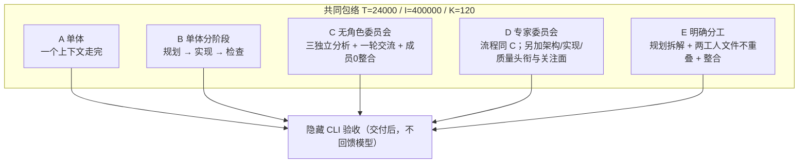
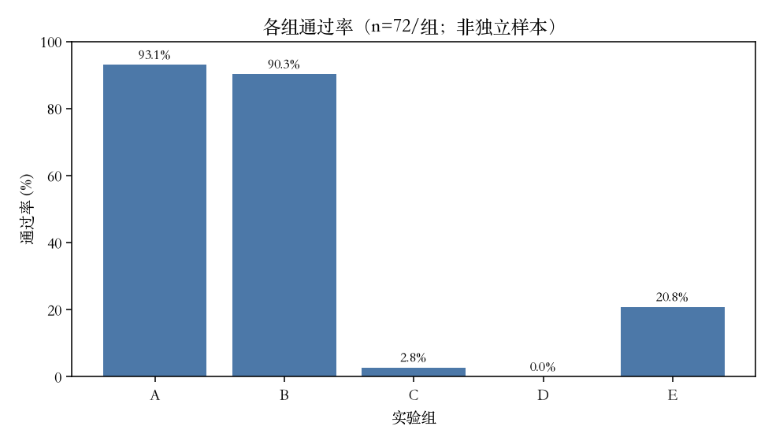
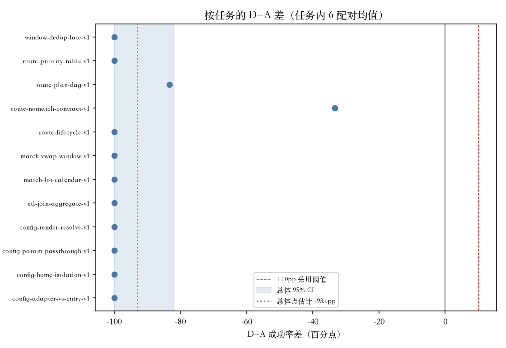
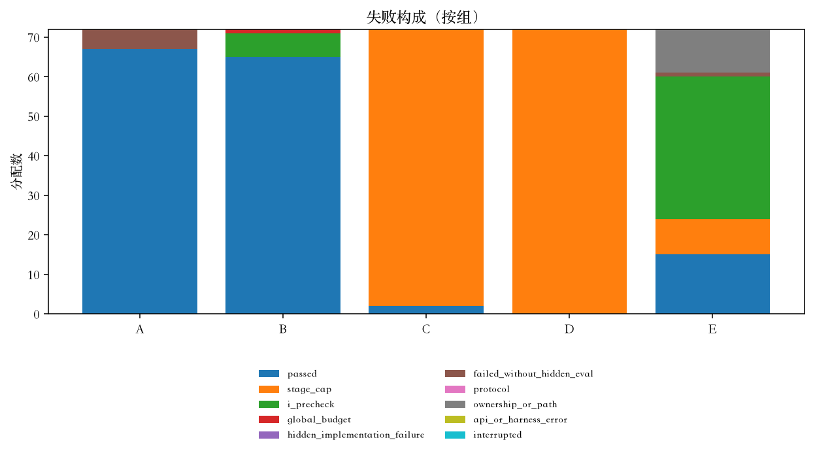
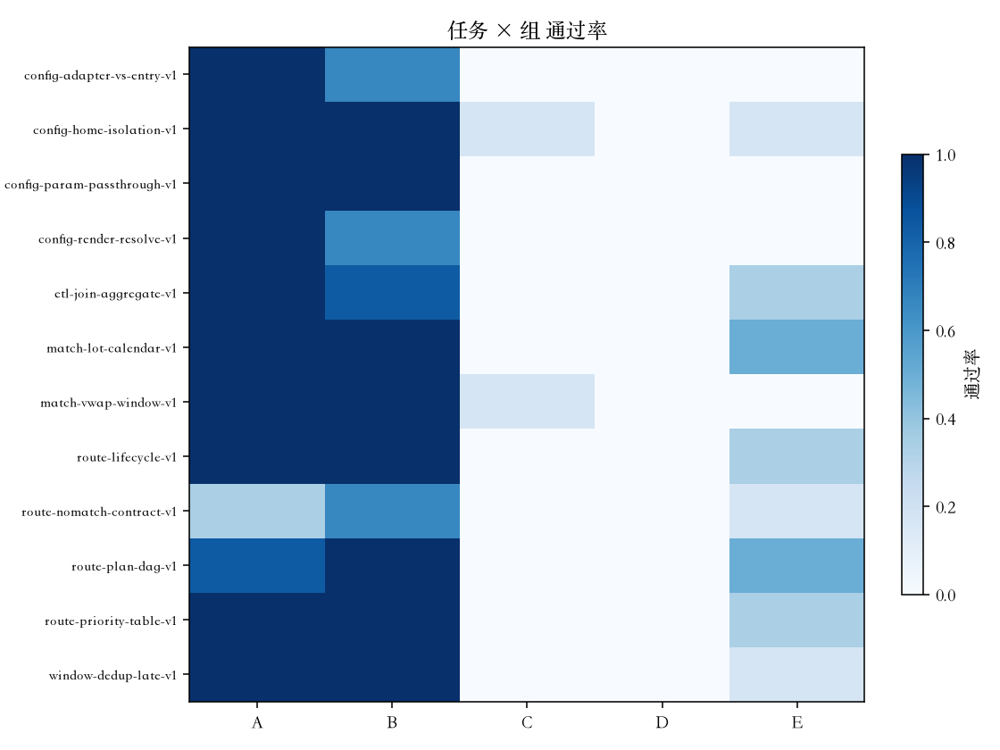
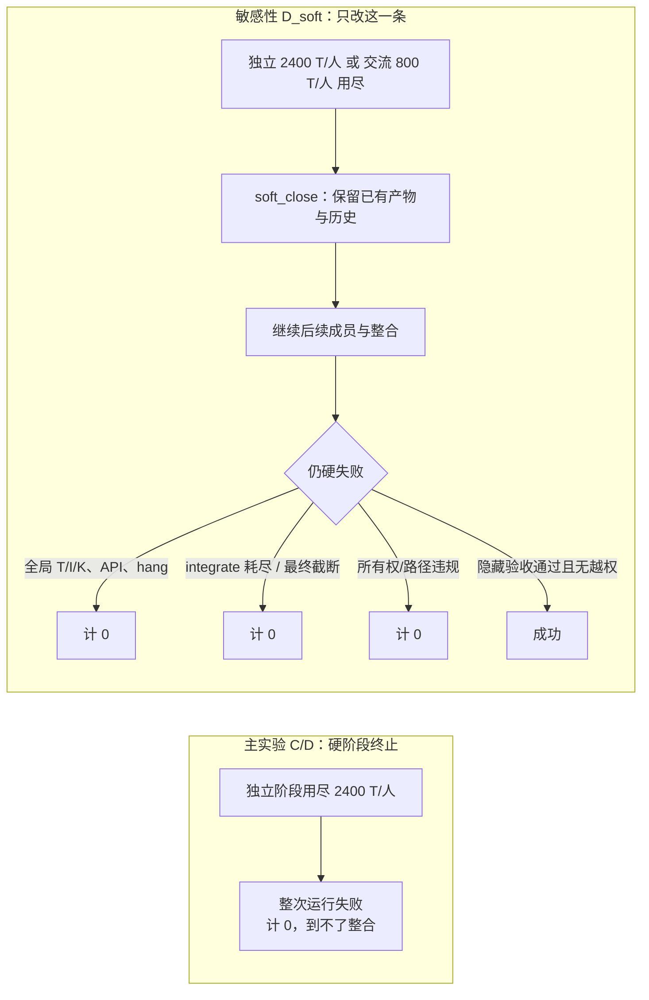
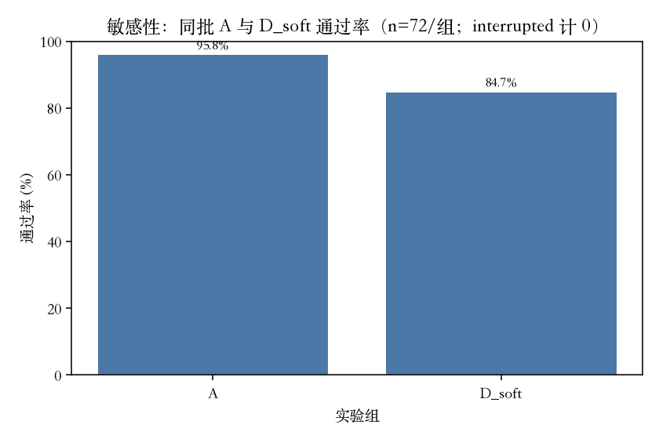
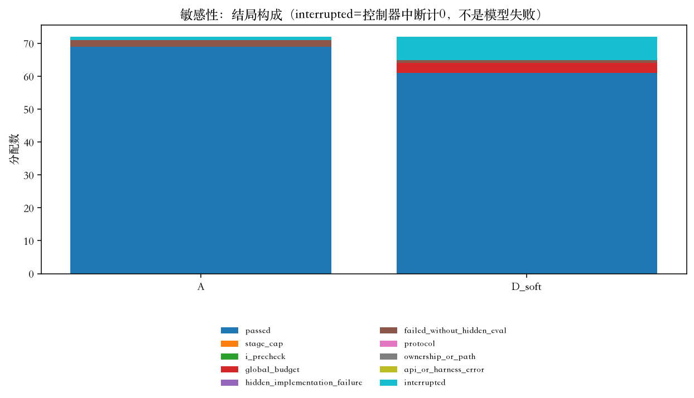
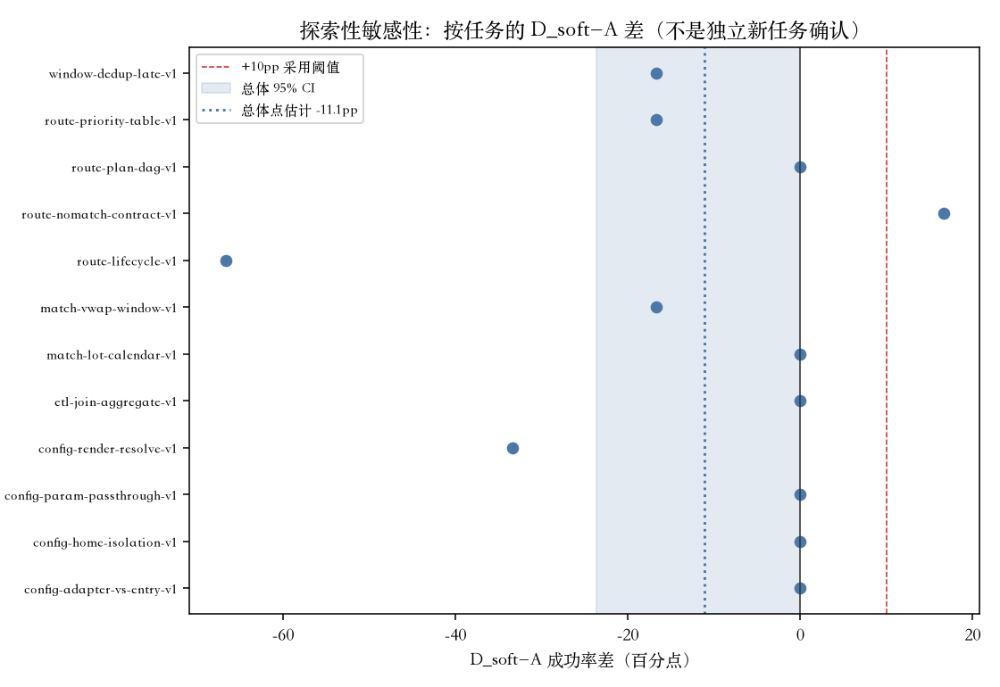

# 多专家组织对照：正式报告

面向要在本地 AI 开发流程里做方法选择的读者。这是一份**受控小型 CLI 基准**的结算，不是异质专家团队、也不是整库工程的结论。

两轮实验**分开计分、不可池化**。后一轮由前一轮的失败诊断触发，是同一任务集上的探索性补充，**不是**独立确认研究。主实验是小规模、本地预固定的主比较，也不是外部注册的大型确认试验。

完整主 360 快照（纠偏前的独立全文）：[`REPORT.primary360.md`](REPORT.primary360.md)。敏感性独立全文：[`../multi-expert-sensitivity/REPORT.md`](../multi-expert-sensitivity/REPORT.md)。过程档案：[`report/provenance/PROCESS.md`](report/provenance/PROCESS.md)。

---

## 发现（先看数字）

**主实验 360**（预固定主分析；12 任务 × 2 spec × A/B/C/D/E × 3；seed 20260913；同一模型与总资源 **T**=24000 输出 token、**I**=400000 输入 token、**K**=120 工具调用）：

| 组 | 通过 / 72 | 进入隐藏验收 | 说明 |
|---|---:|---:|---|
| A 单体 | 67（93.1%） | 67 | 基线 |
| B 单体分阶段 | 65（90.3%） | 65 | 与 A 接近 |
| C 无角色委员会 | 2（2.8%） | 2 | 几乎全停在独立分析阶段额度 |
| D 专家委员会 | **0（0%）** | 0 | 72/72 内部 `stage_budget_exhausted` |
| E 明确分工 | 15（20.8%） | 26 | 11 条产物过隐藏验收但所有权协议失败 |

- 主比较 **D−A = −93.06 个百分点**，95% 区间 **[−100.00, −81.94]**，预注册解释：`support_worse`（上界 &lt; 0）。
- **天花板**：A 已 93.1%。在这套任务集上，即使 D 全过也最多再高 **6.9pp**，达不到预注册 +10pp。失败未达 +10pp，部分来自任务缺少提升空间，**不能**由此证明更难任务也无价值。
- 进入隐藏验收的 **160** 份产物**全部通过**。本任务集主要区分「能否走完流程 / 是否越权」，不是已交付代码的质量排名。本轮没有隐藏验收实现失败的反例。

**探索性敏感性 144**（受主实验诊断启发；同一 12 任务 × 2 spec × **同批新 A** / D_soft × 3；seed 20260914；额度、角色提示、任务均未增加或改写）：

| 组 | 通过 / 72 | 进入隐藏验收 | 中断（计 0） |
|---|---:|---:|---:|
| A（同批） | 69（95.8%） | 69 | 1 |
| D_soft | 61（84.7%） | 61 | 7 |

- 144 分配 = **136 执行完 + 8 中断**。8 次是 Grok headless 600 秒后台清理杀掉 runner，**按预定规则计 0，但不是模型能力失败**，也未补跑。
- ITT **D_soft−A = −11.11 个百分点**，95% 区间 **[−23.61, 0.00]**。解释函数：`rules_out_minimum_gain`（上界 &lt; +10pp）。**上界等于 0，不能说统计已证实更差**（预固定规则是上界 &lt; 0 才有整体更差的证据）。
- 事故后点估计界限（只翻转 8 个未知结局，**不是新的置信区间**）：约 **[−12.50, −1.39]pp**。即使把中断的 7 个 D 全算成功、1 个 A 算失败，本任务集上 D 最多 68，仍低于已知 A 的 69。这是**样本事实**，不是总体推断。
- 本轮天花板：新 A 95.8%，完美 D 最多再高 **4.2pp**。
- 进入隐藏验收的 **130** 份产物全部通过。两轮合计 **290** 份真正进入隐藏验收的产物全部通过。

**机制一句话**：主实验里委员会（尤其 D）几乎没走到验收，是因为独立分析每人最多 2400 输出 token 的**硬阶段终止**。把独立/交流阶段改成软结束后，D_soft 可以继续整合；全局 T/I/K、最终截断、所有权仍硬失败。软结束**解释了主实验 D 的几乎全部失败**，但相对同批 A 仍未达到 +10pp，点估计为负。

**可执行建议（限定本证据）**：先写清验收合同并测单体基线；阶段软结束与全局硬限制分开设计；把协调调用计入同一 K/T；恢复协议必须能把 `running` 标成 `interrupted` 且不重跑；完成信号不能靠 headless 600 秒墙钟。强规划弱执行、更难真实仓库、异质专家是**待验证方向**，本轮没有证明。

费用只覆盖**参与模型推理**的公开非高峰单价估算，**不是**含 Grok 实施、Codex 监督、Docker、计算与人力的总成本，也不是发票。校准 75 ≈ $0.22；主 360 ≈ $1.87；补充 144 已知下界 ≈ $0.72（7 次无 response 的 HTTP 可能已计费、用量未知）。

---

## 1. 原先可能怎样误解，实际测了什么

常见叙事把「加专家角色 / 加委员会」当成交付质量的提升。本实验固定**同一模型**（请求 `deepseek-v4-flash`，服务 DeepSeek-V4.1-Flash，响应 `deepseek-flash`）、同一工具、同一总资源上限，比较组织方式，而不是比较模型智力。

任务是 12 个合成小型 CLI（路由 4、跨层配置 4、可拆分数据/量化 4），完整 spec 与简略 spec 共享可查询合同。标识与规格索引见 [`tasks/catalog.py`](tasks/catalog.py)。它们复用项目里出现过的**失败机制**来出题，不是生产回放。同一作者写了任务、隐藏验收与执行器，监督者做了独立审计；协议里的独立维护者盲评维护性未实施。

资源上限中，**T** 是模型输出 token，**I** 是模型输入 token（含缓存命中），**K** 是工具调用次数。发请求前用 UTF-8 字节数对 I 做保守预检（`I_precheck`），与 API 返回的实际 `usage` 分开记账。

成功定义（预注册，未改）：总预算内交付 + 全部隐藏验收通过 + 无所有权/路径违规。`failed` / `error` / `interrupted` 均记 0，分母包括全部正式分配。

C/D 独立分析每人最多 10% T（**2400**）；交流阶段合计最多 10% T（2400），三人各最多 **800**。D 相对 C **同时**改了角色头衔和关注面指令，不能只归因于头衔。E 的拆解成本计入同一账本。

---

## 2. 主实验 360（预固定）

样本：360/360 terminal（passed 149，failed 211）。无 pending / running / interrupted。并发 8。Docker digest 与 manifest 一致；启动 argv 仍是 tag `python:3.12-slim`。

主估计：每任务 6 个配对（2 spec × 3 repeat）的 D−A 差的均值，再对 12 任务等权平均；cluster bootstrap 20000，seed 20260913。实现：冻结的 `harness/analysis.py`。

任务均值（D−A）几乎全是 −100pp；`route-nomatch-contract-v1` −33.3pp，`route-plan-dag-v1` −83.3pp。D 的 72 次失败全部是内部阶段额度：independent-0 68 次，independent-1 4 次。C 同样以独立分析硬终止为主（70/72 `stage_cap`）。

探索比较（同一方法，**不作确认性宣称**）：

| 对比 | 点估计 | 95% CI | 预注册口径（仅描述） |
|---|---:|---|---|
| B−A | −2.8pp | [−12.5, +6.9] | `rules_out_minimum_gain` |
| C−A | −90.3pp | [−98.6, −77.8] | `support_worse` |
| D−C | −2.8pp | [−6.9, 0.0] | `rules_out_minimum_gain` |
| E−A | −72.2pp | [−86.1, −56.9] | `support_worse` |

D−C 接近 0 且都极低：角色标签几乎没有机会表现，因为两边都卡在独立分析额度。B−A 的区间跨越 0，**不能**说成分阶段无效，只能说本任务集上达不到 +10pp。

资源箱线见 [`report/figures/resources_by_arm.png`](report/figures/resources_by_arm.png)（含失败，不裁剪离群点）。E 与 B 的输入显著高于 A，协调与长上下文本身就贵。

独立监督审计（[`report/provenance/supervisor-final-20260913T023645Z.json`](report/provenance/supervisor-final-20260913T023645Z.json)）：360 唯一分配，4665 次调用，无 usage / cache / 工具 / 元数据 / 成功契约不匹配；manifest SHA 与 first12 同一文件。

---

## 3. 硬阶段终止，以及后来改了哪一条规则

独立 2400/人、交流 800/人，均未增加；总 T/I/K 也未增加。A 原样，无阶段 cap。D_soft 内部仍调用 `stage_caps_for('D')` 与 `run_arm(..., arm='D')`，沿用原 ROLE 提示。不追加摘要调用，不合成缺失的 deliver note。

触发条件预先写在敏感性决策里：主实验 D 失败至少一半为内部 stage_cap。实测 72/72，因此执行了 144。

---

## 4. 探索性敏感性 144（对同批 A）

标签：探索性敏感性分析，受主实验诊断启发。**不是独立新任务确认。不与 360 池化。**

| 口径 | 数字 | 性质 |
|---|---|---|
| 分配 | 144 terminal | 预固定分母 |
| 执行完 | 136（passed 130 + failed 6） | 有最终 ledger |
| 中断 | 8（D_soft 7 + A 1） | 控制器事故，主表计 0 |
| ITT D_soft−A | −11.11pp，CI [−23.61, 0.00] | **唯一预固定区间** |
| 未知结局点估计界限 | [−12.50, −1.39]pp | 事故后描述，**代替不了 CI** |

中断分布不均（7 个 D_soft、1 个 A），**不是可假定的随机缺失**。排除中断后的完成率不能作无偏推断。未做墙钟比较，**不断言**「D 调用更长所以更容易被杀掉」——那只是可能机制。

8 个 interrupted 的 `result.json` 没有最终 ledger，**不能当成用量 0**。7 次已写 request、无 response 的 HTTP **可能已计费，token 未知**；1 次（`route-priority-table-v1-brief-D_soft-r0`）11 个 request 均有 response，但仍无终裁 ledger。派生统计是已保存用量下界。详见 [`../multi-expert-sensitivity/report/interruption-audit/derived-usage.md`](../multi-expert-sensitivity/report/interruption-audit/derived-usage.md)。证据：[`report/provenance/sensitivity-infrastructure-interruption.json`](report/provenance/sensitivity-infrastructure-interruption.json)；stderr 在 **2026-09-13T03:46:53Z** 记录 `headless: background wait timed out ... timeout_secs=600` 与 `killing background work still pending`（本机 [`/Users/huchen/Projects/vibesop-py/.experiment/grok-phase4.stderr`](/Users/huchen/Projects/vibesop-py/.experiment/grok-phase4.stderr)）。恢复指令：[`report/provenance/grok-phase4-recovery.md`](report/provenance/grok-phase4-recovery.md)。**没有**追加或重跑这 8 个样本。

非中断 D_soft **65/65** 都记录了 `soft_close`，并且都进入整合；其中 61 通过。A 没有整合阶段，表中为 N/A。中断的 `config-render-resolve-v1-brief-D_soft-r2` 在被杀前已发出 **integrate** 请求（`call-029-request.json`），不能从「result 无 ledger」推断它从未进入整合。

61 条 D_soft 仍带 `missing_deliver` 阶段名单：软结束保留已有产物并继续，但**不合成**缺失的独立/交流 deliver note，不能把每条 D_soft 说成完整合议。

终态失败 6 次：A 2 次 `incomplete_final_response`；D_soft 3 次全局 `budget_exhausted:K`、1 次最终截断。全局 K 仍是硬限制，与「代码写错」不是同一件事。

独立监督审计：[`report/provenance/supervisor-final-20260913T033401Z.json`](report/provenance/supervisor-final-20260913T033401Z.json)。2404 次请求、2397 次已保存响应、7 次预期缺失；无意外审计缺陷。

---

## 5. 可回查案例（链接原始记录）

路径相对于各实验根目录。隐藏验收没有实现失败反例（主 160 + 补 130 全部通过），下列案例展示流程终止与协议，而不是隐藏 CLI 写错。

### 5.1 主实验：硬阶段在整合前结束

[`route-plan-dag-v1-full-C-r0`](runs/20260913T023645Z/route-plan-dag-v1-full-C-r0/result.json) — 无角色委员会在 independent-0 用尽 2400 输出 token，未进入隐藏验收。error `stage_budget_exhausted:independent-0`，T/I/K = 2400/21714/19。能证明硬上限可以在整合前结束一次运行；**不能**证明分析质量差或任务不可做。D 的 72 次失败属于同一类机制。

### 5.2 主实验：所有权协议失败，隐藏验收却通过

[`window-dedup-late-v1-brief-E-r2`](runs/20260913T023645Z/window-dedup-late-v1-brief-E-r2/result.json) — 工人被分配的文件是 `app.py`，却写入 `_check.py`。执行器拒绝该越界写入，记 `ownership_or_conflict`。隐藏检查 7/7 通过，但严格成功定义仍失败。能证明：成功不只看隐藏测试。本任务集没有「隐藏测试实现失败」的例子。

### 5.3 D_soft：soft_close 之后仍交付并通过

任务契约：跨层配置渲染/解析（`config-render-resolve-v1`），完整 spec。

[`config-render-resolve-v1-full-D_soft-r2`](../multi-expert-sensitivity/runs/20260913T033401Z/config-render-resolve-v1-full-D_soft-r2/result.json)

| 阶段 | 事件 | 是否正式 deliver |
|---|---|---|
| independent-0/1/2 | 各成员 2400 T 用尽，`soft_close` | 否 |
| exchange-0 | 该成员 800 T 用尽，`soft_close` | 否 |
| 整合 | 继续；最终交付 | 是 |

T/I/K = 11359/126034/58。隐藏验收 9/9 通过。`missing_deliver` 仍列出 independent-0/1/2 与 exchange-0：继续用的是已有 private 产物，不是补写的专家意见。

### 5.4 D_soft：交流阶段也软结束，仍通过

[`route-priority-table-v1-full-D_soft-r1`](../multi-expert-sensitivity/runs/20260913T033401Z/route-priority-table-v1-full-D_soft-r1/result.json) — 路由优先级表。三次独立分析（各 2400 T）与三次交流（各 800 T）全部 `soft_close`（均 `delivered: false`），随后整合。T/I/K = 11626/123971/105。隐藏验收 9/9。K 已接近天花板（105/120），与下一例对照。

### 5.5 D_soft：软结束之后撞上全局工具上限

[`route-lifecycle-v1-full-D_soft-r2`](../multi-expert-sensitivity/runs/20260913T033401Z/route-lifecycle-v1-full-D_soft-r2/result.json) — 路由生命周期。独立分析与交流同样 `soft_close`，但 **K=120 全局耗尽**，error `budget_exhausted:K`，未进入隐藏验收。T=10890。这是**协调/工具次数**把总账用完，不是隐藏 CLI 写错。同任务 brief 的 r0/r1 也是 K=120 失败。软结束只放开内部阶段，不放开全局 K。

### 5.6 单体也会在包络内失败

[`route-nomatch-contract-v1-full-A-r0`](runs/20260913T023645Z/route-nomatch-contract-v1-full-A-r0/result.json) — 主实验 A，最终 `incomplete_final_response`，T=24000，无隐藏验收。说明失败不是委员会独有。

---

## 6. 费用（仅参与模型推理估算）

单价（非高峰 Flash，美元/百万 token）：未命中输入 0.15，缓存命中 0.003，输出 0.6。[来源](https://api-docs.deepseek.com/quick_start/pricing/)。**不是账户账单。排除 Grok 研究实施、Codex 监督、Docker 与人力。**

| 队列 | 实验运行/分配 | 估算 USD | 说明 |
|---|---:|---:|---|
| 校准 75（45 旧执行器 + 30 新执行器非正式） | 75 | 0.2187 | 非正式运行，不是 360 样本 |
| 主 360 | 360 | 1.8678 | 360 次实验运行，共 **4665** 次模型请求；ledger 完整 |
| 补充 144 | 144 | 0.7210 | 144 次实验分配，共 **2404** 次模型请求、2397 次已保存响应；**已知下界**。7 次开放 HTTP 未知 |

同批敏感性（各 72 分配）已记录推理费用：A **$0.1315**，D_soft **$0.5895**，已知费用/分配约为 **4.48 倍**。这只比较已落盘的参与模型推理估算；7 次缺 response 的用量未知，不是完整账单，也不是精确总成本比。

---

## 7. 局限

- 小样本、合成 CLI、同一模型、同一作者生成的验收器。天花板高，观察的是流程完成与协议，不是代码质量排名。
- 区间跨越 +10pp 或 0 时结论**未定**，不是「无效」。主 360 的 D−A 上界 &lt; 0，只覆盖**本包络**。
- 敏感性 144 的 CI 上界 = 0：排除了 +10pp，**没有**证实 D_soft 更差。
- 纯角色效应没有对照（无「无头衔但同一检查清单」组，也无 C_soft）。
- 未做异质专家、整库任务、强弱模型、skills、盲评维护性。
- 控制器中断不是随机缺失；排除中断后的完成率不能当作无偏估计；7 个 D_soft / 1 个 A 的中断是控制器事故，不是编排缺陷。
- 模型别名不固定权重；temperature=0 仍有重复。
- Docker 启动未把 digest 写入 argv（文档/实现偏差，本 cohort 未改冻结源）。

---

## 8. 建议（证据边界内）

1. **先写验收合同，再测单体基线。** 本任务集 A 已经 93–96%。没有单体基线，委员会数字没有对照。
2. **阶段软结束与全局硬限制分开。** 若目标是让委员会走到验收，不要用 2400 输出把独立分析直接判死；但全局 T/I/K、最终截断、所有权仍应硬失败。本 144 只测了这一条，不是优化过的专家团队。
3. **把协调开销算进同一 K 和 T。** `route-lifecycle` 的 D_soft 在软结束后撞上 K=120，说明多上下文的工具次数本身就是失败模式。
4. **恢复协议要能结算，而不是靠墙钟。** `running` → `interrupted` 且 `rerun=false`；完成信号不能是 headless 600 秒超时。中断用量按已保存 response 做下界，缺 HTTP 标未知。
5. **待验证、本轮未证明：** 强规划弱执行、更难真实仓库、异质专家、skills。这些方向既未证实，也未证伪。

审计与图：主 [`report/AUDIT.md`](report/AUDIT.md)；敏感性 [`../multi-expert-sensitivity/report/AUDIT.md`](../multi-expert-sensitivity/report/AUDIT.md)。最后验证记录见 [`report/provenance/PROCESS.md`](report/provenance/PROCESS.md) 末节。
