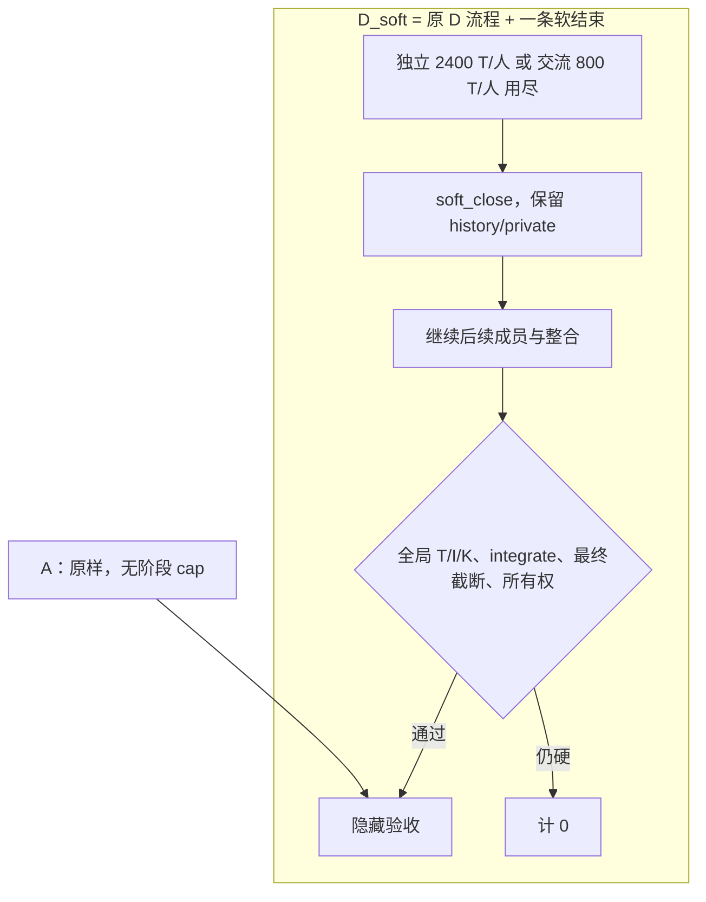

# 探索性敏感性分析报告（D_soft）

**标签：探索性敏感性分析，受主实验诊断启发。不是独立新任务确认，不与原 360 池化。D_soft 只对照同批新 A。**

主报告（两轮合读）：[`../multi-expert-formal/REPORT.md`](../multi-expert-formal/REPORT.md)。本文件是 144 的独立全文。run 目录里的副本只指向本文，避免相对路径错位。

敏感性 run：[`runs/20260913T033401Z`](runs/20260913T033401Z)

## 要回答什么

在**不增加额度、不改角色/提示/任务**的前提下，把 D 在 independent-* / exchange-* 上的硬阶段终止改成软结束，同批 A 对照下：成功率与区间如何？硬终止是否解释主实验 D 的劣势？是否达到 +10pp？

## 机制（唯一变化）

独立 2400/人、交流 800/人，均未增加；总 T/I/K 也未增加。D_soft 使用 `stage_caps_for('D')` 与 `run_arm(..., arm='D')`。不合成缺失的 deliver note。

## 样本：136 执行完 + 8 中断

| 状态 | n | 含义 |
|---|---:|---|
| passed | 130 | 严格成功 |
| failed | 6 | 模型/编排终态失败 |
| interrupted | 8 | Grok headless 600s 杀进程；主表计 0，**不是模型能力失败** |
| 合计 | 144 | 分母 |

8 = 7 个 D_soft + 1 个 A。resume 只跑从未开始的 13 项；这 8 个 `rerun=false`。中断分布不均，不是可假定随机缺失；未做墙钟比较，不断言调用更长导致更容易中断。

7 次已写 request、无 response 的 HTTP 用量/账单未知；派生统计是已保存 usage 下界。1 次 11/11 有 response 但仍无 ledger。因此日志不是 144/144 请求-响应完整。档案：[`report/interruption-audit/`](report/interruption-audit/)。

## 预固定比较 D_soft−A

冻结 `analysis.py`：12 任务等权，配对 bootstrap 20k，seed 20260913。interrupted 计 0。

- 点估计：**−11.11 个百分点**
- 95% 区间：**[−23.61, 0.00]** —— 这是**唯一**预固定 CI
- `rules_out_minimum_gain`：上界低于 +10pp。上界等于 0，**不能**说已证实更差。

| 组 | n | 通过 | ITT 通过率 | 进入隐藏验收 | 进入整合 | 中断 |
|---|---:|---:|---:|---:|---|---:|
| A（同批） | 72 | 69 | 95.8% | 69 | N/A（无整合阶段） | 1 |
| D_soft | 72 | 61 | 84.7% | 61 | 非中断 65/65；另有 1 条中断前已发 integrate 请求 | 7 |

天花板：A 已 95.8%，完美 D 最多 +4.2pp。进入隐藏验收的 130 份产物全部通过。

事故后**点估计**界限（只翻转 8 个未知结局；**不是新 CI，不给解释函数评分**）：不利约 −12.50pp，有利约 −1.39pp。即使有利极端，本任务集 D 最多 68，仍低于已知 A 的 69。这是样本事实。

非中断 D_soft 65/65 均有 `soft_close`；61 条有 `missing_deliver`，不能写成完整合议。

资源箱线（不含中断、不用 0 填 ledger）：[`report/figures/resources_by_arm.png`](report/figures/resources_by_arm.png)。热力图：[`report/figures/task_arm_heatmap.png`](report/figures/task_arm_heatmap.png)。

终态失败：A 2×`incomplete_final_response`；D_soft 3×`budget_exhausted:K`、1×最终截断。

## 轨迹

### 成功：`config-render-resolve-v1-full-D_soft-r2`

记录：[result.json](runs/20260913T033401Z/config-render-resolve-v1-full-D_soft-r2/result.json)

配置渲染/解析，完整 spec。三次独立分析因每人 2400 T、exchange-0 因每人 800 T 软结束（均未正式 deliver），整合继续。T/I/K = 11359/126034/58。隐藏验收 9/9。`missing_deliver`：independent-0/1/2、exchange-0。

### 成功：`route-priority-table-v1-full-D_soft-r1`

记录：[result.json](runs/20260913T033401Z/route-priority-table-v1-full-D_soft-r1/result.json)

优先级表。三次独立 + 三次交流全部 soft_close，再整合。T/I/K = 11626/123971/105。隐藏验收 9/9。K 已接近 120。

### 协调耗尽，不是代码隐验反例：`route-lifecycle-v1-full-D_soft-r2`

记录：[result.json](runs/20260913T033401Z/route-lifecycle-v1-full-D_soft-r2/result.json)

同样 soft_close 后 **K=120**，error `budget_exhausted:K`，未进入隐藏验收。T=10890。同任务 brief r0/r1 同因。这是工具次数把总账用完。

本 144 **没有**隐藏验收实现失败。

## 费用（仅参与模型推理；已知下界）

单价（非高峰 Flash，美元/百万 token）：未命中输入 0.15，缓存命中 0.003，输出 0.6。[来源](https://api-docs.deepseek.com/quick_start/pricing/)。与主报告 [费用节](../multi-expert-formal/REPORT.md#6-费用仅参与模型推理估算) 相同。**不是账户账单。排除 Grok 实施、Codex 监督、Docker 与人力。**

144 是实验分配数，不是 API 调用次数。本队列共 **2404** 次模型请求、2397 次已保存响应。合计已知约 **$0.7210**（136 条 ledger + 8 条已保存 response.usage）。7 次开放 HTTP 未计入。

| 组 | 分配 | 已知估算 USD | 已知费用/分配 |
|---|---:|---:|---:|
| A（同批） | 72 | 0.1315 | 0.0018 |
| D_soft | 72 | 0.5895 | 0.0082 |
| 144 合计（已知下界） | 144 | 0.7210 | — |

D_soft 相对同批 A，已知费用/分配约为 **4.48 倍**。这只比较已落盘的参与模型推理估算；7 次缺 response 的用量未知，不是完整账单，也不是精确总成本比。

## 审计

- 144 唯一；terminal 144 = 136 完成 + 8 中断
- freeze 无漂移；task_hash 一致
- 意外 usage 不匹配：无；预期中断缺口 8；开放 HTTP 7
- 日志完整程度：136 条终态有 ledger；8 条中断无最终 ledger，其中 7 条缺最后 HTTP 响应
- Docker digest 与 manifest 一致
- 机器可读：[`report/audit144.json`](report/audit144.json)、[`report/AUDIT.md`](report/AUDIT.md)

## 仍不能做的判断

纯角色效应、异质专家、整库、强弱模型、skills、盲评维护性：未做。本 144 不能改写主 360 的预固定结果。控制器中断是过程事故，不是编排缺陷。
