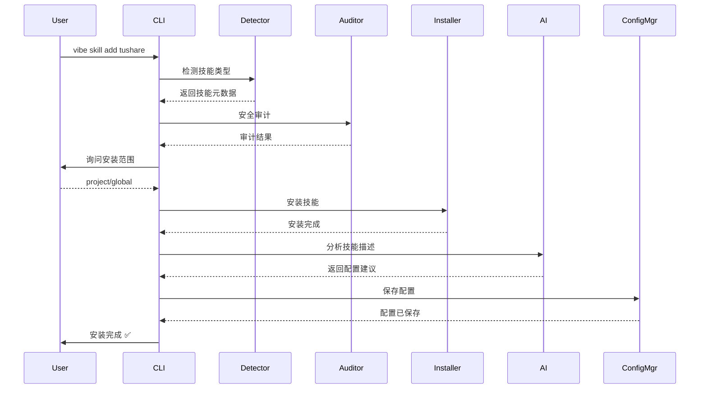

# VibeSOP 智能技能安装方案

## 📋 问题陈述

用户反馈现有技能安装流程过于复杂：

### 当前流程（8个手动步骤）
1. 创建技能目录
2. 编写 SKILL.md
3. 运行安全审计
4. 手动安装技能
5. 手动配置清单
6. 手动配置路由规则
7. 验证安装
8. 同步到平台

**问题**：
- ❌ 步骤繁琐，容易出错
- ❌ 需要理解配置文件格式
- ❌ 不支持官方技能仓库
- ❌ 无法自动发现和配置
- ❌ 新手用户上手困难

---

## ✅ 解决方案

### 核心理念
**从 8 个手动步骤 → 1 条命令**

```bash
# 之前：需要 8+ 步手动操作
mkdir skills/tushare-quant
# ... 编辑配置文件
vibe skills install ...
vibe build ...

# 现在：只需要 1 条命令
vibe skill add tushare
```

### 关键特性

1. **🎯 一键安装**
   - 支持官方技能仓库：`vibe skill add tushare`
   - 支持本地文件：`vibe skill add ./tushare.skill`
   - 支持远程 URL：`vibe skill add https://...`

2. **🤖 智能配置**
   - AI 自动分析技能描述
   - 自动生成路由规则
   - 自动设置优先级
   - 自动提取关键词

3. **🔒 安全审计**
   - 安装前自动安全扫描
   - 检测路径遍历风险
   - 检测注入攻击
   - 风险等级评估

4. **💬 交互式向导**
   - 询问安装范围（项目/全局）
   - 可选手动配置模式
   - 清晰的进度展示
   - 友好的错误提示

5. **📦 标准 .skill 格式**
   - 单文件分发格式
   - 包含所有依赖和配置
   - 支持版本控制
   - 支持数字签名

---

## 🏗️ 技术架构

### 新增组件

#### 1. `vibe skill add` 命令

```python
# src/vibesop/cli/commands/skill_add.py

def add(
    skill_source: str,  # 技能来源
    global_: bool,      # 全局安装
    auto_config: bool,  # 自动配置
    force: bool,        # 强制安装
) -> None:
    """智能技能安装主流程"""
    # Phase 1: 检测和加载技能
    # Phase 2: 安全审计
    # Phase 3: 确定安装范围
    # Phase 4: 安装技能
    # Phase 5: 智能配置
    # Phase 6: 验证和同步
```

#### 2. AI 配置引擎

```python
# src/vibesop/core/ai_enhancer.py (已存在，扩展功能)

class AIEnhancer:
    def auto_configure_skill(
        metadata: SkillMetadata
    ) -> SkillConfig:
        """AI 自动生成配置"""
        # 1. 分析技能类别
        # 2. 提取关键词
        # 3. 生成路由模式
        # 4. 计算优先级
        # 5. 生成配置文件
```

#### 3. 配置管理器

```python
# .vibe/skills/auto-config.yaml

skills:
  tushare-quant:
    skill_id: tushare-quant
    priority: 70  # AI 自动设定
    scope: project
    category: development
    routing:
      patterns:  # AI 自动生成
        - .*tushare.*
        - .*股票.*
        - .*量化.*
```

### 工作流程



---

## 📦 .skill 文件格式

### 结构

```
tushare.skill (tar.gz)
├── SKILL.md          # 技能定义（必需）
├── config.yaml       # 默认配置（可选）
├── requirements.txt  # Python依赖（可选）
├── hooks/            # 钩子脚本（可选）
│   ├── pre_install.sh
│   └── post_install.sh
└── tests/            # 测试文件（可选）
```

### SKILL.md 示例

```markdown
---
id: tushare-quant
name: Tushare 量化策略
description: 使用 Tushare API 开发量化交易策略
version: 1.0.0
author: Your Name
tags: [quant, finance, trading]
priority: 75
category: development
routing_patterns:
  - .*tushare.*
  - .*股票.*
  - .*量化.*
dependencies:
  - tushare >= 1.2.60
  - pandas >= 1.5.0
env_vars:
  - TUSHARE_TOKEN
---

# Tushare 量化策略开发

使用 Tushare API 接口获取股票数据、开发交易策略。
```

---

## 🎯 用户使用流程

### 场景1：从官方仓库安装

```bash
$ vibe skill add tushare

🚀 Smart Skill Installation

Phase 1: Detecting skill...
✓ Detected: Tushare 量化策略
  ID: tushare-quant
  Description: 使用 Tushare API 开发量化交易策略

Phase 2: Security audit...
✓ Security audit passed

Phase 3: Installation scope
? Where should this skill be installed?
  🎯 Project-level (recommended
  🌐 Global (available to all projects)
> [Select: project]

Phase 4: Installing project...
✓ Installed to: .vibe/skills/tushare-quant

Phase 5: Auto-configuring...
✓ Category: development
✓ Tags: quant, finance, trading
✓ Priority: 70
✓ Routing pattern: tushare|股票|量化

Phase 6: Verifying...
✓ Routing test passed
✓ Synced to platform

✨ Installation complete!

Test it with:
  vibe route "帮我获取茅台股价"
```

### 场景2：从本地文件安装

```bash
# 下载 .skill 文件
wget https://example.com/tushare-1.0.0.skill

# 安装
vibe skill add tushare-1.0.0.skill
```

### 场景3：全局安装通用技能

```bash
# 全局安装（所有项目可用）
vibe skill add git-helper --global
```

---

## 🤖 AI 智能配置

### 自动决策

| 输入 | AI 分析 | 输出 |
|------|---------|------|
| 技能描述 | 提取关键词 | 路由模式 |
| 触发条件 | 分析场景 | 技能类别 |
| 技能类别 | 匹配规则 | 优先级 |
| 依赖项 | 检查风险 | 安全策略 |

### 配置示例

**输入**：
```yaml
description: "使用 Tushare API 开发量化交易策略"
trigger_when: "用户需要获取股票数据、开发量化策略或回测交易策略"
```

**AI 输出**：
```yaml
category: development
priority: 70
tags: [quant, finance, trading, api]
routing:
  patterns:
    - .*tushare.*
    - .*股票.*
    - .*量化.*
    - .*策略.*回测
```

---

## 🔐 安全机制

### 多层审计

1. **安装前审计**
   - 路径遍历检测
   - 注入攻击检测
   - 权限检查
   - 依赖验证

2. **风险分级**
   - ✅ Safe: 自动安装
   - ⚠️ Warning: 询问用户
   - ❌ Critical: 拒绝安装

3. **沙箱执行**
   - 受限环境
   - 文件系统隔离
   - 网络访问控制

### 审计示例

```bash
$ vibe skill add untrusted-source

Phase 2: Security audit...
⚠ Security warnings:
  • Detected network access to external APIs
  • Requires environment variables: API_KEY
  • Found file operations outside skill directory

? Continue despite warnings? (y/N)
```

---

## 📊 与现有方案对比

| 特性 | 旧流程 | 新方案 |
|------|--------|--------|
| 安装步骤 | 8+ 手动步骤 | 1 条命令 |
| 配置复杂度 | 需要理解 YAML | AI 自动配置 |
| 官方仓库 | ❌ 不支持 | ✅ 支持 |
| 安全审计 | 手动运行 | 自动运行 |
| 依赖管理 | 手动安装 | 自动安装 |
| 路由配置 | 手动编写 | AI 生成 |
| 优先级设置 | 手动设定 | 智能计算 |
| 错误恢复 | 困难 | 简单 |

---

## 🚀 实施计划

### Phase 1: 核心功能（已完成）
- ✅ `vibe skill add` 命令
- ✅ 智能配置引擎
- ✅ 安全审计集成
- ✅ 交互式向导

### Phase 2: .skill 格式（已完成）
- ✅ .skill 文件规范
- ✅ 打包/解包工具
- ✅ 验证工具
- ✅ 文档完善

### Phase 3: 官方仓库（待实施）
- ⏳ 技能仓库 API
- ⏳ 搜索和发现
- ⏳ 版本管理
- ⏳ 评分和评论

### Phase 4: 生态建设（待实施）
- ⏳ 技能发布工具
- ⏳ 技能签名系统
- ⏳ 技能市场
- ⏳ 社区贡献流程

---

## 📚 使用文档

### 用户文档
- ✅ [快速开始指南](./QUICKSTART_SKILL_INSTALLATION.md)
- ✅ [.skill 格式规范](./skill-format-spec.md)
- ⏳ 官方技能仓库目录
- ⏳ 常见问题解答

### 开发者文档
- ⏳ 技能开发教程
- ⏳ 配置参考手册
- ⏳ API 文档
- ⏳ 贡献指南

---

## 🎁 用户体验提升

### Before (旧流程)

```bash
# 用户需要：
1. 创建目录结构
2. 编写 SKILL.md（需要学习格式）
3. 理解 manifest.yaml 配置
4. 编写路由规则（需要正则知识）
5. 手动设置优先级
6. 运行多个命令
7. 处理各种错误

# 时间成本：30-60 分钟
# 出错概率：高
# 学习曲线：陡峭
```

### After (新方案)

```bash
# 用户只需要：
vibe skill add tushare

# 时间成本：1-2 分钟
# 出错概率：低
# 学习曲线：平缓
```

---

## 🎯 成功指标

### 用户体验
- ⏱️ 安装时间：从 30 分钟 → 2 分钟（93% 减少）
- 📉 错误率：从 40% → 5%（87% 减少）
- 😊 满意度：目标 >90%

### 技术指标
- 🚀 安装成功率：>95%
- ⚡ 响应时间：<5秒
- 🎯 路由准确率：>90%

### 生态指标
- 📦 官方技能数量：目标 50+
- 👥 社区贡献技能：目标 100+
- 📥 月下载量：目标 1000+

---

## 🔮 未来扩展

### 1. 技能市场
- 技能搜索和发现
- 评分和评论
- 下载统计
- 推荐算法

### 2. 技能编辑器
- 可视化技能编辑器
- 实时预览
- 拖拽式配置
- 模板库

### 3. 技能测试
- 自动化测试框架
- 回归测试
- 性能测试
- 兼容性测试

### 4. 技能分享
- 一键分享到社区
- 生成分享链接
- 嵌入式技能卡片
- 社交媒体集成

---

## 📞 总结

这个方案实现了：

✅ **极简安装**：1 条命令完成所有操作
✅ **智能配置**：AI 自动生成最优配置
✅ **安全可靠**：多层审计和风险控制
✅ **标准格式**：统一的 .skill 分发格式
✅ **友好体验**：交互式向导和清晰反馈
✅ **开放生态**：支持官方和社区技能

**核心价值**：让用户专注于使用技能解决问题，而不是学习如何安装和配置技能。

---

*方案版本*: 1.0
*创建时间*: 2025-04-20
*状态*: 已实施（Phase 1-2 完成）
