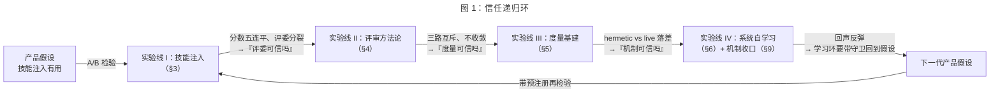
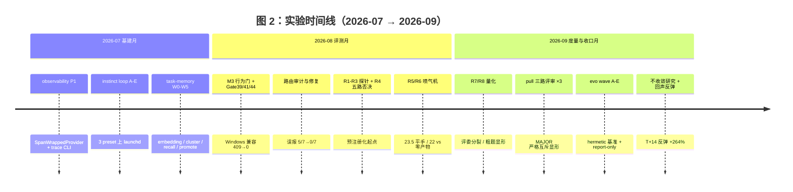
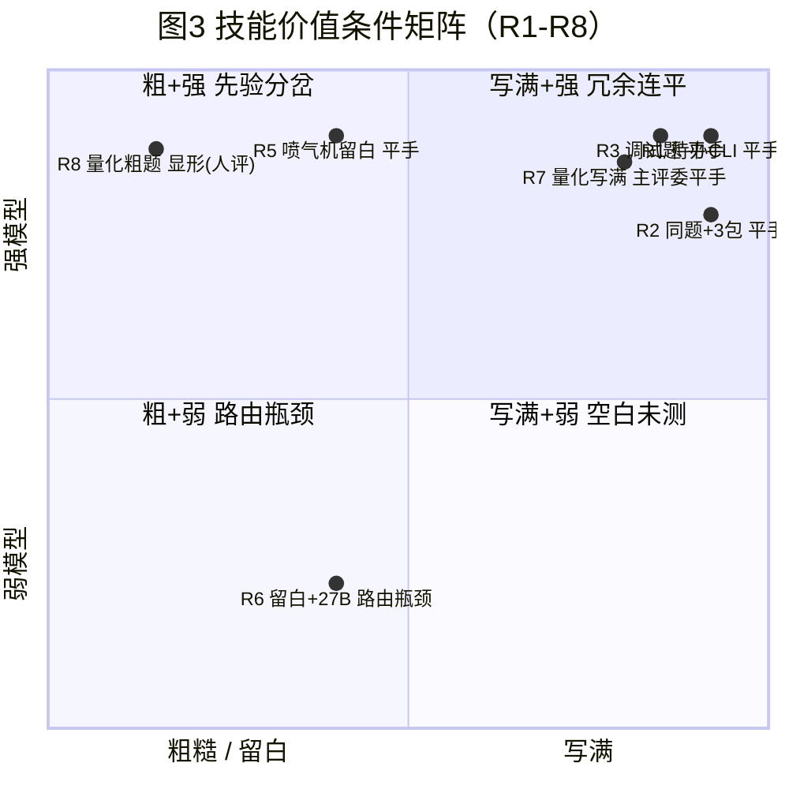
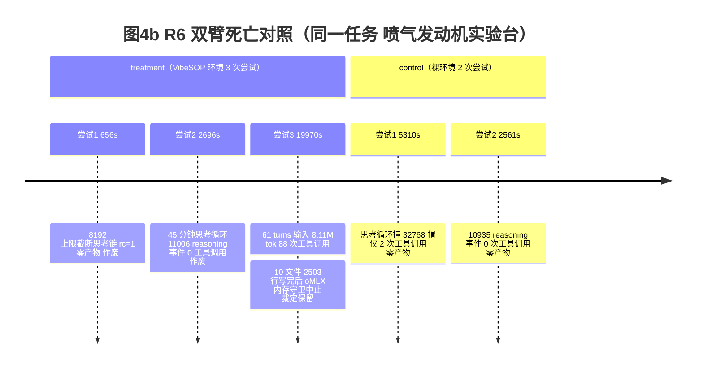
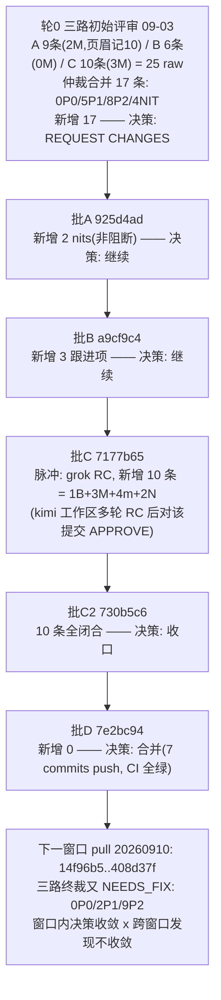
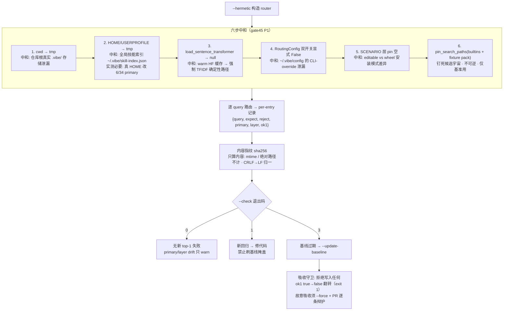
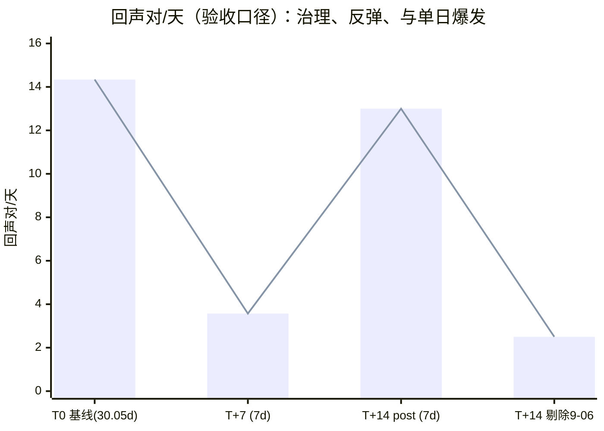
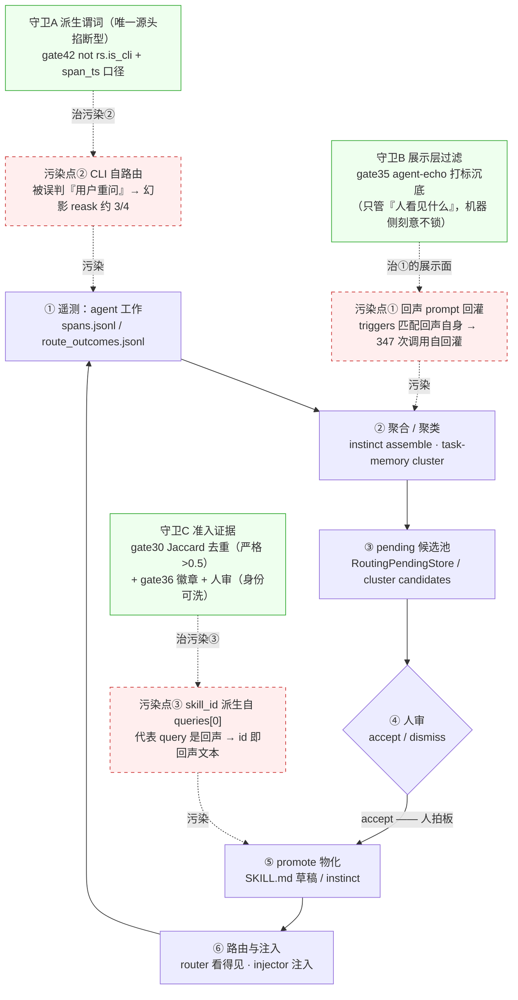
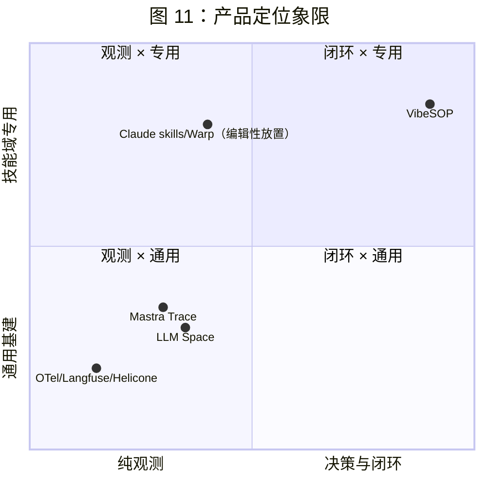

# 把「可信」从声称变成可测量 —— VibeSOP 实验与研究综述（2026-04 → 2026-09）

> **文档状态**：终稿 v1.0 —— 全章成稿：§3-§7、§2/§9、§8 均经 grok 复审（§2/§9 修后确认 APPROVE；§8 修后确认 APPROVE）；全文终审 findings（1 P0 + 2 P1 + 5 P2 + 4 NIT）已全部回修：附录 A 口径 21 项、R5 留白归类、评审轮次 6 轮/13 报告、附录 B 29 项口径（#0-#28，#12 拆双行，共 30 行）；mermaid 11/11 渲染全绿；全量 7123 tests passed（2026-09-12）
> **写作日期**：2026-09-12 · **基线**：main `60fd0487`（8.3.1 修复轮之后）
> **证据约定**：沿用项目三级标注——【实测】= 跑过代码看过输出；【文档】= 有 artifact 记录、未复跑；【假设】= 待实验判决。全文数字一律挂 artifact 路径，统一进附录 B 口径表核对后才入正文
> **铁律**：①不声称清单随文 ②数字先核对后引用 ③图先 mermaid-cli 渲染后入文 ④R8 盲评未结算、整机流水线未检验等「未完成」必须显式写，不许写成结论

---

## 0. 定位与读者

**一句话定位**：对 VibeSOP 项目约 5 个月（998 commits、7123 tests 全绿，附录 B #0）全部实验与研究的系统性综述——做了什么、发现了什么、证据是什么、建议什么。

**中心论点（草案，填充时可修订）**：

> 这五个月的研究轨迹是一次「信任递归」——先用 A/B 实验检验产品假设（技能到底有没有用）；再用评审方法论检验代码与实验本身（怎么知道它是对的）；再用度量基建检验评审与路由（怎么知道「知道」是对的）；最后把一切收进机制（守卫 / 注册表 / 预注册 / fail-closed）而不是宣言。每一层得到同一个结论：**可信无法被声称，只能被测量；而测量工具本身也要被测量。**

**与既有文章的关系（材料复用表）**——综述不复制旧文，只做旧文没做的三件事：跨线综合（§7）、外部对照（§8）、分层建议（§9）。

| 既有文章 | 在综述中的角色 | 复用方式 |
|---|---|---|
| `docs/skill-routing-explained.md`（对外叙事主文） | §3 主材料 | 引用 R1-R8 叙事与结论表，综述补跨线视角与后续证伪 |
| `docs/enterprise-agent-methodology.md` | §4 / §9 素材 | 方法论提炼（设计院/施工队/监理/档案馆类比） |
| `docs/task-memory-loop-article.md` | §6 主材料 | 引用 W0-W5 叙事 |
| `docs/essays/2026-09-11-wechat-never-converge*.md` | §4 主材料 | 「评审不收敛」案例与数据 |
| `docs/essays/2026-09-11-harness-hot-takes.md` | §7 观点源 | 五条爆论作为综合发现的候选条目 |
| `docs/research/2026-09-09-agent-skills-paper.md` | §8 对照 | arXiv 2608.14036 对照笔记 |
| `docs/ROADMAP.md` + `docs/specs/2026-09-11-*` | §5 / §9 素材 | 演进提案 E→D→C→A→B 与 R1-R7 收口需求 |

**目标读者**：① 三个月后的我们自己（对抗遗忘曲线，比 git log 更完整的判断脉络）；② 同在做 agent 基建的工程师；③ 公众号读者（本综述可拆分为 3-4 篇独立成文，拆分点见附录 E）。

**摘要**：五个月、998 commits、21 项实验（附录 A）：本文综述 VibeSOP（AI SkillOS）从产品假设到机制收口的全部研究。R1-R8 八轮系列（R4 为方案评审轮，非 A/B）测出技能注入的条件性价值——spec 写满或先验可覆盖的题技能冗余（R1-R3/R7 平手；R5 留白平手：80 次读取、23.5/23.5）、粗放的题技能显形（R8 人评，盲评未结算）；评审方法论线发现三路独立评审 5 条 MAJOR 严重度零共判、refute-first 驳回 finder 最高 56% 产出——发现不收敛，收敛的是决策；度量线把路由误报 5/7 修到 0/7，建立 hermetic 双向误差基准（过灌 2/19 vs 1/19）；学习线经历回声治理 T+7 −75.2% 后 T+14 反弹 +264% 的换通道再污染，唯一真实 promote 成功仅 1 例且出自人审。综合为十条可迁移发现（F1-F10），与 26 条外部文献逐条对照（TeamBench Verifier 49.4% 假放行、model collapse 的检索层同构、GSM1k 式负例饱和），落点是三层建议，核心一条：**可信无法被声称，只能被测量，而测量工具本身也要被测量——所以收口靠机制（预注册判据、确定性层才配门禁、LLM 评审永不作放行闸、一切结论挂 artifact 路径），不靠宣言。**

---

## 1. 全文结构总览

| 章节 | 问题 | 假设卡 | 状态（2026-09-12） |
|---|---|---|---|
| §2 研究方法总览 | 我们怎么做事 | — | 成稿 v1 |
| §3 实验线 I：技能注入有没有用 | 技能值得做吗 | H1 H2 H3 | 成稿 v1 |
| §4 实验线 II：评审本身可不可信 | 怎么知道代码/实验是对的 | H4 H5 H6 | 成稿 v1 |
| §5 实验线 III：度量与路由可不可信 | 怎么知道「知道」是对的 | H7 H8 | 成稿 v1 |
| §6 实验线 IV：系统能否自己学 | 遥测能变成能力吗 | H9 | 成稿 v1 |
| §7 跨线综合发现 | 十条可迁移结论 F1-F10 | — | 定稿 v1 |
| §8 与外部工作对照 | 别人走到哪了 | — | 成稿 v1（26 条引用逐条核验） |
| §9 建议 | 接下来做什么 | — | 成稿 v1 |
| §10 局限与不声称清单 | 这篇综述自己不可信在哪 | — | 成稿 v1 |

**三条阅读路径**（对应 §0 的三类读者）：
- **三个月后的我们自己**：§2.3 信任递归模型 → §7 F1-F10 → 按需跳各章「案例」小节（每章案例均有 artifact 路径可回溯）。
- **agent 基建同行**：§3（注入效用）+ §5（度量）正文 → §4（评审协议）→ §9.2 实践清单直接取用。
- **公众号读者**：先读 §0 中心论点与 §7 各条「差点错在哪」，再从 §3.4/§3.5（喷气机/评委分裂）、§6 回声反弹三个故事入口进入；附录 E 给出拆分点。

**写作纪律（对填充期的追溯记录）**：实际填充顺序为 §7 先行锁定论点-论据映射（纲举目张），各章只做「展开 + 讲故事」不新增结论——§7 定稿后新增的口径修正（如五次平手轮次、过灌双口径）均回写进了对应章节与附录 B。

---

## 2. 研究方法总览：实验室说明书

> **章状态**：成稿 v1（2026-09-12）。工具溯源均挂 session/artifact；证据等级以【文档】为主（转述既有记录，未复跑）。

**本章论点**：这个项目真正可迁移的不是任何单点结论，而是一套「实证纪律工具箱」——预注册、证据分级、fail-closed、report-only 与门禁的分界、refute-first 对抗评审、不声称清单。§3-§6 的每个实验都是这套工具的一次组合使用；工具箱多数件目按「疼 → 立规」逐次引入（§2.2 三个翻车案例是主要推手），少数先于对应实验存在（见溯源列与章末不声称），本章按主题而非时间排序。

### 2.1 工具箱一览（含溯源）

| # | 工具 | 一句话规则 | 首次引入/代表锚点 | 战绩（详见对应章） |
|---|------|-----------|------------------|-------------------|
| 1 | 预注册 prereg | 判据写死，跑完不得改 | R4 五路否决后 R5 起预注册化；现存最早独立文件 `ab-jet-weak-prereg.md`（R6，抬头 08-29 / git 08-30）【文档】 | R5-R8、R3/R4 优化收敛全部有 prereg（§3/§5） |
| 2 | 三级证据标注 | `[executed]/[inspected]/[assumed]` 按证据级别声明 | 源自行为章程（META 1.2），gate/pull lane 报告通用【文档】 | 全部 lane 报告与本文证据约定 |
| 3 | fail-closed 优先 | 未知 ≠ 错误，但缺数据宁可保守分支 | 成文锚点：S58「匹配无内容：对抗分析 → fail-closed」+ S65 Theme「fail-closed source_file/demote/skill_file」（均 09-03）；另一起点为 health 轮「未知 ≠ 错误」裁决（记忆摘录已入库 `docs/decisions/health-round-unknown-not-false-excerpt.md`，发生日期记录内不可判）【文档】 | 8.3.1 修复批（§6） |
| 4 | report-only ≠ 门禁 | 语义/随机层只报告不拦截 | gate38 起永久 report-only CI job（08-23，CHANGELOG）→ evo D1 `eval_routing` report-only（09-11）+ `docs/dev/routing-benchmark.md`「deliberately NOT gated」自白【文档】 | evo wave1 全部 report-only，零 gate 路径接触（§5） |
| 5 | refute-first 对抗评审 | 发现先被反驳，活下来才算数 | S57 首次走 `adversarial-review` workflow（09-02）；更早 S53b（08-30）已跑 5 路独立对抗评审（workflow 之前的雏形）【文档】 | S57 19→17 确认/2 驳回；S76 27→12/15 驳回（§4） |
| 6 | 不声称清单 | 每章随文发布「本结论不覆盖什么」 | 各章成文标配；综述级汇总见 §10【文档】 | §3-§6 章末各有 |
| 7 | 观察性 vs 因果声明 | 非随机分配的数据只说「观察到」 | evo C（09-11，模型组合非随机分配）【文档】 | §5 案例与 §7-F7 边界 |
| 8 | 账本入库 | gitignored 路径里的账本 = 没有账本 | 案例 2c 反推（本节下方）【文档】 | `.omx/artifacts/` 722 文件入库（2026-09-12 计数） |

### 2.2 为什么需要这套纪律：三个翻车案例

- 【案例 2a · 自述数字不可信】adoption 文档曾虚标「评测集 50+/90+」，口径审计实测 174 条 / builtin 14 个（`design-adoption-v2-final.md` §0）。教训：**对外数字必须实测**，自述口径一律重审——这是 F10 的起点。
- 【案例 2b · 单一评委 = 单点故障】R7 双评委方向相反：Grok 判对照组胜（16.5 vs 17.0），Kimi 判技能组胜（20.0 vs 15.0）（`ab-quant-r7-report.md`）。教训：**评委本身是方差源**（F3），单评委结论不可作为裁决。
- 【案例 2c · 账本差点蒸发】`.omx/` 产物曾长期被 `.git/info/exclude` 静默忽略——356 个历史文件靠强制入库幸存，R3/R4 prereg 靠 `git add -f` 抢救【文档】。教训：**账本入库是机制问题不是习惯问题**（F10）；三份 adversarial-review 报告本体丢失（只剩 session 记录）就是没入库的代价（§4）。

### 2.3 信任递归模型

每个组件都不可信，于是包一层验证；验证层本身也是组件，于是也要被验证。递归不追求完全解，追求「把不可信变成可审计的不可信」。图 1 给出本文四条实验线在这条递归链上的位置——每一层的产出，是对上一层某个信任假设的证伪：



图 2 给出三个月的时间线（数据源：`memory/session.md` S35-S83 + `.omx/artifacts/` 文件日期）：



**对比与类比**（收敛为两个）：
- **临床预注册类比**：实验设计先于数据；试验不因为「医生觉得有效」就上市。对应工具 #1「判据写死、跑完不得改」与 R4 否决「跑完再定判据」的方案（§3 案例 3e）。
- **计量学类比**：天平本身要校准，且校准砝码也要溯源。对应 §5 整章「测量工具也要被测量」与 hermetic 基准对环境噪声的中和处理。
- 反面对照：「vibe coding 式迭代」（改了就跑、跑了就信）在 agent 基建上不可行——因为每一层的输出都会被下游当成输入信任，单点未经校准的乐观会沿调用链放大（案例 2a 与 2b 的并列就是缩影：自述数字虚标是「仪器未校准」，评委分裂是「读数员未校准」——两层各自独立出错，都会让下游拿假数当真）。

**外部参考**（已核验，2026-09-12）：①临床试验预注册制度——[ICMJE 要求临床试验在首例患者入组前完成前瞻性注册](https://www.icmje.org/recommendations/browse/publishing-and-editorial-issues/clinical-trial-registration.html)方可发表，[WHO ICTRP](https://www.who.int/tools/clinical-trials-registry-platform/network/trial-registration) 提供注册网络；②reproducibility crisis 一般性引用——[Baker, *1,500 scientists lift the lid on reproducibility*, Nature 533:452-454, 2016](https://www.nature.com/articles/533452a)（1,576 名研究者调查：70%+ 未能复现他人实验、>50% 未能复现自己的实验）。

**关键数字**（→ 附录 B）：工具箱没有直接数字，每件工具的「战绩」在 §3-§6 各自量化；本表引用的 174/14（#23）、16.5/17.0 与 20.0/15.0（#5）、5/7→0/7（#17）均见附录 B 对应行。

**不声称**：工具箱**不是**一份事前写就的纪律总纲——8 件中至少 #2（META 行为章程，always-loaded 先于本文全部实验）、#4（gate38 的 report-only CI job，08-23 先于 evo D1）、#6（成文标配，属写作规范而非实验产物）在对应实验之前或之外已存在；其余件目大体按「疼 → 立规」引入，但溯源列给出的日期是**可核锚点的日期**，不是严格首次引入日（如 #3 的 health 轮起点连发生日期都不可考）。本文只是把这套混合来源的工具整理成可迁移的形状。

---

## 3. 实验线 I：技能注入有没有用（R1-R8 + 探针）
> **章状态**：成稿 v1（2026-09-12；grok 复审 APPROVE_WITH_NITS，P2/NIT 已回修）。
> **证据分级声明**：本章为纯文档研究，全部论断标注【文档】（转述 artifact 记录，未复跑任何实验）或【假设】；原报告内部的 `[executed]` / `[inspected]` 标注属原作者，引用时注明。全文数字逐项对过附录 B #1-#8（核对结论见 §3.0 与 §3.13）。

**本章论点**（自骨架草案定稿）：技能注入的价值是**条件性的**，且条件不在「模型强弱」这条直觉轴上——spec 写满时冗余（R1/R2/R3/R7 连平）、spec 粗糙且模型先验盖不住空白时显形（R8 人评）、弱模型场景第一瓶颈不在注入而在路由（R6：技能内容 0 次进入上下文）。八轮数据合成的两个推论——「技能是 spec 的泛化」（H2）与「大模型编排 + 小模型执行」流水线（H3b）——分别是未单独检验的框架与未整机检验的工程假设。【文档】

---

### 3.0 轮次编号与证据等级（先修口径，附录 B #1 的核对结果）

写正文前必须先修三处口径，否则「五次平手」数不对：

1. **R4 不是 A/B 轮**。R4 是中场方法论评审：WebGen-Bench 基准方案（n=10-15 配对 A/B）送五路 Kimi 独立对抗评审，**5/5 否决**（`ab-probe-kimi-synthesis.md`「五路中零路支持原案」，2026-08-28）。它没有双臂、没有评分，不计入平手序列。否决理由按独立命中路数排序：C1 n=10-15 无统计功效（McNemar 计算，n=15 只能可靠检测 +30pp 级效应，而外部先验仅 +1.2%（均值）/ +7.1%（最好方法学技能）——分层口径）；C2 捆包处理归因失败（treatment = 技能内容 × 路由触发率 × 路由准确率，阳性阴性都分不清功劳在谁）；C3 无决策规则 = 不可证伪（「R1-R3 三连零增益未改变任何行动」被点名）；C4 机会成本；C5 任务-技能错配（WebGen 是训练饱和区）；C6 工程风险。**R4 的两份遗产直接塑造了 R5-R8：基准锁进容器 + 预注册判据写死；评审固定双外部模型交叉。**
2. **「探针」与「R1-R3」是同一批，不是两批**。`ab-probe-20260828.md` 一个文件含三轮：R1（待办 CLI）、R2（同题+预装三技能包）、R3（cart_lib 调试题），自标「轶事级（anecdotal）」。骨架把「探针 20260828」与「喷气机 R1-R4」并列成两行是误读——喷气机案例只有两轮：R5（强模型）与 R6（弱模型），artifact 命名里的 `round1` 指「喷气机案例第 1 轮」= 全系列 R5。
3. **「五次平手」的逐轮口径**：R1、R2、R3、R5、R7。前四次为「零增益四连」（`ab-jet-weak-prereg.md`：「R1-R5 四连产物平手（强模型）」；`ab-jet-round1-report.md`：「记入 R1-R3 零增益序列（第四连）」）。R7 为第五次——按预注册主评委（Grok 深评 16.5 vs 17.0）记零增益第五连，**Kimi 反向给 20 vs 15，报告明文要求「记入零增益序列时必须注明 kimi 反向、差 5 分」**（`ab-quant-r7-report.md` §合成）。

| 轮 | 日期 | 任务 | 证据等级 | artifact |
|---|---|---|---|---|
| R1 | 08-28 | 待办 CLI（阴性对照） | 轶事级探针 | `ab-probe-20260828.md` §R1 |
| R2 | 08-28 | 同题 + 预装 superpowers/omx/mattpocock | 轶事级探针 | 同上 §Round 2 |
| R3 | 08-28 | cart_lib 调试（4 个植入 bug） | 轶事级探针 | 同上 §Round 3 |
| R4 | 08-28 | WebGen-Bench 方案评审（**非 A/B**） | 五路对抗评审 | `ab-probe-kimi-synthesis.md` |
| R5 | 08-29 | 喷气发动机 3D 教学页（强模型） | **预注册** | `ab-jet-round1-{eval,report}.md` |
| R6 | 08-29 | 同题换 27B 弱模型 | **预注册** | `ab-jet-weak-{prereg,report-r6}.md` |
| R7 | 09-02 | 量化驾驶舱（真实 TDX 行情） | **预注册** | `ab-quant-r7-{prereg,report,implementation}.md` |
| R8 | 09-02 起 | 量化·Kimi 独立命题粗任务书 | 预注册 + 人评（**无独立 report artifact**） | `ab-quant-r8-prereg.md` + session S71b |

证据等级阶梯本身是本章方法论发现之一：R1-R3 轶事级探针（形成假设、验证基建）→ R5-R8 预注册实验（判据 build 前写死、判读规则防事后合理化）。「探针」与「实验」的区别见 §3.11。【文档】

---

### 3.1 H1：技能注入提升 agent 任务表现 —— 条件性成立（写满=冗余已判 / 粗=显形系人评、盲评待结算）

- **假设**：给 agent 技能库并在合适时机注入，产物质量更高。
- **实验设计**：R1-R8 中**七轮**为双臂 A/B（R1-R3 探针 + R5-R8 预注册；R4 为方案评审，非 A/B 轮，见 §3.0）。同一镜像/同一任务书/同一种子（SHA256 逐字校验）；treatment 带 VibeSOP 路由 hook，control 裸奔；有效性三验（hook 触发 + 路由命中/拒判 + span 干净）——R5-R7 三验落盘，**R8 无消费账本**（无独立 report，见 §3.6）。评分 5 维 × 5 分（R5 起判分标准 build 前写死）。
- **结果**：①写满/先验可覆盖的题上五次平手（§3.0 口径）：R1 12/12 vs 12/12、R2 12/12 vs 12/12、R3 16/16 vs 16/16、R5 23.5 vs 23.5、R7 按主评委 16.5 vs 17.0（Kimi 反向 20 vs 15）；②粗题（R8）人评技能组明显更完整，技能第一次在产物层显形。
- **裁决**：**条件性成立**。条件 = spec 的空白处模型先验与 Harness 结构盖不盖得住（skill-routing-explained §5 三道防线）。写满题四次平手 + 留白但训练饱和区的 R5 平手（以上判据均落盘）+ 先验薄弱区的 R8 显形（**人评，盲评未结算——此半边为【假设】级，待盲评**）。
- **置信度与限制**：低-中。n=1/轮、单机、人评为主；R8 盲评未结算（§3.6）；R7 平手是主评委口径（评委分裂本身是数据，见 F3）；R5 第二轮用户人评分数未回（session S75 active 项，09-07）。【文档】

### 3.2 H2：「技能是 spec 的泛化」—— 兼容性假设，未单独检验

- **假设**：spec 是一次一图的施工图（用完即弃），skill 是一整套标准图集（一类任务反复复用）；模型拿到图集，头一件事是把它展开成本次任务的施工图。
- **实验**：无专门判决实验。旁证两条：①R6 模型原话「路由没有匹配到技能，任务书本身就是完整的需求文档——直接实现」（`ab-jet-weak-report-r6.md` §4）——模型自己把任务书当成了完整 spec；②R5「评分表打平 ≠ 意图达成」：留白处的每个决定都是模型拍的板，评分表量得出「做得多好」、量不出「做的是不是你要的那一个」（skill-routing-explained §5 注脚）。
- **裁决**：**框架不是结论**。与八轮全部观察相容，但未被专门设计的实验单独检验——skill-routing-explained §9 不声称清单最后一条明文声明；session S68 的 Next 项也挂「待专门实验检验」。
- **置信度与限制**：【假设】明示。若检验，方向是把「图集展开」操作化（例如同任务给 spec / 给 skill / 两者都给的三臂对照）。

### 3.3 H3 / H3b：弱模型 + 技能 ≈ 强模型？—— 证伪（原因反转）与流水线推导

- **H3 假设**：弱模型 + 技能注入可以逼近强模型（「实习生 + 手册」直觉，借口④）。
- **实验**：R6 单变量设计（vs R5 仅换编码模型为 Qwen3.8-27B 本地 8bit，路由 LLM 同步换同款 27B 保公平；任务/种子/评分逐字不变，`ab-jet-weak-prereg.md` §1）。预注册五条预测含反向假设（Δ≤−3 污染伤害）。
- **结果**：表面碾压——treatment **22/25**（另两套计数勿连读：尝试 3 产物 10 文件/2503 行；D1 物理自验 25/25）vs control 两次尝试零产物（5310s 仅 2 次工具调用；2561s 零次，10935 个 reasoning 事件）。机制提取翻面：路由 2/2 no-match（hook 一次 07:45 + 模型自调一次 08:28，均 `selected_skill: null`）、**全程 0 次 SKILL.md 读取**（R5 同期 80 次）、累计输入 8.11M tok / 61 turns 后死于 oMLX 内存守卫（死前交付物已写完，按规则 5 裁定保留，属协议偏离）。
- **裁决**：**证伪（原因反转）**。22 vs 23.5 的表面接近与 10 文件 vs 0 文件的完成度差距，赢的都是 VibeSOP 静态脚手架（路由协议规则 + 技能目录名称 + vibe CLI），不是技能内容——技能内容根本没机会进入上下文。「技能能否抬升弱模型」在路由质量解决前是**不可检验的问题**：27B 路由本身是第一瓶颈（`ab-jet-weak-report-r6.md` §5）。
- **置信度与限制**：n=1；control 零产物按预注册规则 4 记分（只报完成度 + 过程层）；结论依赖规则 5 事后豁免（若严格执行，treatment 三次尝试全部作废，完成度对比不成立）；runner 参数时点未闭合（`--reasoning-effort low --no-plan` 双臂同参但 control 执行时点无记录）；混杂结构 = 静态脚手架 × n=1 弱模型方差（control 自己两次尝试工具调用 2→0 即方差活证）。【文档】
- **H3b（衍生）**：大模型编排 + 小模型执行流水线——强模型拿技能图集把模糊需求拆成写满的子任务书，小模型执行，人审图验收。【假设】推导自 H1（R7 写满=冗余）+ H3（R6 弱模型+好环境 22/25）两块零件，**整机未跑**；且 evo 线的 E4 整机实验硬依赖 R8 盲评结算（`next-opt-design-v0.md`：「R8 盲评未结算则 E4 不开工」；v1 设计稿仅记「E4 整机（硬依赖 R8 盲评）」）。

---

### 3.4 案例 3a：喷气机双轮（R5 强模型 / R6 弱模型）——「80 次读取换不来 1 分」与「0 次读取照样赢」

**背景**。R1-R3 三连平手后（详见 §3.7），用户点名换一道「技能应该赢」的题：喷气发动机 3D 教学页。出题人按三条选题直觉逐条检查——规格故意留白（只给骨架，教学顺序/物理深度/交互形态全空）、需要手感型知识（布雷顿循环怎么给中学生讲）、再配上 R4 中场换来的预注册封卷（预测/评分表/判读规则 build 前写死，`ab-jet-round1-eval.md` §4-§6）。这是全系列第一个预注册轮。

**双臂设置**。双容器 reset 到同一 seed（TASK.md sha256 前缀 `8607beff` / three.min.js `9274bbce`，双臂逐字一致）；grok 0.2.111 同参；treatment = VibeSOP 79 技能 + hook，control 裸；路由 LLM = deepseek（容器全局配置）。有效性三验全过（hook span 995ms / 平台正确 / transcript 首句引用技能路由）。

**结果（R5）**。**23.5 / 23.5**，逐维打平（`ab-jet-round1-report.md` §静态评分）：

| 维度 | treatment | control | 备注 |
|---|---:|---:|---|
| D1 物理保真 | 5 | 5 | T：燃油 τ0.25s → 转子 τ2.15/3.9s 不对称 → EGT 过富超调 + 红线 → 推力 N^1.82；C：增压比/TIT 更全 + EGT 降推力项——两种取向都满分 |
| D2 3D 交互 | 4.5 | 4.5 | T：剖视 + 5 可点选部件 + 火焰环；C：世界空间标注跟随 3D + 喷流绑仿真态 |
| D3 教学法 | 5 | 5 | T：五步实验带实时状态判定函数；C：布雷顿循环站位编号讲解 |
| D4 工程质量 | 5 | 4.5 | **T 主动补 slam/chop Node 自测（任务未要求）**；C 无自测 |
| D5 完成度 | 4.5 | 4.5 | 静态无法区分，留给运行时人评 |

产物规模同量级（T 8 文件 1987 行 ES modules / C 9 文件 2491 行 classic scripts，`node --check` 全过、资源引用全 200）。预注册判定：P1（treatment ≥1.5× 墙钟）**反向**——treatment 更快（1042s vs 1274s，0.82×，R2 式交叉再现，R1-R3 的成本惩罚不稳健）；P2（D1/D2 平手）精确命中；P3（D3 显性胜出）未成立（「D3 差 ≥2」判读线未达）；P4（主动补测试）命中（slam/chop 断言）；P5（差 ≤3 且 T 略优）落在差 0。规则 2 触发：记入零增益序列**第四连**。而 transcript 计数显示 treatment 是认真读了说明书的：**80 次 SKILL.md 读取、5 次 vibe route 自调、24 次 superpowers 引用**（`ab-jet-weak-prereg.md` §2 [executed]；`ab-jet-weak-report-r6.md` §3 P5 复引）——「80 次认真阅读，换不来 1 分」由此成为 harness 假说的锚点证据：技能是提示词层的规范执行，好运行时是结构层的规范执行，两者并存时结构层赢。

**借口排雷 → R6**。借口④出场：「那是强模型见多识广，真正需要手册的是弱模型。」R6 冲着它去——同题、同种子、同评分表，双臂同时换 Qwen3.8-27B（路由 LLM 也换同款，公平性要求）。

**结果（R6）**。control 两次尝试死于思考循环（一次 88 分钟只做 2 次工具调用、一次 43 分钟零次）；treatment 三次尝试里第三次在 61 turns / 累计输入 8.11M tok 后死于 oMLX 内存守卫，但 10 文件交付物在中止前已写完（最后文件写于 13:07:39、中止在其后，故障只吞掉收尾说明，裁定保留）。22/25 表面接近强模型的 23.5。机制提取（§3.3）翻面：**0 次读取技能文件**，赢的是静态脚手架。路由时间线（`ab-jet-weak-report-r6.md` §4 [executed]）：hook 在 +1.5min 触发 route（07:45:40，`selected_skill: null`）→ 模型 +44min 自己拿摘要再问一次（08:28:27，891 tok、$0.001，仍 `selected_skill: null`）→ 显式推理「路由没匹配到技能，任务书本身就是完整需求文档，直接实现」→ 此后 read_file 目标全部是 TASK.md 和自己的产物。过程侧写：treatment 前 82 分钟也在纯思考（与 control 的循环同构），09:06 突破写出首文件，之后 4 小时均匀产出 10 文件、88 次工具调用（50 编辑 + 11 写 + 14 终端 + 10 读）；control 两次尝试分别 2 次、0 次工具调用后死亡。四条借口至此排完，逼出的是更窄的真相：弱模型格的第一瓶颈在路由。

**下轮修正**。①弱模型格改问「路由质量」而非「注入效果」（→ 演进线 W2/E1，未跑）；②R6 过程抓出的工程缺陷进 **P3 backlog 共 4 条**（factory 不透传 model 名静默 404、hook CLI 不尊重 orchestration 开关、multi-intent 输出被 headless 丢弃、cron 巡检误命中 autonomous-experiment）（`ab-jet-weak-report-r6.md` §6，原文严重级为 P3 非 P0）；③「22 vs 23.5」的 1.5 分差此后被项目明令禁止写成等价（session S72 口径修正①：对照零产物、零读取、事后豁免、n=1 四条注脚必须随行）。

### 3.5 案例 3b：量化驾驶舱 R7 —— 双评委方向相反，分裂本身是答案

**背景**。用户否决「喷气机案例过简单」，要求从 `~/Projects/rstdx` 出发做完整量化系统；并当场改口**禁止伪造 K 线**——必须真 TDX/Tushare 行情（`ab-quant-r7-prereg.md` 抬头）。种子由 rstdx 真拉：8 标的 × ~799 根日线（2023-05-19→2026-09-01），600000 2026-09-01 O9.13/H9.36/L9.10/**C9.35**/V102,669,616 作双臂钉死对照（`ab-quant-r7-implementation.md` §2.2）。

**双臂设置**。同一 TASK.md + 同一 seed/；treatment 对每个非平凡子任务 `vibe route` 并跟 SKILL.md，control 禁读任何 SKILL.md；builder 为 Grok 4.6 隔离子代理分 cwd；每臂 docker compose，人评端口 8811/8812。机制三验：treatment 路由命中且读了 SKILL.md（PROCESS.md）→ **本轮有效**。

**结果**。隐藏 API 双臂全 200（`/`、`/api/health`、`/api/bars`、`/api/equity`、`/api/backtest`、`/api/replay/start`、`/api/paper/order`）、真实行情钉两边一致（600000 2026-09-01 C=9.35）——产物层都能演示；茅台 DualMA 回测终值 treatment 约 65.3 万（-34.7%）vs control 约 62.5 万（-37.5%）。评分第一次分裂（`ab-quant-r7-report.md` §评分）：

| 维度 | Grok 深评 T / C | Kimi 外评 T / C |
|---|---:|---:|
| D1 量化正确 | 3.0 / 3.5 | 3.0 / 2.0 |
| D2 系统完备 | 3.5 / 4.0 | 4.5 / 4.0 |
| D3 面板 | 3.0 / 3.5 | 4.0 / 4.0 |
| D4 工程 | 3.5 / 2.5 | 4.0 / 2.0 |
| D5 文档 | 3.5 / 3.5 | 4.5 / 3.0 |
| **合计** | **16.5 / 17.0** | **20.0 / 15.0** |

方向取决于评委更恨什么：Grok 点名 treatment 的 `tests/test_engine.py` 在信号同一根 `hist[-1]` 上撮合（**测试路径 lookahead**，与 `backtest.py` 的 next-bar 声明不一致）且 replay 主路径不走 matcher；Kimi 则把 control 的 `PINNED_CLOSE`（`app/config.py` 里把评测日收盘强制写死 9.35——种子本身已是 9.35、HTTP 钉仍对，但这是**为隐藏测试写的保险，不是行情计算**）判为「应试造假」、把 treatment 的测试 lookahead 判为「可修的验证错误」。两臂还有一组未入评分的真实工程差（`ab-quant-r7-implementation.md` §5 对照表）：treatment 印花税 5bp（接近现行）vs control 10bp（偏旧口径）；treatment 6 个测试文件（声明 20 passed）vs control 零测试；treatment README+3 份文档 vs control 一份 README；treatment DuckDB 冷库 vs control 仅 parquet。墙钟 1668s vs 1454s（1.15×，预测 P1 的 1.3× 未达）。技能消费有效且形态具体：4 次 route——prototype（82% 命中但**拒跟**，一次性原型不符合可交付）、writing-plans（产出计划文档 `docs/superpowers/plans/2026-09-02-quant-cockpit.md`）、test-driven-development（引擎/撮合/均线测试先写）、design-an-interface + frontend-design（被 CHOICES 锁成系统字体 + 红涨绿跌）。

**裁决与借口排雷**。P5（总分差 ≥3 且 treatment 优）在预注册主评委（Grok 深评）上**不成立**→ 零增益第五连，但报告强制附注「kimi 反向、差 5 分」。合成结论：「写满的题，技能没有下手的地方」——接口铺好、验收钉死之后，差距小到两个评委能吵起来、方向都定不下来。同时留下一个此后被 health 复检钉死的误读风险：**「评委方向相反」不等于「技能归零」**（`health-20260909/paper-brief.md`）。人评 D3（面板）当时仍开放。

**下轮修正**。R7 的 TASK.md 由编排者写——出题人读过技能清单和 R5「必须项+留白」模板，题目被故意做成技能形态 → 实验设计本身成了最大混杂源。R8 因此而生（§3.6）。

### 3.6 案例 3c：R8 独立命题 —— 消除出题污染后的「粗题显形」（人评，盲评未结算）

**背景**。R7 污染被识破后（session S56b：「TASK.md 由编排者写，未跟实现技能，但按 R5 模板+技能形态出题 → 污染」），R8 的唯一协议变更：**命题人 ≠ 编排者，且命题人不得读技能目录 / R5-R7 任务书模板**。

**双臂设置**。命题协议（`ab-quant-r8-prereg.md` §命题协议）：

| 项 | 规定 |
|---|---|
| 命题人 | Kimi Code CLI（与 builder 不同模型） |
| 输入 | 仅用户第一轮的产品需求原话（rstdx 现状 + 完整量化系统诉求 + 模拟盘/CTP） |
| 禁止给命题人 | SKILL.md、R5/R7 TASK、预注册、CHOICES、实现说明书、VibeSOP 字样、14 条清单模板 |
| 编排者对 TASK | 不得改写需求；只许文末追加「环境附录」（路径/种子/端口/无 SimNow）并标明非命题人原文 |
| 哈希钉死 | TASK.md sha256 `eb074c27…4678`；环境附录 `5ce376a2…`；seed bars_daily.parquet `4bdd3f22…`（与 R7 同一份） |

种子复用 R7 真行情 parquet——是公平条件，不是题目内容。Builder、双臂协议、评分表（R7 五维）与判读规则沿用；主假设仍是 P5（差 ≥3 且 treatment 优）；人评端口 8821/8822。

**结果**。新任务书确实粗得多——只有模块清单，没有铺好的接口、没有钉死的数字（skill-routing-explained §4；这同时回答了 prereg 的「额外记录」项：R7 的题目形态来自出题人而非用户原话）。双臂建成；**人评（人肉翻代码 + 点面板）结论：技能组明显更完整**——记录在 session S71b（2026-09-07）与 skill-routing-explained §4。**先声明混杂**：R8 相对 R7 同时换了任务书与命题人，「差异全归于需求粗细」的读法已被 health 复检点名禁止——本段只报告「在 R8 的粗任务书上观察到技能组产物更完整」这一【人评】级事实，不归因。在此前提下，与 R7 对照的两头观察（写满连平 / 写粗显形）成立，但「粗=显形」半边以盲评结算为准。

**裁决与限制**。这是 H1「粗=显形」半边的唯一直接证据，但**盲评未结算**——全库检索（`.omx/artifacts/`、`docs/`、`memory/session.md`）无任何结算记录；最新状态停在 next-opt 设计的硬依赖声明（`next-opt-design-v0.md`：「R8 盲评未结算则 E4 不开工」；lane-a 评审 09-11 复核仍标「盲评未结算」）。且 R8 **没有独立 report artifact**——预注册之外，过程记录只有 session 条目；技能消费计数（是否真读了 SKILL.md、读了几次）未见落盘。R8 相对 R7 同时换了任务书与命题人，「差异全归于需求粗细」的读法已被 health 复检点名禁止。

### 3.7 案例 3d：探针三轮（R1-R3）—— 轶事级的价值与边界，顺带抓 P0

`ab-probe-20260828.md` 是全系列的起点，文件头自标「**证据级别：轶事级（anecdotal）**。单次运行、单任务、同模型同版本，无重复、无统计功效。结论只能用于验证实验基建与形成假设，不能用于宣称产品效果」——这句话本身就是「探针 vs 实验」证据等级的教科书表述。

- **R1（阴性对照）**：待办 CLI，故意选「干净到几乎不该有差异」的题——若这种题上技能都能拉开分，该怀疑的是评分。结果 12/12 vs 12/12、实现逐字等价；treatment 多花 ~30s（69s vs 39s，常驻规则上下文 + hook 开销）。借口①：「题太简单。」
- **R2**：同题预装三个社区技能包（技能宇宙×3）再考——还是 12/12 平手，墙钟方向反了过来（71s vs 81s，噪声区间）。借口②「说明书不够多」出局。
- **R3**：换成技能实际命中的形态——cart_lib 植入 4 个真 bug（B1 `total()` 裸 float；B2 正向遍历中 `del` 致相邻同名跳删；B3 满减阈值 `> 10` 应为 `>= 10`；B4 优惠券在满减前扣、规格要求在满减后），可见套件 6 条只暴露表层（4 过 2 挂），B3/B4 与堆叠顺序只有 `payable()` docstring 规格 + 16 条隐藏验收测试覆盖（两向校验：种子 12 挂 / 参考实现 22 全过）。双臂 16/16 同方案修完（都选 Decimal + ROUND_HALF_UP + 分位量化），可见套件 sha256 与种子逐字一致（无篡改）；**过程层第一次出现可测差异**：treatment 被 systematic-debugging 注入塑形（transcript 首句即引用），先建反馈环、枚举 5 条根因假设、为规格未覆盖处主动补 3 条失败测试；control 修完拍拍手就走。墙钟 197s vs 106s（1.9×，当时的「成本惩罚」证据，后被 R5 反向证伪）。借口③：「产物层测不出技能。」
- **顺带抓的 P0**：`vibe init` 模板 YAML null 键使 `merge_scenarios` 的 `set(None)` 必崩 → **每个新项目每次路由都静默降级为 no-match**，treatment 臂路由价值归零。修复 = `project_config.py` 四处 `or []` + 2 条回归测试。「没有机制探针这 bug 会直接污染实验结论」——有效性三验制度的地基案例。

探针三轮的真正产出是三样：实验基建跑通（双容器隔离/隐藏评分/机制探针全链路可用）、三条选题直觉被逐条教育（题要留空间/包要对得上卡/模型得需要手册——全部没挡住平手）、以及把「任务必须落在技能形态上」收敛为下一轮的设计输入。

### 3.8 案例 3e：污染记录（负面方法论案例）—— 实验设计本身是最大的混杂源

两笔入库的污染记录，都比实验结论更值钱：

1. **出题污染（R7→R8）**：R7 的 TASK.md 由编排者（Grok 4.6）写——出题人读过技能清单和 R5 模板，题目被做成技能形态。control 与 treatment 栈接近，无法分离「技能改了实现」和「题目已经把路铺好」。R8 用命题隔离 + sha256 钉死修正（§3.6）。
2. **宿主污染（R4/R8 两代活体样本）**：①R4 五路评审当天，宿主 VibeSOP hook 对**纯文档评审提示词**误触发多意图编排（五类意图全误报，其中一路路由到社区技能 `fuck-my-shit-mountain`，`ab-probe-kimi-synthesis.md` 会话内即时佐证）；②R8 出题时，宿主 hook 对 `kimi -p`（只负责出题的请求）注入了 fallback-llm 多意图编排（无真实 SKILL.md，session S56b「记入污染」）。**差路由会在开考之前就把题目弄脏**——实验所处的宿主环境本身是混杂变量，这也是 §5 路由审计（5/7 误报、恒 82% 置信）的直接动机之一。

方法论教训：A/B 的混杂不止在臂内，还在**出题链路和宿主环境**；命题隔离、环境附录哈希、有效性三验是三道对应的防线。

---

### 3.9 图 3：技能价值条件矩阵（mermaid quadrantChart）

X 轴 = spec 充分度（左粗/留白 → 右写满），Y 轴 = 模型能力（下弱 → 上强）。**注意 R5 的位置**：骨架草案把「冗余区」写成 R1-R5，但 R5 的任务是故意留白题（非写满）——它平手的原因是「留白 + 强模型先验盖得住」，与 R1-R3/R7 的「写满」是两种机制（skill-routing-explained §5 把 R5 单列）。因此左上象限内部有一次分岔：R5（教学 3D，训练饱和区，先验盖住 → 平手）vs R8（量化领域细节，先验盖不住 → 显形）。



- 右上（冗余区）：R1/R2/R3/R7——写满 + 强模型，五次平手占四次。
- 左上（先验分岔区）：R5 留白但教学 3D 属训练饱和区，先验自己填空 → 仍平手；R8 粗题落在先验薄弱区（lookahead/撮合/CTP 不在通用先验里）→ 技能显形。**同象限两种结局，分岔变量是领域先验覆盖度，不是 spec 字面粗细**。
- 左下（路由瓶颈区）：R6——弱模型连「该用哪本」都判不出（2/2 no-match），注入效果不可检验。
- 右下（写满+弱）：**【空白，未测】**——零轮次落在该象限。空白本身就是发现：未测区域不许填结论。按 H3b 推演这恰是流水线「小模型执行写满子任务书」的目标格，但那是推导不是测量（§3.3）。

### 3.10 图 4：R1-R8 结果总表（+ 可选图 4b R6 死亡对照时间线）

数据源 = 各 report 原文逐格对 artifact；「平手?」列按 §3.0 口径。

| 轮 | 任务 | 双臂 | 评分与评委 | 技能消费证据 | 平手? | 裁决 |
|---|---|---|---|---|---|---|
| R1 | 待办 CLI | VibeSOP vs 裸（grok 0.2.111） | 隐藏 12/12 vs 12/12 | hook 触发 1 次，无命中 | ✅ | 阴性对照通过；+30s 成本可见 |
| R2 | 同题 + 3 技能包 | 同上 | 12/12 vs 12/12 | route+tool-seq 双 hook 触发，无命中 | ✅ | 技能宇宙×3 不改变结局 |
| R3 | cart_lib 调试 | 同上 | 16/16 vs 16/16（T 25=22+3 自加 / C 22） | systematic-debugging 注入，transcript 首句引用 | ✅ 产物 | 过程层首次显形（补 3 条失败测试） |
| R4 | —（WebGen 方案评审） | —（非 A/B） | 五路 Kimi 对抗 5/5 否决 | —（其中一路宿主 hook 误编排，记污染） | — | 基准方案撤回；换来容器内任务书 + 预注册制度 |
| R5 | 喷气机 3D 教学页 | 强模型双臂，预注册 | **23.5 / 23.5**（Claude 静态审读；用户第二轮人评未回） | **80 次 SKILL.md 读取**、5 次 route 自调、24 次 superpowers | ✅ | 零增益第四连；消费≠分数；harness 假说锚点 |
| R6 | 同题换 27B | 弱模型双臂（路由同 27B），预注册 | T 22/25（1/3 次有效）；C 零产物×2 不评分 | **0 次读取**；2/2 no-match | —（Δ 不可计算） | 表面碾压→机制翻面；路由是第一瓶颈 |
| R7 | 量化驾驶舱（真 TDX 8×799 日线） | Grok 4.6 隔离子代理，预注册 | Grok 深评 **16.5 vs 17.0**；Kimi **20 vs 15**（方向相反） | 4 次 route（prototype 拒跟 / writing-plans / TDD / design-an-interface+frontend-design）+ 读 PROCESS.md | ✅（主评委口径，Kimi 异见） | 写满题技能无处下手；评委方差显形 |
| R8 | 量化·Kimi 独立命题粗题 | 同 R7 协议，命题隔离 | 人评：技能组明显更完整；**盲评未结算** | 未见落盘计数（无独立 report） | — | 粗题显形（人评级证据）；出题污染已隔离 |

**图 4b（可选）：R6 双臂死亡对照时间线**（数据 = `ab-jet-weak-report-r6.md` §1/§4）



对照读法：treatment 前 82 分钟也在纯思考（与 control 同构），09:06 突破后 4 小时均匀产出；control 两次尝试连「开始写文件」都没发生过。完成度差距真实，但归因只能到静态脚手架 + n=1 方差（§3.3）。

---

### 3.11 对比与类比

- **类比（沿用 skill-routing-explained 已验证语感，不新造）**：老师傅手感 = 没画出来的施工图（经验是需求的压缩包；图纸画得满，手感就冗余）；监考老师塞小抄 = 误注入（硬塞一本错的比没有更糟，模型会非常认真地照着错书把房子盖歪）。
- **对比：R5 vs R6 技能消费**——同一任务 80 次读取 vs 0 次读取。**消费证据（transcript 计数、route 日志）比评分诚实**：R5 读了 80 次仍平手（消费≠分数），R6 一次没读照样 22/25（分数≠技能贡献）。两条路都走到「评分不能单独当证据」。
- **对比：三种评委**——人评（R8，主权在人有主观性）、盲评（R5/R7/R8 均设了入口但 R8 未结算）、机器评委（R7 Grok vs Kimi 方向相反）。R7 的分裂是 F3「评委本身是方差源」的原生案例。
- **对比：探针 vs 预注册实验**——探针（轶事级）验证基建、形成假设、抓 P0（null-keys）；预注册实验（判据写死、判读规则防事后合理化）才可判决。「先探针后实验」是本章的事实顺序，也是可迁移的工序。
- **对比：R1 阴性对照 vs R5/R8 阳性设计**——R1 故意选「不该有差异」的题校准评分仪；R5/R8 故意留白/写粗制造差异空间。一阴一阳是同一套测量思维。

### 3.12 外部参考

- **arXiv 2608.14036 *Demystifying Agent Skills***（普林斯顿；对照笔记已有：`docs/research/2026-09-09-agent-skills-paper.md`）——外部对「技能何时有用」的实证，与 H1 条件性结论互证的候选；逐条对照表归 §8，本章不预支结论。【文档】
- **Anthropic Claude Code 原生 skills 机制**——技能作为产品形态的工业界锚点（「文件形式的知识编码，agent 干活时自己查」这一形态定义的官方源）。
- **Warp 的技能定义与实践**（Zach Lloyd：file-based skills 表态；Base/Improver 自进化循环）——skill-routing-explained §2 的主要转述源；与我们「不让 agent 改运行时」的共同底线互证。
- **mattpocock/grill-me**——社区「spec 缺口探测器」：一次一问、事实自查/决策交人、`disable-model-invocation: true` 只能人点名。与 H2（技能前移到设计院）同构的社区实践。

### 3.13 关键数字与附录 B 对照（#1-#8 逐项核对结果）

| 附录 B # | 骨架口径 | 核对结果 | 修正后口径（本章采用） |
|---|---|---|---|
| 1 | R1-R4 四轮平手、全系列五次平手 | ⚠ **矛盾**：R4 是 WebGen 五路否决轮（非 A/B）；`ab-jet-round1-report.md` 的「第四连」指零增益序列第 4 次，非「R4 轮」 | 四连平手 = R1/R2/R3/R5；五次平手 = R1/R2/R3/R5/R7（R7 主评委口径 + Kimi 异见） |
| 2 | R5 23.5；80 次读取（session S68，09-03） | ✅ 数字一致；⚠ 日期口径：实验与报告落款 08-29，S68（09-03）是叙事文写作日 | 23.5/23.5 出自 `ab-jet-round1-report.md`；80 次出自 `ab-jet-weak-prereg.md` §2 + `ab-jet-weak-report-r6.md` §3（均 08-29） |
| 3 | R6 22/25；control 零产物×2（2561s） | ✅ 22/25；⚠ 2561s 仅对应 control 尝试 2，尝试 1 为 5310s | control 两试：5310s（2 次工具调用）+ 2561s（0 次），均零产物 |
| 4 | R6 路由 2/2 no-match；读取 0；8.11M tok；61 turns | ✅ 全部一致（`ab-jet-weak-report-r6.md` §1/§4） | 8.11M 为累计输入（缓存读 7.87M / 输出 165k），与 61 turns 同属 treatment 尝试 3 |
| 5 | R7 Grok 16.5/17.0；Kimi 20/15；1668s/1454s | ✅ 一致（`ab-quant-r7-report.md`） | 技能消费 = 4 次 route + 读 PROCESS.md；C 的 PINNED_CLOSE、T 的 test_engine.py lookahead 均坐实 |
| 6 | R8 人评「技能组更完整」；盲评未结算 | ✅ 核实为**未结算**（全库 grep 无结算记录；09-11 仍标「E4 硬依赖」） | 人评出处 = session S71b（09-07）+ skill-routing-explained §4；R8 无独立 report artifact |
| 7 | 探针 12/12 vs 12/12；+30s | ✅（69s vs 39s） | 注意：探针文件含 R1/R2/R3 三轮（R2 71/81、R3 197/106），「探针」≠第四批材料 |
| 8 | WebGen 原案五路 5/5 否决 | ✅（`ab-probe-kimi-synthesis.md` 一句话裁决） | 附 C1-C6 收敛点；R4 性质 = 方法论评审轮 |

### 3.14 不声称清单

1. **R8「技能组更完整」是人评，不是盲评**——盲评未结算（全库无结算记录；E4 整机实验硬依赖它）；且 R8 无独立 report artifact，人评记录仅在 session S71b 与叙事文（对应 §3.6、图 4）。
2. **不把 R6 的完成度差距归因给技能内容**——0 次读取、2/2 no-match，赢的是静态脚手架 + n=1 运气；结论还叠着规则 5 事后豁免与 runner 参数时点未闭合两层协议偏离（对应 §3.3/§3.4）。
3. **「技能是 spec 的泛化」是假设不是结论**——与八轮观察相容但未被专门实验单独检验（对应 §3.2）。
4. **流水线（大模型编排+小模型执行）整机未检验**——八轮测的是三块零件，不是整机；E4 未开工（对应 §3.3 H3b）。
5. **n=1/轮，方差不可分离**——R6 control 自己两次尝试工具调用 2→0 即方差活证；R7「平手」是预注册主评委口径，Kimi 反向差 5 分，不得省略成「评委一致认为平手」，也不得把「评委分裂」读成「技能归零」（对应 §3.0/§3.5）。
6. **「五次平手」依赖 §3.0 的口径修正**——R4 非 A/B 轮；R5 是留白题平手而非写满题；引用时不得写成「R1-R4 四轮平手」或「喷气机四轮 23.5」（对应 §3.0，附录 B #1）。
7. **本章全部论断为【文档】级**——转述 artifact，未复跑；R5 平手目前仅有 Claude 静态审读一手评分，用户第二轮人评分数未回（session S75）。

### 3.15 待填清单（本章收口状态）

- [x] 八轮逐轮叙事压缩为「借口排雷记」连续剧结构（§3.4-§3.8 已按 背景/双臂/结果/借口排雷/下轮修正 展开）
- [x] 图 3 四象限逐轮定位（每点挂轮次编号 + 裁决；R5/R8 同象限分岔已注明）
- [x] R8 盲评状态核实 → **确认未结算**（最新记录 09-11 仍标「未结算则 E4 不开工」）
- [ ] **R8 盲评结算——等待中**：结算后回写 H1 置信度、图 4 R8 行、§9 建议；到期节点 = E4 整机实验开工前（硬依赖，无固定日历日期）
- [ ] **R5 第二轮用户人评——等待中**：预览已恢复（`scripts/ab-jet-preview.sh start`，8801/8802），分数未回（session S75 active，09-07）；回来前 R5 平手只有单一评分人
- [x] 图 3 / 图 4b 的 mmdc 渲染验证（铁律③）→ 2026-09-12 终审批渲染 11/11 全绿（附录 C）
- [ ] 与 arXiv 2608.14036 的逐条对照表（归 §8 填充时做，本章 §3.12 仅挂候选）
- [x] 主会话合并时同步修正附录 B：#1（R1-R4→R1/R2/R3/R5；五次=R1/R2/R3/R5/R7）、#2（实验日期 08-29 非 09-03 + 出处拆分）、#3（control 两试 5310s+2561s，非单一 2561s）、附录 A「喷气机 R1-R4 双臂×4 轮」行（喷气机实为 R5/R6 两轮；23.5/23.5 仅 R5）——**均已完成**

---

**本章与 F 系列发现的锚点映射**（供 §7 定稿对表，不新增结论）：F1「技能的价值以 spec 缺口为前提」← 五次平手（§3.0）+ R8 人评显形（§3.6）；F2「瓶颈会转移 / 消费证据比评分诚实」← R6 的 0 次读取与 R5 的 80 次读取对照（§3.4）；F3「评委本身是方差源」← R7 双评委方向相反（§3.5）。三条的边界（n 小、人评为主、盲评未结算）随 F 表如实携带。

*§3 成稿 v1 · 2026-09-12 · 附录 B #1-#8 已逐项核对（#1/#2/#3 带口径修正，#4-#8 一致）· mmdc 渲染已验证（附录 C：11/11 全绿）*
---

## 4. 实验线 II：评审本身可不可信（gate / pull 三路 / 不收敛研究）
> **成稿说明**：本章按 `docs/research/research-survey.md` 骨架 v0.1 §4 展开，仅展开骨架既有结论（H4/H5/H6、案例 4a-4e、F4/F5/F6/F10 对应面），不新增 F1-F10 之外的研究结论。
> **证据约定**：本章为纯文档研究，全部论断标注【文档】——有 artifact / session 记录、未复跑。lane 报告内部的 `[executed]` 标签是评审 lane 的自证，本综述未复跑，引用时注明「lane 自证」。
> **写作日期**：2026-09-12 · 基线 main `60fd0487`。数字核对状态见 §4.8 对账表。

**本章论点**：多模型评审是**发散的发现机器 + 收敛的决策机器**。发现不收敛——同一天四份互不引用的优化计划、45+ 轮 gate 每轮都能交卷、修复轮里还会爆出新的 BLOCKER；但决策可以收敛——每一轮「修不修、合不合」都有人拍板，且拍板靠仲裁人逐条亲证代码，从不靠多数票。由此推出本节的核心工程裁决：**LLM 评审只能当咨询，不能当放行闸；放行权在确定性闸和人**。这条裁决走过的路是「文档禁令 → 翻车实证 → CI 机制」——从写在 ROADMAP 里的一句话，变成 `decision_source` 注册表加守卫红灯。

这条线回答的递归问题是：§3 用 A/B 实验检验了产品假设，可评审这些实验和代码的 LLM 本身可信吗？当评审者本身是方差源，我们的答案不是「换个更强的模型」，而是把评审拆成三件可分别测量的事：**发现面**（多路互补，H4）、**放行权**（永不交给模型，H5）、**产出量化**（可测量才可治理，H6）。

---

### 4.1 假设卡 H4：多轮/多路评审会收敛到正确答案吗——证伪

| # | 假设 | 判决实验 | 裁决 | 置信度与限制 |
|---|---|---|---|---|
| H4 | 多轮/多路评审会收敛到正确答案 | 5 P1 走 6 个评审轮（pull 20260903 全链）+ 不收敛研究（`essays/wechat-never-converge.md`） | **证伪**：发现不收敛（每轮出新 P1/P2，修复轮爆新 BLOCKER），收敛的是决策；「能收敛的是决策，不是发现」 | 观察 n=1 串案例 + evo C 全库统计旁证；「不收敛」是观察归纳非形式化证明 |

**证伪的三层证据。**

**第一层：同一产物、多次诊断、互不知情。【文档】** 2026-07-20 同一天、同一个仓库生成过四份彼此独立的优化计划（`optimization-plan.md`、`-p1`、`-p2`、`-auto-opt`），没有共享账本、没有去重、没有人问「第 4 轮相对第 1 轮，真实新增是多了还是少了」。条目是「给 `atomic_writer.py` 补测试」「把 `_shared.py` 拆开」这类在任何还在长大的代码库里都不会自然终止的句子。后来又跑了 45+ 轮 gate 评审（claude / pi / grok 轮流上），**每轮都能交卷**——「交卷能力」本身从不是瓶颈。

**第二层：把「新发现」拆开，看清哪些成分没有终点。【文档】** 不收敛研究给出了拆解公式：

```
观测到的新发现
  = 真新发现          （有限，本应几何衰减）
  + 改写型伪影        （每轮大致常数，无限）
  + 修复引入的新问题  （脉冲）
  + 标准漂移          （你换了评分口，旧代码变「新问题」）
```

按可判定性分三类：

| 类 | 含义 | 有没有终点 |
|---|---|---|
| **D** | 编译 / 测试 / lint 能判的违反 | 有 |
| **T** | 有测试或可观测行为作证 | 取决于覆盖 |
| **J** | 「可以更优雅」「建议拆分」 | **没有** |

多数 AI 评审输出的是 J，却用 D 的口气说话。任何没标 D/T/J 的「优化点计数」，都不能当门禁。「再也找不到新问题」需要四条同时成立：问题集合有限可判定、评审确定性、上下文全覆盖、标准不漂移——我们这条链路里四条都不成立。

**第三层：修复轮的脉冲实测。【文档】** pull 20260903 的修复链（详见案例 4a）给出了「修复引入的新问题（脉冲）」的实测样本：批 A/B 双路 APPROVE 后，批 C（`7177b65`）kimi 经工作区多轮 RC 后对该提交 **APPROVE**，grok 对提交态打出 **REQUEST CHANGES**，新发现 10 条（1 BLOCKER + 3 MAJOR + 4 MINOR + 2 NIT，grok 单路）——其中 BLOCKER 是「未改的 e2e 断言仍要求旧句式」，即修复把存量问题暴露了出来。窗口内最终收敛（批 C2/D 双 APPROVE 后合入，7 commits push、CI 全绿）；但下一个窗口（pull 20260910，`14f96b5..408d37f`，37 commits——synthesis 记 38 系含基线口径）三路评审终裁又是 NEEDS_FIX（0 P0/2 P1/9 P2）。**窗口内决策收敛，跨窗口发现永不枯竭。**

**裁决**：「再也发现不了新问题」不能作为成功判据。正确的产品目标是：①把真新增和度量伪影分开（→ H6）；②让**决策**收敛（这份 diff 今晚合不合），不要幻想**发现**收敛。这句裁决后来直接写进了对外文章的标题逻辑（`essays/wechat-never-converge.md`）。

---

### 4.2 假设卡 H5：LLM 评审可以当放行闸吗——证伪并机制化

| # | 假设 | 判决实验 | 裁决 | 置信度与限制 |
|---|---|---|---|---|
| H5 | LLM 评审可以当放行闸 | S67/S78/S81 Claude 复审三连（`--tools ""` 编造不存在 API 后 APPROVE 等） | **证伪 → 机制化**：ROADMAP:35 禁令 + evo B `decision_source` 注册表把它从宣言变成闸 | 机制落在 `feat/evo-wave1`（PR #120，截至 2026-09-12 **未合入 main**） |

**翻车不是挂掉，是自信地放行。** 三个 session 的记录（详见案例 4d）给出同一个教训：LLM 评审最危险的不是拒绝工作，而是**在没有取证能力时编造取证然后 APPROVE**——S67（2026-09-03）Claude `-p` 带 Read 工具挂死；改用 `--tools ""` 后 14 秒出稿，稿子里引用了**不存在的 SkillInjection API**，然后给出 APPROVE。产物当场标「不可靠」。这不是「模型不行换模型」的问题，而是「无工具评审的结构性失败模式 = 编造证据后自信放行」——恰好是放行闸最不能接受的失败方向（fail-dangerous，而非 fail-safe）。

**同一台机器，配置对了能用。** S78（2026-09-09）用 `--bare --permission-mode dontAsk --allowedTools Read,Grep,Glob`（刻意避开 `--tools ""` 编造路径）跑同一冻结包：Claude 给出 REQUEST CHANGES，C1–C8 全部 CONFIRMED【文档，lane 自证】。所以 H5 的准确裁决不是「Claude 不能评审」，而是：**LLM 评审的可用性是「工具协议 × 产物要求」的函数，而它的失败模式不可预测（同一配置 S78 成功、S81 挂死 600s）——不可预测的东西不能当闸**。闸的要义是红灯绿灯语义确定，这一点只有确定性工具和人能做到。

**从禁令到机制。** ROADMAP 第 35 行早就写着禁令「把 LLM 评审当放行闸」，但很长时间它只是一句文档——直到 2026-09-11 evo B 把它做成 CI 机制：**每个 job 必须登记 `decision_source: deterministic | human`；登记成模型输出的 required job 直接红灯**；`routing-eval` 那份给人看的 JSON 标 `human`，永不挡合并。落地记录：`feat/evo-wave1` 分支 `220ddd41`（registry + drift guard）+ `6cb371f9`（守卫接为 required job），守卫 9/9、hermetic --check 0【文档：session 记录】。为什么必须机制化？不收敛研究的话：「一旦把不可判定的 J 类输出接到 exit code 上，仓库会进入『永远修不完、永远合不了』的稳态。那不是质量，是仪式。」

---

### 4.3 假设卡 H6：评审产出可以量化吗——部分成立

| # | 假设 | 判决实验 | 裁决 | 置信度与限制 |
|---|---|---|---|---|
| H6 | 评审产出可以量化（重复率/空报告率） | evo C 零模型解析 gate 全库 + R3 预注册 | **部分成立**：45+ 轮 / 191 文件 / 310 findings / 精确去重后 307（重复率 ~1%，标题字面下界）；观察性非因果 | 标签异构两套映射；R3（空报告率 M≥50，Wilson CI）**在途未跑** |

**量化第一步：解析器自己不能是模型。【文档】** evo C lane（kimi 施工于 worktree `vibesop-evo-C-kimi`，commit `9d9d539f` + `ae3a1ab9`）造了一个 stdlib-only、零模型的 `scripts/parse_gate_findings.py`：双套标签映射（`[P1]/P1/MAJOR→P1`、`[nit]/NIT/NITS:→NIT`；超 spec 扩展 `BLOCKS:→P0`）、文件名推断 gate/reviewer、标题归一化（小写、去路径、去标点）后全集去重。对与主仓同源的 gate 语料（worktree `.omx/artifacts`，313 个 tracked gate 文件）做只读 dry-run，经历了两版：

| 指标 | C 初版 | C.1（修复缠绕行 + 跳过 instructions 模板） |
|---|---|---|
| files_scanned | 264 | **191**（另跳过 73 个 `*-instructions.md`） |
| n_raw | 309 | **310** |
| n_unique_exact / jaccard | 295 / 295 | **307 / 307** |
| repeat_rate | ≈4.5% | **≈0.97%（~1%）** |
| severity（raw） | P0 10 / P1 2 / P2 6 / NIT 291 | P0 3 / P1 2 / P2 6 / NIT 299 |

初版到 C.1 的数字移动本身就是一次小型诚实化：P0 10→3 是 instructions 模板行的 `[severity]` 假阳性被剔除；NIT 291→299 是缠绕行截断丢失被修复。**~1% 是「标题字面重复的下界」，不是「伪影很少」**——换一套词说同一件事，解析器看不见；token-Jaccard ≥ 0.8 在本语料没有合并出更多（307=307），但这只是该阈值下的可测上界，语义改写的真上界至今没有。这个「敢报下界、不敢报上界」本身就是结论的一部分。

**量化第二步：金标对齐划出能力边界。【文档】** Cgold lane 对 10 个异构文件做人工金标（`gate-findings-gold-10.json`）：共 38 条 finding（P1×8、NIT×30）。可解析的 7 份覆盖三类结构（`[P1]`/`[nit]` 中文编号列表、英文 `VERDICT/NITS` 代码块、`[MAJOR]`/`[NIT]` 列表）；判 parseable=false 的 3 份各代表一种边界：

| 不可解析文件 | 边界类型 |
|---|---|
| `gate11-claude.md`（单段散文 verdict） | 无 severity 标签、无条目结构——抽出来就得编造 severity |
| `gate34-synthesis.md`（裁决稿） | 条目是「处置」不是独立 finding，跨文件抽会重复计数 |
| `gate10-instructions.md`（任务书） | Verdict 格式模板本身就是假阳性陷阱 |

结论：**结构化文件条数对得上，半结构化散文对不上**——解析器的量化力有明确边界，且边界是自报的。parser 精确率对金标的 ≥0.9 验收判据，截至写作时**待 grok 重跑对齐**（C.1 修复后未复检）。

**量化第三步：观察性声明必须随数字打印。【文档】** 解析器输出强制 `observational: true` 并携带非随机分配声明——gate 的模型组合是历史演进而非随机分配，数字只描述语料、不支持因果主张。

**量化第四步（在途）：空报告率 R3。【文档】** 评审量化还有一个解析器答不了的问题：**当输入确实无问题时，LLM 会如实报「无问题」吗？**（这决定所有「已全部检查/无优化点」自述的可信度上界。）R3 已于 2026-09-11 预注册（`.omx/artifacts/optimization-convergence-r3-prereg.md`），判据写死：

- 样本 `M ≥ 50`：A 机械样板（无分支/依赖/IO 的纯数据文件）≥30、B 确定性基线通过集 ≥10、C 空/极简 diff ≥10；
- 每组 ≥2 个模型后端，`(样本 × 后端)` 为独立观测单元；
- 主指标空报告率 `p̂ = k/M`，Wilson score 95% CI（闭式解）；
- **证伪线：CI 下端 ≥ 0.90** → 「强制发射偏差」不成立；**支持线：CI 上端 < 0.50** → 「无问题」类自述不可作验收依据；中间地带只报区间，不得写「已证明不可信」；
- 剔除规则事先声明；全程 report-only 不接门禁；脚本 `scripts/measure_null_report_rate.py` 已就位，**未执行**。

---

### 4.4 案例叙事

### 案例 4a：评审不收敛连环案（pull 20260903 全链）

2026-09-03 拉取 `fa6e3fc..7f2de48`（11 commits，fail-closed inject / skill_file 链，tag v8.1.4），三路互不见面的独立对抗评审（详见 §4.5）：A=claude 正确性（NEEDS_FIX，2 MAJOR）、B=claude 架构（**APPROVE_WITH_NITS**，0 MAJOR）、C=grok 外部（NEEDS_FIX，3 MAJOR）。**终裁 REQUEST CHANGES：0 P0 / 5 P1 / 8 P2 / 4 NIT**——仲裁人对全部 P1 逐条亲证代码（FC2 None 穿透、FC3 猜路径、F-A2 根序分歧均本人 [executed] 复现，记录于 synthesis）。

修复走了四批（A→D，7 commits `925d4ad..14f96b5`），每批 kimi 改动前门禁 + grok commit 后只读复审：批 A 双 APPROVE（kimi 附 2 nits）、批 B 双 APPROVE（附 3 跟进项）、**批 C：kimi 经工作区多轮 RC 后对 `7177b65` APPROVE，grok 对提交态 REQUEST CHANGES——新发现 10 条（1 BLOCKER + 3 MAJOR + 4 MINOR + 2 NIT，grok 单路），修复暴露了存量的 e2e 旧断言与扫描器 lookbehind 漏报**、批 C2 阻断项全闭合（N-9 hook 模板经裁维持现状）后 grok APPROVE、批 D 双 APPROVE 收口。全部 push，CI 全绿【文档：fix 系列报告 + fix-shipped memory】。

两个细节让这个案例立得住。其一，**活体证据零成本捕获**：仲裁 session 开头，宿主 hook 当场注入了 `[ACTIVE SKILL: fuck-my-shit-mountain]` 包裹的幽灵通知——这是 fa6e3fc（修复前）代码在实机的直接复现，P1-4「存量安装未升级」的三重实证之一【文档：synthesis 记录】。其二，B 路判 APPROVE_WITH_NITS 与终裁 NEEDS_FIX 的差异，源于它把「CHANGELOG 假声明」按 MINOR 处理；仲裁按项目先例（8.1.2 假声明=MAJOR）上调——**严重度校准本身不收敛，需要仲裁人拿先例来锚**。

### 案例 4b：三路 MAJOR 几乎互斥（重叠统计见 §4.5）

A 正确性、B 架构一致性、C 外部部署面——三路各自的 MAJOR 判定**没有一条是两路共判的**；C 独有的两条 MAJOR（存量安装未升级、`.pi` prompt 猜路径）全是「已部署状态/对外声明」视角，作者视角的两条 claude lane 结构上看不到（它们读的是 diff 与仓内代码，不是 `~/.claude` 里的旧部署）。「外部视角不可替代」在这里不是口号，是逐条可数的。【文档：三份 lane 报告 + synthesis】

### 案例 4c：refute-first verifier 的过滤战绩

注册 workflow `adversarial-review`（5 个互不见面的 finder + 反驳优先 verifier）跑了三个窗口，verifier 对每条 finding **默认反驳、亲证后才确认**：

| 窗口（session） | finder 产出 | 确认 | 驳回 | 未核实 | 裁决 |
|---|---|---|---|---|---|
| S57（`5a7c6fa..fa6e3fc`，幽灵技能链，25 agents） | 19 | **17** | 2 | 0 | REQUEST CHANGES（HIGH 8 / MEDIUM 8 / LOW 1） |
| S67（`7f2de48..967e134`，v8.2.0） | 27 | **23** | 4 | 0 | REQUEST CHANGES（HIGH 13） |
| S76（`1435d57d..2329b013`，v8.3.0） | 27 | **12** | 15 | 0 | REQUEST CHANGES（HIGH 8 + MEDIUM 4） |

驳回率 11% / 15% / 56%——**同一协议下 finder 产出质量随窗口波动近 5 倍**，而 verifier 的「0 未核实」保证了每一条都过了对抗验证这道闸。「先反驳后采信」便宜地把进入修复清单的条目过滤了一遍（F6）；同时骨架提醒的反面也成立：反驳要花预算（每条都要 verifier 亲证），防 verifier 偷懒是协议设计点。**【文档：session.md L85/L180/L301 记录；三份报告文件本体已丢失，见 §4.9 不声称 ⑤】**

### 案例 4d：Claude 评审翻车三连（口径已修正）

| Session | 配置 | 结果 | 产物处置 |
|---|---|---|---|
| S67（09-03） | `-p` 带 Read 工具 | 挂死；换 `--tools ""` → **编造不存在的 SkillInjection API 后 APPROVE** | `ask-claude-fail-closed-residual-20260903.md` 标不可靠 |
| S78（09-09） | `--bare --permission-mode dontAsk --allowedTools Read,Grep,Glob` | **成功**：REQUEST CHANGES，C1–C8 全 CONFIRMED | `ask-claude-pull-20260909.md` 采纳 |
| S81（09-10） | `--allowedTools Read,Grep,Glob` | 挂死 600s（先 WinError 206 prompt 过长；短 prompt 仍无输出）；`--tools ""` 14s 出稿但**无文件取证、无裁决** | `ask-claude-pull-20260910-c1c8-fix.md` 标不可靠 |

同轮对照的 Kimi 给出第三种失败形态：带工具挂死 720s（`-p` 不能配 `--auto`）、无工具重跑全部 WEAK 判 COMMENT——**弃权不是驳回，弃权的评审没有裁决价值但也没有危害；编造后 APPROVE 才是唯一致命形态**。三连合起来就是 H5 的判决书。【文档：session.md S67/S78/S81 记录】

### 案例 4e：互补性画像（方法资产）

跨 20+ 轮评审沉淀下的分工画像：**grok 抓数据/结构层**（算法 edge case、原子性、并发、schema 演进、部署面）、**pi 抓产品/认知层**（sibling feature 一致性、spec 与实现 drift、用户心智）、**claude 抓正确性**（不变量、出口枚举、green-light 审计）、**kimi 抓交叉一致性**（声明 vs 实现、CHANGELOG 真伪）。W5.2 实证了这个画像的经济价值：omx-code-review 双 lane 第一轮抓到 4 个 must-fix（全是 code-local：YAML duplicate-key、JSON 路径泄漏、footer 硬编码、--scope 被 dedup 覆盖），grok+pi 第二轮又抓到 **5 个 omx 漏掉的 must-fix**（grok：`dedupe_project_distribution` 的 `-N` 撞 key 算法 edge case、裸 write_text blast radius；pi：`dismiss_cmd` sibling 漏改、警告块位置违反 brief、docstring 与 emit 不一致）。**多路评审的价值在覆盖率不在投票**（F5）——单 lane 的绿灯是局部真相。【文档：条目级清单以 feedback 记忆为据；仓内 `_review-w5-2-cross-project-promote-merged.md` 可复核的是「双方收敛 5 个 P0」的计数，不含逐条清单——本条目级归因的可追溯性弱于本章其余案例，引用时注意】

---

### 4.5 图 5：三路评审 MAJOR 归属矩阵（重叠统计）

> mermaid 不支持 Venn，按骨架预案用表格。数据源：`pull-20260903-review-{lane-a,lane-b,grok}.md` 逐条归类（本次填充新做统计，n=1 次 pull）。

| # | 发现（实质内容） | 判 MAJOR 的 lane | 其他 lane 的判定 | 终裁归属 |
|---|---|---|---|---|
| F-A1 | content-missing demote 丢弃全部诊断信号，坏安装与真 no-match 字节相同 | A | B=MINOR（FB1）、C=MINOR（FC5） | P1-1（3/3 路实质收敛） |
| F-A2 | `source_file` 断线于主导路由层 + 路由器/注入器根序互换 → 潜在错体注入 | A | B=MINOR（FB3）、C=MINOR（FC4，顺序分歧由仲裁人亲证补齐） | P1-2（3/3 路实质收敛） |
| FC1 | 存量安装未升级：always-loaded 仍命令猜路径，wheel 不重建 `~/.claude` | C | **A/B 零命中** | P1-4（C 独有） |
| FC2 | `source_file=None/缺键` 双闸穿透 + CHANGELOG 假声明 | C | A=MINOR（F-A3）、B 零命中 | P1-3（2/3 路） |
| FC3 | `.pi/prompts/vibe-route.md` 仍猜生成树路径，CHANGELOG 点名却说已跟 | C | **A/B 零命中** | P1-5（C 独有） |

**重叠统计结论（一句话）**：5 条 MAJOR 判定中 **0 条被两路同时判为 MAJOR**（严格互斥）；其中 3 条是「同一实质问题、严重度判定分裂」（A 判 MAJOR 时 B/C 判 MINOR，反之亦然），2 条（FC1/FC3 部署面）只在 C 路出现且 A/B 报告零命中；与此同时终裁 5 个 P1 里有 2 个（P1-1/P1-2）是三路实质收敛、2 个 P2（P2-3/P2-4）是 3/3 收敛——**「不重叠」的精确表述是：MAJOR 严重度判定与发现类别不重叠（B 路甚至给出方向相反的 APPROVE_WITH_NITS），而重大问题的「实质发现面」存在三路共识**。这比「完全不重叠」更有信息量：多路既贡献了任何单路都没有的覆盖（部署面、根序分歧），又贡献了严重度校准的分歧本身——后者正是必须由仲裁人用项目先例来锚定的部分。

---

### 4.6 图 6：不收敛漏斗（+ 6b 协议演进）

**图 6 · pull 20260903 不收敛漏斗**（每轮新增发现数标在节点上；右侧为决策状态）：



漏斗读法：窗口内，「每轮新增」并非单调递减——批 C 的脉冲（10 条）出现在连续两轮双 APPROVE 之后，对应公式里的「修复引入的新问题」项；但**决策状态每一轮都收敛**（修/不修/收口/合并，始终有人拍板）。跨窗口，发现重新开始累积——下一个窗口（37 commits）又终裁 11 条。这就是 H4 的图形化：「能收敛的是决策，不是发现」。

mermaid 未渲染时的数据表（图 6 底稿）：

| 轮次 | 裁决 | 新增发现 | 决策 |
|---|---|---|---|
| 轮 0 三路初始（09-03） | A/C NEEDS_FIX、B APPROVE_WITH_NITS → 终裁 REQUEST CHANGES | 25 raw → 仲裁 17（0P0/5P1/8P2/4NIT） | 开修复轮 |
| 批 A `925d4ad` | grok APPROVE / kimi APPROVE | 2 nits（非阻断） | 继续 |
| 批 B `a9cf9c4` | grok APPROVE / kimi APPROVE | 3 跟进项 | 继续 |
| 批 C `7177b65` | grok REQUEST CHANGES / kimi APPROVE（工作区多轮 RC 后） | **10（1 BLOCKER + 3 MAJOR + 4 MINOR + 2 NIT，grok 单路）** | 加批 C2 收口 |
| 批 C2 `730b5c6` | 双 APPROVE | 0（阻断项全闭合；N-9 经裁维持现状） | 收口 |
| 批 D `7e2bc94` | 双 APPROVE | 0 | 合并（7 commits push，CI 全绿） |
| （跨窗口）pull 20260910 | 三路终裁 NEEDS_FIX | 11（0P0/2P1/9P2） | 新修复轮（已闭环 push） |

**图 6b · 评审协议演进**（可选图，任务书指定补充）：


演进逻辑：每一代协议都是对上一代实证失败的回应——单路=单点故障（R7 双评委反向）→ 双路=还漏 code-local 或 sibling → 三路+仲裁=覆盖与严重度校准 → 注册 workflow=协议可复跑 → 机制闸=把「评审当咨询」的裁决写进 CI，不再依赖人记得。

---

### 4.7 对比与类比

- **类比（会诊 vs 手术同意书）**：LLM 评审 = 会诊——多科室各说各的（发现不重叠），主治医师汇总拍板（决策收敛）；放行闸 = 检验科（确定性化验，lint/测试/hermetic）+ 主治医师签字（人）。会诊意见再一致也不能替签字。
- **类比（沿用既有，不新造）**：企业方法论的「监理」角色——监理发现问题、出整改单，但不替业主签字。对应 `decision_source` 里 LLM 产物最多标 `human`。
- **对比（多数投票 vs 仲裁亲证）**：图 5 的统计说明为什么不投票——5 条 MAJOR 0 条双路共判时，「多数票」会把 B 路没看到的部署面 P1 直接投没；唯一可行的收敛机制是仲裁人逐条亲证代码 + 拿项目先例锚严重度。投票在 MAJOR 严重度互斥的世界里等于抽签（投 P1 级会抓住两条 3/3 收敛项、漏掉部署面独有项，见 §4.5）。
- **对比（三种评审协议的捕获面）**：omx-code-review 双 lane（diff-local，抓 code-local 4 条）→ grok+pi（算法 edge + sibling + brief drift，抓 omx 漏掉的 5 条）→ 三路 pull（加部署面/对外声明）。捕获面逐层外扩，成本线性上涨——两路+外部视角是经验性价比点（F5 边界）。
- **辨析（团队执行 vs 团队评审，§8 伏笔）**：TeamBench/MAST/CooperBench 证伪的是**常驻专家团执行任务**（团队平均不赢单打、41-87% 失败率、专家被稀释 6-41%）；本节的结论是**多路评审互补**。两者不矛盾：多路评审恰好落在 Anthropic 刻画的「多 agent 能赢」的条件下——方向独立、上下文互不污染（lane 互不见面）、产物可并行（独立报告）；且最终裁决权不在投票而在人亲证，架构性切断了「团队稀释专家」的机制。此辨析 §8.1 展开。

---

### 4.8 外部参考（仅列已核实）与关键数字对账

**外部参考**（均出自 `docs/enterprise-agent-methodology.md` §3 + 相关阅读，该文档已核实引用；TeamBench 数字已经 §8.1 E3 正文级核验坐实为 49.4%）：

- **TeamBench**（Kim et al., 2026）：强制拆分 Planner/Executor/Verifier，团队平均不赢单打（+0.5，统计不显著）；**Verifier 49.4% 假放行**（Wilson CI [45.9,52.9]）——LLM 验证者不可靠的外部量化锚点，与我们的 `--tools ""` 编造后 APPROVE（案例 4d）同构互证。
- **MAST**（Cemri et al., 2025，*Why Do Multi-Agent LLM Systems Fail?*）：七个流行框架 41%–87% 失败率，主因是步骤重复、不知何时停——不是「缺一个专家」。
- **CooperBench** 与 ***Multi-Agent Teams Hold Experts Back***（Pappu et al., 2026）：双 agent 合作比单 agent 做两件事低约一半；LLM 团队把专家意见折中稀释，最高 -41.1%（归属更正见 §8.1 E4/E5：前者归 CooperBench，后者摘要只支持上限）。
- **Anthropic**：*Building effective agents* / *How we built our multi-agent research system* / *Patterns and problems in emerging multiagent systems*——规定角色「没什么差别」；共享上下文、步骤强依赖的领域不适合今天的多 agent；多 agent 赢在方向独立、上下文互不污染的可并行子搜索（我们的 lane 隔离评审恰好满足）。
- **MetaGPT**（Hong et al., 2023）：角色消融的正例——赢的是 SOP 和结构化产物，不是工牌。
- LLM-as-judge 偏差文献已收 §8.2（E11 MT-Bench 三偏差名录 / E12 G-Eval / E13 自偏好）——R7 双评委方向相反（§3 案例 3b）是名录外的**跨评委结构性分歧**形态，对照展开见 §8.2。

**关键数字对账（附录 B 口径，本次核对结果）**：

| 附录 B # | 数字 | 核对结果 | 出处 |
|---|---|---|---|
| #13 | evo C 191 文件 / 310 findings / ~1% | ✅ **已核对**：C.1 handback 表格 191（+73 skipped）/310/307 exact/0.0097；severity raw P0 3/P1 2/P2 6/NIT 299。⚠ 产物在 worktree `vibesop-evo-C-kimi`，主仓无 | `docs/research/evidence/evo-20260911/vibesop-evo-C-kimi/artifacts/evo-lane-C1-handback.md` |
| #14 | S76 27→12 确认/15 驳回；S57 19→17/2 驳回 | ✅ **已核对**（另核 S67 27→23/4 驳回）；三组均 0 未核实。⚠ 三份报告文件本体已不在盘上，以 session.md 记录为据 | `memory/session.md` L85/L180/L301 |
| #15 | pull 20260903 终裁 0P0/5P1/8P2/4NIT | ✅ **已核对**；三路原始 A=2M/6m/2N、B=0M/3m/3N、C=3M/6m/1N | `pull-20260903-review-synthesis.md` |
| #16 | R3 判据 M≥50 / Wilson CI | ✅ **已核对原文**：证伪线 CI 下端 ≥0.90、支持线上端 <0.50、中间只报区间、exit 0/2/3、**未执行**；R4 FPR≤0.10/FNR≤0.30 同 | `optimization-convergence-r3-prereg.md` |
| #27 | TeamBench Verifier 49.4% 假放行（Wilson CI [45.9,52.9]，n=1,083） | ✅ 已核验（§8.1 E3，正文级：摘要+正文） | `docs/enterprise-agent-methodology.md` + arXiv 2605.07073 |

**两处口径修正（相对骨架 v0.1，建议回写骨架）**：
1. H5 卡「带工具挂死 720s（S78）」——session.md 记录 **720s 挂死是 Kimi**（S78），Claude 挂死 600s 是 **S81**（09-10），且 S78 的 Claude 在正确配置下**成功**。本章按修正后口径撰写（案例 4d）。
2. 案例 4a「5 个 P0 → 8 轮 grok+kimi 双路」——实际是 **5 个 P1**（0 P0）；评审通过次数 = 3 路初始 + 批 A/B/C/C2/D 双路 = **6 个评审轮、13 份 lane 报告**。「8 轮」与「P0」在源材料中无出处。本章按核实数字撰写。

---

### 4.9 不声称清单

1. **~1% 重复率是标题字面重复的下界**：token-Jaccard ≥ 0.8 在本语料未合并出更多（307=307），但换词改写不可见——语义伪影的真上界至今没有，我们不敢报「伪影占比」。
2. **evo C 是观察性统计**：gate 的模型组合非随机分配（历史演进而非实验设计），数字只描述语料、不支持因果主张；解析器精确率 ≥0.9 的金标验收在 C.1 修复后**未复检**。
3. **「三路 MAJOR 几乎不重叠」口径升级为半统计**：对 pull 20260903 已做逐条统计（5 条 MAJOR、0 条双路共判），但这是 **n=1 次 pull**；跨 pull（20260827/0831/0901/0910）的系统统计未做。且统计显示「不重叠」的精确含义是**严重度判定与发现类别不重叠**——P1-1/P1-2 的实质发现面是三路收敛的，不得写成「三路发现完全不重叠」。
4. **R3/R4 判据已写死、未跑**：本节不含任何空报告率结果；`measure_null_report_rate.py` 就位 ≠ 执行。
5. **部分产物链已丢失**：S57/S67/S76 三份 adversarial-review 报告与 ask-claude/ask-kimi pull 系列产物已不在 `.omx/artifacts`（session.md 记录在）——相关数字降级为「session 记录级【文档】」。这本身是案例 2c「gitignored 账本 = 没有账本」的又一活实证（F10）。
6. **PR #120 未合并**：evo B 机制闸描述的是 `feat/evo-wave1` 分支上的实现（2026-09-12 快照），合并前「机制化」不是生产事实。
7. **仲裁人 = 实验执行者本人**：三路的「独立」是 lane 相互独立；仲裁与后续修复不是独立第三方，自评自述风险仅由 artifact 挂链缓解、未消除。

---

### 4.10 待填清单

- [ ] 跨 pull 的 MAJOR 重叠系统统计：把 pull-20260827/0831/0901/0910 的 lane 报告 MAJOR 逐条归类，验证本节 n=1 结论（图 5 扩为 5 次 pull）
- [ ] R3 执行与结果回填（判据已写死，跑完不得改）
- [ ] parser 精确率对 Cgold 金标的复检（C.1 修复后，grok 路）
- [x] LLM-as-judge 外部文献搜索与链接核实 → 已收 §8.2（E11/E12/E13，逐条核验）
- [x] TeamBench / MAST 外链复核 → 已收 §8.1（E3 正文级核验，附录 B #27 ⚠ 已销）
- [ ] PR #120 合并状态跟踪 + evo B 注册表覆盖率（job 漂移监控）
- [ ] 丢失产物（adversarial-review 三份、ask-claude/ask-kimi pull 系列）能否从其他 worktree / 备份恢复；不能则附录 A 标注「仅 session 记录」
- [x] 图 6 / 6b 的 mmdc 渲染验证（铁律③）→ 2026-09-12 终审批渲染 11/11 全绿（附录 C）
- [x] 「8 轮」「5 P0」口径修正回写骨架 v0.1（本章 §4.8 修正 1/2）→ 已回写：附录 A「评审不收敛」行与摘要均按「6 个评审轮、13 份报告；5 P1（0 P0）」口径（2026-09-12 终审修复）

---

### 4.11 与 §7 综合发现的映射（本章程个，不新开结论）

| 发现 | 本章承担的论据面 |
|---|---|
| F4 发现不收敛，决策才收敛 | §4.1 三层证据 + 图 6 漏斗（批 C 脉冲、跨窗口再爆） |
| F5 多路互补是覆盖率问题 | §4.5 重叠矩阵（0 条双路共判 MAJOR、C 独抓部署面）+ 案例 4e（W5.2 两道评审互补） |
| F6 先反驳后采信 | 案例 4c（27→12 / 27→23 / 19→17，0 未核实） |
| F10 禁令要变成机制 | §4.2（ROADMAP:35 → decision_source 注册表）+ 不声称 ⑤（产物丢失的活实证） |

---

*§4 成稿 · 2026-09-12 · 数据基线：main `60fd0487` + worktree handback · 全章【文档】级证据，无【实测】*
---

## 5. 实验线 III：度量与路由可不可信（审计 / hermetic / evo wave / R4）
> 证据约定：本章全部论断为【文档】级——有 artifact 记录、本次未复跑。数字一律挂出处路径；对账与裁决见 5.6。
> 骨架锚点：假设卡 H7/H8；案例 5a-5e；图 7/8/8b；对比「门禁 vs report-only」「R3 评审层 vs D 检索层」；不声称清单。

### 5.0 本章论点

路由系统「看起来在工作」不等于「可判地对错」。三个独立证据先后坐实这一点：

1. 负样本误报曾达 **5/7**，且每次误报都挂着**恒定 82%** 的置信度——一个硬编码的数字在冒充分数（2026-08-29 审计【文档】）；
2. BM25 在中文真实 query 上零召回——检索层的语言依赖坑（2026-07-29 预检【文档】）；
3. 产品命题已改口「**找不到匹配是成功**」（`docs/ROADMAP.md:11`：技能图集是可点名方法卡，不是常驻专家编制【文档】），却长期没有任何数字在测 no-match 发生率是否合理——提案现状盘点原话：「'找不到匹配是成功'无任何数字在测」【文档，evolution-direction-proposal §2】。

修复沿三步推进：**确定性纪律**（hermetic 六步中和 + 内容指纹 + 吸收守卫）→ **双向误差度量**（过灌/过拒混淆计数 + near_miss 负例 + 生产聚合）→ **语义层观测**（profile-semantic 画像）。

本章最大意外：预期最脏的语义层，实测方差为零——假设被自己的控制组设计证伪，画像工作随即降级为低频抽检。这既是 F7（「预期噪声的层可能最稳」）的来源，也是「观测先于优化」的方法论正案例：先测量盲区有多大，再决定投入多少。

### 5.1 假设卡

| # | 假设 | 判决实验 | 裁决 | 置信度与限制 |
|---|---|---|---|---|
| H7 | 语义路由层（embedding/AI triage）方差大，需要画像与门禁 | evo A profile-semantic（N=10 × 55 题，控制组判决 harness） | **证伪（方向 b）**：控制组与语义组稳定度均 = 1.0，方差为零 → 降级低频抽检；顺带抓产品 P0（embedding 路径 `top_k` 签名不匹配必崩） | 单机单版本单进程；**两臂均经 in-process 画像 harness 测得（语义组走 `_LazyMatcherAdapter`，产品 `enable_embedding=True` 当时必崩）——harness ≠ 产品路径的限定适用于稳定度结论整体，不只 32.7%**；torch/HF 升级是否破坏可复现待观察 |
| H8 | 「找不到匹配是成功」可度量（双向误差） | 路由审计 20260829 + evo D1/D2 + hygiene AB | **进行中**：负样本误报 5/7（恒 82%）→ 修复后 0/7；held-out 首轮 3/22 → 加固后 2/22；near_miss 负例 14 条入闸；过灌 hermetic 2/19 vs live 1/19 | 生产侧 no-match 基线窗口未跑满 |

**H7 展开：假设从哪里来，怎么被写死的证伪出口裁决**。

假设的来源是 hermetic 文档里的自白：`docs/dev/routing-benchmark.md` §"What is deliberately NOT gated" 明写语义层（embedding、semantic_index 回退、AI triage）与 SCENARIO/INDEX 层「在 CI 的任何地方都不可见」——**确定性最强的部分被覆盖得最好，非确定性最强的部分零观测**【文档】。方向 A 的提案（`docs/specs/2026-09-11-evolution-direction-proposal.md` §3）据此设计了一个带证伪出口的实验：

- **控制组**（embedding 关、其余 pin 相同）必须 100% 稳定，否则测到的是 harness 噪声而非语义层方差（证伪 a：先修 harness 再谈数据）；
- 若语义层稳定度 ≈ 1.0，则盲区实际很小，A 降级为低频抽检、不再投入预算（证伪 b）【文档】。

另一个被控制组判决的前置【假设】：「单线程 CPU 推理的运行间确定性」（OMP=1 + torch 单线程）不可从文献推出，必须由控制组实测背书——这是「校准砝码先于读数」在实验设计层的落点。

evo A 实测两条稳定度全部恰为 1.0，命中证伪 (b)。lane 按任务书预先写死的分支收工：**降级、不加预算**（handback §1 明确「证伪 (b) 是本 lane 的合法科学结论，不是执行失败」【文档】）。注意裁决只覆盖「固定输入 + 本机 + 本栈 + in-process」这一个象限（5.7 不声称①列了四个未测面）。

**H8 展开：从口号到数字的链条**。

「找不到匹配是成功」的命题链条：R1-R8 系列实验（R4 为方案评审轮，非 A/B）改口产品命题 → W1-D5「生成规则改口：no-match 是正常输出」随 8.3.0 交付（ROADMAP:11/20【文档】）→ 但度量缺位 → 方向 D 三件套补位（report-only 双向误差计数 / near_miss 负例 ≥10 条 / 生产聚合脚本）【文档，提案 §3】。

H8 的判决实验是一条接力链，每一环解决上一环暴露的缺口：

1. **20260829 审计**证明误报可测可修（5/7→0/7），但 7 条探针太少（95% CI 上界 ~35%）→ 补 held-out 22 负 + 8 正回归资产；
2. **evo D1** 给 `eval_routing.py` 加双向误差 8 键（n_pos / n_neg / over_reject / over_inject / no_match_by_layer / no_match_rate / n_near_miss / near_miss_over_inject），任务书明写 report-only——「不要因为这些数字非零而 return 非 0」，不许把 `--check` 从 0 打成 1【文档，evo-lane-D1.md】；
3. **evo D2** 补 near_miss 负例 14 条 + `aggregate_nomatch.py` 生产聚合器（Wilson 95% CI 纯 stdlib）【文档，evo-lane-D2.md】；
4. **hygiene AB**（2026-09-11，Docker）首跑出第一份两臂数字（图 7），并留下「hermetic ≠ live」的直接证据。

当前状态：门内侧两向误差都有了数字；生产侧聚合器就位但基线窗口未系统化——仅一个手工窗口（本机 898 route、no-match 32.18%【文档，hygiene 判读 3】）。下游：H8 的指标定义是 W2-E1（弱模型路由质量）的判据前置（提案 §3：「E1 两臂的命中/拒判比较需要 D 的指标定义与生产基线，否则『弱模型拒判是否异常』无从判定」【文档】）。

### 5.2 案例

**【案例 5a】负样本误报审计（2026-08-29）：恒定 82% 的自信**。

*起源本身就是一个误报事故*：kimi 五路对抗评审运行期间，宿主机 VibeSOP hook 对纯文档评审提示词误触发多意图编排，top skill 竟是 `fuck-my-shit-mountain`（社区包，无质量门）【文档，`routing-precision-audit-20260829.md`】。审计用 7 条负样本（无动作型提示词）+ 3 条正样本过宿主机 `vibe route --yes`：

- 负样本误报 **5/7（71%——n=7 探针集点估计，非总体概率；与修复后 0/7 的 CI 上界口径不对称，沿用审计原文）**：评审请求→autonomous-experiment、方案分析→code-review、「解释 GIL」→instinct-learning、翻译→oneshot-web-spec、会议纪要问答→oneshot-web-spec；正确 no-match 的只有长文总结与闲聊（短查询 bypass）；
- 正样本 3/3 全对——层管线主体健康，问题集中在兜底。

*根因链三层*（全部 executed 记录在案【文档】）：

1. **AI_TRIAGE 提示词 v1 没有 no-match 出口**：「Select the skill that best matches」+「Return ONLY the skill ID」，LLM 被迫对任何输入点名一个技能（v2 有 null 选项，v3 又删了，而默认跑的是 v1）；
2. **非结构化回复被硬编码盖 82% 章**：`triage_service.py:368`（2026-08-29 审计时行号；该常数在后续修复中已删）`confidence = 0.88 if structured else 0.82`——bare-token 回复走 regex fallback 后凭空获得 0.82，高于确认阈值，`ambiguous_only` 模式下静默注入。这就是「恒定 82%」的出处：**不是模型的判断，是代码的常数**；
3. **kimi -p 信封 bug（独立）**：无头模式 hook 输入的 prompt 字段是 content-block 数组，jq 把整个 JSON 数组当 query，多意图检测器看到 `"type": "text"` 等噪声 token 误判 MULTI_AGENT。

影响评估（审计原文）：这是「每个装了 VibeSOP 的非编码会话都会踩」的日常路径——任何问答/翻译/总结/闲聊提示词，71% 概率被注入无关技能 + MANDATORY 指令块【文档】。

*修复三轮闭环*：

- **P1+P2**（提示词加 no-match 出口 + NONE token 归一；非结构化回复一律 no-match 而非压低置信度；缓存 SCHEMA_VERSION=2 让旧误报条目既不 fresh 命中也不 last-good 复活；jq `unblocks` 解包数组信封）→ 同 10 探针复测 **0/7**、正样本 3/3，全量 6506 passed【文档】；
- **kimi 五路复审**逼出 round-2 加固（负缓存 `NEGATIVE_TTL_HOURS=6`、jq 对象信封加固、`printf '%s'` 取代 `echo`、bool 置信度排除防 JSON `true` 变 1.0、版本不符即驱逐）→ 复测仍 0/7，全量 6509 passed【文档】；
- **Windows CI 两轮红灯**作为跨平台插曲：第一轮按反斜杠理论修 `as_posix()`——错，仍红；真因是**盘符冒号**——`C:/...` 里的 `:` 让 bash 按 `:` 劈开 PATH 条目，jq 永远找不到；且此前所有子串断言被 blob 回退侥幸喂绿，新加 `'"type"' not in out` 断言才首次暴露【文档】。这两轮教训（盘符劈 PATH / 子串断言假绿）已沉淀为项目记忆。

*held-out 收口*：补建回归资产 `scripts/ai_triage_probes.yaml`（22 负 + 8 正，与校准集文本不相交）+ `scripts/audit_ai_triage.py`（缓存隔离、rule-of-three 上界、exit 1 回归门）。**首轮 3/22 误报**（HN01/HN02 评审文档→code-review 走结构化通道、HN21 转行建议→experience-evolution 走 KEYWORD 层）；提示词加固（v1 指令 5 / v3 指引 7 / review-only 判别线）后 **2/22**，正样本 8/8【文档】。残余 2 条已通道归因、有意 defer：HN02→MULTI_AGENT 多意图检测器、HN21→第二 KEYWORD 层「经验」78% 裸命中；审计原文的 defer 理由值得引用：「没有守护反方向召回的探针，贸然收紧会伤正例」。

> 时间线裁决（附录 B #17）：3/22 是首轮、2/22 是加固后现状，两个记录不矛盾。

**【案例 5b】BM25 中文 0% 召回：检索层的语言依赖坑**。

2026-07-29 task-memory 产品设计预检，在 cmspark 项目的真实 spans 上测试：10 个「截图权限」相关的中文 query（同一问题、不同表述：弹窗/权限/授权/批准/录制/屏幕和音频/截图），BM25/Jaccard 相似度 **Jaccard ≥ 0.3 的配对数 = 0**【文档，`docs/decisions/2026-07-29-bm25-chinese-recall-precheck.md`（记忆摘录入库，附录 B #18 出处）；原始记录另见 memory `project-task-id-bug-and-cross-project` Finding 3】。

严格口径是「阈值 0.3 下同题异表配对为零」，文章简写为「BM25 在中文 query 上 0% 召回（W0 预检实测）」（`docs/task-memory-loop-article.md:179`、`docs/decisions/2026-07-29-task-memory-product-design.md` Finding 3）。附录 B #18 按严格口径记账。

直接推论：**embedding 是 day-1 必需而非 W2.5 兜底**，BM25 仅 fallback；W1 据此选 paraphrase-multilingual-MiniLM-L12-v2（中英混合），并设 kill switch：cmspark「截图权限」cluster 聚不出 ≥10 query 就换模型【文档】。

方法论价值：**词汇重叠型检索在形态丰富的语言上静默失效**——不报错、不降级，就是找不回来。若不做「同题异表必须聚在一起」的负向验证，这条坑永远不会显形。这与 5a 是同构教训：都是在「系统看起来正常工作」的表面下，靠刻意构造的负样本挖出静默失败。

**【案例 5c】hermetic 基准纪律（gate45 P1）：把环境噪声中和成机器无关**。

这是 §5 确定性一极的机制范本（`docs/dev/routing-benchmark.md`【文档】）。六步中和流水线（图 8b）在路由任何 query 之前运行，每步中和一个具体的机器相关输入：

1. **cwd → tmp**：仓库根带着真实 `.vibe/`，InstinctLearner 等存储按 cwd 解析，必须不泄漏；
2. **HOME/USERPROFILE → tmp**：INDEX 层会合并 `~/.vibe/skill-index.json`（本机构建、CI 不存在）——文档记录了经验必要性：**一个真实 HOME 通过陈旧 global-index profiles 改掉 6/34 个 primary**；
3. **`load_sentence_transformer` → null**：warm HF 缓存的机器会激活 CI 永远走不到的 embedding 回退；null 强制 TFIDF 确定性路径；
4. **RoutingConfig 双开关显式 False**：unset 字段会从 `~/.vibe/config` 泄漏（CLI-override 语义）；
5. **SCENARIO 层 pin 空**：editable 安装读空是侥幸（bundled registry 只在 wheel 里），wheel 环境会静默激活并把基线刷进另一个宇宙——pin 使姿态与安装模式无关；
6. **`pin_search_paths`**：候选宇宙 = checkout builtins + checked-in fixture pack，不可逆、仅基准用。

配套机制三件：

- **内容指纹**：sha256 只算内容（registry + 技能根的 md/yaml + 数据集 + 姿态），**mtime 不算、绝对路径不算、CRLF→LF 归一**——touch、换目录 checkout、Windows autocrlf 全部指纹相同（fingerprinted 路径另在 `.gitattributes` 钉 `eol=lf`）；
- **退出码三分**：0 = 无新 top-1 失败（drift 只 warn）/ 1 = 新回归（**永远不许用刷基线修**）/ 3 = 基线过期（刷新是常规动作，可疑变化是 review 信号）；
- **吸收守卫**：`--update-baseline` 先对比新旧条目，**拒绝写入任何 `ok1: true→false` 翻转**（exit 1）——「宇宙变了」与「路由器退化了」的区分由工具强制，不靠评审自觉；故意吸收须 `--force` + PR 逐条辩护。

2026-08-28 确定性证明（文档记录为 [executed]，macOS 对 main）：双跑基线文件**逐字节相同**；touch registry → 仍 exit 0（mtime 不敏感）；改 fixture 内容 → exit 3；篡改基线（known-fail 改 `ok1: true`）→ exit 1 带明细；HOME/HF_HOME/cwd 三路 env A/B 的逐 query JSON **全部逐位一致**【文档】。

同一份文档里最有价值的是诚实自白：§"What is deliberately NOT gated" 承认**语义层在 CI 完全不可见**，其真实测量面只剩本地 report-only 跑动和手动 docker e2e。这不矛盾——恰恰是「门禁 vs report-only 分界」的自觉执行（5.4 对比一）：能中和的才配门禁，不能中和的强行门禁只会得到一个 flaky gate。文档还记录了一个保守取舍：`core/registry.yaml` 虽被指纹覆盖但 hermetic 路由器并不消费它（scenario keys 此姿态下惰性）——registry-only 变更触发一次语义空的刷新，接受。

**【案例 5d】evo A：假设被自己的控制组证伪（本章方法论高光）**。

*设计*：任务书（`docs/specs/2026-09-11-evo-lane-A.md`）保留 hermetic 六步中的 1/2/6（cwd→tmp、HOME→tmp、pin 宇宙），放开 3/4（不 null loader、`enable_embedding=True`、AI triage 关），SCENARIO 维持 pin 空；同一 commit、同一 fixture、N=10 轮（分辨率 0.1）【文档】。两种失败方式被预先写死：证伪 (a) 控制组不稳定 → 测的是 harness 噪声，先修 harness；证伪 (b) 语义层稳定度 ≈ 1.0 → 盲区很小，降级低频抽检、**不要再加预算**【文档】。

*结果*（N=10 × 55 题，两臂各 550 次路由【文档，evo-A handback §4】）：

- 控制组（embedding 关）：primary/layer 稳定度均**恰为 1.0**——仪器不响，harness 自检通过；
- 语义组（embedding 开、AI triage 关）：mean primary 稳定度 **1.0**、mean layer 稳定度 **1.0**、0/55 题不稳定、直方图 `{'1.0': 55}`——**证伪 (b) 命中**。

*三个让 1.0 可信而非空洞的细节*：

1. **embedding 真实参与了路由**：语义组 layer 分布 `keyword 210 / embedding 180 / fallback_llm 110 / explicit 50` vs 控制组 `keyword 260 / fallback_llm 240 / explicit 50`——embedding 赢下 **180/550 = 32.7%**，并把 fallback 从 240 压到 110；
2. **诚实性守卫**：loader 调用计数 = 1，防「静默退回确定性路径」的假 1.0（`PROFILE_INVALID_NO_EMBEDDING_LOAD` 分支有单测覆盖）；
3. **环境全记录**：torch 2.13.0 / sentence-transformers 5.7.0 / transformers 5.15.0 / huggingface_hub 1.27.0 / numpy 2.5.2 / python 3.12.13 / macOS arm64 / git commit / HF_HOME 指真缓存 / OMP=1 / torch 单线程 / 数据集指纹（文件名 = 指纹短码）——未来 torch/HF 升级后复跑对比即知可复现性是否存活（提案 unknown #7 的闭环设计）。

*顺带抓到的产品 P0*：`enable_embedding=True` 时 `route()` 必崩——`MatcherPipeline` 以 `match(query, filtered, context, top_k=...)` 调用（matcher_pipeline.py:147），而 `LazyEmbeddingMatcher.match()` 签名无 `top_k` → TypeError 不在 pipeline 捕获类型里，直接穿透到调用方；任何未被 keyword≥0.95 早退的 query 都会触发。既有单测只用宽松签名的 FakeMatcher，从未让真 Lazy 代理过真 pipeline【文档，handback §6】——「测试替身签名宽于真实现」的经典假绿，也解释了这个 P0 为什么能潜伏到被画像 harness 撞见。

*处置纪律*：lane 内只做 in-process 适配器（`_LazyMatcherAdapter`，posture 显式记录 `embedding_matcher_adapter: lazy-top-k-forwarding-in-process`），产品代码零改动（任务书「不许改产品路由代码」），修复移交 grok（一行签名修 + 一个真链路产品测试）。推论：**32.7% 是画像 harness 契约下的数字，不是产品行为数字**——产品路径当时不存在（5.7 不声称⑤）。

*收工裁决*：证伪 (b) 是合法科学结论，不是执行失败。lane A 降级为低频抽检，建议触发条件 = torch/transformers/sentence-transformers 升级或产品 embedding 修复合入时各复跑一次（单会话成本）【文档】。「预期最脏的层最稳」——如果当初不加控制组直接投预算做「方差画像与门禁」，这笔预算就是在给一个不存在的方差打补丁。

**【案例 5e】evo D2 near_miss：门内测试集饱和 ≠ 生产安全**。

*缺口*：方向 D 现状盘点发现 `must_not_inject` 负例闸的最低集（5 条：写公众号/微信文章/翻译/天气/考试题）全是「明显不该有技能」类，**近失类（与技能触发词形近但域外）完全空白**【文档，提案 §3】。

*补强*：D2 追加 14 条 near_miss（`category: near_miss` 而非 `must_not_inject`——后者是 CI 硬闸，新近失例若过灌会让 `--update-baseline` 直接拒绝；本轮是观测）【文档，evo-lane-D2.md】。题目构造原则「形近但域外」：工地收工/礼物 wrapped up/猫的捕猎本能/herd instinct/陶艺课学新技能/预约安装净水器/搬家清单/露营列购物清单/实习生评估反馈/酱菜方子沉淀/失眠全面检查/交响乐编排/自驾路线/化学课分组实验。

*首跑*（hermetic，D2 worktree）【文档，evo-lane-D2-handback】：最低集 5/5 仍全绿；near_miss 过灌 **2/14**，都是 keyword 层裸匹配无域过滤——`工地收工`→session-end（conf 0.95）、`herd instinct`→instinct（conf 0.50）；其余 12 条正确拒判。

*hygiene AB 复测*（图 7）确认两臂行为并给出「hermetic ≠ live」证据。判读（hygiene 报告判读 2）值得整段引用：「收工」这种触发词裸匹配没有域过滤器——用户真正下班收工**该**命中 session-end，工地叙事**不该**；**产品该做的是分层负例，不是把 session-end 拆掉**【文档】。D2 handback 补充：`herd instinct` conf 只有 0.50 也过了 keyword 闸——若收紧须注意别误伤真 instinct 正例（本套 3 条 instinct 正例当前全绿）。

*迁移意义*：**全绿的门内测试集可能只是考卷太简单**——送分题全对证明不了近失区分能力；负例集的难度分布本身就是测试集质量的一部分。这正是 F8 的边界条件「两层指标都在建、数字未满」的另一面：数字满了也可能是饱和的数字，near_miss 是往考卷里加进阶题。

### 5.3 图

**图 7 双向误差混淆矩阵**（数据源：`ab-routing-hygiene-20260911.json`，Docker linux/arm64、`vibesop-val-base:py3.12`、代码 `feat/evo-wave1`，2026-09-11【文档】；预注册：跑前写死「同一组负例/正例，比过灌率与命中率，不谈墙钟」；题集 = 负例 19（must_not_inject 5 + near_miss 14）+ 正例 16（diagnosis/experiment/session/slash））：

| | 正例（expect 非空，n=16） | 负例（must_not_inject + near_miss，n=19） |
|---|---|---|
| **有输出（primary 落到技能）** | **命中**：hermetic 15 / live 14 | **过灌**：hermetic 2 / live 1 |
| **无输出（no-match / fallback）** | **过拒**：hermetic 1 / live 2* | **正确拒判**：hermetic 17 / live 18 |

补充注记（均出自 hygiene 报告/JSON【文档】）：

- \* live 过拒 2 条中 1 条是「收工了」的 JSON 抽取空——**仪器故障，报告明示「不当成产品结论」**；有效过拒按 1 计；
- 两臂共同漏的正例：「帮我深度诊断这个项目的性能瓶颈并给出优化建议」（诊断+性能混在一句，hermetic 基线里已是 known-fail）；
- 过灌明细：`工地上的工人六点准时收工下班`→session-end（**两臂都灌**，keyword 0.95）；`herd instinct is what drives most market bubbles`→instinct（**仅 hermetic 灌**，conf 0.50，live 正确落 fallback）——pin 宇宙和 live 宇宙不一样，「拿 hermetic 数字直接当生产数字会说错话」【文档，hygiene 判读 3】；
- 最低集五条两臂全绿——「日常负例已经不像 8 月那次 5/7 误注入」，这是 D3 `must_not_inject` 闸 + 改口之后的回归，不是「技能突然懂了闲聊」【文档，hygiene 判读 1】。

**图 8 语义层稳定度与分层分布**（数据源：evo-A handback §4【文档】）：

| 组 | N×题量 | primary 稳定度 | layer 稳定度 | 不稳定题数 | layer 分布（合计 550） |
|---|---|---|---|---|---|
| 控制组（embedding 关） | 10×55 | 1.0 | 1.0 | 0/55 | keyword 260 / fallback_llm 240 / explicit 50 |
| 语义组（embedding 开、triage 关） | 10×55 | 1.0 | 1.0 | 0/55 | keyword 210 / **embedding 180** / fallback_llm 110 / explicit 50 |

embedding 赢 180/550 = **32.7%**；fallback_llm 240 → 110（-54%）。可选 xychart-beta（铁律③：渲染前先 `mmdc` 验证，双 bar 序列若当前版本不支持则改两幅单序列图）：

```mermaid
xychart-beta
    title "控制组 vs 语义组：layer 分布（550 次路由）"
    x-axis ["keyword", "embedding", "fallback_llm", "explicit"]
    y-axis "路由次数" 0 --> 280
    bar [260, 0, 240, 50]
    bar [210, 180, 110, 50]
```



**图 8b hermetic 六步中和流水线**（mermaid flowchart；每步标注它中和的环境输入；六步全在任何 query 路由前执行，顺序有讲究）：



### 5.4 对比与类比

**对比一（写透）：门禁（gate）vs 观测（report-only）的分界**。

这条边界在 §5 的每个机制里都反复出现，值得合并陈述。**可门禁的判据是「环境可中和 + 输出可复现」**：hermetic 六步把机器相关输入全部钉死、退出码 0/1/3 语义稳定、逐字节复现有证明——所以它配当 CI 硬闸（"Routing Benchmark (gate)"，gate45 P1）。

**禁门禁的是随机/语义层**，三条独立依据【文档】：

1. `docs/ROADMAP.md` 禁止清单：「把 LLM 评审当放行闸」；
2. `routing-benchmark.md:4-7` 先例：Routing Eval（gate38）**永久 report-only**——数字依赖本机安装的 packs 与本地技能索引，「是给人看的，永远不用于门禁」；hermetic benchmark 是它的「同入口、钉死宇宙、可进 CI」的孪生；
3. 提案 §3-A 设计论证原话：「**任何阈值化都会把随机层做成 flaky gate**」。

evo A 的 profile 严格执行了这条边界：退出码恒 0，CONTROL_BLOCKED / PROFILE_INVALID 只进报告字段、不做 gate；唯一非 0 的 exit 2 是「跑都没跑成」（模型/依赖离线不可用），docstring 注明**这不是质量判决**【文档】。

反面设计之所以是反面：flaky gate 要么随机拦截无辜提交（假阳），要么训练所有人无视红灯——E lane handback 原话：「**一个永远红的闸没人看**」【文档】。对照之下，CI 里的 `--reruns 2` 只该吸收 OS 级 flake（Defender 扫描、文件锁竞争——decision-source 注册表 rationale 原文），不该也不能吸收语义抖动。

这条边界最终被 evo B 做成机制：CI 每个 required job 声明 `decision_source: deterministic | human`，注册表（`ci/decision-source.yaml`）+ 交叉核对脚本自身也是 required job——缺登记者红灯、声明含模型输出者红灯。当前 9 个 job 全注册：8 个 deterministic + `routing-eval` 被维护者终裁为 `human`（「该 job 喂养的决策是人」）【文档，S83 / B lane handback / PR #120】。从「写在 ROADMAP 里的禁令」变成「机器可查的注册表」——F10 在 §5 的落点。注册表自己声明的边界同样诚实：它「记录声明、不验证声明」，import 级静态禁入（deterministic job 禁 import anthropic/openai）是 B2、有意未实现。

**对比二（写透）：R3（评审层「敢说没有」）vs D（检索层「敢说没有」）——同命题、两层、两指标、不可互替**。

提案 §3 方向 D 的区分原文：「R3 = LLM 分析/评审路径的空报告率（发射偏差，'敢说没有'在评审层）；D = 路由层拒判正确性（'敢说没有'在检索层）。**同命题两层两指标**」【文档】。

两层的实验设计刻意同构又互不吞并：

- **R3 预注册**（`optimization-convergence-r3-prereg.md`）：问「输入确实无问题时，LLM 会不会如实报告无问题」——这决定所有「已全部检查」「无优化点」类自述的可信度上界。主指标空报告率 `p̂ = k/M`（M≥50，三类机械构造样本：无逻辑样板 ≥30 / hermetic 通过集 ≥10 / 空 diff ≥10），Wilson 95% CI；**证伪线 CI 下端 ≥ 0.90 / 支持线 CI 上端 < 0.50 / 中间地带只报区间、不得写「已证明不可信」**；每组 ≥2 模型后端、剔除规则事先声明、全程 report-only 不接 gate（prereg §4 第 5 条）【文档】。
- **D 系**（D1/D2 + hygiene）：问「路由器面对不该匹配的输入敢不敢不给匹配」——过灌/过拒混淆计数 + near_miss 分层 + 生产聚合（Wilson CI）。

**为什么必须两层**：只测命中率会奖励过灌——如果只考正例命中，系统最优解是「永远给个匹配」；5a 的 AI_TRIAGE「必选 + 高置信 82%」正是这个失败模式的实例（兜底被迫点名 + 置信度盖 章静默注入）。反过来只测负例拒判会奖励过拒。双向误差（图 7 四格同表）+ 两层（检索层/评审层）才是完整命题。两层的下游也交汇：D 是 W2-E1（弱模型路由质量：命中/拒判，不谈成品）的判据前置；R3 的结论决定评审自述能否作为验收依据（若支持线成立，建议把「已全部修复完成」类判定强制降级为 `unsupported`——需另行授权，实验不自动改验证逻辑）【文档】。

**R4 前瞻：把「阈值可用」本身做成判决**。R4（`optimization-convergence-r4-prereg.md`）收口 `_BEHAVIOR_JACCARD_THRESHOLD`（行为一致性闸的 0.5 起点从未被真实数据检验——2026-08-21 cmspark 真实数据上同簇正例对 = 0、跨簇负例对 = 1，脚本以 exit 2 fail-closed「SAMPLE TOO THIN」【文档】）。判据原文（写死）：**可分离 = 存在阈值 t 使 FPR ≤ 0.10 且 FNR ≤ 0.30**（多个可行取 FNR 最小者，平手取 FPR 最小者）；FPR/FNR 定义钉死防事后挪动；主口径 folded、unfolded 必须同时报告；防泄漏（同 trace 不进正负例）；三种处置显式三选一（已标定 / 证据仍不足——**不得用 `consistent` 兜底** / 降级 advisory）。四条触发门槛全满足才开跑，就绪度由 `check_behavior_calibration_readiness.py` 机器检查。诚实盲区事先记录：「**不承诺阈值可用**——本轮允许的合法结论之一就是『仍然不可用』」【文档】。R4 与 R3/D 同属一个纪律家族：判据先于数据、fail-closed 优先于绿灯、report-only 不做门禁。

**类比一：控制组 = 天平的校准砝码**。evo A 的控制组（embedding 关、其余 pin 相同、必须 100% 稳定）先证明「仪器不响」再读语义层数字——若控制组自身抖动，测到的是 harness 噪声（证伪 a），语义组数字全部作废。计量学「天平要校准、砝码要溯源」的同构：§5 整章都在给「测量路由的仪器」做校准，而控制组是校准的校准。

**类比二：体检指标正常 ≠ 健康**。门内测试集全绿可能只是考卷太简单——near_miss 空白 = 只考了送分题（5e）。最低集 5 条两臂全绿与 near_miss 2/14 过灌同时成立，正是「指标正常」与「近失区分能力缺失」并存的实证。

### 5.5 外部参考

- flaky test 大规模实证已收 §8.4（E18，Luo et al. FSE'14：51 项目 201 修复 commit，根因多在环境）——对照「flaky gate 是反面设计」的外部量化锚点；六步中和清单与 E18 根因名录逐条对上
- embedding 检索确定性文献：§8 检索未找到比 E17（基准方差量化）更贴近「单线程推理确定性」的条目——evo A「运行间确定由控制组判决而非文献保证」的做法维持自有观测地位，如实记为外部空白
- 负样本/对抗样本构造一般方法：§8 未收直接条目；E16（GSM1k 新鲜等难度集）承担「负例集饱和」的外部锚点，near_miss「形近但域外」构造原则仍为自有方法

### 5.6 关键数字（→ 附录 B 对账结果）

| 数字 | 出处 | 本章核对状态 |
|---|---|---|
| evo A 稳定度 1.0/1.0（控制组/语义组，N=10×55） | `docs/research/evidence/evo-20260911/vibesop-evo-A-claude/artifacts/evo-lane-A-handback.md` §4 | **已核对（#9）**：两臂 primary/layer 稳定度均恰 1.0，0/55 不稳定 |
| embedding 赢 180/550 = 32.7%；fallback 240→110 | 同上 §4 | **已核对（#10）**：画像 harness（in-process 适配器）数字，产品路径当时必崩 |
| near_miss 14 条；过灌 hermetic 2/19、live 1/19；正例命中 15/16 vs 14/16 | `ab-routing-hygiene-20260911.{md,json}` | **已核对 + 对账裁决（#11）**：见下 |
| near_miss 过灌 2/14 | `docs/research/evidence/evo-20260911/vibesop-evo-D2-claude/artifacts/evo-lane-D2-handback.md` | **已核对**：与 2/19 非矛盾（分子同、分母异） |
| 负样本误报 5/7→0/7；恒 82%；held-out 3/22→加固后 2/22；正样本 3/3 与 8/8 | `routing-precision-audit-20260829.md` | **已核对（#17）**：82% = `triage_service.py:368` 硬编码；时间线已理清 |
| BM25 中文 0% 召回 | `docs/decisions/2026-07-29-bm25-chinese-recall-precheck.md`（记忆摘录入库；叙事文 `task-memory-loop-article.md:179` 为转述源） | **已核对（#18）**：严格口径 = 10 个同题异表 query 的 Jaccard≥0.3 配对数为 0 |
| 生产 no-match：本机 898 route、32.18% | `ab-routing-hygiene-20260911.md` 判读 3 | 【文档】手工窗口、非系统化基线；建议附录 B 增补此行 |
| 吸收守卫 9/9 | 骨架原引 session S83 | **误归因澄清（#12 已拆分）**：见下 |

**过灌 2/19 vs 2/14 对账裁决**：两个口径**都真、非矛盾——分子相同、分母不同**。

- 分子 = 同两次 hermetic 过灌事件（`工地收工`→session-end、`herd instinct`→instinct），**两次都落在 near_miss 类**，must_not_inject 最低集 5 条两臂全绿（不影响分子）；
- **2/19** = hygiene AB 的**全部负例口径**：JSON summary `n_neg: 19` = must_not_inject 5 + near_miss 14（`ab-routing-hygiene-20260911.json`【文档】）；
- **2/14** = evo D2 handback 的 **near_miss 子层口径**：hermetic 臂单独跑、分母只算 14 条 near_miss（`evo-lane-D2-handback.md`【文档】）；
- live 臂对应 **1/19**（= near_miss 口径 1/14，仅工地条）；记忆索引「过灌 2/14」源自 D2 ship 记录；
- **建议**：正文统一用 2/19（全负例口径）并随文注「near_miss 子层口径 2/14」；附录 B #11 两口径并记。

**吸收守卫「9/9」误归因澄清（附录 B #12 已拆分）**：session S83 的「守卫 9/9」经核对指向 **evo B 的 decision_source 注册表守卫**——feat/evo-wave1 的 `ci/decision-source.yaml` 恰好 9 个 CI job（lint / type-check / test / test-windows / security / benchmark / routing-eval / decision-source / routing-benchmark），交叉核对 9/9 全部注册通过。时间线的精确口径【文档】：B lane 集成前的 handback 已记 **8/8**（含 routing-benchmark，见该 handback 表第 8 行）；当时缺的是后来才接入 CI 的 `decision-source` 守卫自身（B handback §3.F 自白 "This guard is not wired into CI"）——feat/evo-wave1 的 9 job = 原 8 + decision-source。**hermetic 吸收守卫本身没有任何「9/9」计数记录**——其文档证据是 `routing-benchmark.md` 的拒绝语义（拒绝 `ok1: true→false` 翻转、exit 1）+ 2026-08-28 确定性证明中的**单例**篡改测试（known-fail 条目改 `ok1: true` → exit 1）。

### 5.7 不声称清单

1. **稳定度 1.0 只在「测试机器 + 钉死版本 + 单进程」成立**：macOS arm64、torch 2.13.0 / sentence-transformers 5.7.0 全套记录在画像 JSON；模型加载一次、顺序 10 轮。**且两臂均走画像 harness（语义组经 in-process 适配器，产品 embedding 路径当时必崩）——「harness ≠ 产品」限定适用于两臂的稳定度结论，不止第 5 条的 32.7%**。跨进程/跨机器方差未直接测（旁证：同输入两次 encode 逐位相同）、AI triage 开启时的方差未测、Windows 未跑（evo A handback §5 自列【文档】）。torch/HF 升级后必须复跑才能维持结论。
2. **过灌 2/19（2/14）是门内侧 Docker 数字，生产基线未建**：生产侧仅一个手工窗口（898 route、no-match 32.18%）；`aggregate_nomatch.py` 在真实 spans 上只做过管线 smoke（D2 worktree 仅 1 条 route span）；hygiene 报告自己强调「hermetic ≠ live，拿 hermetic 数字当生产数字会说错话」。
3. **「误报已修复」指测试探针集上的 0/7 与 held-out 2/22，不是全域证明**：残余 2 条 held-out FP 已通道归因但有意 defer（MULTI_AGENT 多意图检测器、KEYWORD 层「经验」裸命中）；结构化 FP 通道（F10）与技能宇宙质量门（P3，`fuck-my-shit-mountain` 可中选）明确 defer 未修。
4. **evo wave1 尚未合并**：PR #120（feat/evo-wave1）写作时状态 **OPEN、未合并**；evo A / D2 handback 均在各自 worktree、未 push，且因 `.git/info/exclude` 仍含 `.omx/` 依赖 `git add -f` 收口（合并后该行才删）。
5. **32.7% 是画像 harness 契约下的数字**：产品 embedding 路径当时因 `top_k` P0 必崩，数字经 in-process 适配器测得（posture 已显式记录），不能读作产品路由行为；产品修复合入后须删适配器、重跑 profile 对账。
6. **R3/R4 判据已写死但未跑**：两脚本骨架就位、`TODO(r3-wire)`（measure_null_report_rate.py:171）/ `TODO(r4-wire)`（check_behavior_calibration_readiness.py:121）未接线【文档，grep 记录】；一切 R3/R4 数字位空置，本章不预填。

### 5.8 待填清单

- [x] 过灌数字 2/19 vs 2/14 对账 → 已裁决（5.6）：分子同、分母异（全负例 vs near_miss 子层），两口径并记
- [x] evo A handback artifact 路径 → `docs/research/evidence/evo-20260911/vibesop-evo-A-claude/artifacts/evo-lane-A-handback.md`（2026-09-14 整理注：handback 已按原始字节收录到本仓；旧 worktree 已校验归档并退役，分支保留）
- [ ] 图 7 live 侧窗口聚合 → `aggregate_nomatch.py` 就位但生产窗口未系统化跑（5.7②）；补一个真实窗口后刷新图 7 与 32.18% 基线
- [x] 外部文献搜索（flaky gate / embedding 确定性 / 负样本构造）→ flaky=E18 已收 §8.4；后两项检索无直接条目，已在 5.5 如实标注外部空白
- [x] 附录 B #12 拆行改写（吸收守卫 vs decision_source 守卫 9/9）→ 已拆分（5.6 澄清段 + 附录 B 两行）
- [ ] PR #120 合并状态跟踪 → 合并后更新 5.7④ 与图 7 数据基线（feat/evo-wave1 → main）
- [x] 图 7/8/8b 三图 `mmdc` 渲染验证（铁律③）→ 2026-09-12 终审批渲染 11/11 全绿；xychart 双 bar 序列在 mmdc 11.17.0 下渲染通过，无需拆图
---

## 6. 实验线 IV：系统能否自己学（instinct / task-memory / observability / adoption）
> **证据约定**：本章全部引用为【文档】级——数字出自 `.omx/artifacts/` 测量记录与 `docs/decisions/` 决策文档（原始记录内部自标 `[executed]`，本综述未复跑任何测量；原始记录中的 `[assumed]` 项本章随文转述）。
>
> **写作时点**：2026-09-12。gate43 T+21 复检预定 **2026-09-14**，成稿时未到期，`.omx/artifacts/` 中无任何 `gate43-t21-*` 提前产物——本章所有关于 T+21 的表述都是「等待中」，不是结论。

**本章论点**：「让系统从自己的遥测学习」这条路，VibeSOP 用四条支线（instinct loop、task-memory、observability、adoption）走出了同一个结论：**机制可以全链路跑通，但学习环的敌人是它自己的观测污染。**

回声治理 T+7 大胜（−75.2%）后 T+14 反弹 +264%，且反弹源头不是修复失效——是系统自己产生的新观测（lane 派发 + 插件验证的三通道路由）撞上了治理时已记录但未处理的正交机制。同期，真实 promote 成功案例全系统只有 1 个（bd1bc217，人审路径——自动 promote 成功 0 例），而它本身恰恰是从「回声」里长出来的——过滤器若开在 intake 层，会把这唯一的训练信号一起掐死。

因此本章的落点不是「自动学习可行/不可行」的二值判断，而是**人机分工**：机器管收集、聚合、去重与打标（**过滤自动化**），人管准入与晋升（**不过滤人审**）。这是 gate34 三路对抗评审的显式裁决（裁决 1：intake 不过滤、只做展示层；裁决 2：verifier 永不硬阻断——「过滤自动化，不过滤人审」是对两条裁决的事后概括），不是姿态性宣言——它是被 42.9% / 3.0% / 1 例成功与 347 次回声回灌（session/knowledge 转述口径，无独立测量 artifact，见 6c）这组数字逼出来的（详见各案例与图 10 对位表）。

### 假设卡 H9

| # | 假设 | 判决实验 | 裁决 | 置信度与限制 |
|---|---|---|---|---|
| H9 | 系统可以从遥测自动沉淀可复用技能/本能 | instinct loop Phase A-E + 24h 实机 + 回声治理 gate41-43 + task-memory W0-W5 | **机制层成立（自动层未证）**：机制全链路跑通（span→聚合→pending→人审→promote→注入→新 span）；回声对/天 14.4 → 3.57（T+7，−75.2%，p=2.4e-19）；但 T+14 反弹 13.0（+264%，76/91 集中 9-06 单日三通道路由）；promote 真实成功仅 1 例（bd1bc217，人审路径——自动 promote 成功 0 例） | 反弹归因未终裁（T+21 复检等待中）；promote 效用无回测；跨项目 recall 有机制无效用数据；单机 dogfood（cmspark）单用户 |

「条件成立」的条件至少有三层，置信度逐层走低：

- **机制层（置信度高）**：instinct loop 三环（Phase A-E；Phase C+D+E 时点全量 273 tests 通过——非 A-E 累计新增口径）与 task-memory W0-W5（4 周 5 个里程碑 + W5 跨项目，每 gate 双路评审）都把闭环跑通了。这一层没有悬念——锁、store、CLI、launchd 都是可测试的确定性零件。
- **信号质量层（置信度中）**：遥测里混着回声（卡片层 42.9%）、幻影（reask 约 3/4 是 CLI 自路由误判）、死配置（`routing.patterns` 全链路零消费者）与空字段（1573 spans 中 task_id 填充率 0%）。学习环吃进去的第一口数据就需要先治理，且治理会反弹（T+14）——信号质量不是一次性达标项，是持续军备竞赛。
- **效用层（置信度低，显式声明未检验）**：「会学习」≠「学得对」。promote 出的技能没有一次回测证明它提升了路由或任务表现；跨项目 recall 通路存在但效用从未测过。H9 的最终判决依赖这一层，而这一层还是空的。

### 案例

#### 案例 6a：instinct loop——先修锁，再上机（2026-07-24）

instinct 学习链路原本只在 session-end 一次性触发（PostToolUse hook → sequences.jsonl → session-end 跑 assemble → 候选靠人手 `/learn-eval` 升级）。要接通「积累 → 提升 → 反馈」三个空缺，让 `vibe sequence assemble`、`vibe instinct auto-promote`、`vibe instinct feedback-collect` 作为 launchd 定时任务常驻运行——**全部本地文件操作，不调 LLM**。

动工前对抗评审给出 **FIX BEFORE EXECUTE 总判定、8 个 CONFIRMED FLAW**（`docs/archive/reviews/instinct-loop/_review-instinct-loop-brief.md`）。最要命的三条都在并发与状态管理上：

1. `InstinctLearner._lock` 是 threading.RLock——**进程锁，非文件锁**，对跨进程的定时任务形同虚设；
2. per-loop advisory lock 只保护 `state.json`，不保护 `instincts.jsonl`；
3. `miss_counter.clear()` 会**删掉整个数据文件**（保留 salt）。

于是 Phase A-E 的路线变成「先修地基再装环」：

| Phase | 内容 | Commit |
|---|---|---|
| A | `LoopSpec.command_args` target 类型 + executor 分支 | `fdafbcb` |
| B | instinct learner 文件锁 + decay_frequent/hash_for | `953df2b` |
| C | launchd plist 生成 + install/uninstall CLI | `b14c24c` |
| D | instinct auto-promote + feedback-collect CLI | `3be214d` |
| E | `--preset` 快捷方式 + docs/loop-setup-guide §3.3-3.5 + ADR-005 | （当轮） |

2026-07-24 三个 preset 装进 launchd（`~/Library/LaunchAgents/com.vibesop.loop.<name>.plist`）：`instinct-assemble` 每 15 分钟、`instinct-promote` 每日 04:17（`--min-confidence 0.85` 熔断）、`instinct-feedback` 每日 04:37——**与 promote 刻意错开 20 分钟，避免文件锁竞争**（计划稿曾拟 feedback hourly :23，实装改为每日错峰）。次日晨按七项清单复检：assemble 期望 ~96 次 tick（15min × 24h）、promote/feedback 各 1 次、dry-run 预测 0 promote（装机时 `instincts.jsonl` 仅 10 行、`sequences.jsonl` 仅 1 行，candidate 本就稀少）【文档：memory 索引 `project-instinct-loop-24h-watch.md`；详细观察数字未落正式 artifact，见不声称⑥】。

这一例的方法论要点：**定时学习环是并发系统，不是脚本。** 对抗评审抓的 8 个 FLAW 全部是并发与状态管理问题，没有一个是「学习算法」问题——学习环的第一批 bug 永远出在它作为分布式系统的那一面。

#### 案例 6b：回声三部曲——治理、反弹、与它自己的观测污染（本章戏肉）

回声（echo）指 agent 把收到的注入 prompt 原文重发给 CLI，同一意图在 90 秒内以「hook 已命中 + CLI 再问一遍」的形态成对入流。它污染学习环的两个入口：成对的重复 query 进 miss 池被再学习；CLI 侧的再问被 outcome 派生误判为「用户重问」（reask）污染反馈信号。三部曲按时间展开。

**第一幕（gate35，2026-08-22）：痛点在卡片层，不在池层——展示层先于 intake 层修。**
gate34 三路对抗评审曾裁决「intake 过滤否决」（见 6c 与对比节），但 Lane A 的痛点判断（队列认知负荷）仍需数据定位。gate35 用半小时离线脚本（`scripts/measure_echo_share.py`）量出两个数：

| 口径 | 数字 | 说明 |
|---|---|---|
| miss 池整体 agent-prompt 形状占比 | **3.0%**（16/525，前缀谓词；完整谓词为 4.8%=25/525） | 机器吃的那一层，几乎干净 |
| **已入队卡片**回声占比 | **42.9%**（9/21，project+global 双 scope 去重） | 人看的那一层，近半是回声 |
| 长 query 风险人口（>150 字符且非 agent 前缀） | 1.7%（9/525） | intake 过滤可能误杀的对象 |

痛点集中在卡片层。所以修展示层（回声行打 `shape: agent-echo` 标签、按 `cluster_fingerprint` 分组沉底折叠、支持批量 dismiss 且豁免污染阈值统计），而不修 intake；同时写死重议门槛——**队列卡片回声率 >80% 且长 query 风险人口占比 <1% 才可重议 intake 过滤**。实测 42.9% < 80%、1.7% > 1%，双双不满足，intake 过滤继续封存。这一幕确立的原则：**过滤的是「人看见什么」，不是「机器吃什么」**——因为合法训练信号（bd1bc217 类回声簇）就藏在机器要吃的那层里。

**第二幕（gate41-42，2026-08-24）：幻影 reask 治理——秒级 vs 小时级的分布不重叠。**
回声的另一面是「幻影 reask」：vibe-cli 的自路由 span 被 outcome 派生逻辑误判为「用户重问」——cmspark 残余 reask 里 **约 3/4（217/294 ≈ 73.8%）是这种幻影**。判别特征干净利落：

| 分布 | Δt p50 | 形态 |
|---|---|---|
| 幻影对（CLI 自路由被误判） | **≈18s**（回声对基线宽口径 17.9s；触发器侧 p50 仅 3s） | 秒级、同 session、机械 |
| 真实用户重问 | **≈24h** | 小时级、跨 session、人形 |

两个分布根本不重叠——这是「判据先于修复」的正案例。gate42 修复极小（`_classify`/`_classify_hit` 两处 `later_same_task` 各加 `not rs.is_cli`，gate41 §6 预授权的语义收窄），效果用绝对计数验收：

| 窗口 | reask 行触发器归因 | 幻影计数 |
|---|---|---|
| 修复前 8-24（单日） | 55/55 全 CLI 幻影 | 55 |
| T+24h | 139/139 全 hook（合法） | 0 |
| 一周（gate42 t7 A.3） | 409/409 全 hook | **0/409** |

但同一轮测量挖出一个**正交新机制（A.5 双发）**：cmspark 的 grok 环境同时活跃 grok 原生 hook 与 claude 兼容通道 hook，**每个 prompt 被两套 hook 各路由一次（间隔 ~5s），后者把前者判成 reask**——grok-build→claude-code 方向一周 305 对，同 session 占 397/409，重复 query 聚簇（「继续」×24、「对」×17）佐证是机制性双发而非少数 query 反复。该机制与 gate42/43 的修复对象正交，当时 grep ROADMAP 未见立项，只记了趋势基线。——记住这个伏笔，它在第三幕回来。

**第三幕（gate43，T0=2026-08-24 18:42 CST）：文案降级的 T+7 大胜。**
gate43 把回声 prompt 的模板文案降级（减少「已注入仍机械重跑 CLI」的复发），口径在 `gate43-t7-echo-measure.md` §B.0 锁定（route span 谓词、全组合对、锚=CLI ts、回声=hook 命中 ∧ Δt≤90s；基线窗 30.05 天）。T+7 验收：

| 口径 | 基线(30.05d) | T+7(7d) | 降幅 |
|---|---|---|---|
| **回声口径（验收）** | 431 对 = 14.34/天（钉死 14.4） | **25 对 = 3.57/天** | **−75.2%**（对钉死值；对复算 14.34 为 −75.1%） |
| 宽口径（对照） | 611 对 = 20.33/天 | 58 对 = 8.29/天 | −59.2% |
| 14 天滚动（构成对齐） | 253 对 = 18.07/天 | 3.57/天 | −80.2% |

硬验收双条件（方向性降幅 ≥25%；CI 不含基线）大幅富余通过：精确 Poisson 95% CI **[2.31, 5.27]/天**不含 14.4，单侧 **p=2.4e-19**；stretch ≥50% 亦过。更重要的是归因对照防住了假阳性：hook 单发量 102.3/天稳定（采集无故障）；下降精确落在文案目标类（hook_hit∧≤90s 类 −75%，no-match 复查类 3.99→3.71 基本不变）；护栏全绿（divergent 伪 miss=0、真人残量 3 条未同步消失）；T+7 回声对按日 10/5/3/7/0/0/0——8-29 起连续三天为零。**T+7 时点，这是一个教科书级的治理成功案例。**

**第四幕（T+14，`gate43-t14-echo-measure.md`，2026-09-10 补跑，窗口上界 09-07）：反弹，+264%。**
post 窗（T+7, T+14] 回声 **91 对 = 13.00 对/天，相对 T+7 +264%，FAIL（回升）**；宽口径 8.29 → 16.86/天同向；post 91 对的近似 Poisson 95% CI = [10.6, 16.0]/天，**区间包含基线 14.4**——连「显著低于基线」都不可判定。绝对 FAIL 线（≥14.4）未触发，但已无统计距离。

**反弹不许藏，但归因必须细**：

- **单日爆发，非趋势性回升**：91 对中 **76 对集中在 9-06（周日）单日**；按日分布 09-03=3、09-04=12、09-06=76、其余四天=0；**剔除 9-06 后其余 6 天合计 15 对 = 2.5 对/天 ≈ T+7 水平**。
- **三通道机制**：9-05/9-06 是 lane 派发 + 插件验证日（9-05 单日 169 条 CLI span、9-06 单日 285 条 route span，含 111 span 单 session）；每个 prompt 在 8-32s 内被三套通道入流——**grok 原生 hook + claude 兼容 hook（第二幕的 A.5 双发伏笔，首次与 CLI 通道同帧）+ CLI 自身路由**。91 对的 h→c 平台交叉：claude-code→vibe-cli **62**、grok-build→vibe-cli **29**。
- **跨 session 结构**：91/91 对的 hook 与 CLI 分属不同 session——不是「同一 agent 收注入后自己重跑」的文案作用面形态；CLI 通道来源与 hook 会话分离（lane/插件工作流的派发调用）。
- **护栏仍全绿**：hook 单发 99.7/天无异常下降、divergent=0、真人残量 27 未消失；残余对 Δt p50 19.7s、fast≤30s 占 88%（T+7 为 61%）——恢复「机械形态」但换了机制。

**裁决与悬念**：T+14 正式裁决 FAIL（回升），按回滚条款形式上应建议 revert；但测量报告附了分析意见——**回升机制（跨 session 的 harness/插件 CLI 通道 × 双 hook）不在文案降级的作用面内**，revert 无法消除它、且会永久恢复 14.4/天量级的文案驱动 echo——建议 **T+21 复检（预定 2026-09-14）确认稳态（剔除单日后 ≈2.5/天）无趋势性回升后，再定回滚去留**（本次不执行回滚）。本章成稿时（09-12）T+21 未到期、无提前产物。

三部曲连读才是完整的发现：**治理有效的同一个月里，系统自己的使用方式演化（lane 工作流 + 插件验证）制造了新的观测污染通道——学习环的敌人不是外部攻击者，是它自己的遥测在增长过程中不断长出的新形状。** 治理不是一次性动作，是与观测污染的持久军备竞赛；单点测量（T+7）会高估疗效，窗口化复检（T+14/T+21）才见真相。这正是 §7 F9 的全部来源。

#### 案例 6c：幽灵技能与回声技能——每个环节都会被自己的输出污染（cmspark dogfood，2026-08-25）

W4 promote 物化出的技能目录出现「**幽灵技能**」：提升技能 **router 看得见、injector 看不见**（可路由不可注入）——根因是 injector 候选目录没学 `.vibe/skills`；修复给 injector 补上项目 + home 两级目录并处理 per-base nested 精确匹配（全局前置会压 flat 命中，priority inversion）。部署坑一条：`uv tool install --force` 会复用缓存 wheel，必须 `--no-cache`。

同一轮处理**回声技能 bd1bc217**——全系统唯一真实 promote 成功案例，出身恰是回声簇：判定保留（gate32 A1 已裁决 agent prompt 回声是合法池成员，属刻意 user override：手写 triggers + 与另一簇显式区分）；id 从回声 slug 改名 `adversarial-reviewer-dispatch-bd1bc217`（五处同步）；删 auto-config 死条目；并给 promote 流程加 agent-echo 非阻断警告（+2 测试）。

两个结构性发现让「污染」从轶事升级为机制描述：

1. **身份层污染**：skill_id slug 派生自 `queries[0]`（`custom/{_slugify(queries[0])}-{cluster_id[:8]}`）——代表 query 是回声时，**id 本身就是回声文本**，改名（如 bd1bc217）是身份层的洗污染。
2. **配置层假象**：auto-config 的 `routing.patterns` 是**无消费者死配置**（全 routing/matching 链路零访问，priority 亦被 candidate_manager 硬编码）；某回声技能的 **347 次调用其实是 triggers 匹配回声 prompt 自身的回灌**，不是任何配置生效——「技能在被大量使用」是一个学习系统对自己说谎的完整案例。

三条污染路径（回声 prompt 回灌 / CLI 自路由 / id 派生自回声 query）与三个守卫的对位见图 10。

#### 案例 6d：task-memory W0-W5——身份设计的一次自我证伪与被 benchmark 改写的阈值（2026-07-29 → 08-01）

task-memory 线回答「agent 怎么记住你做过什么」：span 按 task 聚类 → 高频高成功率的任务模式 → 人审 SKILL.md 草稿 → 技能池（叙事主文 `docs/task-memory-loop-article.md`）。本章挑三个最有可迁移价值的节点：

**其一，身份设计的自我证伪（特性互斥检查的教训案例）。** v2 设计曾把「跨项目记忆」作为核心卖点，同时把 `task_id = hash(query + project_path)`——这两个设计**数学上互斥**：同一 query 在不同项目算出不同 task_id，跨项目 cluster 永远聚不起来。评审中被独立抓出，v3 修订退回单项目 + **task_id 纯 query 派生**（跨项目 defer 到 post-MVP，W5.1 才以 composite hard-key 重新引入为受控桥接）。教训沉淀为通用纪律：**每加新特性必须问「与已有特性数学/逻辑上是否互斥」**——两个各自合理的设计可以静默地杀死对方。

**其二，W0 embedding 选型是 benchmark 不是偏好。** `docs/decisions/w0-embedding-benchmark.md`（grok+pi 复审后 v2，raw JSON 同目录）：

| 模型 | separation（v2 复核后） | 备注 |
|---|---|---|
| **MiniLM-L12-v2（胜出）** | **−0.285**（v1 为 −0.274，gold 清洗后改善） | 384 维 ~120MB，三者最小最快 |
| bge-small-zh-v1.5 | −0.259（v1 为 −0.245） | |
| bge-base-en-v1.5 | −0.239（v1 为 −0.209） | |

> 口径说明：v1 = 设计文档 `task-memory-product-design.md` §8.1；v2 = 复审后 benchmark 文件（本表基准）。两版数字并存是修订史，正文一律引 v2，v1 仅在此注明。

| 阈值 | recall | precision | FPR |
|---|---|---|---|
| 0.75 | 0.750（v1 附录 0.644） | 0.778（v1 0.784） | 0.075（v1 0.08） |
| **0.80（W1 默认）** | **0.643**（v2 口径；设计附录 §8.1 表记 0.622，版本差见不声称⑦） | **0.818**（附录表 0.824） | **0.05**（附录表 0.06） |
| 0.85 | 0.464（v1 附录 0.489） | 1.000 | 0.00 |

0.85 时 recall 掉到 46.4%（v1 附录口径 48.9%，出处为另一文件，版本差入附录 B #28）——一半 gold 簇碎成 singleton，触发 W1 kill switch 条款（「≥10 gold 在同一连通分量」失败），**W1 默认阈值因此从设计稿的 0.85 改为 0.80**。遗留警示：near-miss query（截图相邻但不同任务）p90 相似度 **0.894**——过召回对 `vibe recall` 无害（用户可拒），对簇纯度有风险。另记一处偏差管理：设计稿候选是 MiniLM + bge-m3 + e5-multilingual-small，实际跑的是 bge-small-zh + bge-base-en——FastEmbed 目录里没有前两者，**benchmark 偏离设计稿时偏离理由要随数据一起入档**。

**其三，W4-W5 的治理连环。** W4 抓 hard cap 静默驱逐（pi P0：候选池满时无提示挤掉旧候选）与 drafts 目录被 auto-discover（grok P0：`.vibe/skills/` 里的草稿会被当正式技能路由）；W5.1 跨项目 pool 的 `pool.yaml` RMW race 被 omx 双 lane 评审判 **CRITICAL**（跨进程读-改-写必须把 read 放进锁内——本仓第二次被同一类 race 咬，第一次是 ReflectionStore）；W5.2 promote `--scope` 双 store 又被 grok+pi 强制 9 个 must-fix。七个里程碑每 gate 双路评审，机制成立——但**跨项目 recall 有机制无效用数据**：「跨项目召回的记忆是否真的帮到了任务」从未测过（不声称③）。

#### 案例 6e：观测先行——1573 个 span 教我们「先看数据再建学习」（dashboard v3 调研，2026-07-27）

dashboard v3 立项做 Orchestration Map 时，三个并行 sub-agent 先做数据摸底，实测 **1573 个 span**（`_review-dashboard-v3-brief.md` 增量 2）：

| 字段 | 实测填充率 | 目标 |
|---|---|---|
| `Span.task_id` | **0%** | 100% |
| `Span.role_id` | **0%** | 100% |
| `Span.parent_span_id` | 5.8% | >80% |
| `conv.metadata.orchestration_id` | 不存在 | 100% |
| `mirror.metadata.parent_session` | 设计有实际空 | 100% |

文档原话：「没补这 5 个字段，DAG 重建算法跑不起来。」——如果先建学习层再建观测层，学习层学到的是**空数据**。这直接改写了 v8 的路线叙事：observability 决策文档（`docs/decisions/2026-07-22-observability-loop-closure.md`）开篇一句话成为整条线的纲领——**「v8.1 built all the parts. v8.2 wires them together.」**（v8.1 造好了所有零件，v8.2 把它们接成闭环）。两个后续细节同样重要：v8.2 设计目标显式写明**不自动改写技能文件，只产 suggestions、人审后才动**——人机分工在观测闭环的设计期就已锁定，不是出事后补的；dashboard v3 Phase A 的验收关卡从「填充率」改为「rebuild_dag 真实数据 smoke」——指标要对着下游能力校准，不对着字段本身（填充率可以是「看起来在填」的假绿）。

#### 案例 6f：adoption 诚实化——对外数字先实测（2026-08-27）

学习线的一切机制，如果对外讲述时数字是虚的，前面全部白做。adoption v2 设计（`.omx/artifacts/design-adoption-v2-final.md`）开工第一块是口径审计（B0.4）：

- README 宣称的评测集「**50+/90+**」实测为 **174 条**：routing_eval 34 + extended 107 + oneshot 11 + retention 22；其中 **scored 152**，retention 22 条文件头明示 NOT scored（2026-08-19 label audit 迁出，保留弱标签仅作 provenance）。
- builtin 技能实为 **14 个**，全为 slash/instinct/meta 类，**无通用开发技能**；`50+` 混布在 README.md:31,64,327,940,999 及 README.en / README.zh-CN / PHILOSOPHY，`90+` 在 README.md:101——全量替换。
- 细节警示：v1 的「188 条」是**对抗评审代理自己的误报**，被仲裁推翻——连「纠正虚标」这个动作本身也要防代理虚报（数字必须挂 artifact，代理报数不算数）。

90 天冷启动的次序结论（memory 索引概括：**obscurity >> 内化 >> 燃尽**——先解决没人知道，再谈用起来，最后才谈烧尽优化）把「对外诚实」放在整条 adoption 链的第一块地基：分发地基（块0）→ 信任物（块1）→ 15 分钟惊艳路径（块2）→ Launch Kit（块3），每块的事实基线都以复审核定的实测口径为准。

### 图

**图 9 回声治理曲线**（mermaid xychart-beta；数据源 = `gate43-t7-echo-measure.md` §B.1 + `gate43-t14-echo-measure.md` §1，全部【文档】；第四柱为敏感性分析柱——剔除 9-06 单日后的稳态，**不是时间点**，勿与前三柱连读）：



注记（反弹段不许藏）：

- T+7 → T+14 的 **+264%** 反弹中，**76/91 集中在 9-06 单日**（lane 派发 + 插件验证日）；剔除该日后稳态 **2.5 对/天 ≈ T+7 水平**（第四根柱）。
- T+14 的 95% CI **[10.6, 16.0]/天包含基线 14.4**——「显著低于基线」不可判定。
- T+21 复检（**2026-09-14，等待中**）裁决「稳态无趋势回升（维持治理）」还是「趋势回升（触发回滚条款讨论）」。

**图 10 学习闭环架构：三个污染点 × 三个守卫**（mermaid flowchart）：



污染点 × 守卫对位核实（骨架待填项③，本章已逐一对位；对位原则 = 守卫必须直接治理该污染的机制，不是「同层出现的另一个好东西」）：

| 污染点（案例） | 对位守卫 | 裁决语义 |
|---|---|---|
| ② CLI 自路由幻影（6b 第二幕：217/294 ≈ 73.8%） | **A 派生谓词**（gate42 `not rs.is_cli`；新增行判定用 span_ts 非 recorded_at） | 唯一「源头掐断」型守卫：派生层直接排除污染源；口径锁定防复检漂移 |
| ① 回声 prompt 回灌（6c：347 次调用自回灌，转述口径） | **B 展示层过滤**（gate35：打标沉底 + 批量 dismiss 豁免阈值统计） | 只过滤「人看见什么」，不过滤「机器吃什么」——刻意不锁机器侧，保住 bd1bc217 类训练信号；机器侧的兜底是人审准入（④）而非过滤器 |
| ③ id 派生自回声 query（6c：slug 污染） | **C 准入证据**（gate30 Jaccard 去重，严格 >0.5、恰 0.5 不合并；gate36 promote 徽章 + agent-echo 非阻断警告，verdict 攒 ≥30 条才议阈值固化） | 身份层三连：可检测（近重复合并）、可警告（徽章）、可洗（bd1bc217 改名先例）；准入处由人看徽章拍板 |

> 不列入对位的守卫：跨进程文件锁 / JSONL 双锁（6a）守的是**并发写完整性**——防任何污染被并发 RMW 放大，不针对回声本身；它是全线通用地基，不是某个污染点的对位守卫。

【图 10b 人机分工泳道，表格替代】机器做：收集（span 采集）/ 聚合（cluster、assemble）/ 去重（Jaccard 严格 >0.5 双侧留距的 overlap-merge）/ 打标（agent-echo badge、shadow verdict）。人做：准入（accept/dismiss）/ 晋升（promote + activate）/ 阈值（≥30 样本/桶后才议阈值固化——代码库自带的再校准纪律）。

### 对比与类比

- **档案馆与本能（沿用既有类比，不新造）**：task-memory-loop-article 的「档案馆」（agent 把活过的东西归档成可检索的经验）与 ADR-005 preset 的 instinct 回路（把「该持续发生的事」装进 launchd 在回路外自转）——本章只引用不重述，详见原文。
- **回声治理 vs 免疫系统**：免疫系统的一生都在区分「自身/非自身」，最大故障模式是自免疫病——把自己人当敌人。幻影 reask 误判（把 CLI 自路由当成用户重问）正是自免疫病的数据层版本；gate34 拒绝 intake 过滤则是拒绝一种会攻击自身训练信号的自免疫疗法（bd1bc217 就是会被误杀的「自己人」）。免疫系统还有第三层对应：**识别库必须随病原演化持续更新**——T+14 的三通道反弹就是「新病原」，所以治理必须带复检窗口（T+21）而不是一次治愈的宣言。
- **自动学习三档**：全自动 promote（危险——回声簇会被机器自己放大，347 次回灌就是预演）/ **shadow verifier 徽章（我们的选择：机器给证据、人扣扳机）** / 纯人工（慢但稳——instinct loop 装机初期 dry-run 0 promote 的空转就是它的真实成本）。gate34 裁决 1 的完整理由：intake 过滤会掐死 bd1bc217 类训练信号——全系统唯一真实 promote 成功（人审路径）恰恰出身回声簇，过滤器的 FN 成本在此被实例化为一个具体案例，不是抽象风险。配套裁决：verifier 永不硬阻断（裁决 2/D1）、不做阈值工程（D3，≥30 样本前）、D4 不可变记录否决立项——三路对抗把「EvoTrace 式自动化」的野心裁掉，收敛到「先让队列可读可信，再给 promote 装一盏不挡路的灯」。「**过滤自动化，不过滤人审**」是对这套裁决的事后口号化概括（`memory/project-knowledge.md`），引用时不应冠「裁决原文」。
- **observability 三代**：v8.1 各零件（span/trace/dashboard 各自存在）→ v8.2 接线闭环（SpanWrappedProvider + SpanAggregator + 四 analyzer 冻结 + replay/metrics CLI）→ v8.3+ 验证契约（rebuild_dag smoke 验收）。「v8.1 built all parts, v8.2 wires them」值得反复引用，因为它承认了一个反直觉事实：**零件齐了不等于系统在工作**——1573 spans 填充率 0% 就是「零件存在而系统未接线」的直接证据。

### 外部参考

- **Langfuse / Helicone / LangSmith**：LLM 观测平台三件套，解决「看清 agent 在做什么」——本章 6e「观测先行」的工业对照；但它们全部止步于看，不做准入与晋升决策。
- **Mastra Trace Intelligence**：开始用 LLM 给 trace 打标签、聚类——观测平台向语义层伸手的一步，仍未触碰「记忆转技能」的准入环节。
- **LLM Space**：把 Agent harness 的 Build–Trace–Debug–Eval 做成桌面产品。定位对照文档已有（`docs/decisions/2026-07-31-positioning-vs-llm-space.md`），结论一句话：*Mastra / LLM Space 让你看清楚 agent 在做什么；VibeSOP 让 agent 记住你做过什么，并让「该持续发生的事」在回路外发生。*——观测平台与本章的学习环是**相邻不重叠**的两层，且本章的全部教训（回声、幻影、空字段）都发生在「看完之后怎么办」的那一层。
- **OpenTelemetry**：span/trace 模型的工业标准锚点，VibeSOP 的 span 语义对它保持可映射（task-memory 设计明示以 OTel 语义为参照系）。
- **MetaGPT**：把 SOP 编码进 agent 流程的先例——「赢在 SOP」。与 VibeSOP 的技能沉淀是同一命题的两种封装：MetaGPT 编码人类显式写出的 SOP；VibeSOP 从遥测里长出 SOP 候选再经人审转正——后者的全部难度（本章主题）恰在前者不存在的那 half：从自己的输出里分辨信号与污染。
- **data feedback loop / model collapse 文献**（自产数据训练退化的理论对应）——已收 §8.3（E14 Curse of Recursion / E15 Nature 期刊版）：回声污染是 model collapse 在检索语料层的微观镜像——训练/学习分布被自己的输出稀释，且「过滤处方」在技能池层有 bd1bc217 反例（分层阻断）。

### 关键数字（→ 附录 B #19-#24，已逐项核对；MiniLM 为新增建议行）

| # | 数字 | 出处 artifact | 状态 |
|---|---|---|---|
| 19 | 回声 14.4 → 3.57（−75.2%，CI [2.31,5.27]，p=2.4e-19）→ 13.0（+264%，CI [10.6,16.0] 含 14.4）；76/91 集中 9-06；剔除后 2.5/天；三通道 62+29 全跨 session | `gate43-t7-echo-measure.md` + `gate43-t14-echo-measure.md` | 已核对 |
| 20 | 回声卡片层 42.9%（9/21）vs 池层 3.0%（16/525 前缀谓词；完整谓词 4.8%）；长 query 风险 1.7%；重议门槛 >80% 且 <1% 双不满足 | `gate35-echo-measure-cmspark.md` | 已核对 |
| 21 | 全系统唯一真实 promote 成功 1 例（bd1bc217：出身回声簇；gate32 A1 裁决保留；gate34 引为否决 intake 过滤的决定性证据；S43 改名 `adversarial-reviewer-dispatch-bd1bc217`；**人审路径，非自动**） | `.omx/artifacts/gate34-synthesis.md` 裁决 1 + session S43 | 已核对 |
| 22 | 1573 spans；task_id 0% / role_id 0% / parent_span_id 5.8% / orchestration_id 不存在 / mirror parent_session 空 | `docs/archive/reviews/dashboard-v3/_review-dashboard-v3-brief.md` 增量 2 | 已核对 |
| 23 | 评测集 174 条（34+107+11+22；scored 152）纠正 50+/90+ 虚标；builtin 14 个；v1「188」系代理误报已仲裁推翻 | `design-adoption-v2-final.md` §0 | 已核对 |
| 24 | gate30 真重复 Jaccard 0.88-0.99 vs 假（共享泛化 task 如「提交」）≤0.41；阈值 0.5 双侧留距；27 条 pending 中 8 对 id 漂移重复 | `gate30-instructions.md` + session S40 | 已核对 |
| 33（新增建议） | MiniLM benchmark（v2）：separation −0.285（v1 −0.274）；bge-small-zh −0.259 / bge-base-en −0.239（v1 −0.245 / −0.209）；阈值 0.80 → R 0.643 / P 0.818 / FPR 0.05；0.85 → R 0.464（v1 设计附录口径 0.489，出自另一文件）；near-miss p90 0.894；W1 默认 0.80（非设计稿 0.85） | `docs/decisions/w0-embedding-benchmark.md`（v2 post-review，raw JSON 同目录；v1 出自 `docs/decisions/2026-07-29-task-memory-product-design.md` §8.1） | 已核对（v1/v2 分列后） |

### 不声称

1. **回声治理「成功」仅指 T+7 窗口**：T+14 已判 FAIL（回升），T+21 复检（2026-09-14）未出——「治理是否可持续」是开放问题，不许引用本章数字说「回声已解决」。
2. **「系统会学习」≠「学得对」**：promote 效用无回测——bd1bc217 转正后没有一次测量证明它提升了路由或任务表现；机制成立与效用成立之间隔着整个未做的评估层。
3. **跨项目 recall 有机制无效用数据**：W5.1 bridge + `recall --cross-project` 通路存在，「跨项目记忆是否帮到任务」从未测过。
4. **反弹归因（lane+插件三通道路由）是初步归因未终裁**：9-06 CLI 通道来源未逐 span 溯源到调用进程（原始报告自标 [assumed]：依据为跨 session 结构 + query 内容 + 使用日特征推断）；T+21 复检（或剔除 9-06 的窗内复检）才是终裁点。
5. **gate35 池层口径有两个值**：3.0%（前缀谓词，与展示口径一致，正文引用值）与 4.8%（完整谓词）——引用必须注明口径，否则 42.9% vs 3.0% 的对比可被质疑为挑选口径。
6. **instinct loop 24h 实机观察的详细数字未落正式 artifact**：96 tick / 锁竞争出自复检清单与 memory 索引【文档】；三环频率以实装 launchd 为准（feedback 为每日 04:37 错峰，非计划稿的 hourly），引用时注意计划与实装差异。
7. **MiniLM 阈值表存在两套口径**：benchmark v2（0.80: R 0.643/P 0.818/FPR 0.05）与设计附录 §8.1（0.80: R 0.622/P 0.824/FPR 0.06）——版本差（gold 清洗前后），正文以 v2 为准、附录表数值并列披露；separation 同理（−0.285 vs −0.274）。

### 待填清单

- [ ] **T+21 复检结果**（2026-09-14 到期后回填）：稳态维持 2.5/天量级 → H9 更新为「治理可持续、反弹系单日事件」；趋势性回升 → 触发回滚条款讨论 + 更新 F9 措辞。
- [ ] instinct preset 三个的具体内容与 ADR-005 引用——本章已给实装参数（assemble 15min / promote 04:17 `--min-confidence 0.85` / feedback 04:37 错峰 20min）与 ADR 路径（`docs/adr/005-loop-command-target.md`），完稿时与 `docs/loop-setup-guide.md` §3.3-3.5 对一遍即可销项。
- [ ] 图 10 三个污染点 × 三个守卫逐一对位核实——**本章已完成**（见对位表），转入 §7 F9 引用时直接复用。
- [x] data feedback loop / model collapse 外部文献搜索 → 已收 §8.3（E14/E15，逐条核验）
---

## 7. 跨线综合发现（本综述核心交付）

> 本章是全文承重墙：十条可迁移结论，每条 = 结论 → 论据（实验 + 数字 + artifact）→ 适用边界 → 「我们差点错在哪」。各线细节见 §3-§6，此处只做跨线合成；F 编号被 §9 建议直接引用。全部论断【文档】级（转述 artifact 记录，未复跑）。

| # | 发现（一句话） | 论据（→ 章） | 边界 |
|---|---|---|---|
| F1 | 技能的价值以 spec 缺口为前提：写满/先验可覆盖=冗余、粗糙=显形（半边待盲评结算） | H1，R1-R8（§3） | n=1/轮、人评为主、盲评未结算 |
| F2 | 瓶颈会转移：弱模型第一瓶颈是路由不是注入；「表面分数接近」可能全程没用到技能 | H3，R6（§3） | 单模型单任务；「消费证据优先于评分」限有消费日志的 harness |
| F3 | 评委本身是方差源：双评委方向相反；评分表打平 ≠ 意图达成 | R7、R5（§3） | 评委 prompt 未标定 |
| F4 | 发现不收敛，决策才收敛：收敛靠仲裁人亲证，不靠投票或轮数 | H4（§4） | 单案例串定性结论 |
| F5 | 多路互补是覆盖率问题：三路 MAJOR 严重度互斥（≠发现不重叠，见正文修正）；单 lane 绿灯是局部真相 | pull 20260903 图 5（§4） | 首次系统统计，n=1 个 pull |
| F6 | 先反驳后采信：refute-first 三窗驳回率 56%/11%/15%，精确率随窗口波动近 5 倍 | 27→12 / 19→17 / 27→23（§4） | 驳回正确性无二级验证；反驳要预算防放水 |
| F7 | 预期噪声的层可能最稳：假设必须可证伪且带控制组 | evo A 稳定度 1.0（§5） | 单机单版本；画像 ≠ 产品路径 |
| F8 | 「敢说没有」要分两层度量：检索层 no-match + 评审层空报告；只测命中率奖励过灌 | H8、R3 vs D（§5） | 两层指标都在建，数字未满 |
| F9 | 学习环的敌人是自己的观测污染：-75.2% 后反弹 +264%；promote 成功仅 1 例（人审路径，自动 0 例） | H9，gate41-43（§6） | T+21（09-14）复检等待中 |
| F10 | 账本和纪律必须是机制不是宣言：gitignored 账本 = 没有账本 | 案例 2a/2c、evo B/E（§2/§4/§5） | 机制缩小表面不归零 |

### F1 技能的价值以 spec 缺口为前提

写满或先验可覆盖的题上技能冗余——五次平手：R1 12/12、R2 12/12、R3 16/16（探针三轮，题简单到先验必盖住）；R5 23.5/23.5（**留白规格**，平手机制是训练饱和区先验盖住，非写满）；R7 主评委 16.5 vs 17.0（评价人 Grok 预注册在先记平手，Kimi 反向外评 20 vs 15 在报告期补入并强制披露分歧）；粗任务书上技能第一次在产物层显形（R8 人评「技能组明显更完整」——**人评，盲评未结算**）。价值条件不在「模型强弱」直觉轴上，在 spec 空白处「模型先验 + harness 结构」盖不盖得住（skill-routing-explained §5 三道防线）。
- 论据：§3 H1；`ab-probe-20260828.md`、`ab-jet-round1-{eval,report}.md`、`ab-quant-r7-report.md`、`ab-quant-r8-prereg.md` + session S71b（R8 人评记录）
- 边界：n=1/轮、单机、人评为主；R8 盲评未结算；R5 第二轮用户人评未回（session S75 active 项）
- **差点错在哪**：R1 本是故意设置的阴性对照，R3 后差点下结论「技能无用」——错的是任务选择而非命题。把「为什么测不出」真正理清的是 R4 五路否决 WebGen 原案（归因失败一条）与 R5 的训练饱和区诊断

### F2 瓶颈会转移；「表面分数接近」可能全程没用到技能

R6 弱模型 22/25 vs 强模型 23.5 表面接近，但 treatment 技能内容 0 次进入上下文（路由 2/2 no-match、SKILL.md 读取 0 次，强模型 R5 同题读了 80 次）——赢的是静态脚手架（协议/目录/CLI），不是技能注入。模型原话：「路由没匹配到技能，任务书本身就是完整需求文档，直接实现」。
- 论据：§3 H3；`ab-jet-weak-report-r6.md` §4
- 边界：n=1；方法论可迁移但有限界——**在有消费日志的 harness 上，消费证据（读计数/trace）比评分诚实，任何「技能有用/无用」结论先查消费**；无 trace 的系统不适用（在线检测是开放问题，→ §9.3）
- **差点错在哪**：只看 22/25 vs 23.5，差点写成「弱模型+技能≈强模型」——读数盲区差点制造一个假等价

### F3 评委本身是方差源

同一双臂两评委方向相反（R7：Grok 给 treatment 16.5 < control 17.0，Kimi 给 20 > 15）；R5 暴露「评分表打平 ≠ 意图达成」——留白处每个决定都是模型拍的板，评分表量得出「做得多好」，量不出「做的是不是你要的那个」。机器评委未标定、人评有锚定风险：盲评与预注册判据（评价人预注册 + 分歧强制披露）是必须品不是奢侈品。
- 论据：§3 案例 3b、R5 注脚（skill-routing-explained §5）
- 边界：评委反向完整记录仅 1 例；评委 prompt 标定是开放问题（→ §9.3）
- **差点错在哪**：R7 若只请一个评委——Grok 单评委会按预注册规则（差≤2 记零增益）记平手，Kimi 单评委会记技能胜——任一单评委都能写出言之凿凿的结论；真正救了这一轮的是报告期补入的 Kimi 外评把分裂暴露出来

### F4 发现不收敛，决策才收敛

5 个 P1 走 6 个评审轮（3 路初始 + 5 批双路）、13 份 lane 报告——**窗口内决策收敛，跨窗口/修复脉冲仍出新发现**（脉冲集中出现在批 C，新增 10 条；批 A/B 与 C2/D 为 APPROVE 收口）（「能收敛的是决策，不是发现」）。收敛机制 = 仲裁人逐条亲证代码（复现/读源码/查部署面），不是多数票，也不是轮数堆叠。
- 论据：§4 H4；`essays/2026-09-11-wechat-never-converge.md`、pull 系列产物
- 边界：单案例串定性结论；「每轮新增」无法证明穷尽（第 N+1 轮可能还有第 N+1 条）
- **差点错在哪**：差点把「评审轮数」当质量指标——多轮的边际发现不减，但边际决策价值递减；该拍板时拍板，残余交给 refute 层和守卫

### F5 多路互补是覆盖率问题，不是投票问题

pull 20260903 三路原始判定：A=2 MAJOR / B=0 / C=3，5 条 MAJOR **严重度上严格互斥、0 条双路共判**；部署面 2 条仅外部路（grok）命中（「外部视角不可替代」实证）。修正口径：P1-1/P1-2 在三路实质收敛——**严重度判定与类别不重叠 ≠ 发现完全不重叠**。多路的正确用法是取并集归因，不是投票。
- 论据：§4 图 5 矩阵；`pull-20260903-review-{lane-a,lane-b,grok,synthesis}.md`
- 边界：首次正式统计，n=1 个 pull；成本随 lane 数线性涨，「两路 + 外部视角」是经验性价比点（未做双路消融验证）
- **差点错在哪**：gate1-45+ 时代的单路轮流评审（图 6b 协议演进）——单 lane 绿灯是局部真相；跨 pull 的重叠系统统计仍未做（§4.10 待填）

### F6 先反驳后采信（refute-first）

对抗评审的 verifier 默认反驳：S76 27 findings → 12 确认 / 15 驳回 / 0 未核实；S57 19→17；S67 27→23。三窗驳回率 56%（15/27）/ 11%（2/19）/ 15%（4/27）——finder 精确率（确认/产出）从 44% 波动到 89%，近 5 倍；**finder 产出不过反驳层，引用无意义**。
- 论据：§4 案例 4c；session.md L85/L180/L301（⚠ 三份报告本体已丢失——这本身是 F10 的活实证）
- 边界：反驳也要预算（每轮 9 条上限）防 verifier 偷懒放水；「驳回」的正确性没有二级验证；verifier 本身是 5 finder 之外的模型调用，不是零成本
- **差点错在哪**：若直接采纳 finder 的产出——S76 的 27 条里 15 条经反驳被驳，不过 refute 层时每条都看着有理

### F7 预期噪声的层可能最稳；假设必须可证伪且带控制组

evo A 预期「语义路由层方差是被忽视的盲区」，设计控制组判决 harness——实测控制组与语义组稳定度双 1.0（N=10×55，0/55 不稳定），假设被自己的实验设计证伪，方向降级为低频抽检；顺带抓出产品 embedding 路径 `top_k` 签名不匹配必崩的 P0（画像 harness 能跑 ≠ 产品路径可用）。
- 论据：§5 H7；`docs/research/evidence/evo-20260911/vibesop-evo-A-claude/artifacts/evo-lane-A-handback.md`
- 边界：单机单版本；torch/HF 升级是否破坏可复现待观察；分层信息仍在（embedding 赢 180/550=32.7%）
- **差点错在哪**：差点直接给语义层上门禁——对一个方差为零的层上门禁是浪费，对一个没有控制组的观测是自欺

### F8 「敢说没有」要分两层度量；只测命中率会奖励过灌

检索层：负样本误报曾 5/7 且恒定 82% 置信（AI_TRIAGE 兜底「必选+高置信」），修复后 0/7；near_miss 14 条入闸后 hermetic 过灌 2/19（全负例口径 = 5 must_not_inject + 14 near_miss；near_miss 子层为 2/14）、live 1/19。评审层：R3 空报告率（prereg M≥50，Wilson CI 双线判据，未执行）。同一命题「敢说没有」在两层两指标，不可互替。
- 论据：§5 H8；`routing-precision-audit-20260829.md`、`ab-routing-hygiene-20260911.{md,json}`、`optimization-convergence-r3-prereg.md`
- 边界：生产 no-match 基线窗口未跑满；R3 未执行；「门内侧全绿」曾长期掩盖负例集饱和
- **差点错在哪**：负例最低集曾全是「明显不该有技能」的送分题（写总结/翻译/闲聊）——门内全绿差点当成生产安全

### F9 学习环的敌人是它自己的观测污染

回声治理 T+7 大胜：14.34 → 3.57 对/天（-75.2%，p=2.4e-19）；T+14 反弹 +264%（13.0/天，76/91 集中 9-06 单日三通道路由，剔除单日仍 2.5/天）。promote 真实成功仅 1 例（bd1bc217——本身出身回声簇，人审路径）。结论：机器管收集/聚合/去重，人管准入/晋升/阈值；「过滤自动化，不过滤人审」（gate34 裁决 1/2 的概括：intake 过滤会掐死 bd1bc217 类训练信号；verifier 永不硬阻断）。
- 论据：§6 H9；`gate43-t{7,14}-echo-measure.md`、`gate34-synthesis.md`、`gate35-echo-measure-cmspark.md`（痛点在卡片层 42.9% 不在池层 3.0%）
- 边界：T+21 复检（2026-09-14）等待中；反弹归因（lane+插件三通道）未终裁；「会学习」≠「学得对」——promote 效用无回测
- **差点错在哪**：T+7 时点的 -75.2% 足以被写成「治理成功」（T+7 报告自己也预约了 T+14 复检，未封盘）——**一周窗口的成功会被第二周反弹打脸**；窗口长度与复检节奏本身要预注册

### F10 账本和纪律必须是机制，不是宣言

四条实证：① adoption 文档虚标「评测集 50+/90+」，实测 174 条 / builtin 14 个——自述数字不可信；② 三份 adversarial-review 报告本体丢失，只剩 session 记录（F6 的论据因此降级）；③ `.omx/` 被 `.git/info/exclude` 静默忽略，356 个历史文件靠强制入库幸存，R3/R4 prereg 靠 `git add -f` 抢救；④ 「禁 LLM 评审当放行闸」曾只是 ROADMAP 一行字，直到 evo B 把它变成 decision_source 注册表（9/9 CI job 全注册 + fixture 红灯测试）才有牙。原则：凡被 tracked 文档引用或作为验收证据的产物，必须在 tracked 路径。
- 论据：§2 案例 2a/2c、§4 H5、§5 evo B/E；evo-E lane（PR #120，写作时点未合入 main）
- 边界：机制缩小表面不归零——「人把模型结论粘进 PR 批注」检测不了，残余靠人纪律
- **差点错在哪**：每个「我以为记录了」都是静默丢失——账本纪律不是写作问题，是 gitignore 问题

### 候选候补（有据但未入正表，防十条溢出）

- **探针先行、预注册判决**：R1-R3 轶事级探针形成假设、验证基建，R5-R8 才配得上判据（§3.0 证据等级阶梯本身就是方法资产）
- **测试集饱和是假绿**：near_miss 空白期全绿 ≠ 安全（§5 案例 5e；与 F8「差点错在哪」同构，故留候补不转正）
- **特性互斥检查**：task_id salt 与跨项目 cluster 数学互斥，却曾被塞进同一方案（§6 案例 6d；grok+pi 独立各抓一次）

---

## 8. 与外部工作对照

> **章状态**：成稿 v1（2026-09-12；26 条外部参考 E1-E26 逐条检索核验，无编造、无仅凭常识入表；图 11 渲染验证见附录 C）。

本章把四条实验线（线 I 技能注入 / 线 II 多代理评审 / 线 III 度量基建 / 线 IV 系统自学习）放进外部文献坐标系，为中心论点「信任递归」找外部锚点：递归验证的每一层——采样聚合、LLM 评审、评测基准、检索路由、自产数据回灌——学术界都独立观察到了同构的不可信结构。竞品/生态对照（Langfuse/Helicone/LangSmith/Mastra/LLM Space/OTel）已在 §6 章末「外部参考」落地，本章不重复；产品定位象限见 §8.7。

### 8.1 多代理系统可靠性：他们证伪「团队执行」，我们验证「团队评审」

**先纠正一处内部预期**：项目材料曾以「MAST 的 MAWS/MAF 分类」指称该 taxonomy——实际论文中不存在这两个缩写。MAST 的三个大类是 FC1 规格与系统设计 / FC2 agent 间失调 / FC3 任务验证。以下按真实分类撰写。

**E1. *Why Do Multi-Agent LLM Systems Fail?*（MAST）** — Cemri, Pan, Yang et al.（UC Berkeley 等），arXiv [2503.13657](https://arxiv.org/abs/2503.13657)，2025-03，NeurIPS 2025 Datasets & Benchmarks。[已核验-检索+摘要+正文]

- 核心主张：对七个开源 MAS 框架（ChatDev、MetaGPT、HyperAgent、AppWorld、AG2、Magentic-One、OpenManus）的 1600+ 条 trace 做专家标注（κ=0.88），失败率 41%–86.7%；14 种失败模式归三类（FC1 规格与系统设计 / FC2 agent 间失调 / FC3 任务验证与终止，按 trace 出现率约 44% / 32% / 24%）；大多数失败源于规格与沟通问题，而非模型智力不足。
- 与我们对话：线 II 三路评审系列（`.omx/artifacts/pull-20260903-review-synthesis.md`）。

**E2. *More Agents Is All You Need*** — Junyou Li, Qin Zhang, Yangbin Yu, Qiang Fu, Deheng Ye（Tencent），arXiv [2402.05120](https://arxiv.org/abs/2402.05120)，2024-02，TMLR。[已核验-检索+摘要]

- 核心主张：对同一问题采样 N 次 + 多数投票（sampling-and-voting），LLM 性能随 agent 数量提升；增益与任务难度相关，复杂任务边际递减；与其它增强方法正交可叠加。
- 与我们对话：F5「多路互补是覆盖率问题，不是投票问题」。

**E3. *TeamBench: Evaluating Agent Coordination under Enforced Role Division*** — Yubin Kim et al.，arXiv [2605.07073](https://arxiv.org/abs/2605.07073)，2026-05。[已核验-检索+正文]

- 核心主张：851 个任务上强制 Planner/Executor/Verifier 分权，团队均值不显著优于单 agent（+0.5，p=0.20，paired bootstrap n=10,000）；**Verifier 放行 49.4% 未通过确定性判分器的提交**（Wilson 95% CI [45.9, 52.9]，n=1,083；按模型 36%–77% 不等）；去掉 Verifier 反而均分 +5.5；团队在单 agent 弱的最低分位 +15.7、在高分位 -6.8~-10.1（团队价值条件化）。
- 与我们对话：H5/§4 案例 4d（`--tools ""` 编造后 APPROVE）与 evo B decision_source 注册表。骨架引用的「Verifier 约 49% 假放行」据此坐实为 49.4%，附录 B #27 的 ⚠ 已销。

**E4. *Multi-Agent Teams Hold Experts Back*** — Aneesh Pappu, Batu El, Hancheng Cao, Carmelo di Nolfo, Yanchao Sun, Meng Cao, James Zou，arXiv [2602.01011](https://arxiv.org/abs/2602.01011)，2026-02，ICML 2026。[已核验-检索+摘要]

- 核心主张：LLM 团队系统性达不到其最佳成员水平——即使被告知谁是专家；瓶颈在专家利用而非识别；团队倾向「integrative compromise」（专家与非专家观点折中），ML 基准上损失最高 41.1%；这种寻求共识的折中同时换来对对抗 agent 的鲁棒性（协同性 vs 专家利用的权衡）。
- 与我们对话：F4/F5——收敛机制是人仲裁逐条亲证，不是投票。

**E5. *CooperBench: Why Coding Agents Cannot be Your Teammates Yet*** — arXiv [2601.13295](https://arxiv.org/abs/2601.13295)，2026-01。[已核验-检索]

- 核心主张：共享代码库上双 agent 协作成功率约 25%，单 agent 独做两任务约 50%（作者称 "curse of coordination"）；协作成功率随 agent 数单调下降（2 agent 68.6% → 3 agent 46.5%）。
- 归属纠正：骨架中「双 agent 合作比单 agent 低约一半」应归属 CooperBench（非 Pappu）；Pappu 的下界在摘要中未见（摘要只给 up to 41.1%），引用只写「最高 41.1%」。

**E6. *MetaGPT: Meta Programming for A Multi-Agent Collaborative Framework*** — Sirui Hong et al.，arXiv [2308.00352](https://arxiv.org/abs/2308.00352)，2023-08，ICLR 2024 Oral。[已核验-检索]

- 核心主张：把人类 SOP 与结构化产物（文档/图）编码进多角色协作，可处理显著更高的软件复杂度（以代码行数量）——「赢在 SOP 与结构化交接物，不是角色工牌」。

**E7. *ChatDev: Communicative Agents for Software Development*** — Chen Qian et al.，arXiv [2307.07924](https://arxiv.org/abs/2307.07924)，2023-07，ACL 2024。[已核验-检索]

- 核心主张：chat chain 把瀑布开发分解为角色扮演原子对话，70 个需求上改善产物完整性与可执行性。注意：MetaGPT 与 ChatDev 本身是 E1 七框架中的两个——MAST 的失败模式（步骤重复、不知何时停）恰在这两个系统上测出，「角色分工」叙事的正反面由同一批系统提供。

**E8. Anthropic，*Building Effective Agents***（工程博客，2024-12-19，[anthropic.com/engineering/building-effective-agents](https://www.anthropic.com/engineering/building-effective-agents)）[已核验-检索] — 主张从 workflow 到 agent 的渐进组合，反对为炫技上多代理。

**E9. Anthropic，*How we built our multi-agent research system***（工程博客，2025-06-13，[anthropic.com/engineering/multi-agent-research-system](https://www.anthropic.com/engineering/multi-agent-research-system)）[已核验-检索] — orchestrator-worker 多代理系统有效的前提：子方向独立、上下文隔离、可并行。

**E10. Anthropic，*Patterns and problems in emerging multiagent systems***（Frontier Red Team，2026-08，[anthropic.com/research/multiagent-systems](https://www.anthropic.com/research/multiagent-systems)）[已核验-检索；标题实为 "emerging multiagent systems"，骨架拼写有偏差]

- 核心主张：对 Claude agent swarm 的实验观察到协调失败、合谋与破坏；第三方报道（The AI Beat）提炼其要害为「最大的多代理失败是许多 agent 犯同一个错」——相关失败而非推理失败。

**对照辨析：团队执行 vs 团队评审（本章最有原创性的对照点）。** E3/E4/E5/E1 证伪的是**常驻专家团执行任务**：执行需要把多个视角融合进同一产物，融合点就是折中稀释点（E4 的 integrative compromise、E5 的 coordination 开销、E10 的相关失败）。我们的线 II 是**多路评审**：lane 互不见面、产物是独立报告、不存在融合点——恰好落在 E9 刻画的多代理收益条件内（方向独立/上下文隔离/可并行），又用「人仲裁亲证」替代了团队融合，架构上切断了 E4 的稀释机制。两组结论不矛盾，是两个域。pull 20260903 三路评审的 MAJOR 严重度 0 条双路共判（按 §4.5 修正口径：P1-1/P1-2 的**实质发现面**三路 3/3 收敛，部署面 2 条为 C 路独有；`.omx/artifacts/pull-20260903-review-synthesis.md`），与 E2 的关系因此是**反衬**：sampling-voting 的多数派增益预设错误独立同分布、正确答案占多数；评审发现是覆盖率问题——MAJOR 级投票在 0 共判时等于抽签，而投 P1 级投票会抓住两条 3/3 收敛项、漏掉部署面独有项（F5：多路互补是覆盖率问题，不是投票问题）。所以我们的协议是取并集归因 + refute-first 过滤（S76 27→12 确认，session 记录级）+ 人仲裁。与 E3 的关系是**互证**：TeamBench 的 49.4% Verifier 假放行是「LLM 验证者不可靠」的外部量化锚点，与我们 `--tools ""` 编造后仍 APPROVE 同构，共同支撑 evo B 的 decision_source 注册表（LLM 产物永不作放行闸）。MAST 对我们的增量在**补格**：其 FC2（agent 间失调）在 lane 隔离设计下被架构性排除；FC3 只覆盖「执行系统的内嵌验证」，不覆盖「评审系统本身的发现分布」。我们把失败分析从执行域推进到评审域：发现不收敛（`docs/essays/2026-09-11-wechat-never-converge.md`）、各评审器有系统性盲区与翻车模式，是 MAST 未登记的失败形态。

### 8.2 LLM-as-judge：评委偏差有名录，我们的评委方差是实测

**E11. *Judging LLM-as-a-Judge with MT-Bench and Chatbot Arena*** — Lianmin Zheng et al.，arXiv [2306.05685](https://arxiv.org/abs/2306.05685)，2023-06，NeurIPS 2023 D&B。[已核验-检索+摘要]

- 核心主张：系统考察 LLM 评委的三类偏差——**position bias / verbosity bias / self-enhancement bias**；GPT-4 与人类偏好一致性超 80%（与人类之间的一致性相当）；缓解手段包括交换答案位置双向判。

**E12. *G-Eval: NLG Evaluation using GPT-4 with Better Human Alignment*** — Yang Liu et al.（Microsoft），arXiv [2303.16634](https://arxiv.org/abs/2303.16634)，EMNLP 2023。[已核验-检索]

- 核心主张：GPT-4 + CoT + 表单填充的评测框架，与人类评估的相关性大幅超过既有 NLG 自动评测器——即评委可用，但「可用」是相对于人类共识标定出来的。

**E13. *LLM Evaluators Recognize and Favor Their Own Generations*** — A. Panickssery, Samuel R. Bowman，arXiv [2404.13076](https://arxiv.org/abs/2404.13076)，2024-04。[已核验-检索]

- 核心主张：GPT-4/Llama-2 开箱即有非平凡的自我识别能力，且自我识别能力与自偏好强度线性相关并提供因果证据——「认识自己的字」导致「偏袒自己的字」。

**对照。** 本组与 F3（评委本身是方差源）直接对话，三层关系：① R7 同一双臂两评委方向相反（Grok 16.5<17.0，Kimi 20>15；`ab-quant-r7-report.md`），是 E11 偏差名录之外的一种形态——不是同一评委内的位置偏差，而是**跨评委模型的结构性分歧**；E11 的缓解（交换位置）对我们无效，预注册主评委制 + 强制注明分歧是针对跨模型分歧的替代机制。② E13 给出跨模型系统性分歧的一个机制候选（评委对风格的识别与偏袒），但 R7 未做评委-被评模型同源对照，自偏好是候选解释而非已证原因，引用时按「机制候选」写。③ E12 提供反面校准：LLM 评委在有人类共识可标定的域（聊天质量）可达高一致性；我们的域（工程产物评分，无共识金标）恰恰缺这个标定物——「评委未标定」不是工程疏漏而是任务属性，§9.3 因此把「评委标定」列为开放问题。

### 8.3 递归与自食数据：模型塌缩在权重层，回声污染在检索层

**E14. *The Curse of Recursion: Training on Generated Data Makes Models Forget*** — Ilia Shumailov, Zakhar Shumaylov, Yiren Zhao, Nicolas Papernot, Ross Anderson, Yarin Gal，arXiv [2305.17493](https://arxiv.org/abs/2305.17493)，2023-05。[已核验-检索；编号是 .17493 不是 .17403]

**E15. *AI models collapse when trained on recursively generated data*** — 同组作者，Nature 631, 2024-07，[s41586-024-07566-y](https://www.nature.com/articles/s41586-024-07566-y)（E14 的期刊版）。[已核验-检索]

- 核心主张：不加区分地学习模型生成的数据导致「model collapse」——原始分布的尾部消失、缺陷不可逆、少量合成数据也会在递归世代中被放大。

**对照。** 与 F9（回声技能治理）是全综述最直接的同构类比。回声技能 = 自产观测数据（路由 span / 模型产物）回流进技能池再被检索注入——我们不重训权重，塌缩发生在**检索语料层**：池分布被回声簇挤占，注入分布随之漂移。实测曲线与 E15 的「逐代放大」形态一致：文案面修复后 T+7 降到 3.57 对/天（-75.2%，p=2.4e-19），T+14 反弹 13.0 对/天（+264%，76/91 集中在 9-06 单日——单日工作流爆发撞上双 hook + CLI 三通道变体的首次同帧，双发在 T+7 已被识别；`gate43-t{7,14}-echo-measure.md`）——污染源换通道再生成，单点修复不闭合。但有一处**张力**必须如实写：E15 的处方是过滤合成数据；我们的 gate34 裁决发现 intake 层过滤会掐死唯一的真阳性技能（bd1bc217，本身出身回声簇；`gate34-synthesis.md`）。「过滤自产数据」在权重层是对的，在技能池层会误杀训练信号。我们的落点（F9）：过滤自动化、不过滤人审；机器管收集/聚合/去重，人管准入/晋升。这给 collapse 文献补了一个它没有的维度：**当自产数据里混着真信号时，阻断策略必须分层**。

### 8.4 基准方法学：污染、方差、flaky——三层外部病，各对应我们一层对策

**E16. *A Careful Examination of Large Language Model Performance on Grade School Arithmetic*（GSM1k）** — Hugh Zhang et al.（Scale AI），arXiv [2405.00332](https://arxiv.org/abs/2405.00332)，NeurIPS 2024 D&B。[已核验-检索]

- 核心主张：用新造等难度 GSM1k 复测，多家模型掉点最高 8%，Mistral/Phi 家族呈过拟合与记忆迹象——老基准上的高分混入了污染与过拟合。

**E17. *Quantifying Variance in Evaluation Benchmarks*** — Lovish Madaan, Aaditya K. Singh, Rylan Schaeffer et al.，arXiv [2406.10229](https://arxiv.org/abs/2406.10229)，2024-06。[已核验-检索]

- 核心主张：基准分数在重复运行间存在可观方差，论文系统量化其来源与幅度。

**E18. *An Empirical Analysis of Flaky Tests*** — Qingzhou Luo, Farah Hariri, Lamyaa Eloussi, Darko Marinov（UIUC），FSE 2014，[DOI 10.1145/2635868.2635920](https://dl.acm.org/doi/10.1145/2635868.2635920)。[已核验-检索]

- 核心主张：首项 flaky test 大规模实证（51 个开源项目、201 个修复 commit），根因以测试顺序依赖、并发、网络、环境为主——非确定性的来源大多是环境而非代码。

**对照。** 线 III 的三块基建与之一一对应：E16 ↔ 负例集饱和（F8 边界：「门内侧全绿」长期掩盖负例全是送分题）——他们的对策是造新鲜等难度集，我们的对策是 near_miss 14 条入闸 + 双向误差度量（`ab-routing-hygiene-20260911.md`），同构的是「旧集全绿 ≠ 新集安全」。E17 ↔ hermetic 路由基准：他们量化不可消除的抽样方差，我们反方向操作——对确定性层用六步中和（HOME 索引泄漏、盘符冒号劈 PATH、CI 时序裕度，全是 E18 同款环境病）做到逐字节复现，把方差工程性归零；语义层保留方差但 report-only（F7：确定性层才配门禁）。E18 ↔ 六步中和清单本身：我们踩过的坑就在 E18 的根因名录里；增量是把 flaky 治理从测试工程搬到 LLM 工具链基准。文献指出而我们尚未做的：live 路径的重复运行方差量化（hermetic 消灭了它，但 live 幅度未测），如实记入 §10 局限。

### 8.5 检索与路由：瓶颈在外部被反复独立发现，我们把「消费证据」做成判据

**E19. *ToolLLM: Facilitating Large Language Models to Master 16000+ Real-world APIs*（ToolBench）** — Yujia Qin et al.，arXiv [2307.16789](https://arxiv.org/abs/2307.16789)，ICLR 2024 Spotlight。[已核验-检索]

- 核心主张：16,464 个真实 API 的工具使用基准，配套**神经 API 检索器**做工具推荐——工具生态大到检索层成为一等公民。

**E20. *Benchmarking Tool Retrieval for Large Language Models*（ToolRet）** — arXiv [2503.01763](https://arxiv.org/abs/2503.01763)，ACL 2025 Findings（副题 "Retrieval Models Aren't Tool-Savvy"）。[已核验-检索]

- 核心主张：7.6k 检索任务 / 43k 工具语料的首个综合工具检索基准；通用 IR 模型在工具检索上表现不佳——工具检索是未解决的独立子问题。

**E21. *BEIR: A Heterogenous Benchmark for Zero-shot Evaluation of Information Retrieval Models*** — Nandan Thakur, Nils Reimers, Andreas Rücklé, Abhishek Srivastava, Iryna Gurevych，arXiv [2104.08663](https://arxiv.org/abs/2104.08663)，NeurIPS 2021 D&B。[已核验-检索]

- 核心主张：18 数据集 / 9 任务零样本评测；BM25 仍是难以击败的强基线，MS MARCO 训练的稠密检索器域外常不敌 BM25——词法与语义检索的强弱由域匹配决定。

**E22. *C-Pack: Packaged Resources To Advance General Chinese Embeddings*（含 C-MTEB）** — Shitao Xiao et al.，arXiv [2309.07597](https://arxiv.org/abs/2309.07597)，2023-09。[已核验-检索]

- 核心主张：中文嵌入评测基准 C-MTEB（35 数据集 / 6 任务，含 8 个检索任务）+ 训练集 + BGE 模型——中文检索的基准化参照。

**E23. *Demystifying Agent Skills: Why They Work—Until They Don't*** — Zhiyuan Jiang et al.，arXiv [2608.14036](https://arxiv.org/abs/2608.14036)，2026-08-14。[已核验-检索+摘要；对照笔记 `docs/research/2026-09-09-agent-skills-paper.md`]

- 核心主张：8,135 条受控试验、238 个有效标注归为 3 类 12 种技能使用模式；技能主要作为**过程锚**稳定执行（65.7%），显式知识注入仅 4.5%；配对实验中 Skill 比 Workflow Memory 高 6.06 点；**池从 5 涨到 100 时实际使用 precision 从 29.6% 崩到 3.3%**，但下游成功率不随之崩——精确命中真值技能既非必要也非充分。

**对照。** 本组是四条线在外部被「独立发现同一瓶颈」最密集的一处：E19/E20 与 R6 路由瓶颈（2/2 no-match、SKILL.md 读取 0 次，`ab-jet-weak-report-r6.md`）互证——工具/技能生态规模化后，检索层先于模型能力成为瓶颈（F2）；E20 的标题就是 F2（H3 证伪后的原因层）换个域说一遍。E23 与线 I 的对照（限 F2 层）：65.7% 过程锚 ↔ R6 赢的是静态脚手架（协议/目录/CLI）而非知识；「精确命中非必要非充分」↔ R5 读了 80 次仍平手 + R6 零读取仍 22/25（消费≠分数，两个方向都测过；80 次读取出自 `ab-jet-weak-prereg.md` §2 + `ab-jet-weak-report-r6.md` §3、平手出自 `ab-jet-round1-report.md`，附录 B #2）；precision 29.6%→3.3% ↔ 我们的误报审计（5/7→0/7，`routing-precision-audit-20260829.md`）与 near_miss 过灌 2/19——差别是他们在池规模轴上量、我们在负例难度轴上量，两轴合成 F8 的完整命题（命中率与拒判率都要测）。注意边界：E23 **不**构成 F1（价值以 spec 缺口为前提）的独立重现——项目对照笔记明言「论文挑战的是排他性结论，不能替我们证明因果；R5 单题单轮平分不能排除可靠性增益」（`docs/research/2026-09-09-agent-skills-paper.md`）。E21 与我们的 BM25 中文召回 0% 表面相反、实为同一定理的两面：BM25 强在词法域匹配（BEIR 是英文域内），跨语言词法失配时归零（我们的中文 query）——检索器的可用性由 query-语料界面决定，所以 embedding day 1 必需、E22 的 C-MTEB 是中文侧的验收参照。诚实标注：未检索到直接量化「中文 query × 英文/混合技能库」BM25 失效的公开文献，我们的 0% 是自有观测，外部文献只提供边界条件。

**技能遗忘与路由漂移：未找到直接外部对照，最接近的两组映射。** 其一，**灾难性遗忘**：E24. McCloskey & Cohen, *Catastrophic Interference in Connectionist Networks*, Psychology of Learning and Motivation v24, 1989（[伊利诺伊大学条目](https://experts.illinois.edu/en/publications/catastrophic-interference-in-connectionist-networks-the-sequentia/)）；E25. Robert M. French, *Catastrophic forgetting in connectionist networks*, Trends in Cognitive Sciences 3(4), 1999（[ScienceDirect](https://www.sciencedirect.com/science/article/abs/pii/S1364661399012942)）。[均已核验-检索] 我们不重训模型，但 W4 曾抓到 P0「hard cap 静默驱逐」：池容量压力下静默挤掉旧技能，就是检索语料层的遗忘；修复方向（驱逐必须可见）与 continual learning 文献的解法（回放/显式保护）同型。其二，**概念漂移**：E26. João Gama, Indrė Žliobaitė, Albert Bifet, Mykola Pechenizkiy, Abdelhamid Bouchachia, *A survey on concept drift adaptation*, ACM Computing Surveys 46(4), 2014（[DOI 10.1145/2523813](https://dl.acm.org/doi/10.1145/2523813)）。[已核验-检索] gate43 反弹就是教科书式生产概念漂移：部署通道组合变化（lane+插件三通道）改变了 P(query→技能) 关系，T+7 的治理结论随之过期；我们被逼出来的对策（窗口化复测 T+14/T+21）正是该文献意义上的漂移检测周期。增量：给「技能资产会漂移」提供两个可审计实例（驱逐可见性、通道变更触发复测），但承认这是类比级对照，不是文献级互证。

### 8.6 对照总表：我们 vs 他们

| # | 外部工作（链接） | 其核心结论 | 我们的对应实验/发现（artifact） | 关系 | 我们的增量 |
|---|---|---|---|---|---|
| E1 | [MAST 2503.13657](https://arxiv.org/abs/2503.13657) | MAS 失败 41%–86.7%；14 模式三类；多败于规格与沟通 | 线 II 三路评审（`pull-20260903-review-synthesis.md`） | 互补 | 失败分析从执行域推进到评审域；lane 隔离架构性排除 FC2；发现不收敛是 MAST 未登记形态 |
| E2 | [More Agents 2402.05120](https://arxiv.org/abs/2402.05120) | 采样-投票随 N 提升且有边际收益 | F5：MAJOR 严重度 0 双路共判；实质 3/3 收敛 2 条 + C 路独有 2 条（§4.5 修正口径） | 反衬 | 投票增益预设错误独立同分布；评审发现是覆盖问题——并集+仲裁替代投票 |
| E3 | [TeamBench 2605.07073](https://arxiv.org/abs/2605.07073) | Verifier 假放行 49.4%（CI [45.9,52.9]）；团队均值不赢单 agent | H5/案例 4d：`--tools ""` 编造后 APPROVE；evo B decision_source 注册表 | 印证 | 他们测出问题；我们把「LLM 永不作放行闸」做成机制（注册表+fixture 红灯） |
| E4 | [Pappu 2602.01011](https://arxiv.org/abs/2602.01011) | 团队折中稀释专家（最高 -41.1%） | F4/F5：人仲裁亲证收敛决策，不投票 | 印证 | 稀释发生在融合点；无融合架构（独立报告+人仲裁）保住互补性 |
| E5 | [CooperBench 2601.13295](https://arxiv.org/abs/2601.13295) | 双 agent 协作成功率约为单 agent 一半 | 我们不做团队执行——单 agent+技能注入（线 I） | 互补 | 执行与评审分域的边界条件（§8.1 辨析） |
| E6/E7 | [MetaGPT 2308.00352](https://arxiv.org/abs/2308.00352) / [ChatDev 2307.07924](https://arxiv.org/abs/2307.07924) | SOP/角色分工提升产物；同系统在 MAST 中高失败 | 三层架构；SOP 候选从遥测长出、经人审转正 | 互补 | MetaGPT 编码人写的 SOP；我们补「从自己输出里分辨信号与污染」的那一半 |
| E8-E10 | [Anthropic 系列](https://www.anthropic.com/engineering/multi-agent-research-system) | 多代理收益条件：方向独立/上下文隔离/可并行；swarm 相关失败 | lane 隔离评审恰好满足三条件 | 印证 | 把「何时多代理能赢」从工程直觉变成对照实验里的实测配置 |
| E11 | [MT-Bench 2306.05685](https://arxiv.org/abs/2306.05685) | 评委三偏差名录；GPT-4 与人类 >80% 一致 | F3：R7 双评委方向相反（`ab-quant-r7-report.md`） | 互补 | 名录外的跨评委结构性分歧；预注册主评委制+强制注明分歧 |
| E12 | [G-Eval 2303.16634](https://arxiv.org/abs/2303.16634) | 评委可用性相对人类共识标定 | 我们的域无共识金标 → 评委未标定 | 反衬 | 无金标域的评委方差治理（盲评/预注册）是必须品 |
| E13 | [Panickssery 2404.13076](https://arxiv.org/abs/2404.13076) | 自识别与自偏好线性相关（因果证据） | R7 分歧的机制候选（未做同源对照） | 假设源 | 提供「为什么换评委就翻面」的可检验机制 |
| E14/E15 | [Shumailov Nature 2024](https://www.nature.com/articles/s41586-024-07566-y)（[arXiv 2305.17493](https://arxiv.org/abs/2305.17493)） | 自食数据 → model collapse，尾部消失不可逆 | F9：回声治理 T+7 -75.2% → T+14 +264%（`gate43-t{7,14}-echo-measure.md`） | 印证+张力 | 塌缩搬到检索层；过滤处方的反例（bd1bc217）→ 分层阻断 |
| E16 | [GSM1k 2405.00332](https://arxiv.org/abs/2405.00332) | 老基准高分混入污染/过拟合（掉点至 8%） | F8 边界：负例送分题期门内全绿假安全 | 印证 | 新鲜负例集纪律（near_miss 14 条）用于路由基准 |
| E17 | [Madaan 2406.10229](https://arxiv.org/abs/2406.10229) | 基准分数重复运行方差可观 | hermetic 六步中和 → 逐字节复现 | 反衬 | 他们量化方差、我们归零方差；语义层保留 report-only（F7） |
| E18 | [Luo FSE'14](https://dl.acm.org/doi/10.1145/2635868.2635920) | flaky 根因多在环境（顺序/并发/网络） | HOME 索引泄漏/盘符劈 PATH/CI 时序（gate45 P1） | 印证 | flaky 治理清单迁移到 LLM 工具链基准 |
| E19/E20 | [ToolBench 2307.16789](https://arxiv.org/abs/2307.16789) / [ToolRet 2503.01763](https://arxiv.org/abs/2503.01763) | 工具检索是未解决的独立瓶颈 | F2：R6 路由 2/2 no-match、0 读取（`ab-jet-weak-report-r6.md`） | 印证 | 消费证据（读计数/trace）作为「技能有用/无用」的前置判据 |
| E21/E22 | [BEIR 2104.08663](https://arxiv.org/abs/2104.08663) / [C-Pack 2309.07597](https://arxiv.org/abs/2309.07597) | BM25 强弱由域匹配决定；中文嵌入基准 | BM25 中文 query 召回 0% → embedding day 1 | 互补 | 跨语言词法失配的实测案例（自有观测，文献只给边界） |
| E23 | [Demystifying Agent Skills 2608.14036](https://arxiv.org/abs/2608.14036) | 技能=过程锚（65.7%）非知识注入（4.5%）；precision 29.6%→3.3%；命中真值非必要非充分 | F2（消费≠分数）/ F8（两轴合成的完整命题，`ab-routing-hygiene-20260911.md`） | 互证（限 F2/F8 层） | 消费≠分数与负例饱和两个子命题在不同代码库/任务族重现；**不支撑 F1 的 spec 缺口条件性结论**（对照笔记：论文不能替我们证明因果）；我们补弱模型路由与预注册纪律 |
| E24/E25 | [McCloskey&Cohen'89](https://experts.illinois.edu/en/publications/catastrophic-interference-in-connectionist-networks-the-sequentia/) / [French'99](https://www.sciencedirect.com/science/article/abs/pii/S1364661399012942) | 灾难性遗忘 | W4 hard cap 静默驱逐 P0（技能池层遗忘） | 类比 | 检索语料层的「驱逐可见性」要求 |
| E26 | [Gama CSUR'14](https://dl.acm.org/doi/10.1145/2523813) | 概念漂移：P(x,y) 随时间变 | gate43 反弹（通道组合变化改变路由分布） | 类比 | 部署变更触发复测窗口的制度化（T+14/T+21） |

**差距与增量（按线归拢）。**

- 线 I 的增量：消费证据判据（读计数/token 差）作为技能效用的前置判据（E23 在 F2 层互证）。注意 E23 不构成 F1 条件性结论（spec 缺口）的独立重现——对照笔记已警告论文不能替我们证明因果、R5 单题平分不能排除可靠性增益。
- 线 II 的增量：把多代理失败分析从执行域推到评审域，给出「并集 + refute-first + 人仲裁」收敛协议（E1-E5 均未覆盖该域）。
- 线 III 的增量：hermetic 确定性纪律 + 双层「敢说没有」度量（E16-E18 各测一层，我们把两层接在同一命题上）。
- 线 IV 的增量：检索层塌缩实例与分层阻断（E15 之外的新形态）。
- 反向差距如实写：外部有而我们没有的——大规模 trace 标注（E1 的 1600+ vs 我们 n=1 pull 的三路统计）、评委-人类共识标定（E11/E12）、重复运行方差量化（E17，live 路径未测）；已全部计入 §10 局限与 §9.3 开放问题，不在本章冒领。

**核验状态汇总。** 26 条参考全部 [已核验-检索]；其中 6 条达摘要级（E1/E2/E3/E4/E11/E23），E1/E3 为正文级核验，E23 的正文级数字另经对照笔记（`docs/research/2026-09-09-agent-skills-paper.md`，引论文 §5.1/表10/§5.5）。无编造条目；无 [未核验-仅常识] 条目。核验纠正的既有口径四条：①「MAWS/MAF」非 MAST 术语（实为 FC1/FC2/FC3 三类）；②「双 agent 低约一半」归属 CooperBench 而非 Pappu，Pappu 摘要只支持「最高 41.1%」；③ The Curse of Recursion 的 arXiv 编号是 2305.17493（非 .17403）；④ Anthropic 第三篇标题实为 *Patterns and problems in emerging multiagent systems*（/research/multiagent-systems）。附录 D 统一编号时按本章 E1-E26 顺序收录。

### 8.7 产品定位象限（收拢 §6 外部参考与定位 ADR）

竞品对照明细在 §6 章末「外部参考」（Langfuse/Helicone/LangSmith 止步于观测；Mastra 伸手语义层；LLM Space 桌面化 Build–Trace–Debug–Eval），此处只复述定位 ADR 的锁定句并给一张象限图。ADR 原句（`docs/decisions/2026-07-31-positioning-vs-llm-space.md`）：**「Mastra / LLM Space 让你看清楚 agent 在做什么；VibeSOP 让 agent 记住你做过什么，并让『该持续发生的事』在回路外发生。」**——观测平台与学习环是**相邻不重叠**的两层。



注（读法限定）：①「Claude skills/Warp」点是**编辑性放置**——这两个产品属技能分发层，本文未做过 §6 级对照分析（相关讨论只在 §3.12），不参与任何定位结论的论证；②VibeSOP 落右上是按 ADR 口径的图示化（观测→学习→准入→回测全环闭合且域专用），ADR 未对其他住户做同精度分析，「闭环×技能域暂无对照过的住户」是本文视野内的表述而非市场断言。

---

## 9. 建议

> **章状态**：成稿 v1（2026-09-12）。三层结构：给本项目（路线）/ 给从业者（可迁移清单）/ 给未来研究（开放问题）。§7 的 F1-F10 每条至少映射到一项建议（9.1 综述依据列 + 9.2 行内标注；个别 9.2 条目为跨切纪律，无单一 F 对应）。

### 9.1 给本项目（与演进计划对齐，引用不复制）

路线细节以 `docs/specs/2026-09-11-evolution-optimization-plan.md` 及 ROADMAP 为准，此处只列「综述结论要求它们必须发生」的六件事：

| # | 行动 | 综述依据 | 状态（写作时快照） |
|---|------|---------|------------------|
| 1 | R3/R4 优化收敛按各自预注册执行——R3：M≥50、Wilson 95% CI、证伪线/支持线（评审层空报告率）；R4：正/负例对 ≥30 且 FPR≤0.10、FNR≤0.30（Jaccard 检索层可分离），「未就绪不跑」 | F8（R3 评审层半边；R4 属检索层度量） | prereg 已入库，待执行 |
| 2 | 弱模型路由质量实验（E 系）以 D 的双向误差为判据前置，先证「检索层合格」再测注入 | F2 | 提案已过；D1 handback DONE，代码在 feat/evo-wave1（PR #120 OPEN，未合 main） |
| 3 | R8 盲评结算（F1/F3）；「大模型编排 + 小模型执行」整机流水线单独立项并预注册（F2；方向提案写明 E4 未绿不做整机） | F1/F3（前半）、F2（后半） | R8 人评已有、盲评未结算 |
| 4 | gate43 T+21 复检（2026-09-14）裁决：回滚 or 归因确认——反弹归因未终裁前不得宣称治理成功 | F9 | 等待中 |
| 5 | 语义层低频抽检制度化（月度或版本升级触发）（F7）；hermetic 与 live 的系统差（2/19 vs 1/19 过灌）随版本升级复测（F8） | F7 + F8 | 未制度化，hermetic 已落地 |
| 6 | evo B 注册表覆盖率随 job 漂移维护；一切新 gate 必须同时登记 decision_source | F10 | 注册表 9/9（同 feat/evo-wave1 分支，未合 main），需持续 |

### 9.2 给从业者（可迁移实践清单）

每条挂一次实战出处；这些出处本文正文都有展开：

1. **spec 写满时别指望技能**——先把任务书写清楚（F1；`ab-quant-r7-report.md`：产物层/API 打平——隐藏 API 双臂全 200、control 零测试——主评委记平手）。
2. **弱模型先修路由再谈注入**；验证「技能真的进上下文了吗」——读计数比分数诚实（F2；R6 0 次读取 + 2/2 no-match，`ab-jet-weak-report-r6.md`）。
3. **评审协议**：多路互补 + 仲裁亲证（F4/F5；`pull-20260903-review-synthesis.md`）；发现先过反驳层（F6；S76 27→12 确认/15 驳回，§4 案例 4c——adversarial-review 报告本体已丢，session 记录口径）；永不投票、永不把 LLM 评审当放行闸（§4.2 ROADMAP 透明度声明）。
4. **判据预注册**：跑之前写死，跑完不改——包括「跑完再定判据」的方案本身要被否决（`ab-probe-kimi-synthesis.md` 五路否决）。
5. **确定性层才配门禁**；语义/随机层 report-only（F7 设计面推论；`docs/dev/routing-benchmark.md` §deliberately NOT gated）。
6. **度量双向**：命中率 + 拒判率一起报，否则奖励过灌（F8；`ab-routing-hygiene-20260911.md` 2/19 vs 1/19）。
7. **学习环要防自污染**：回声过滤放展示层、准入留给人；治理效果必须看 T+N 多窗口（F9；`gate43-t14-echo-measure.md` 反弹 +264%）。
8. **一切结论挂 artifact 路径；账本入库；对外数字先实测**（F10；案例 2a/2c）。
9. **不声称清单随文发布**——「不声称」本身是交付物（本文 §3-§6 章末 + §10）。
10. **机器评委要标定**：盲评优先于明评；标定（同评委重复方差）完成前——单评委结论不得单独封盘、预注册主评委 + 分歧强制入档、不把分数差写成效应（F3；R7 双评委方向相反，1 例，且协议差与评委差缠绕：Grok 走 curl+读代码深评、Kimi 走无工具外评，`ab-quant-r7-report.md`）。

### 9.3 开放研究问题（每条带最小实验草图）

| 问题 | 为什么开放 | 最小实验草图 |
|------|-----------|-------------|
| LLM 评委的方差能否标定、方向翻转率何时趋稳？（F3） | R7 只观察到「分裂」这一次实现，未测同评委重复方差 | 同一产出集、同评委独立重评 k≥5 次，测组内方差与方向翻转率；对照人类仲裁 |
| 技能消费的在线检测（F2） | trace 读计数依赖 harness 埋点，产品路径没有 | 主臂：双侧计数对账——注入前后 prompt token 差 vs 读计数（对账注入，接近 F2 的读计数操作定义）；可替换第二臂：技能文本埋 canary、事后测回忆——只能测「记得住」，测不出「按流程做事」，仅当注入失败的必要条件证据用 |
| 评审新增发现是否/何时边际趋零？（F4/F5） | 「不收敛」是 n=1 pull 的观察，无饱和曲线；F4 提示可能根本不收敛 | 固定 artifact 池，n 路评审逐轮记录新增发现，画饱和曲线；先回答「是否趋零」再谈「何时」 |
| 回声污染的受控刻画（F9；对照 model collapse 文献，§8.3） | 我们只有生产环境 T+7/T+14 两点，无受控实验；且 T+14 已把反弹归因到三通道路由，受控臂若不分通道会测错机制 | 受控注入合成「回声技能」，按 T+14 归因的三通道分别建臂，双臂测回灌率与 T+N 曲线；对照无守卫组 |

**不声称**：9.1 的状态列是 2026-09-12 快照（T+21、R3/R4、PR #120 均可能随后续 session 改变）；9.2 面向「独立开发者 + 多代理」这一特定形态，大团队组织的适用性未讨论；9.3 的草图未做过功效计算。

---

## 10. 局限与不声称清单（综述自我审计）

> **章状态**：成稿 v1（2026-09-12）。本章是综述对自己的 §4 式评审——先把「这篇综述自己不可信在哪」列全，读者再决定信多少。

**证据强度分层**（先给总判断）：本文所有结论均为「案例研究级」，不是「统计显著级」。以下七条局限按影响面排序：

1. **样本量**：几乎全部 A/B 为 n=1/轮、单任务族；「五次平手」是 5 个单案例的模式匹配，不是 5 次重复测量。任何一条 F 结论被推广到其他任务族/模型代际前，需要重复实验（§9.3 草图 3 是饱和曲线方案的起点）。
2. **综述作者 = 实验执行者**：自评自述风险贯穿全文。缓解手段（全部数字挂 artifact 路径、证据分级标注、外部 grok 逐章复核）降低但不能消除——审稿人与被审者是同一个大脑的两次运行（F6 的自嘲在此适用于本文自身）。
3. **幸存者偏差**：失败实验是否都被记录？`.omx/artifacts/` 有 722 文件（09-12 计数），session.md 机制保证大致覆盖，但无法证明全覆盖——特别是「做了没记」的探针级尝试。三份 adversarial-review 报告本体丢失（§4）是最接近的反例：连入库的都会丢，没入库的更不可知。
4. **环境单点**：开发单机（macOS）+ 验证单机（Windows）+ CI 双 lane（Ubuntu/Windows）；无跨机器重复、无并发压测。hermetic 基准的「稳定」是单机单版本意义上的（F7 已声明）。
5. **评委体系**：人评为主、盲评一处未结算（R8）；机器评委未标定（R7 只观察到一次分裂实现）；人评仲裁者 = 作者本人（与第 2 条同源）。
6. **观察性数据**：evo C 的模型组合非随机分配；「三路 MAJOR 互斥」是 n=1 个 pull 的统计而非系统性抽样——它是一个强观察，不是分布估计。
7. **时效**：全部数字截至 2026-09-12；gate43 T+21 复检（09-14）、R3/R4 执行、R8 盲评结算、PR #120 合并状态均为「写作时快照」，读者引用前应查最新 artifact。

**本文不声称**（对 §0 中心论点的自我限定）：
- 不声称「技能注入无用」——只声称「在我们测过的任务族与模型上未测出增量」（F1 的条件结构是结论的一部分）。
- 不声称「多代理评审无效」——只声称「投票式收敛无效；互补覆盖 + 亲证仲裁有效」（F4/F5 的区分不可省略）。
- 不声称「hermetic 基准代表生产」——hermetic 与 live 的系统差（过灌 2/19 vs 1/19）本身是本文发现之一（F8）。
- 不声称 F1-F10 在其他代码库/团队/模型代际成立——可迁移性是 §9.2 的**假设**，按本文自己的规矩，它需要被预注册式检验后才能当结论。

---

## 附录 A：实验清册（21 项）

> 列：实验线 / 名称与日期 / 设计 / n / 核心数字 / 裁决 / artifact 路径。数字未核对项标 ⚠。

| 线 | 名称 | 设计要点 | 核心数字 | 裁决 | artifact |
|---|---|---|---|---|---|
| I | 探针 R1-R3（20260828，三任务：CLI/预装技能包/调试） | 轶事级双臂探针 | R1 12/12、R2 12/12、R3 16/16 连平；+30s | 零增益四连前三连；抓 P0 null-keys | `ab-probe-20260828.md` |
| I | R4 WebGen-Bench 方案评审（**非 A/B 轮**） | Kimi 五路独立对抗 | 5/5 否决（统计功效/归因/不可证伪等） | 方案否决 → R5 起预注册化 | `ab-probe-kimi-{synthesis,adv*}.md` |
| I | 喷气机 R5（强模型，08-29） | 预注册双臂+trace | 23.5/23.5；80 次 SKILL.md 读取 | 平手；消费≠分数 | 23.5 出自 `ab-jet-round1-{eval,report}.md`；80 次出自 `ab-jet-weak-{prereg,report-r6}.md`（附录 B #2） |
| I | 喷气机 R6（弱模型，08-31） | 预注册；Qwen 27B 单变量 | 22/25 vs 零产物×2（5310s/2561s）；0 读取；2/2 no-match；8.11M tok | 路由是第一瓶颈 | `ab-jet-weak-{prereg,report-r6}.md` |
| I | 量化 R7 | 真实 TDX 行情；预注册 | Grok 16.5/17.0；Kimi 20/15；1668s/1454s | 评委方差显形 | `ab-quant-r7-*.md` |
| I | 量化 R8 | Kimi 独立命题 sha256 | 人评技能组更完整；盲评未结算 | 条件性成立（人评半边待盲评） | `ab-quant-r8-prereg.md` + S71b |
| II | pull 三路系列 20260827-0911 | 三 lane 互不见面+仲裁+确认轮 | 20260903 终裁 0P0/5P1/8P2/4NIT（B #15 已核对） | 评审方法论实证 | `pull-*-review-*.md` |
| II | adversarial-review S57/S76 | 5 finder + refute-first verifier | 19→17；27→12 确认 | 反驳过滤有效 | `adversarial-review-*.md` |
| II | 评审不收敛 20260911 | 3 路初始 + 5 批双路 = 6 个评审轮、13 份报告 | 每轮新增发现>0；终裁 0P0/5P1 | 发现不收敛 | `essays/wechat-never-converge.md` |
| II | evo C gate 解析 | 零模型文本解析 | 191 文件/310 findings/~1% | 观察性基线 | `parse_gate_findings` 产物 + essays |
| II | R3 空报告率 | 预注册 M≥50，Wilson CI | 未跑 | 在途 | `optimization-convergence-r3-prereg.md` |
| III | 路由精度审计 20260829 | 负样本 7 条探针 | 5/7→0/7；恒 82%；2/22 | 修复闭环 | `routing-precision-{audit,fix}-*.md` |
| III | gate45 P1 hermetic | 六步中和+指纹+守卫 | 逐字节复现；吸收守卫拒绝语义（无 9/9 计数——9/9 属 evo B decision_source 注册表，见 #12 拆分） | 确定性纪律成立 | `docs/dev/routing-benchmark.md` |
| III | evo A profile-semantic | N=10×55，控制组 | 稳定度 1.0/1.0；embedding 180/550 | 证伪(b) | evo-A handback（已收录到 research/evidence） |
| III | evo D1/D2 双向误差 | 混淆计数+near_miss 14 条 | 过灌 2/19 hermetic vs 1/19 live ⚠2/14 对账 | 进行中 | `ab-routing-hygiene-20260911.md` |
| III | R4 阈值收口 | FPR≤0.10/FNR≤0.30 | 未跑 | 在途 | `optimization-convergence-r4-prereg.md` |
| IV | instinct loop A-E | 三环 launchd；对抗评审先行 | 8 FLAW 先修；96 tick | 机制成立 | `docs/decisions/_review-instinct-loop-*` |
| IV | 回声治理 gate41-43 | 文案面修复+窗口化测量 | 14.4→3.57→13.0（反弹） | T+21 待裁 | `gate43-t{7,14}-*.md` |
| IV | task-memory W0-W5 | 7 周流水线；每 gate 双路评审 | MiniLM 基线（B #28 已核对）；跨项目 pool | 机制成立，效用未测 | `docs/decisions/2026-07-29-*` + W 系列 |
| IV | observability v8.2/v8.3 | 断点接线+验证契约 | 1573 spans 填充率 0% | 观测先行实证 | dashboard v3 系列 |
| IV | adoption canary 块0-2 | 口径审计+quickstart | 174 条实测纠正 50+/90+ | 对外诚实化 | `design-adoption-v2-final.md` |

## 附录 B：数字口径表（入文前逐项核对）

| # | 数字 | 出处 artifact | 日期 | 状态 |
|---|---|---|---|---|
| 0 | 约 5 个月/998 commits；全量 **7123 passed** / 15 skipped / 3 deselected（本机 macOS，HF offline + 3 个 HF 下载测试 deselect，155s） | [executed] 2026-09-12 本机全量 run；commits = `git rev-list --count HEAD` | 09-12 | ✅ 已刷新（此前 08-26 口径：147 天/831/5825 函数） |
| 1 | 五次平手 = R1/R2/R3/R5/R7；R4 是五路否决（非 A/B 轮）；R1-R3 = 轶事级探针三任务 | `ab-probe-20260828.md` + `ab-jet-round1-report.md` | 08-28/29 | ✅ 已核对（口径修正） |
| 2 | R5 强模型 23.5/23.5；80 次 SKILL.md 读取 | 23.5 出自 `ab-jet-round1-report.md`；80 次出自 `ab-jet-weak-prereg.md` §2 + `ab-jet-weak-report-r6.md` §3（round1 两文件不含 80） | 08-29 | ✅ 已核对（日期 + 出处修正） |
| 3 | R6 22/25；control 零产物×2（尝试1 5310s / 尝试2 2561s） | `ab-jet-weak-report-r6.md` | 08-31 | ✅ 已核对 |
| 4 | R6 路由 2/2 no-match；读取 0；8.11M tok；61 turns | 同上 | 08-31 | ✅ 已核对 |
| 5 | R7 Grok 16.5/17.0；Kimi 20/15；1668s/1454s | `ab-quant-r7-report.md` | 09-02 | ✅ 已核对 |
| 6 | R8 人评「技能组更完整」；盲评未结算 | 全库 grep 无结算记录；09-11 仍标 E4 硬依赖 | 09-12 核实 | ✅ 已核实未结算 |
| 7 | R1 12/12、R2 12/12、R3 16/16；+30s（探针文件含 R1-R3 三轮） | `ab-probe-20260828.md` | 08-28 | ✅ 已核对 |
| 8 | WebGen 原案五路 5/5 否决（六条理由，C1 统计功效/C2 归因/C3 不可证伪居前） | `ab-probe-kimi-synthesis.md` | 08-28 | ✅ 已核对 |
| 9 | evo A 稳定度 1.0/1.0（N=10×55，0/55 不稳定） | `docs/research/evidence/evo-20260911/vibesop-evo-A-claude/artifacts/evo-lane-A-handback.md` | 09-11 | ✅ 已核对 |
| 10 | embedding 赢 180/550=32.7%（画像 harness 数字；产品路径当时必崩） | 同上 | 09-11 | ✅ 已核对 |
| 11 | 过灌 hermetic 2/19（全负例 = 5 must_not_inject + 14 near_miss，JSON n_neg:19）、live 1/19；2/14 = near_miss 子层口径，两口径都真 | `ab-routing-hygiene-20260911.{md,json}` | 09-11 | ✅ 已对账 |
| 12a | hermetic 吸收守卫：无任何「9/9」计数记录；证据 = 拒绝 `ok1: true→false` 翻转语义 + 篡改单测（单例） | `docs/dev/routing-benchmark.md` | 08-28 | ✅ 已核对 |
| 12b | 「守卫 9/9」实为 evo B decision_source 注册表：feat/evo-wave1 恰 9 个 CI job 全注册（B handback 时 8/8，缺的是 decision-source 守卫自身接入 CI） | evo-B handback + S83 + PR #120 | 09-11 | ✅ 已核对 |
| 13 | evo C：191 文件/310 findings/精确去重 307/~1%（C.0→C.1：264→191、4.5%→1%）；金标 10 文件 38 条 | `vibesop-evo-C-kimi` handback（主仓无副本） | 09-11 | ✅ 已核对 |
| 14 | S76 27→12 确认/15 驳回；S57 19→17 确认/2 驳回；S67 27→23 确认/4 驳回 | session.md L85/L180/L301（⚠ 三份报告本体已丢失） | 09-02/09 | ✅ 已核对（session 记录在） |
| 15 | pull 20260903 终裁 0P0/5P1/8P2/4NIT；三路原始 MAJOR：A=2/B=0/C=3 | `pull-20260903-review-synthesis.md` | 09-03 | ✅ 已核对 |
| 16 | R3：M≥50、Wilson 95% CI、证伪线下端≥0.90/支持线上端<0.50；R4：FPR≤0.10/FNR≤0.30——均未执行 | 两份 prereg | 09-11 | ✅ 已核对（未执行） |
| 17 | 误报 5/7→0/7；82% 恒定（`triage_service.py:368` 硬编码）；held-out 3/22 首轮 → 2/22 提示词加固后 | routing audit/fix 产物 | 08-29 | ✅ 已核对（时间线理清） |
| 18 | BM25 严格口径：cmspark 10 个同题异表 query 的 Jaccard≥0.3 配对数 = 0 | `docs/decisions/2026-07-29-bm25-chinese-recall-precheck.md`（记忆摘录入库；原始出处为 Claude 项目记忆，仓内无独立测量 artifact——F10 活证） | 07-29 | ✅ 已核对（出处已入库） |
| 19 | 回声 14.34→3.57（-75.2%，p=2.4e-19）→ T+14 13.0（+264%）；76/91 于 9-06；剔除后 2.5/天；三通道 62+29 | `gate43-t{7,14}-echo-measure.md` | 09 | ✅ 已核对 |
| 20 | 回声卡片层 42.9%（9/21）vs 池层 3.0%（16/525）；完整谓词口径 4.8% 双披露 | `gate35-echo-measure-cmspark.md` | 08-23 | ✅ 已核对 |
| 21 | 唯一真实 promote 成功 1 例（bd1bc217，出身回声簇；人审路径，非自动） | `.omx/artifacts/gate34-synthesis.md` 裁决 1 | 08-23 | ✅ 已核对 |
| 22 | 1573 spans；task_id/role_id 0%；parent_span_id 5.8% | `_review-dashboard-v3-brief.md` | 07-27 | ✅ 已核对 |
| 23 | 评测集 174 条（34+107+11+22，scored 152）；builtin 14 个；v1「188」系代理误报 | `design-adoption-v2-final.md` §0 | 08-27 | ✅ 已核对 |
| 24 | gate30 真重复 Jaccard 0.88-0.99 vs 假 ≤0.41（阈值 0.5 双侧留距；27 pending 中 8 对重复） | `gate30-instructions.md` | 08-22 | ✅ 已核对 |
| 25 | gate44 Windows 409→5→0（项1 sibling 锁修完 409→5，项3 残余清零；项5 转正 3 连绿 296c1ae/e875bc7/a9df194 + 775639c） | `gate44-synthesis.md`（基线 409，818=409×2 零 rescue 口径修正）+ session S43 | 08-25 | ✅ 已核对 |
| 26 | Windows 容器 e2e 17 passed【文档】；全量套件 6801（09-07）→ **7123**（09-12 刷新，#0） | session S70/S77 + 09-12 本机 run | 09-07/09-12 | ✅ 已刷新（e2e 为 session 记录口径） |
| 27 | Verifier 49.4% 假放行（TeamBench，外部；Wilson CI [45.9,52.9] n=1,083） | §8.1 E3（arXiv 2605.07073，正文级核验） | 2026-05 | ✅ 已核对（49%→49.4% 坐实） |
| 28 | MiniLM separation −0.285（v2）；0.80→R 0.643/P 0.818/FPR 0.05；0.85→R 0.464（v2 benchmark）/0.489（v1 设计附录，另一文件） | `docs/decisions/w0-embedding-benchmark.md`（v2）+ `2026-07-29-task-memory-product-design.md` §8.1（v1） | 07-29 | ✅ 已核对（v1/v2 分列） |

## 附录 C：图表清册

| 图 | 内容 | 形式 | 数据源 | 状态（2026-09-12） |
|---|---|---|---|---|
| 1 | 信任递归环 | mermaid flowchart | 概念图 | 成稿（§2.3） |
| 2 | 实验时间线泳道 | mermaid timeline | session.md S35-S83 + artifacts 日期 | 成稿（§2.3） |
| 3 | 技能价值条件矩阵 | quadrantChart | R1-R8 裁决表 | 成稿（§3.9） |
| 4 (+4b) | R1-R8 结果总表（+ R6 死亡对照时间线） | 表格 + timeline | 各 report | 成稿（§3.10） |
| 5 | 三路 MAJOR 归属矩阵 | 表格（Venn 不可用，见 §4.5 说明） | 4 份 lane/synthesis 报告 | 成稿（§4.5） |
| 6 (+6b) | 不收敛漏斗（+ 评审协议演进） | flowchart ×2 | wechat-never-converge + 4 份报告 | 成稿（§4.6） |
| 7 | 双向误差混淆矩阵 | 2×2 表 | ab-routing-hygiene JSON | 成稿（§5.3） |
| 8 (+8b) | 语义层稳定度（+ hermetic 六步中和流水线） | 表 + flowchart | evo-A handback / routing-benchmark.md | 成稿（§5.3） |
| 9 | 回声治理曲线 | xychart-beta | gate43 t7/t14 | 成稿（§6） |
| 10 (+10b) | 学习闭环：污染点×守卫（+ 人机分工泳道） | flowchart + 表 | §6 案例 | 成稿（§6） |
| 11 | 外部定位象限 | quadrantChart | §8.7 竞品对照 | 成稿（§8.7） |

> 渲染验证：全文 mermaid 源码 11 块（附录 C 各行的 +b 副图已含在内），均限 flowchart/timeline/quadrantChart/xychart-beta。[executed] 2026-09-12 以 mermaid-cli 11.17.0（本机 npx 缓存）逐块渲染：**11/11 通过、0 失败**——铁律③全文闭环（此前「写作机未装 mmdc」的假设不成立，源码块均可直接渲染）。

## 附录 D：参考文献（正文级对照见 §8，编号 E1-E26）

**学术（全部已核验，链接与核验状态见 §8.1-§8.5）**：按组——多代理系统可靠性 E1-E10（MAST / More Agents / TeamBench / Pappu / CooperBench / MetaGPT / ChatDev / Anthropic×3）；LLM-as-judge E11-E13（MT-Bench / G-Eval / 自偏好）；递归与自食数据 E14-E15（Curse of Recursion + Nature 期刊版）；基准方法学 E16-E18（GSM1k / 方差量化 / flaky test）；检索与路由 E19-E23（ToolBench / ToolRet / BEIR / C-Pack / Agent Skills 实证）；遗忘与漂移类比 E24-E26（灾难性遗忘×2 / 概念漂移）。

**方法学科普源（已核验，2026-09-12）**：ICMJE 临床试验前瞻性注册要求（icmje.org/recommendations → Clinical Trial Registration）；WHO ICTRP 注册网络（who.int/tools/clinical-trials-registry-platform）；Baker, *1,500 scientists lift the lid on reproducibility*, Nature 533:452-454, 2016（nature.com/articles/533452a）——§2.3 类比的外部锚点。

**产品/竞品**：Langfuse；Helicone；LangSmith；Mastra Trace Intelligence；OpenTelemetry；LLM Space；Claude Code Skills（官方文档）；Warp（技能表态）——观测平台对照展开见 §6 章末「外部参考」与 §8.7（Claude skills/Warp 仅有 §3.12 级讨论，未做 §6 级对照）

**社区**：mattpocock/grill-me；superpowers；omx 技能包；Anthropic 角色规范（Agent 指南）

**自家内部**（不进参考文献但作材料索引）：skill-routing-explained / enterprise-agent-methodology / task-memory-loop-article / wechat-never-converge / harness-hot-takes / ROADMAP / specs 2026-09-11 全套 / .omx/artifacts（附录 A 逐项）

## 附录 E：填充工序与验收标准

**工序**（每章一个独立 session 可完成）：
1. §7 发现表定稿（含每条 2-4 句展开）
2. §3 → §4 → §5 → §6（每章：先核附录 B 对应数字 → 写正文 → 画图渲染 → 不声称清单）
3. §8（外部文献搜索+核实）→ §9 → §1 → §10 → 摘要
4. 全文通读：证据分级标注复查 + 附录 B 全绿 + 图表全渲染
5. INDEX.md 登记（「对外叙事」入口仍指向 skill-routing-explained，综述作为「研究总账」入口）

**每章验收标准**：
- 该章全部数字在附录 B 标「已核对」且与 artifact 原文一致
- 每个 mermaid 图 `mmdc` 渲染通过（项目先例：S72 五图全绿）
- 不声称清单 ≥ 3 条（不够说明写得太大胆）
- 证据分级：正文中每个关键论断可追溯到【实测】/【文档】/【假设】之一
- 章末「待填清单」清零或显式转入下一章

**公众号拆分点**（可选拆为 4 篇）：§3 一篇（技能有没有用）/ §4 一篇（评审不收敛，已有底稿）/ §5+§7 一篇（度量的度量）/ §9 一篇（实践清单）。

---

*终稿 v1.0 · 2026-09-12 · 全文经 grok 无头终审（REQUEST CHANGES 的 1 P0 + 2 P1 + 5 P2 + 4 NIT 全部回修并按任务书过线条件自查清零）· 维护入口：数字改附录 B、结论改 §7、拆分点见附录 E*
