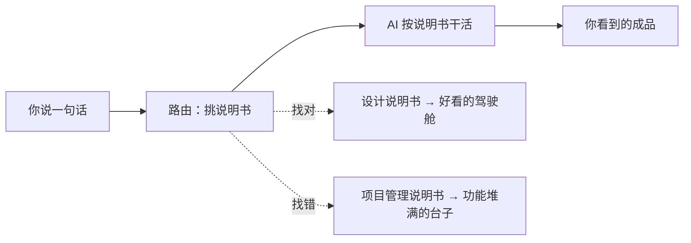
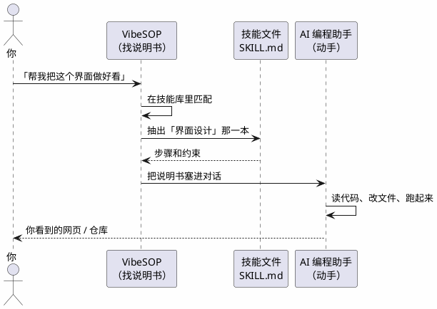
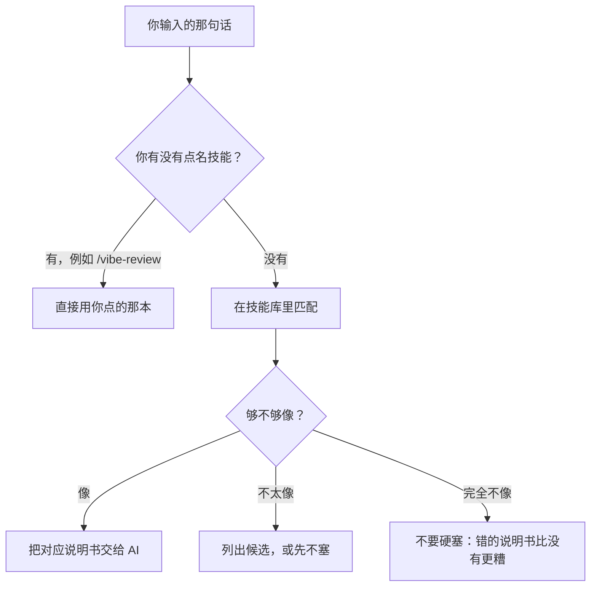
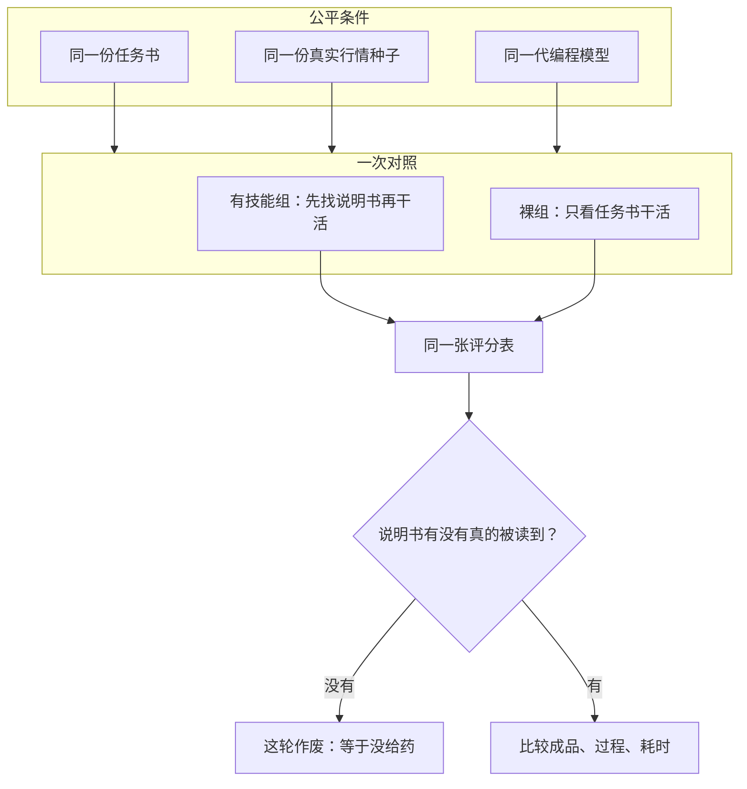
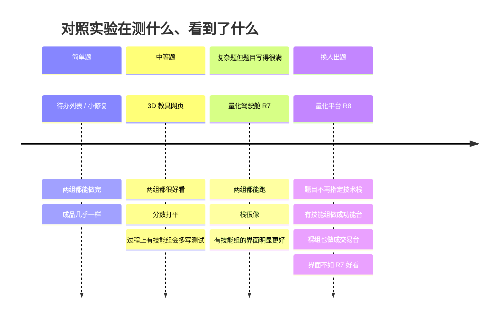
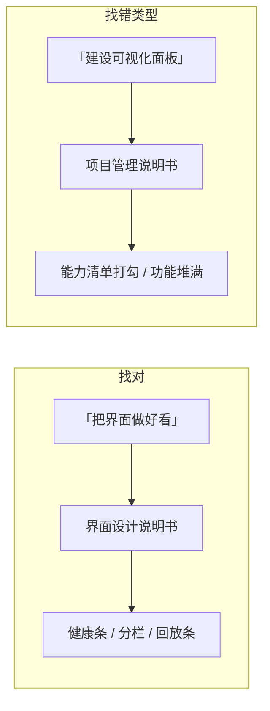
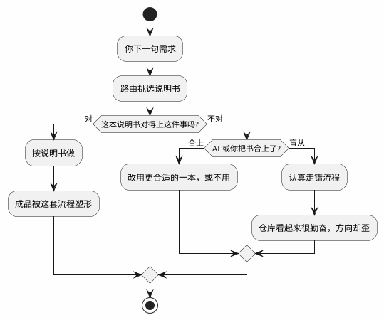
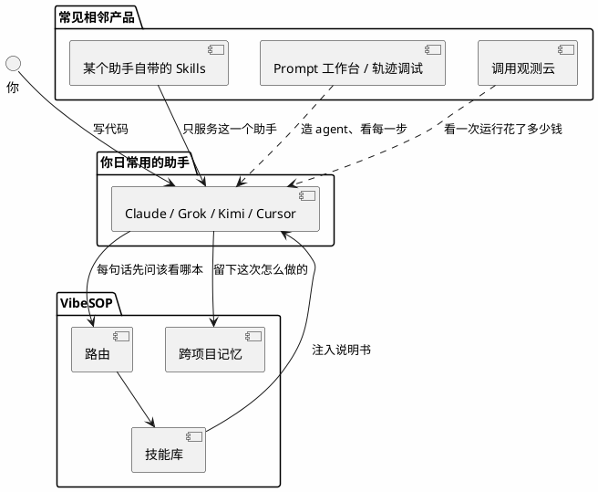
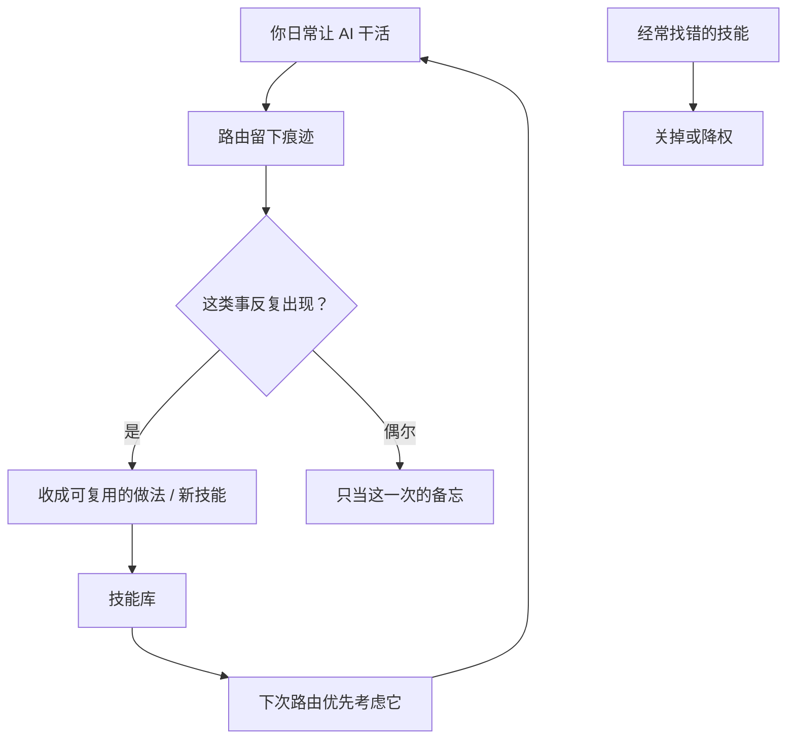

# 给 AI 找对说明书：技能路由是什么，我们怎么验证的，你怎么用

> 面向第一次听说 VibeSOP 的人。技术实现细节见 [路由系统设计](architecture/routing-system.md)。  
> 本文取代早期「装了技能就一定更好」的说法。结论来自 2026-08 至 09 的对照实验（R1–R8），**不是统计证明，是我们敢公开讲的发现**。

---

## 先用一句话说完

大模型已经会写代码了。真正容易翻车的，不是它「不够聪明」，而是它**随手抓错了工作方法**。

技能，就是写给 AI 看的操作说明书。  
路由，就是在几十上百本说明书里，帮它抽出**这一次该看的那一本**。

我们做过对照：同一道题，一组 AI 拿到对的说明书，一组不拿，一组拿到错的说明书。结果很朴素——

**说明书这条路走得通；但「找没找对」对后面做成什么样，影响非常大。** 找对了，界面可以像交易台；找错了，同样会写代码，却堆成功能墙。



---

## 1. 技能不是魔法，是说明书

你请人修水管，不会把《公司法》塞给他。你会把「先关总阀、再拆弯头」那一页递过去。

给 AI 的技能就是这一页：

- 什么时候用
- 先做什么、后做什么
- 哪些坑不要踩
- 做到什么算完

它不是模型本身，也不是又一个聊天机器人。模型已经会干；技能管的是**这一次按哪套流程干**。

VibeSOP 不管替你敲键盘。真正读文件、写代码、跑测试的，还是 Claude Code、Grok、Kimi 这些 agent。VibeSOP 做的是：听你一句话 → 选出说明书 → 把说明书塞进 agent 的上下文。



---

## 2. 路由：图书管理员，不是更强的大脑

技能一多，问题就变了。不是「有没有说明书」，而是**会不会抽错**。

家里三本说明书，你记得住。装了 Superpowers、OMX、界面设计包之后，常常是几十上百本。人记不住，模型也会「感觉这题像调试」然后打开一本完全不对的。

路由要干的，就是图书管理员：

1. 你点名了（`/vibe-review`）→ 直接给那本，不猜。
2. 你没点名 → 看这句话更像哪一类工作。
3. 拿不准 → 宁可少给，也不要硬塞一本错的。



早期对外说法容易写成「理解意图、智能匹配、越用越聪明」。实验之后我们改口：**匹配值得做，但准不准是第一瓶颈。** 错配时，AI 会非常认真地走错流程。

---

## 3. 我们怎么验证：不拍 demo，做对照

「给 AI 装技能有用」是行业口头禅。我们想证明它，就用笨办法：

同一道题、同一份数据、同一类模型。  
一组**允许**找说明书并按说明书做（有技能组）。  
一组**禁止**读任何说明书（裸组）。

跑之前先写死：怎么打分、怎样算赢、什么情况算实验无效。跑完不允许因为结果难看再改规则。



中间还做了几件「防自己骗自己」的事：

- **确认药吃进去了**：日志里必须出现「调用了路由、读了说明书」。没读到，这轮作废。
- **隐藏验收**：有的检查项两组都看不见，避免为了过测试而应试。
- **换题目的人**：发现「出题人已经按技能口味出题」会污染结果后，把任务书交给另一个模型，只给用户原话。

实验不是实验室里的万人抽样。每一轮都是小样本演示。我们公开的是**方向**，不是「平均提升百分之几」。

---

## 4. 中间发生了什么：从打平，到看清瓶颈

按时间顺序，人话版：



### 4.1 题目太简单，或写得太满：看不出差别

修一个待办、做一个能点的网页，今天的强模型自己就会。再塞说明书，像给会骑车的人发《如何上车》。两组都交卷，分数打平。

题目如果写成「必须有这些接口、用这些数据、Docker 一键起」，路已经被铺好。有没有说明书，两边都会走到差不多的技术栈。**这不是技能没用，是对照测错了变量。**

### 4.2 说明书一旦对上「那一面」，成品会变

量化驾驶舱那一轮，有技能组专门问了「请设计 A 股研究员驾驶舱」。路由把**界面设计**那本说明书抽了出来。再加上「单页、健康条在上、K 线在中、回放在下」这种选法，排版就是你觉得好看的那一版。

裸组同样能做深色图表，但没有这本界面说明书，骨架不会自动长成同一套。

### 4.3 找错说明书，比没找更伤

下一轮把出题权交给另一个模型，任务书变成「请扩建这些能力」，不再点名技术细节。有技能组去找说明书时：

- 整句话先被分到「深度治理现有仓库」——那是给已经存在的大项目做体检的，**不该用在从零盖房子**。他们拒绝了，这步是否决，不是失败。
- 后面几乎都进了「五步研发流程」（研究、构思、计划、执行、复盘）。项目管理说明书会逼你把能力做全，但不会教你怎么排版。于是台子功能很全，看起来却像功能墙。

同一类模型、同类量化任务：



所以：**路由这条路可以走；准不准，会直接决定后面工程长成什么样。** 不准的时候，模型会认真执行一本错书。

还有一层：找错之后，**会不会把书合上**。找错并拒绝，工程还能救；找错还严格执行，才会把仓库带进沟里。



---

## 5. 这对 VibeSOP 意味着什么

VibeSOP 不是「让模型更聪明」，也不是又一个 Agent 工作台。它是给编程助手用的**技能操作系统**：安装、查找、注入、记住、淘汰说明书。

### 5.1 特色（我们真正卖的）

| 别人常做的 | 我们做的 |
|---|---|
| 在一个产品里内置技能（只服务自己） | **装一次，Claude / Grok / Kimi / Cursor 等都能用同一套技能** |
| 默认你记得命令 | **你说人话，它负责找该看的说明书** |
| 只关心这一次对话 | **把做过的题留下痕迹，下次类似问题可以回想** |
| 技能只增不减 | **技能有生命周期：能装、能关、能评估、能淘汰** |

一句话：**别人让你看清 agent 这一步在干什么；我们让 agent 找到对的做法，并跨工具记住。**

### 5.2 优势（实验之后仍然成立的）

1. **跨助手复用。** 技能文件是一份 Markdown，不是绑死在某一个聊天框里的插件。
2. **路由是显式的。** 不是模型「感觉该用 TDD」，而是先选出技能再注入。选错了，日志里看得见，可以改。
3. **发现过自己的丑。** 对照里抓到过：不该注入的闲聊被当成开发任务；弱模型轮「赢了」却根本没读技能。这些写进产品，比宣传「智能匹配」更值钱。
4. **经验可以沉淀。** 路由记录、本能（反复出现的有效做法）、跨项目回想——说明书库不是死的。

### 5.3 和同类的差别



- **助手自带 Skills**：好用，但换一个助手就要重装一套。VibeSOP 的目标是技能跟你走，不跟某一个窗口走。
- **Agent 工作台**：帮你造 agent、看调用链。我们不造 agent，我们给已有 agent 发对的说明书。
- **观测平台**：帮你看延迟和费用。我们关心的是「这次有没有找对技能、下次能不能复用」。

### 5.4 我们不再对外这么说

- 「装了技能，成品一定更好」——简单题、写满的题，强模型自己就会，看不出差别。
- 「智能理解意图就够了」——准不准比「有没有理解模块」更致命。
- 「路由失败也算过程赢」——没读到说明书的对照，不能用来宣传技能有效。

---

## 6. 你怎么快速用上

最短路径：

```bash
# 1. 安装
pipx install vibesop    # 或: uv tool install vibesop

# 2. 向导：选你的助手、装推荐技能包
vibe quickstart

# 3. 接到你正在用的助手（择一）
vibe build grok-build --output ~/.grok
# vibe build claude-code --output ~/.claude

# 4. 看环境是否健康
vibe doctor

# 5. 重启助手，然后正常说话即可
# 想手动试路由：
vibe route "帮我把这个页面做好看一点"
vibe skills list
```

日常不用记命令。装好 hook 之后，你对 Grok / Claude 说的每一句，会先经过路由。点名也可以：`/vibe-help` 看有哪些入口。


没有 API Key 也能用关键词/场景匹配做演示。要用「更懂语义」的匹配，再配模型密钥（见仓库 README 的 LLM 配置一节）。

---

## 7. 怎么进化、怎么优化

路由不是一次装好就结束。实验说明：库越大，找对越难，也越值得做。

### 7.1 你怎么让它变准

- **点名。** 你确定要用审查、TDD、调试时，直接说出来或用对应斜杠命令。点名是最高优先级，不经过猜测。
- **纠正。** 它找错了，告诉它「这次不该用那本，该用界面设计」。记录下来，下次同类话少走弯路。
- **少而精。** 先装你真会用的包。技能不是越多越好——书太多，管理员更容易抽错。
- **看日志。** 一次对话结束后，可以查这次匹配了什么。有技能组对照里，我们就是靠「有没有读到 SKILL.md」判断实验有没有效。

### 7.2 产品怎么自己长

VibeSOP 把每次路由留下痕迹：后来相似的问题可以回想上次怎么修的。反复有效的做法，可以升成更正式的技能。没用的、老误伤的，应该关掉或淘汰。



优化时优先做三件事（比再写一百本说明书更值）：

1. **把不该出手的查询拦住**——闲聊、翻译、纯问答不要塞开发流程。
2. **把 vis 类问题打到 vis 类说明书**——「做好看」不要打成「项目管理」。
3. **让 AI 有权合上错书**——说明书是建议，不是圣旨。

---

## 8. 诚实的边界

- 对照是小样本、单次运行，不能当论文里的平均提升。
- 强模型 + 写满的题目，有没有技能，成品经常打平。技能的价值出现在：**方法有讲究、题目有留白、而且找对了那一类说明书**。
- 我们验证过 Claude / Grok 上的自动注入；其它助手目前主要是生成配置，完整程度不一样。
- 本文是给人口述的发现。实现层的分层、置信度、级联，仍以 [routing-system.md](architecture/routing-system.md) 为准。

如果你只记住三句：

1. 技能是说明书，路由是图书管理员。  
2. 管理员抽错书，工匠会把房子盖歪。  
3. VibeSOP 要做的，是让说明书跟你走、抽得更准、错了能改、用过能记住。

---

## 相关阅读

- 上手：[用户 Quick Start](QUICKSTART_USERS.md) · [cold-start-guide.md](cold-start-guide.md)
- 技能长什么样：[SKILLS_GUIDE.md](SKILLS_GUIDE.md)
- 和助手怎么接：[Hook 集成](user/HOOK_INTEGRATION.md)
- 实验原始记录：仓库 `.omx/artifacts/ab-validation-wechat-deepdive.md`（R1–R6）、`ab-quant-r7-report.md`、`ab-quant-r8-prereg.md`
