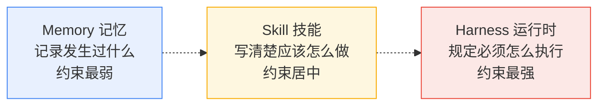
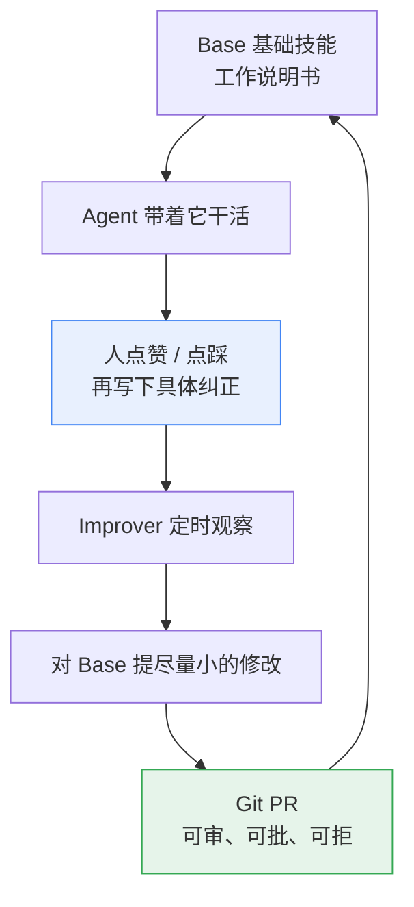
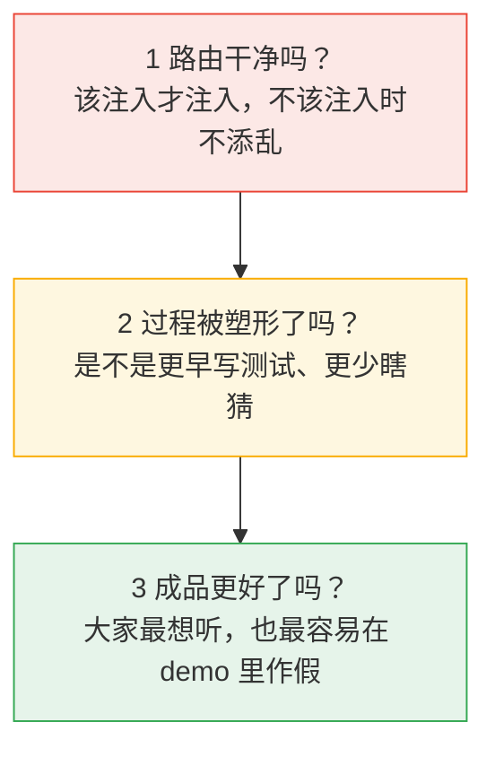
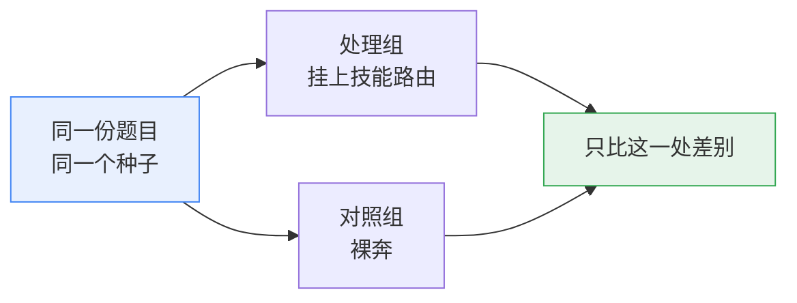
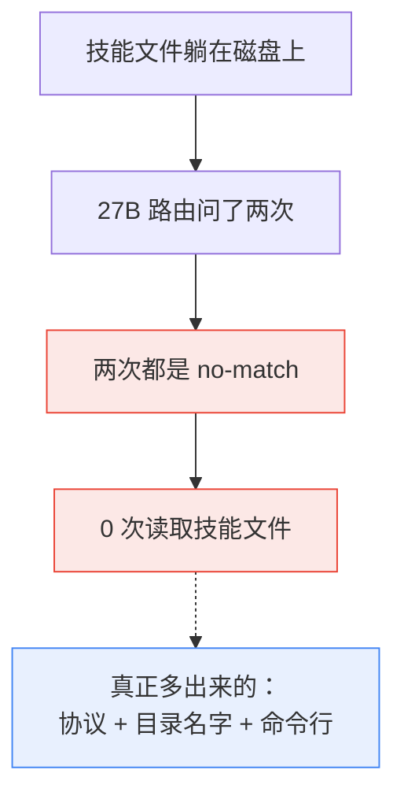
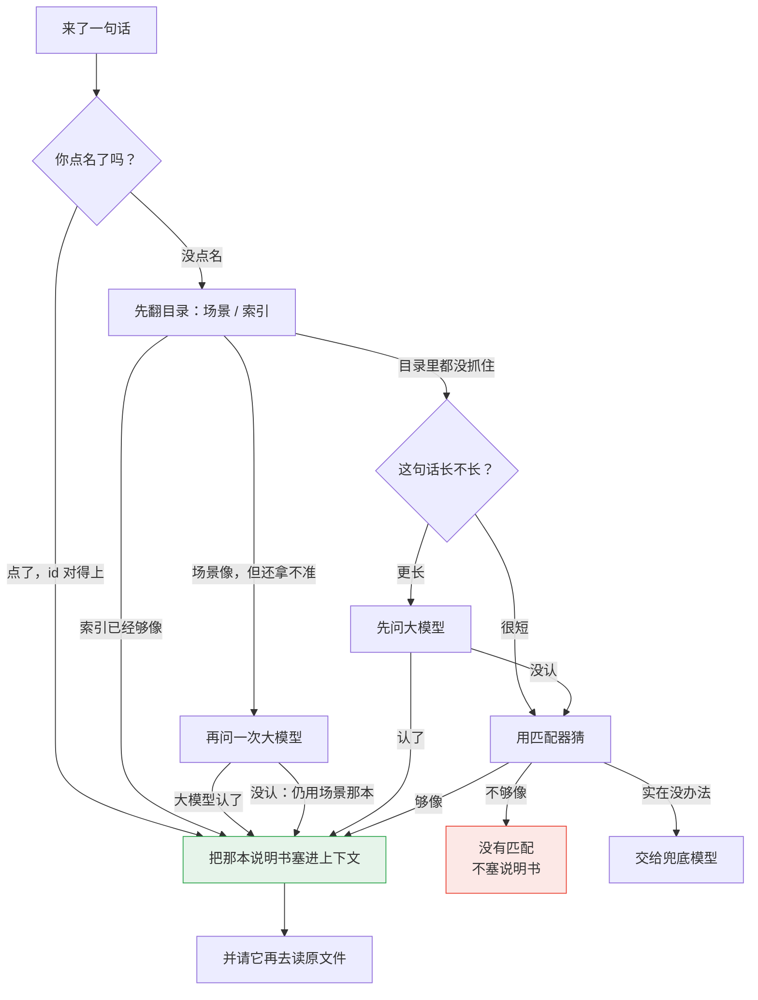

# AI 助手为什么总在同一个坑里跌倒？——从 Warp 的自进化 Skill，聊到我们的技能路由

> 你纠正过 AI 一次，它当时改了，下次照犯。问题多半不在模型笨，而在**你的纠正没地方存**。
>
> 全文不需要前置知识。能对外讲的对照来自 2026-08 至 09 的 R1–R6：小样本、单次运行，**不是统计证明**。R7 只有当时的工作记录，没有写成可公开复核的报告；R8 尚未跑完。读过 Anthropic / Warp 那篇的人可以对上号。本文写的是我们怎么想、怎么测、踩过什么坑，不是产品说明书。

## 1. 先对齐三个词：Agent、Skill、Memory

**Agent（智能体）**：不只是聊天，而是能自己动手干活的 AI——读代码、跑命令、改文件、提交审核。

**Skill（技能）**：把「某类活儿该怎么做」写成一份文件，放在工作目录里。AI 接到相关任务时自己去翻这份文件，照着做。Warp 创始人 Zach Lloyd 的定义：

> File-based skills are a way of encoding knowledge for agents without putting that knowledge directly in the prompt, as something the agent can simply look up in the course of doing its job.
> （文件形式的技能，是把知识编码给 AI、但不直接塞进提示词的一种方式——AI 干活的过程中自己去查。）

好处有两层：提示词不必越写越长；文件可以像代码一样被版本管理、被审查、被迭代。

**Memory（记忆）**：记下「发生过什么」——这个仓库上次哪里出过 bug、用户偏好什么格式。它由 AI 推理时自动写入，永远在变。

一句话分清：**Memory 记录发生过什么，Skill 写的是应该怎么做。** 很多系统把两者搅在一起，把流水账全塞进记忆，AI 越记越臃肿、越记越不知道该听哪条。

下面这张图是**本文的分析框架**，用来标约束从软到硬怎么升，**不是** Warp 原文里的结构：

- **Memory**：最软。可能被参考，也可能被忽略。
- **Skill**：居中。写成指令，靠模型自觉执行。说明书是建议，不是圣旨。
- **Harness**：最硬。流程写成代码，AI 没有跳过的权限。

Warp 和我们都同意：不要让 Agent 去改承载自己运行的代码。那一层必须由人写。

## 2. Warp 已经跑通的路：纠正要有去处

Warp 是一家做 AI 终端的公司。他们内部的代码评审 Agent，第一版提示词只能做对八成，剩下两成持续制造噪音。团队改提示词、补 AGENTS.md，都有改善，但没根治。更本质的问题是：

> **人对 AI 输出的纠正，在会话结束的那一刻就消失了。**

你告诉它「你建议重命名的那个变量，其实符合这个代码库的命名惯例」，它这次改了。下次开新会话，这段纠正不复存在，它接着犯。根因不在提示词写得不好，而在**反馈没有去向**。

他们的解法是两个 skill：Base 承载工作指令；Improver 当定时观察者，对比 Agent 当时的建议和人的回应，对 Base 提出尽量小的修改，走 GitHub 的 PR。循环长这样：

规格、评审、分诊三类 Agent，每类自带这样一个循环。入口是模型从 name + description 列表里自选——在他们那个技能数量和模型强度下，这条路是通的，不是缺陷。

循环能成立，靠三件事：技能是普通文件，人能逐行看 AI 改了什么；反馈越具体越值钱；Improver 只改 skill 文件，不碰 Harness。

这对我们是对照，不是前提。Warp 已经在自己的仓库和生产里跑。我们缺的那一块，后面会老实说。

## 3. 我们真正要回答的问题

读完 Warp，很容易把下一问写成「我们也做一套自进化」。我们没这么写。先问一个更冷的问题：

> **给 AI 一堆技能文件，它到底有没有在该用的时候翻到该翻的那一份？翻到了，成品会不会更好？**

这个问题可以拆成三层，而且必须按顺序问——前一层不成立，后一层的实验就是假的：

1. **路由层干净吗？** 该注入时注入，不该注入时不添乱。
2. **过程有没有被塑形？** 哪怕成品打分一样，它是不是更早写测试、更少瞎猜？
3. **成品有没有更好？** 这是大家最想听的，也是最容易在 demo 里作假的。

设计目标因此不是「多写一百本说明书」，而是三句约束：

- **找不到是正常输出。** 硬塞一本错的，比没有更糟——模型会非常认真地走错流程。
- **没找着，就不把技能正文塞进上下文。** 顶多留一句「没有匹配」。
- **反复被违反又验证关键的规则，归宿是人写成代码（Harness），不进自动循环。** 这一点和 Warp 相同。

至于「找错可能比没找更伤」：这是上面第一条推出来的**产品约束**，不是某一轮对照的统计结论。我们后面会写到，弱模型那一轮其实是「没找着」，不能拿来证明「找错」。

## 4. 怎么测：预注册，比事后解释更重要

技能这种东西极难 A/B。模型有随机性，题目有难度分布，评分有主观性。更容易的路径是挑一个漂亮 demo 发视频。我们选择做双容器对照，是因为一个更冷的事实：**如果技能的价值只能在精心剪过的 demo 里显形，那它就不是产品价值，是剪辑价值。**

方法上逐渐钉死三件事：

**单变量。** 每轮两个容器、同一镜像、同一份任务书、同一个种子。一边挂上技能路由，一边裸奔。任务书哈希逐字校验，防止「题目其实不一样」。

**预注册。** 从第 5 轮起，按下运行键之前把预测、评分表、判读规则写死。包括反向假设（技能注入是净伤害）也一并写上。人会向着希望解释数据，预注册文档不会。

**有效性三验。** A/B 最阴的坑是处理组没吃到处理。每轮结束要核对：hook 是否真触发过、对话里是否真读了技能文件、路由用的是不是设计里的那个模型。第三条后来抓住一次静默失败——路由工厂没把弱模型名透传下去，52 毫秒内 404，系统无声降级成「没有大模型的路由」。表面一切正常，公平性已经没了。

还有一条方法论上的教训：墙钟时间不能当判据。四轮耗时比从 1.8 倍跳到反向 0.82 倍，哪个方向都能被噪声支持。我们正式撤回过「技能有可见时间成本」这种话。

## 5. 六轮里实际看见了什么

| 轮 | 题目 | 结果 | 现在敢讲的 |
|---|---|---|---|
| R1 | 简单待办 CLI | 产物平手（验收 12/12 等价） | 题目太简单，测不出技能 |
| R2 | 同题，技能包×3 | 仍平手 | 多装几本说明书，改变不了简单题 |
| R3 | 调试（种子里埋 4 个真 bug，验收测试双方都看不见） | 产物平手；过程有差异 | 技能组会先建反馈环、补测试；对照组只修不加测 |
| R4 | 方法论本身 | 五路外部评审否决了原 Web 方案 | 工具变量不可控的基准，不能拿来证明技能 |
| R5 | 喷气发动机 3D 教学页（规格留白，本应是技能占优的题） | 强模型双臂 23.5 / 23.5 | 好 harness + 强模型 + 方法论技能 ≈ 冗余 |
| R6 | 同题，编码和路由都换成 27B | 完成度差距极大，但机制意外 | 见下一节，这是全文最重要的观察 |

R3 和 R5 合在一起，我们称之为 **harness 假说**：

> 技能是提示词层的规范执行；好的 agent 运行时是结构层的规范执行。两者并存时，结构层赢。

强模型在一个守规矩的运行时里，本来就会写测试、会把教学页做完。技能只是把它已经会做的事再说一遍。行为被塑形了（主动补测、物理自测跑五遍），成品分数没被拉开。

R5 我们特意选了「技能应该赢」的题：规格留白、要教学法、要一点物理。强模型两边都交出十个文件量级的完整应用，五维评分一毫不含糊地打平。这不是「技能没用」的定理，是**这道题、这个模型、这个运行时**下，技能是冗余的。

价值矩阵里，测过的格子是这样的：

| 场景 | 我们看见的 |
|---|---|
| 差路由 + 技能 | **主动伤害**（日常闲聊/翻译类查询 7 条里 5 条被误注入） |
| 好运行时 + 强模型 + 方法论技能 | **冗余**（四连平手） |
| 好运行时 + 弱模型 | **问题问错了**——见第 6 节 |
| 信息型技能（组织 runbook、冷门坑、项目私有约束） | **唯一还没测的格子** |

## 6. 弱模型那一轮：赢的一侧根本没读文件

R6 把编码模型和路由模型都换成同一个 27B，保证公平。表面上处理组碾压：十个文件、2503 行、25 项物理自验全过，22/25 分（强模型轮是 23.5）；对照组两次尝试零产物——一次 88 分钟只做了 2 次工具调用，一次 43 分钟零工具调用，都死在思考循环里。

机制提取之后，故事翻了面。

处理组的路由被调用了两次（一次是 hook 带上全文，一次是模型自己拿摘要再问）——**两次都是 no-match**。全程 **0 次**读取技能文件。强模型做同一道题时，读了 80 次。模型自己的推理原话大意是：路由没匹配到技能，任务书本身就是完整需求，直接实现。

也就是说，处理组多出来的不是技能内容，而是环境里的静态脚手架：路由协议、技能目录的名字、命令行还在。技能正文从未进入上下文。对照组两次尝试之间，工具调用数还从 2 变 0——n=1 的弱模型方差本身就很大。脚手架和运气搅在一起，分不开。

所以 R6 不能用来宣传「技能对弱模型有效」，也不能写成「所以我们发明了分层管线」。它只说明一件更窄的事：

> **那一轮里，知识在文件里躺着，模型没去查。**  
> 「技能能不能抬升弱模型」在路由质量解决之前，是不可检验的问题。

这一轮还有协议偏离，必须写在结论旁边：思考链截断上限、`--reasoning-effort` 是跑起来之后才改的；处理组最后一次保留，依赖对「中途故障作废」规则的事后豁免——交付文件在中止前已经写完，故障只吞掉了收尾说明。预注册写死的是作废重跑。我们选择保留并评分，这是偏离。敏感性很清楚：若严格执行那条规则，处理组三次尝试全部作废，完成度对比本身不成立。

没读到技能文件的对照，一律不能用来宣传技能有效。

## 7. 题目写满会打平；写这篇文章时路由仍会抽错

R1、R2 是简单题打平。R7 换成「从真实行情做量化驾驶舱」——题目写得很满，接口和数据几乎铺好。当时的工作记录：两组都能跑，成品打分评委对打、不能写成一次结算胜利。没有公开报告，这里只把方向记下来：**待办、能点的网页、接口和数据都写死的题，今天的强模型自己就会。** 有没有说明书，两边都能交卷。这不是技能没用，是对照测错了变量。

R8 还在跑，预注册也还没公开。这里不结算。已经看到的污染值得记一笔：宿主 hook 曾把「只负责出题」的请求编成多意图执行计划，上下文里却没有真实的技能文件。差路由会在实验开始之前就把题目弄脏。

回到「找错」。我们在路由层之外做过一次探针：7 条不该注入技能的日常查询（聊天、翻译、纯问答），**5 条被误注入**，置信度还常常钉在 82%——非结构化回复被写成了固定数字。修完后同 7 条探针 0 误报。修的过程本身又过了一轮对抗复审。

更刺的注脚有两条。写六轮综述的当天，一句「写公众号总结」被编排成四角色工程小队。写这篇文章的会话里，一句很普通的工程请求，仍被匹配到一个**磁盘上根本不存在的技能**，置信度还是 82%。同一类幻影。差路由之下，技能编排是负资产——这句话我们是用自己的系统反复验证的。

所以设计上才把「找不到」当成一等公民：宁可不注入，也不要一本错书被严格执行。这是约束，等 R8 或专门的「找错」实验跑完，再决定能不能升级成对照结论。

## 8. 中间那些不浪漫的坑

给真想做类似实验的人，不给演示用。

**弱模型三连击。** 思考链超过单次输出上限，推理服务器把截断当错误，整轮 rc=1、零产物——上限从 8192 提到 32768，两臂一起改。弱模型会在单轮里无限思考：我们观测过 45 分钟、11006 个思考事件、零次工具调用。runner 加上限制思考的参数后，小任务验证从 11006 降到 15。最阴的是第三条：路由模型名没透传到工厂，静默 404，看起来像「没匹配」，其实是「根本没问到那个模型」。没有有效性三验，我们会发布一个方向完全错误的结论。

**陈旧状态比 bug 更危险。** 上一轮残留的元数据会让监控误判「已经跑完」。它不报错，只让观测说谎。每轮清空、改看进程和会话事件。

**一次实验推翻一次设计。** 原计划用网页当基准，五路外部评审 5/5 否决（工具变量不可控），改成容器内任务书。评审后来固定成双外部模型交叉：一路抓数据/结构，一路抓产品/认知，单路漏掉的必改项经常被另一路抓住。

这些坑改变了我们对「验证」的定义。人能审出一句话写得对不对，审不出这句话会不会让路由在 34 条金标上静默翻盘。所以技能文件一改，指纹必须重算。那是工程门，不是效果分数。当前金标 30/34 通过，这个 88% 是此刻的得分，不是「低于 88% 就禁止合并」的数字门槛。评测集分数、徽章、覆盖率，不要画成同一张闸：徽章从不阻断激活；覆盖率测的是 Python 代码，不是技能有没有用。

## 9. 因此路由才长成现在这样

实验之后，路由的设计目标变得很具体：**先保证「找对 / 找空」是可信的，再谈注入效果。**

它不是一次算相似度。先看图，再看字：

用话说：你点名了（动词点名要和技能 id 完全一致，例如 `use builtin/systematic-debugging`；斜杠 `/systematic-debugging` 也可以）→ 直接给那本。没点名 → 先走早层（很短的查询走场景和索引，更长的查询早层主要走索引）。场景命中不会直接交卷，会强制再问一次大模型。早层什么都没抓住时：很短的查询会跳过大模型、直接进匹配器；更长的查询才先问大模型，问不出再用匹配器兜底。终端是「没有匹配」或「交给兜底模型」。未登记的斜杠命令是未知命令，不会被当成点名成功。

三件事是故意的：

1. 找不到就停，不要猜一本塞进去。
2. 没有匹配，就不注入技能正文。
3. 注入的是文件正文，不是摘要；超长会截断，并要求模型再去读原文件。

学习环也故意焊开。工具序列反复出现、次数和成功率过线，只是**候选**，不会自动抬路由分；要变成可复用的本能，还得再走一道命令，默认门槛比候选门更高。会话里反复出现的 query→技能（habit）是另一条抬分的路，和这条候选门不是一回事。

聚类发现的技能苗子，稳定的、不稳定的、反复 miss 的都可以进池给人看；写成草稿是另一步，默认不会自动变成会注入的技能文件。

Warp 那种「Improver 改已经存在的技能、走 PR」我们没有。晋升只做新增，旧技能怎么改，目前靠人。这是缺口，不是规划。

日常比再写一百本说明书更值的，仍是三件土办法：点名；找错了就说「这次不该用那本」；先装真会用的包。闲聊、翻译、纯问答，不该塞开发流程——探针已经证明，塞了就是误伤。

## 10. 我们不声称什么

- 不让 Agent 改运行时。
- 不把「不够像」硬塞成命中。
- 不说聚类结果会自动变成技能文件。
- 不说「装了技能，成品一定更好」。强模型 + 写满的题目，经常打平。
- 不说没读到说明书的对照证明了技能有效。
- 不说徽章是上岗门。灯不是闸。
- 不说 Warp 缺了我们才能跑。他们已经在跑。
- 不把 R8 未完成的实验写成发现。

只记住三句：技能是说明书，路由是图书管理员。管理员抽错书，工匠会把房子盖歪。要做的是让说明书跟你走、抽得更准、错了由人改、用过能留痕——并且承认，**抽得准**这件事，我们是被实验逼着看清的，不是一开始就会。

## 相关阅读

- Anthropic 官方博客《How Warp builds self-improving agents on Claude》
  https://claude.com/blog/how-warp-builds-self-improving-agents-on-claude
- Anthropic Webinar，同题
  https://www.anthropic.com/webinars/how-warp-builds-self-improving-agents-on-claude
- LanLance 推文《读懂 Warp 的 Agent Skill 自进化机制》（本文 Warp 部分的主要转述来源）
  https://x.com/LanLance24/status/2094777203984896418
- 开源仓库（源码与实验记录）
  https://github.com/nehcuh/vibesop-py
- R1–R6 对照综述（设计目的、方法、坑、结论）
  https://github.com/nehcuh/vibesop-py/blob/main/.omx/artifacts/ab-validation-wechat-deepdive.md
- R6 弱模型对照（含协议偏离）
  https://github.com/nehcuh/vibesop-py/blob/main/.omx/artifacts/ab-jet-weak-report-r6.md
- 《路由系统设计》：阈值和索引闸门。讲控制流时以代码为准。
  https://github.com/nehcuh/vibesop-py/blob/main/docs/architecture/routing-system.md
- R7 只有当时的工作记录，没有公开报告；R8 尚未跑完，本文不引用未公开材料。
