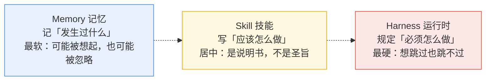
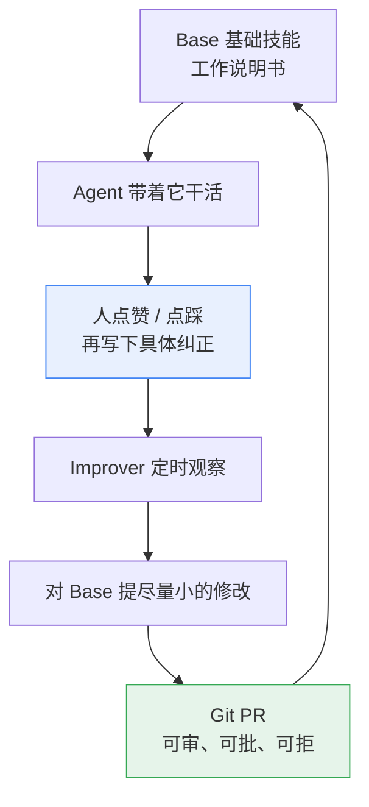
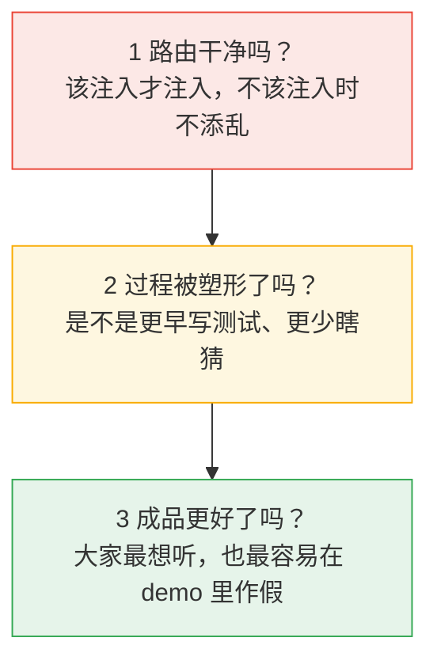
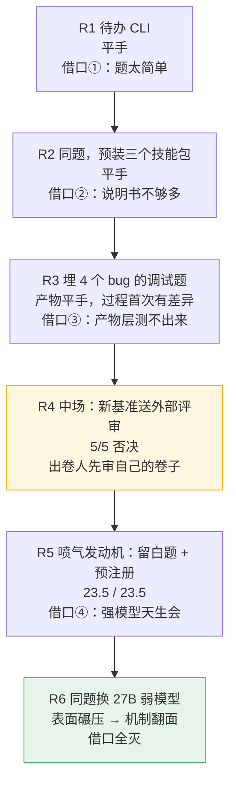
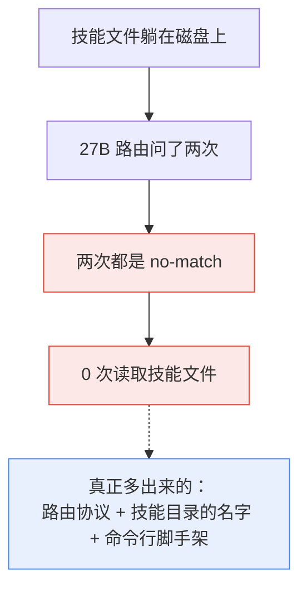
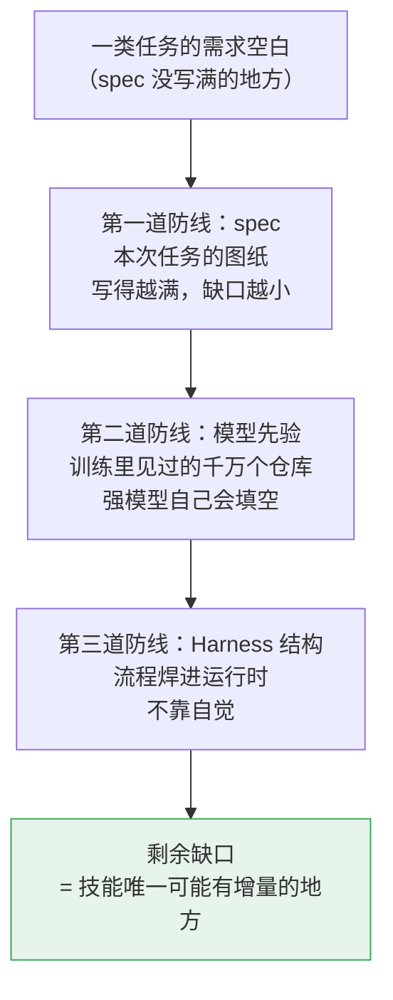
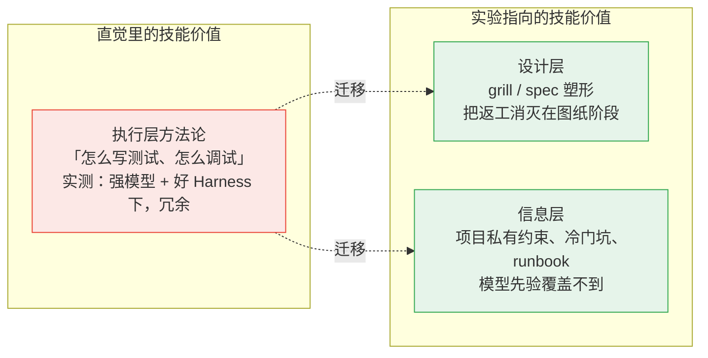
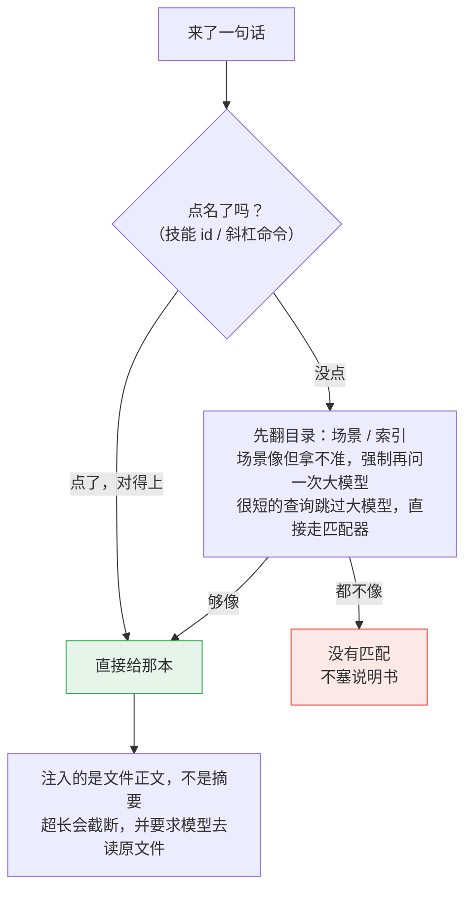

# AI 助手为什么总在同一个坑里跌倒？——Skill、Memory、Harness 一家后厨讲清楚，以及六轮实验把我们送到的那个反转

> 你纠正过 AI 一次，它当时改了，下次照犯。问题多半不在模型笨，而在**你的纠正没地方存**。
>
> 这篇文章分两层。前半篇不需要任何背景：用一家后厨的比喻，讲清楚 AI 干活时身边的三样东西——记忆（Memory）、技能（Skill）、流水线（Harness）。后半篇是我们自己的实验记录：2026 年 8 月底到 9 月初，六轮双容器对照实验，四次平手，一次表面碾压。复盘的时候，这些结果把我们逼到了一个当初没想到的地方：
>
> **当一份需求写得足够清楚——边界条件、输入输出、每一步要什么——今天的 LLM 加上好 Harness，完全可以在没有技能的情况下完成工作。技能真正的岗位，不在 AI 干活的手上，而在人写需求的笔下。技能不是执行的外挂，是 spec 的补充形态。**
>
> 先把丑话说在前面：小样本、单次运行，不是统计证明；R7 只有工作记录没有公开报告，R8 还没跑完。本文写的是我们怎么想、怎么测、被结果教育了什么，不是产品说明书。

## 1. 三个词，一家后厨

**Agent（智能体）**：不只是聊天，而是能自己动手干活的 AI——读代码、跑命令、改文件、提交给你审。把它想象成一位刚入职的主厨：你递进去一句话，他真的会端出一盘菜。

这位主厨上工那天，后厨里有三样东西在等着他。

**Memory（记忆）**：墙上那本交接便签。记的全是「发生过什么」——昨天的汤咸了，301 包间对花生过敏，周三的鱼提前腌。它由 AI 在干活时自己写自己读，永远在变，越记越厚——也可能记错、记重、记成流水账。

**Skill（技能）**：挂在墙上的一张张标准菜谱卡。写的是「应该怎么做」——宫保鸡丁：糖醋 1:1，滑油二十秒，起锅前撒花椒。和便签相反，它是**静止的文件**：可以像代码一样被版本管理、被人逐行审阅、改了又改。Warp 创始人 Zach Lloyd 的定义：

> File-based skills are a way of encoding knowledge for agents without putting that knowledge directly in the prompt, as something the agent can simply look up in the course of doing its job.
> （文件形式的技能，是把知识编码给 AI、但不直接塞进提示词的一种方式——AI 干活的过程中自己去查。）

**Harness（运行时，本义是马挽具、安全带）**：焊死在厨房结构里的规矩，规定「必须怎么做」。油锅超温自动断电；出餐口不放行，就没有一道菜能端出去；垃圾不过称重台进不了桶。主厨想跳过？物理上跳不过。它不是建议，是结构。

一张图标出三样东西的约束强度，从软到硬：

一句话分清：**Memory 记录发生过什么，Skill 写的是应该怎么做，Harness 规定的是必须怎么做。**很多系统把三者搅在一起，把流水账全塞进记忆，结果 AI 越记越臃肿、越记越不知道该听哪条。

后厨里其实还有第四个角色，不在墙上、不在结构里，但在门口——**点菜的人**。他递进来的那张菜单写得有多清楚，决定了这顿饭做得有多顺。这张菜单，就是工程师嘴里的 **spec（需求）**。现在按下不表，第五节它是主角。

## 2. 社区已经跑通的一条路：纠正要有去处

Warp 是一家做 AI 终端的公司。他们内部的代码评审 Agent，第一版提示词只能做对八成，剩下两成持续制造噪音。改提示词、补 AGENTS.md，都有改善，但没根治。更本质的问题是：

> **人对 AI 输出的纠正，在会话结束的那一刻就消失了。**

你告诉它「你建议重命名的那个变量，其实符合这个代码库的命名惯例」，它这次改了。下次开新会话，这段纠正不复存在，它接着犯。根因不在提示词，而在**反馈没有去向**。

他们的解法是两个技能：Base 承载工作指令；Improver 当定时观察者，对比 Agent 当时的建议和人的回应，对 Base 提出尽量小的修改，走 GitHub 的 PR。

用后厨的话说：Base 是墙上的菜谱卡，Improver 是每周翻便签本的主厨长——他把「这道菜客人嫌咸」的便签，变成菜谱卡上「盐减一克」的一行小字，而且改了哪行、谁批的，全部留痕。规格、评审、分诊三类 Agent，每类自带这样一个循环。

**这个循环的本质，是一台把「单次纠正」晋升为「可复用说明书」的机器。**记住这句话，第五节要回来。

循环能成立，靠三件事：技能是普通文件，人能逐行看 AI 改了什么；反馈越具体越值钱；Improver 只改技能文件，不碰 Harness。Warp 和我们都同意最后一条：**不要让 Agent 去改承载自己运行的代码**，那一层必须由人写。

这对我们是对照，不是前提。Warp 已经在自己的仓库和生产里跑；我们缺的那一块，后面老实说。

## 3. 我们决定先问一个冷问题

读完 Warp，顺理成章的下一问是「我们也做一套自进化」。我们没这么写。先问了一个更冷的：

> **给 AI 一堆技能文件，它到底有没有在该用的时候翻到该翻的那一份？翻到了，成品会不会更好？**

这个问题必须拆成三层、按顺序问——前一层不成立，后一层的实验就是假的：

为什么大多数团队不测？因为技能极难 A/B：模型有随机性、题目有难度分布、评分带主观性。更容易的路是挑一个漂亮 demo 发视频。我们偏要做对照，是因为一个更冷的事实：**如果技能的价值只能在精心剪过的 demo 里显形，那它就不是产品价值，是剪辑价值。**

我们的做法，与其说是新药双盲试验，不如说是一场较真的考试。两个容器是两个考生，规则三条：

**同一间考场。**同一镜像、同一份任务书、同一个随机种子——任务书哈希逐字校验，防止有人质疑「题都不一样，比什么比」。处理组带小抄（技能路由），对照组裸考；每轮只许有这一处差别。

**开考前封卷。**从第 5 轮起上预注册：把预测（「处理组得分高于对照组 ≥3 分」）、评分表（5 维 × 5 分，判分标准逐字固定）、判读规则在按下运行键之前全部封存，连反向假设（技能注入是净伤害）也一并写上。这份文件拦的不是对手，是我们自己——人会向着希望解释数据，封存的文件不会。

**考完验药。**A/B 最阴的死法，是处理组根本没吃到处理：考完六小时，才发现小抄压根没发到手。所以每轮结束核对三件事——hook 真触发过吗、对话里真读过技能文件吗、路由用的真是设计里那个模型吗。第三条后来真抓住了黄雀，救了我们一次（第 8 节）。

至于「发小抄的监考老师」（路由）自己，也有三句纪律，全部来自学费：

- **找不到是正常输出。**硬塞一本错的，比没有更糟——模型会非常认真地照着错书把房子盖歪。
- **没找着，就不把技能正文塞进上下文。**顶多留一句「没有匹配」。
- **反复被违反又验证关键的规则，归宿是人写成代码（Harness），不进自动循环。**这一点和 Warp 相同。

## 4. 六轮实验：一场「借口排雷记」

技术报告会把这个章节写成六张表。我们更想按它实际发生的样子讲：**每一轮结局出来，我们都会顺手给「技能为什么没显灵」找一个借口；下一轮，就专门冲着这个借口去。**跟着这条线走，就不会迷路。

出题之前，先交代我们的三条选题直觉——它们就是后面要被逐个教育的对象：

1. **题要给技能留空间。**题目写得太满，说明书没有插手的缝隙；
2. **技能包里得有对得上的卡。**考调试题，包里就得有方法论技能；
3. **模型得「需要」说明书。**强模型见多识广，弱模型才像需要手册的实习生。

整段旅程一眼看：

**R1，开胃菜。**我们选了最标准的「AI 会做的题」：一个待办 CLI。选它不是为了证明技能有用，恰恰相反——它是一道**阴性对照**：干净到几乎不该有差异；如果这种题上技能都能拉开分，我们反而要怀疑评分出了问题。结果 12/12 全对、69 秒对 39 秒，两份产物几乎逐字等价。

借口①随即上线，而且听上去无比合理：「题太简单，强模型裸考都满分，说明书当然没用武之地。」

**R2，把说明书管够。**同一道题，预装三个社区技能包（superpowers、omx、mattpocock）再考一次——上百张菜谱卡挂满墙。结果 12/12，还是平手，连耗时方向都反了过来（第一轮处理组 69 秒对 39 秒，这轮 71 秒对 81 秒，处理组反而慢了）。

「说明书不够多」出局。「题太简单」还站着——那就换题。

**R3，换一道方法论该显灵的题：调试。**我们在代码种子里亲手埋进 4 个真 bug；验收测试捏在考官手里，跑完即删，防止「面向测试编程」。这次墙上正好有对得上的卡——systematic-debugging，它的核心主张就一句：「别瞎猜，先建反馈环。」

结果：两边都修完了，16/16，连「金额计算要用 Decimal」这种岔路口都选了同一条。但**过程录像里第一次出现了真差异**：技能组先建反馈环、列出 5 个根因假设、修完主动补了 3 条失败测试；对照组修完拍拍手就走。像两个都考满分的学生——一个先打草稿再誊写，一个提笔就写。卷面一样，习惯不同。

借口③跟上：「行为变了，产物没变——也许产物层根本测不出技能。」

**R4，中场休息：出卷人先审自己的卷子。**我们想换更硬的公开基准，方案先送五路外部模型评审——5/5 否决，理由：工具变量不可控。这次「失败」换来两条铁规矩：基准必须锁在容器里；评审固定双外部模型交叉，一路抓数据/结构，一路抓产品/认知——单路漏掉的必改项，经常被另一路抓住。

**R5，下重注。**用户点名的题：喷气发动机 3D 教学页。按三条选题直觉逐条检查——规格**故意留白**（任务书只给骨架，教学顺序、物理深度、交互形态全是空地）；需要**手感型知识**（怎么给中学生讲布雷顿循环、转速-温度-推力怎么耦合）；再配上**预注册**封卷。直觉说：这正是「老师傅手感」值钱的地方，技能应该赢。

结果：**23.5 / 23.5**。两边都交出十个文件量级的完整应用。处理组是认真读了说明书的——80 次读取技能文件，自写物理自测脚本跑了五遍；对照组的教学深度一点不虚，布雷顿循环的站位讲解、推力滞后注解一样不少。

我们盯着评分表愣了半天，写下了 **harness 假说**：

> 技能是提示词层的规范执行；好的 agent 运行时是结构层的规范执行。两者并存时，结构层赢。

强模型在守规矩的运行时里，本来就会写测试、会把教学页做完。技能只是把它已经会的事再说一遍——行为被塑形了，成品没被拉开。**80 次认真阅读，换不来 1 分。**

借口④顺势出场，也是最难驳的一个：「那是强模型见多识广。真正需要手册的是弱模型——像实习生。」

**R6，冲着借口④去。**编码模型换成 27B 本地弱模型（8bit，约 22 token/秒），路由模型同步换，保证公平。这一轮也让我们围观了弱模型的「实习日常」：隔窗看它单轮思考 45 分钟、11006 个思考事件、零次工具调用，最后撞上输出上限当场死亡——像看一个实习生盯着白板发呆到天黑。

表面结果一度让我们差点开香槟：处理组 10 文件、2503 行、25 项物理自验全过，22/25 分；对照组两次尝试**零产物**——一次 88 分钟只做了 2 次工具调用，一次 43 分钟零次，全死在思考循环里。

香槟收回冰箱。机制提取显示：

- 处理组的路由被调了两次（hook 一次、模型自己拿摘要再问一次）——**两次都是 no-match**；
- 全程 **0 次**读取技能文件。强模型做同一道题时，读了 80 次；
- 模型自己的推理原话：**「路由没有匹配到技能，任务书本身就是完整的需求文档——直接实现。」**

赢的不是技能内容，是环境里的静态脚手架（路由协议、技能目录的名字、命令行还在），再搭上 n=1 的运气——对照组自己两次尝试，工具调用数就从 2 掉到 0。两条纪律注脚必须跟结论放在一起：思考链上限和推理参数是跑起来之后才调的；处理组唯一有效的那次尝试，依赖对「中途故障作废重跑」规则的事后豁免（交付文件在中止前已写完，故障只吞掉了收尾说明，我们选择保留并评分）——若严格执行预注册规则，处理组三次尝试全部作废，完成度对比本身不成立。

所以 R6 不能用来宣传「技能对弱模型有效」。排雷排到最后，它只炸出一个更窄的真相：

> **那一轮里，知识在文件里躺着，模型没去查。「技能能不能抬升弱模型」在路由质量解决之前，是个不可检验的问题——弱模型路由本身就是第一瓶颈。**

### 考完对答案，发现监考老师自己有问题

A/B 的前提是路由公平——小抄只能发给该带的人。我们回头查监控：拿 7 条不该注入技能的日常查询（聊天、翻译、纯问答）实测，**5 条被塞了小抄**，置信度还恒定钉在 82%——像一个不管答什么都打 82 分的考官，非结构化回复被硬编码成了固定数字。四个根因、六次提交修完之后，同 7 条探针 0 误报，正例 3/3 保持命中，另建了 22 负 + 8 正的 held-out 回归常态化把关。

讽刺的注脚有两枚。写实验综述的当天，一句「写公众号总结」被自家系统编排成四角色工程小队；写这篇文章的会话里，一句很普通的工程请求，仍被匹配到一个**磁盘上根本不存在的技能**，置信度还是 82%。同一类幻影。**差路由之下，技能编排是负资产**——这句话我们是用自己的系统反复验证的。

顺带交代两轮没进上面的旅程图的：R7（从真实行情做量化驾驶舱——题目写得很满，接口和数据几乎铺好）只有工作记录：两组都能跑，评委对打，不能写成胜利，这里只记方向。R8 还在跑，不结算；已看到的污染值得记一笔——宿主 hook 曾把「只负责出题」的请求编成多意图执行计划：**差路由会在开考之前就把题目弄脏。**

雷排完，地图长这样：

| 场景 | 我们看见的 |
|---|---|
| 差路由 + 技能 | **主动伤害**（7 条日常查询误注入 5 条） |
| 好 Harness + 强模型 + 方法论技能 | **冗余**（四连平手） |
| 好 Harness + 弱模型 | **问题问错了**——瓶颈在路由，不在注入 |
| 信息型技能（组织 runbook、冷门坑、项目私有约束） | **唯一还没测的格子** |

但排雷真正的收获不在这张表里。四个借口排完，剩下的那个解释，比「技能没用」有趣得多——它把六轮平手拼成了一个形状。下一节讲这个形状。

## 5. 复盘：把六轮串起来的那根线

排完雷回头看，六轮数据各自为政：平手、平手、平手、否决、平手、翻面。复盘的时候，R6 里模型那句原话突然把所有轮次串成了一根线——

> 「任务书本身就是完整的需求文档，直接实现。」

回头看：

- **R1、R2、R3、R7**：题目写满——边界、接口、验收都清楚——有没有说明书，都打平；
- **R5**：题目故意留白，我们等着看「老师傅手感」——强模型自己把空白填了，教学法、物理深度都是它补的，还是平手；
- **R6**：题目留白加上弱模型，模型看着任务书说「这就是完整需求」，然后没碰任何技能文件，照样交付了接近强模型质量的产物（22 vs 23.5）；真正的对照组裸模型则直接无法启动。

于是我们得到了那句话，也是这篇文章的核心判断：

> **当项目开工时的需求足够明确——边界条件清晰、每一步要什么清楚——今天的 LLM + Harness 完全可以在没有技能的情况下完成工作。**

甚至比这更狠一步：R5 教我们的是，就算需求故意留白，强模型也会自己把空白填上。所以技能的生死线不在「需求明不明确」，而在——

> **需求的空白处，模型的先验和 Harness 的结构，盖不盖得住。**

### 老师傅的手感，是没有画出来的施工图

装修类比一下。全屋定制的施工图画到每一颗螺丝，任何一支靠谱的施工队都能装——不需要老师傅；图纸只有一张毛坯平面图，二十年的手感才决定成败。

老师傅的手感是什么？**是几千张没有画出来的施工图。**经验不是玄学，是需求的压缩包：把一类场景里所有该问的边界条件，压进肌肉记忆。当图纸能画满，手感就冗余；图纸画不满，手感才值钱。

技能和 spec 的关系也是同一个关系：

- **spec 是一次一图的施工图**——给一个任务，用完即弃；
- **skill 是一整套标准图集**——给一类任务，反复复用；
- 模型拿到图集，干的头一件事其实是把它「展开」成本次任务的施工图。

所以技能没有消失，它换了个岗位：**从工地退回了设计院**。写一本好技能，本质是把一类任务的需求空白提前填掉、压缩成可复用的文件——技能是需求设计的泛化形态，是 spec 的补充，不是执行层的 Buff。

### 一个必须诚实写下的注脚：评分表打平 ≠ 意图达成

R5 的平手还有一层容易被读漏的东西。两份产物在评分表上打平，但每一个留白处的决定——教学法怎么设计、物理建到多细、交互做到什么程度——**都是模型自己拍的板**。评分表量得出「做得多好」，量不出「做的是不是你要的那一个」。如果这些板本该由你来拍，「模型悄悄填空」就不是省事，是隐患：返工的定义，大多数时候不是「做错了」，而是「做的时候没人问过」。

这正是下一节的入口：既然执行层的空白强模型自己会填，那真正值得花力气的，是把空白**在设计阶段摊开来、由人来拍板**。

## 6. 把技能用在刀刃上：从 grill-me 说起

社区其实已经有人把技能搬进了设计院。mattpocock 的技能包（[mattpocock/skills](https://github.com/mattpocock/skills)）是 2026 年最出圈的技能合集，里面最有名的不是「怎么写代码」，而是一个叫 **grill-me** 的技能——description 只有一行：「一场不留情面的访谈，用来磨尖一个计划或设计。」

它做的事，展开来是这样：

- 你丢给它一个想法，它**一次只问一个问题**，把决策树一条分支一条分支走完，依赖逐个解掉；
- 每个问题都附上它**推荐的答案**；
- **事实它自己去查**——翻文件系统、跑工具，不打扰你；**决策必须交还给你**，每问必等你答；
- 你没确认「我们达成了共识」之前，它**一行代码都不写**。

这门技能在它的元数据里写着 `disable-model-invocation: true`——机器永远不会自作主张盘问你，它只能被你点名。这个细节和我们从实验里学到的路由哲学完全同构：**要不要被盘问，得由主人亲自开闸。**

用本文的语言翻译：**grill-me 是一台 spec 缺口探测器。**它不教你执行，它在图纸阶段把空白一个个找出来、摊在你面前。工程界的经验法则是改动成本按阶段十倍递增：图纸阶段改一条线是 1，施工中改是 10，交付后砸墙是 100。grill-me 把整场返工押回成本最低的那一环。

### 为什么这件事，LLM 比普通人（甚至大多数单个专家）干得好

一个人类专家盘问你，受两样东西限制：**知识疆界**和**情绪带宽**。资深后端可能想不到无障碍、想不到时区、想不到审计日志——他没踩过的坑不在他的题库里；而且人会被问烦，你也会被问烦，第三轮访谈通常就散了。

LLM 的训练分布里，躺着几乎所有工种的踩坑记录——安全、并发、时区、法务边缘、运维血泪。它盘问的广度接近「一屋子不同工种的专家轮流提问」，而它不累、不烦、不怕问傻问题，还能每个问题都附一个推荐答案——普通盘问者给不出这个。它未必比每个工种里最顶尖的那个人深，但比「一个普通人加大多数单一专家」广得多、稳得多。

它的边界也恰好写在技能原文里：**事实它查，决策你拍。**它不知道你哪个接口是历史包袱、哪块代码下季度要拆——项目里的私事天然不在它的先验里。所以它不替你填空，只把「你没想到要做决定的地方」变成「你做过决定的地方」。空还是你来填，但它保证没有一块空被漏掉。

### 技能的版图，重画之后长这样

有意思的是，我们自己实验矩阵推到尽头剩下的那个「唯一还没测的格子」（信息型技能：runbook、私有约束、冷门坑），和 grill-me 走红的格子（设计层），指向同一句话：

> **模型不知道、也查不到的东西，才需要写成文件；模型已经会的东西，说明书只是复读。**

设计层的知识缺口在人的脑子里没被说出来，LLM 用广度把它钓出来；信息层的知识缺口在项目的私事里，模型先验天然够不着——只有这两处，文件才是知识的唯一载体。最后收一个悖论式的总结：

> **最好的执行层技能，是让这次任务不再需要技能的技能。**grill-me 就是这样一个技能——它的全部产出，是一份饱满到不需要任何其他技能的任务书。

## 7. 所以我们的路由才长成现在这样

实验之后，路由的设计目标变得很具体：**先保证「找对 / 找空」是可信的，再谈注入效果。**它不是一次算相似度，是一条带闸门的流水线：

三件事是故意的，都来自实验学费：

1. **找不到就停，不要猜一本塞进去。**图书管理员宁可告诉你「馆里没这本书」，也不能顺手塞一本错的——工匠会非常认真地照着错书把房子盖歪。
2. **没有匹配，就不注入技能正文。**
3. **注入正文，不是摘要**，并且要求模型再去读原文件。

学习环也故意焊开：工具序列反复出现、次数和成功率过线，只是**候选**，不会自动抬路由分；要变成可复用的「本能」，还得再过一道门槛更高的、人参与的命令。聚类发现的技能苗子，进池给人看、人审、写成草稿——默认不会自动变成会注入的技能文件。Warp 那种「Improver 改已存在的技能、走 PR」我们没有；晋升只做新增，旧技能怎么改目前靠人。**这是缺口，不是规划。**——而且按第五节的框架，这个缺口的正确终点可能不在「自动改说明书」，而在「自动补全 spec」：纠正的归宿如果是单次的，进本次任务书；可复用的，进图集；发生过的，进记忆。三样东西各有各的去处，才不会都挤在流水账里。

日常比再写一百本说明书更值的，仍是三件土办法：**点名**；**找错了就说「这次不该用那本」**；**先装真会用的包**。闲聊、翻译、纯问答不该塞开发流程——探针已经证明，塞了就是误伤。

## 8. 方法论的账单：给真想复现的人

**弱模型三连击。**思考链超过单次输出上限，推理服务器把截断当错误，整轮 rc=1、零产物——上限 8192 提到 32768，两臂一起改。弱模型会在单轮里无限思考：我们观测过 45 分钟、11006 个思考事件、零次工具调用；runner 加上限制思考的参数后，同类小任务思考事件降到 15。最阴的是第三条：路由模型名没透传到工厂，静默 404，看起来像「没匹配」，其实是「根本没问到那个模型」。没有有效性三验，我们会发布一个方向完全错误的结论。

**陈旧状态比 bug 更危险。**上一轮残留的元数据让监控误判「已经跑完」。它不报错，只让观测说谎。每轮清空、改看进程和会话事件。

**一次实验推翻一次设计。**原计划用网页当基准，五路外部评审 5/5 否决（工具变量不可控），改成容器内任务书。评审后来固定成双外部模型交叉：一路抓数据/结构，一路抓产品/认知，单路漏掉的必改项经常被另一路抓住。

**墙钟时间不能当判据。**四轮耗时比从 1.8 倍跳到反向 0.82 倍，哪个方向都能被噪声支持。我们正式撤回过「技能有可见时间成本」这种话。

三条元经验，按价值排序：**预注册是给自己的护栏**（六轮里最有用的单一制度）；**验证「处理真的发生了」和验证结果同样重要**（R6 的静默失败若没被抓住，结论方向完全相反）；**负结果要写下来发出去**（四连平手逼出了 harness 假说、路由审计和重新定向，比任何一次「赢了」的 demo 产生的认知都多）。

这些坑还改写了我们对「验证」的定义：人能审出一句话写得对不对，审不出这句话会不会让路由在 34 条金标上静默翻盘——所以技能文件一改，指纹必须重算。当前金标 30/34，这个 88% 是此刻的状态，不是「低于 88% 禁止合并」的闸。评测分数、徽章、覆盖率，不要画成同一张闸：徽章从不阻断激活，覆盖率测的是 Python 代码，不是技能有没有用。

下一步因此很清楚：弱模型格先测**路由质量**（让 27B 能正确命中、正确拒判），再谈注入；剩余唯一可检验的注入价值走**三臂设计**——裸 / 全量 dump / 智能路由，护城河只能是「路由 vs dump」的差值，且大概率要在 50+ 技能规模下才显形；信息型技能格（runbook、私有约束）单独立项——按第五节的框架，它是我们最看好的一格。

## 9. 我们不声称什么

- 不让 Agent 改运行时。
- 不把「不够像」硬塞成命中。
- 不说聚类结果会自动变成技能文件。
- 不说「装了技能，成品一定更好」——强模型 + 好 Harness，四连平手。
- 不说没读到技能文件的对照证明了技能有效。
- 不把 R6 的完成度差距归因给技能内容。
- 不说徽章是上岗门——灯不是闸。
- 不说 Warp 缺了我们才能跑——他们已经在跑。
- 不把 R7 的方向记录写成结算，不把 R8 的未完成写成发现。
- 「技能是 spec 的泛化」是复盘得出的解释框架，与全部六轮观察相容，但**它本身还没有被一个专门设计的实验单独检验过**——它现在是一个假设，不是定理。

收束成三句话：**Memory 记发生过什么，Skill 写应该怎么做，Harness 规定必须怎么做——而决定这顿饭的，先是那张菜单写得清不清。**技能是施工图的图集，路由是图书管理员；开工之前把图纸画满，比给工地多挂十张菜谱卡更值。至于抽书抽得准这件事——我们是被实验逼着看清的，不是一开始就会。

## 相关阅读

- Anthropic 官方博客《How Warp builds self-improving agents on Claude》
  https://claude.com/blog/how-warp-builds-self-improving-agents-on-claude
- Anthropic Webinar，同题
  https://www.anthropic.com/webinars/how-warp-builds-self-improving-agents-on-claude
- LanLance 推文《读懂 Warp 的 Agent Skill 自进化机制》（本文 Warp 部分的主要转述来源）
  https://x.com/LanLance24/status/2094777203984896418
- mattpocock/skills —— grill-me / grilling 所在的开源技能包
  https://github.com/mattpocock/skills
- 开源仓库（源码与实验记录）
  https://github.com/nehcuh/vibesop-py
- R1–R6 对照综述（设计目的、方法、坑、结论）
  https://github.com/nehcuh/vibesop-py/blob/main/.omx/artifacts/ab-validation-wechat-deepdive.md
- R6 弱模型对照（含协议偏离）
  https://github.com/nehcuh/vibesop-py/blob/main/.omx/artifacts/ab-jet-weak-report-r6.md
- 《路由系统设计》：阈值和索引闸门。讲控制流时以代码为准。
  https://github.com/nehcuh/vibesop-py/blob/main/docs/architecture/routing-system.md
- R7 只有当时的工作记录，没有公开报告；R8 尚未跑完，本文不引用未公开材料。
